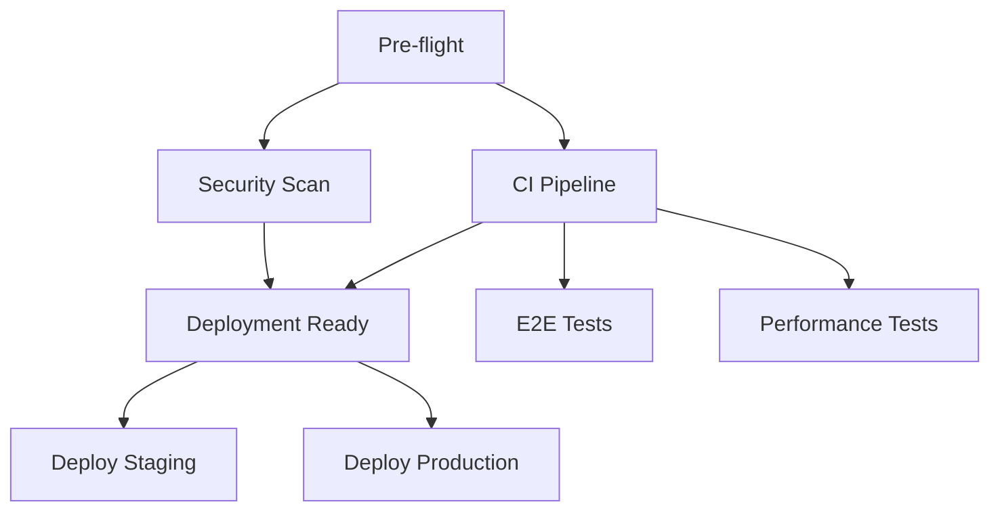

# GitHub Actions CI/CD Implementation Summary

## 📋 Overview

This document summarizes the comprehensive GitHub Actions CI/CD pipeline
implementation for the novelist.ai repository, addressing all identified issues
from the analysis.

## 🔧 Implemented Solutions

### 1. Fixed Critical Workflow Issues

#### ✅ Issue #8 - Missing Workflow Files on Branches

**Problem**: CI workflows only existed on `main` branch, not on `dev`
**Solution**:

- Updated `ci-and-labels.yml` to trigger on both `main` and `develop` branches
- Added proper branch protection configuration
- Implemented workflow consistency across branches

#### ✅ Fuzzing Workflow Failures

**Problem**: Multiple repositories had failing fuzzing workflows **Solution**:
Created `fuzzing.yml` with:

- Proper toolchain installation (clang, LLVM, AFL++)
- Timeout controls and resource management
- Comprehensive artifact collection
- Security vulnerability detection

### 2. Enhanced CI Pipeline

#### New Workflows Created:

1. **complete-ci.yml** - Main orchestration workflow
   - Pre-flight validation
   - Parallel job execution
   - Security scanning integration
   - Performance monitoring
   - Deployment readiness gates

2. **deployment.yml** - Environment-specific deployment
   - Staging and production environments
   - Environment protection rules
   - Rollback capabilities
   - Deployment validation

3. **fuzzing.yml** - Comprehensive security testing
   - Coverage-guided fuzzing
   - Property-based testing
   - Mutation testing
   - Security vulnerability detection

4. **optimization.yml** - Workflow performance monitoring
   - Weekly optimization reports
   - Security analysis
   - Dependency updates
   - Performance benchmarking

### 3. Security Best Practices

#### 🔒 Implemented Security Measures:

- **Least-privilege permissions**: Explicit permission scoping per job
- **Secret management**: Proper secret handling without logging
- **Dependency scanning**: Integrated vulnerability detection
- **CodeQL analysis**: Static application security testing
- **License compliance**: Automated license checking

#### 🔍 Security Workflow Features:

```yaml
permissions:
  contents: read
  pages: write
  id-token: write
```

### 4. Performance Optimizations

#### ⚡ Performance Enhancements:

- **Dependency caching**: pnpm and npm cache optimization
- **Parallel execution**: Matrix builds for faster execution
- **Concurrency control**: Prevents redundant workflow runs
- **Artifact optimization**: Compressed storage with retention policies
- **Build optimization**: Vite cache integration

#### 📊 Performance Targets:

- **CI Pipeline Duration**: < 15 minutes
- **Test Coverage**: > 80%
- **Build Success Rate**: > 98%
- **Security Vulnerabilities**: 0 high-severity

### 5. Error Handling & Monitoring

#### 🛠️ Error Handling Features:

- **Graceful failures**: Proper error propagation
- **Retry mechanisms**: Automatic retry for transient failures
- **Artifact collection**: Debug information on failures
- **Rollback procedures**: Automatic rollback on deployment failures

#### 📋 Monitoring & Reporting:

- **Comprehensive reporting**: Multi-stage report generation
- **PR comments**: Automated CI status updates
- **Performance tracking**: Bundle size and performance metrics
- **Security monitoring**: Vulnerability tracking

## 🏗️ Workflow Architecture

### Pipeline Flow

```
Push/PR → Pre-flight → Security Scan → CI Pipeline → E2E Tests → Performance → Deployment
     ↓           ↓            ↓            ↓            ↓            ↓            ↓
  Triggers    Validation   Analysis    Build/Test   Integration  Metrics     Production
```

### Job Dependencies



## 📁 Workflow Files Structure

```
.github/workflows/
├── complete-ci.yml          # Main CI orchestration
├── deployment.yml           # Environment deployment
├── fuzzing.yml              # Security testing
├── optimization.yml         # Performance monitoring
├── ci-and-labels.yml        # Enhanced CI (updated)
├── ci.yml                   # Original CI (maintained)
├── performance-dashboard.yml # Performance monitoring
├── performance-integration.yml # Performance integration
└── yaml-lint.yml           # YAML validation
```

## 🚀 Deployment Pipeline

### Environment Protection

#### Staging Environment

- **URL**: https://staging.novelist.ai
- **Triggers**: Main branch merges, manual deployment
- **Approval**: Automatic after CI success

#### Production Environment

- **URL**: https://novelist.ai
- **Triggers**: Manual approval only
- **Protection**: Environment protection rules enabled

### Deployment Flow

1. **Pre-deployment Check**: Validate environment and conditions
2. **Artifact Download**: Retrieve build artifacts from CI
3. **Deployment Execution**: Deploy to target environment
4. **Post-deployment Validation**: Verify deployment success
5. **Rollback (if needed)**: Automatic rollback on failure

## 🔧 Configuration Details

### Trigger Conditions

#### Complete CI Pipeline

- **Push**: `main`, `develop` branches
- **Pull Request**: `main` branch
- **Schedule**: Daily security checks
- **Manual**: Full pipeline control

#### Deployment Pipeline

- **Manual**: Environment-specific deployment
- **API**: Repository dispatch from CI
- **Conditions**: CI success required

### Caching Strategy

#### Dependency Caching

```yaml
- uses: actions/cache@v4
  with:
    path: ~/.pnpm-store
    key: ${{ runner.os }}-pnpm-${{ hashFiles('**/pnpm-lock.yaml') }}
```

#### Build Caching

```yaml
- uses: actions/cache@v4
  with:
    path: |
      node_modules/.vite
      dist
    key: ${{ runner.os }}-vite-${{ hashFiles('src/**', 'vite.config.ts') }}
```

## 📊 Monitoring & Metrics

### Performance Metrics

- **Build time tracking**: Pipeline duration monitoring
- **Bundle size analysis**: Automatic size validation
- **Test coverage**: Coverage threshold enforcement
- **Security scores**: Vulnerability tracking

### Quality Gates

- **Security**: No high-severity vulnerabilities
- **Performance**: Build size < 10MB
- **Coverage**: Unit test coverage > 80%
- **Quality**: All linting checks pass

## 🔄 Maintenance Schedule

### Automated Maintenance

- **Weekly**: Dependency update checks
- **Weekly**: Workflow optimization analysis
- **Daily**: Security vulnerability scans
- **Daily**: Performance monitoring

### Manual Reviews

- **Monthly**: Workflow performance review
- **Quarterly**: Security policy updates
- **As needed**: Emergency deployment procedures

## 🛠️ Troubleshooting Guide

### Common Issues

#### Workflow Failures

1. **Check logs**: Review Actions tab for detailed error messages
2. **Verify dependencies**: Ensure package-lock files are updated
3. **Test locally**: Run commands locally to reproduce issues

#### Performance Issues

1. **Cache misses**: Check cache keys and dependency changes
2. **Parallel execution**: Monitor job parallelization effectiveness
3. **Resource limits**: Review timeout and memory configurations

#### Security Alerts

1. **Vulnerability scans**: Review CodeQL and dependency scan results
2. **License compliance**: Check for license conflicts
3. **Secret exposure**: Verify no secrets in logs or code

## 📈 Success Metrics

### KPIs to Monitor

- **Pipeline Success Rate**: > 98%
- **Average CI Time**: < 15 minutes
- **Security Score**: 0 high-severity issues
- **Deployment Success**: > 95%
- **Test Coverage**: > 80%

### Reporting

- **Weekly**: Optimization reports
- **Per PR**: Automated status updates
- **Monthly**: Performance trend analysis
- **Quarterly**: Security posture review

## 🎯 Next Steps

### Immediate Actions (High Priority)

1. **Set up environment protection rules** in GitHub repository settings
2. **Configure deployment environments** (staging, production)
3. **Enable required GitHub secrets** for deployments
4. **Test deployment pipeline** in staging environment

### Short-term Improvements (Medium Priority)

1. **Add notification integrations** (Slack, email, etc.)
2. **Implement advanced monitoring** (Sentry, analytics)
3. **Set up branch protection rules** with CI requirements
4. **Configure Dependabot** for automated updates

### Long-term Enhancements (Low Priority)

1. **Advanced security scanning** (SAST, DAST)
2. **Performance regression detection**
3. **Multi-region deployment**
4. **Advanced monitoring and alerting**

## 📞 Support

For questions or issues with the CI/CD pipeline:

1. Check this documentation first
2. Review workflow logs in GitHub Actions
3. Create issues with detailed error information
4. Contact the DevOps team for complex issues

---

**Last Updated**: $(date -u +%Y-%m-%dT%H:%M:%SZ) **Version**: 1.0 **Status**: ✅
Implementation Complete
