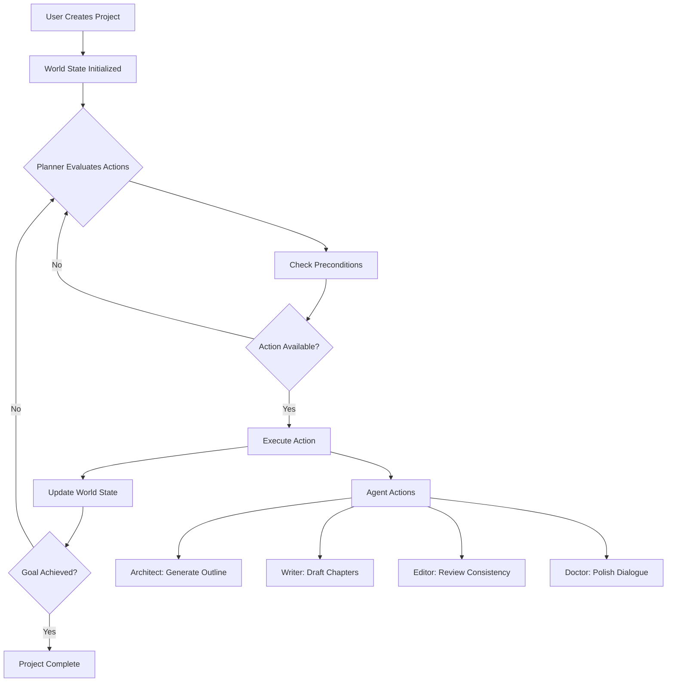

# Novelist.ai - GOAP eBook Engine

**An AI-powered eBook creator utilizing Goal-Oriented Action Planning (GOAP)
architecture**

[](https://www.typescriptlang.org/)
[](https://react.dev/)
[](https://vitejs.dev/)
[](https://github.com/d-oit/do-novelist-ai)
[](LICENSE)

[Features](#-features) • [Architecture](#-architecture) •
[Getting Started](#-getting-started) • [Usage](#-usage) •
[Development](#-development) • [Testing](#-testing)

---

## 📖 Overview

Novelist.ai is a sophisticated eBook generation platform that leverages
**Goal-Oriented Action Planning (GOAP)** to orchestrate AI agents in creating
complete novels. Unlike traditional linear AI writing tools, this engine uses
intelligent planning to break down the complex task of novel writing into
discrete, achievable goals with preconditions and effects.

### What is GOAP?

GOAP (Goal-Oriented Action Planning) is an AI architecture pattern commonly used
in game development that allows agents to autonomously plan sequences of actions
to achieve goals. In Novelist.ai:

- **Agents** (Architect, Writer, Editor, Doctor, etc.) have specialized roles
- **Actions** have preconditions (what must be true) and effects (what changes)
- **Planner** dynamically selects the optimal action sequence based on current
  world state
- **World State** tracks progress (hasOutline, chaptersCompleted, etc.)

This creates an adaptive, intelligent writing system that can handle complex
multi-chapter projects with consistency and coherence.

---

## ✨ Features

### 🤖 **Multi-Agent GOAP System**

- **Architect Agent**: Generates story outlines using hero's journey structure
- **Writer Agents**: Parallel chapter drafting with context awareness
- **Editor Agent**: Consistency checking and plot hole detection
- **Doctor Agent**: Specialized dialogue polishing and refinement
- **Profiler Agent**: Character development and psychological profiling
- **Builder Agent**: World-building, lore, and setting expansion

### 📚 **Intelligent Content Generation**

- Hierarchical story generation (outline → chapters → content)
- Context-aware chapter writing with previous chapter continuity
- Dynamic content refinement with adjustable temperature and model selection
- Character development and world-building tools
- Plot enhancement and dialogue polishing
- **Writing Assistant** with real-time style analysis and grammar suggestions
- Multi-provider AI support via OpenRouter SDK (Anthropic, Google, OpenAI, etc.)

### 🎨 **Rich User Interface**

- Real-time GOAP visualizer showing planning stages
- Agent console with color-coded logging
- Interactive chapter editor with markdown support
- Project dashboard with statistics and progress tracking
- Dark mode support with theme persistence

### 📦 **Export & Publishing**

- EPUB 3.0 generation with proper metadata
- Cover image generation using Google Imagen
- Chapter illustrations support
- Drop caps and custom styling options
- Multi-language support
- Publishing analytics and platform status tracking

### 💾 **Data Management**

- Turso (libSQL) database integration with localStorage fallback
- Auto-save functionality (2-second debounce)
- Project versioning and management
- Import/export capabilities
- **PWA Support**: Installable app with offline capabilities
- **Analytics Dashboard**: Writing statistics, productivity tracking

---

## 🏗️ Architecture

### Technology Stack

```
Frontend:
├── React 19.2          # UI framework
├── TypeScript 5.8      # Type safety
├── Vite 6.2            # Build tool & dev server
├── Tailwind CSS        # Utility-first styling
└── Lucide React        # Icon library

AI & Services:
├── OpenRouter SDK      # Multi-provider AI (Anthropic, Google, OpenAI, etc.)
├── Google Imagen       # Cover & illustration generation
└── @libsql/client      # Turso database client

Utilities:
├── JSZip               # EPUB generation
├── Recharts            # Data visualization
├── Zustand 5.0        # State management
└── Playwright          # E2E testing
```

### Project Structure

```
novelist-goap-ebook-engine/
├── src/
│   ├── components/          # Reusable UI components
│   │   ├── ActionCard.tsx
│   │   ├── AgentConsole.tsx
│   │   ├── GoapVisualizer.tsx
│   │   ├── Navbar.tsx
│   │   ├── PlannerControl.tsx
│   │   ├── ProjectDashboard.tsx
│   │   └── ProjectStats.tsx
│   ├── features/            # Feature-based modules
│   │   ├── editor/          # Chapter editing & GOAP engine
│   │   │   ├── components/
│   │   │   └── hooks/
│   │   │       └── useGoapEngine.ts  # Core GOAP logic
│   │   ├── projects/        # Project management
│   │   └── settings/        # App settings
│   ├── lib/                 # Core utilities
│   │   ├── db.ts           # Database abstraction
│   │   ├── epub.ts         # EPUB generation
│   │   └── gemini.ts       # Gemini API integration
│   ├── types/              # TypeScript definitions
│   │   └── index.ts
│   └── App.tsx             # Main application
├── tests/                  # Playwright E2E tests
├── index.html
├── index.tsx
├── package.json
├── tailwind.config.js
├── tsconfig.json
├── vite.config.ts
└── playwright.config.ts
```

### GOAP Engine Flow



### Key Interfaces

```typescript
interface WorldState {
  hasTitle: boolean;
  hasOutline: boolean;
  chaptersCount: number;
  chaptersCompleted: number;
  styleDefined: boolean;
  isPublished: boolean;
}

interface AgentAction {
  name: string;
  label: string;
  description: string;
  cost: number;
  preconditions: Partial<WorldState>;
  effects: Partial<WorldState>;
  agentMode: AgentMode; // SINGLE | PARALLEL | HYBRID | SWARM
  promptTemplate: string;
}
```

---

## 🚀 Getting Started

### Prerequisites

- **Node.js** (v18 or higher)
- **npm** or **yarn**
- **Google Gemini API Key** ([Get one here](https://ai.google.dev/))

### Installation

1. **Clone the repository**

   ```bash
   git clone https://github.com/yourusername/novelist-goap-ebook-engine.git
   cd novelist-goap-ebook-engine
   ```

2. **Install dependencies**

   ```bash
   npm install
   ```

3. **Configure environment variables**

   Create a `.env.local` file in the root directory:

   ```env
   VITE_GEMINI_API_KEY=your_gemini_api_key_here
   ```

4. **Start the development server**

   ```bash
   npm run dev
   ```

5. **Open your browser**

   Navigate to `http://localhost:5173`

---

## 💡 Usage

### Creating Your First Novel

1. **Launch the Project Wizard**
   - Click "New Project" in the navbar
   - Enter your story idea, genre/style, and target word count
   - Click "Create Project"

2. **Activate the GOAP Planner**
   - Click "Start Planner" in the dashboard
   - Watch as the Architect agent generates your outline
   - The planner will automatically sequence actions based on world state

3. **Monitor Agent Activity**
   - View real-time logs in the Agent Console
   - Track progress through the GOAP Visualizer
   - See which agents are active and what they're doing

4. **Edit & Refine**
   - Click on any chapter to view/edit content
   - Use "Continue Writing" to extend chapters
   - Use "Refine" to improve content with different models/temperatures

5. **Export Your Novel**
   - Click "Export EPUB" when ready
   - Your novel will download as a standard EPUB 3.0 file
   - Compatible with all major eBook readers

### Advanced Features

#### Manual Chapter Management

```typescript
// Add chapters manually
onAddChapter(); // Creates a new pending chapter

// Update chapter content
onUpdateChapter(chapterId, {
  content: 'New content...',
  status: ChapterStatus.COMPLETE,
});
```

#### Custom Refinement

```typescript
// Refine with specific parameters
handleRefineChapter(chapterId, {
  model: 'gemini-2.0-flash-exp',
  temperature: 0.7,
});
```

#### Agent Modes

- **SINGLE**: One agent executes the action sequentially
- **PARALLEL**: Multiple agents work simultaneously
- **HYBRID**: Combination of sequential and parallel execution
- **SWARM**: Distributed agent coordination (future feature)

---

## 🛠️ Development

### Available Scripts

```bash
# Development
npm run dev          # Start Vite dev server (http://localhost:5173)
npm run build        # Build for production
npm run preview      # Preview production build
npm run analyze      # Build with bundle analysis (generates dist/stats.html)
npm run clean        # Clear build artifacts and caches

# Testing
npm run test         # Run unit tests with Vitest (725 tests)
npm run coverage     # Run tests with coverage report
npm run test:e2e     # Run E2E tests with Playwright

# Code Quality
npm run lint         # Lint and fix code with ESLint + TypeScript checking
npm run lint:ci      # Lint check for CI (no fixes)
npm run lint:fix     # Fix linting issues only
npm run format       # Format code with Prettier
npm run format:check # Check code formatting
npm run typecheck    # Standalone TypeScript type checking
npm run check:file-size # Check file sizes (max 500 LOC policy)

# Advanced Testing
npx playwright test                    # Run all E2E tests
npx playwright test tests/specs/name.spec.ts  # Run specific E2E test
npx playwright test --ui              # Run E2E tests in UI mode
npx playwright test --debug           # Debug E2E tests
```

### Test Coverage

- **Unit Tests**: 725 tests passing (Vitest)
- **E2E Tests**: Full workflow coverage (Playwright)
- **Coverage**: >80% for new features (target)
- **Accessibility**: WCAG 2.1 AA compliant (95/100 score)

### Code Style & Conventions

- **TypeScript**: Strict mode enabled, explicit types preferred
- **Components**: Use `React.FC<Props>` with interface definitions
- **Styling**: Tailwind utility classes (e.g., `className="flex gap-2"`)
- **Icons**: Use `lucide-react` for all icons
- **Formatting**: 2 spaces indentation, semicolons required
- **Naming**:
  - PascalCase for components (`AgentConsole`)
  - camelCase for variables/functions (`handleCreateProject`)
  - SCREAMING_SNAKE_CASE for constants (`INITIAL_ACTIONS`)

### Writing Assistant Feature

The Writing Assistant provides real-time analysis and suggestions:

```typescript
// Style analysis (readability, tone, voice, complexity)
const styleAnalysis = styleAnalysisService.analyzeStyle(content);

// Grammar suggestions (spelling, grammar, clarity)
const suggestions = grammarSuggestionService.analyze(content);

// Writing goals with daily targets
const goals = goalsService.trackProgress(chapterId, wordCount);

// Real-time feedback during writing
const feedback = realTimeAnalysisService.analyze(content, cursorPosition);
```

### Adding New Agent Actions

1. Define the action in `src/features/editor/hooks/useGoapEngine.ts`:

```typescript
{
  name: 'my_new_action',
  label: 'MyAgent: Action Label',
  description: 'What this action does',
  cost: 100,
  agentMode: AgentMode.SINGLE,
  preconditions: { hasOutline: true },
  effects: { /* what changes */ },
  promptTemplate: '...'
}
```

2. Implement the execution logic in `executeAction`:

```typescript
if (action.name === 'my_new_action') {
  addLog('MyAgent', 'Starting action...', 'info');
  // Your implementation
  addLog('MyAgent', 'Action complete!', 'success');
}
```

### Database Schema

The app uses Turso (libSQL) with localStorage fallback. See `src/lib/db.ts` for
implementation.

```typescript
// Projects table
{
  id: string;
  title: string;
  idea: string;
  style: string;
  chapters: Chapter[];
  worldState: WorldState;
  // ... additional fields
}
```

---

## 🧪 Testing

### E2E Testing with Playwright

Tests are located in `tests/specs/` and cover:

- Project creation workflow
- GOAP planner execution
- Chapter editing and refinement
- EPUB export functionality
- UI interactions and navigation

```bash
# Run all tests
npx playwright test

# Run with UI
npx playwright test --ui

# Run specific test file
npx playwright test tests/specs/project-creation.spec.ts

# Debug mode
npx playwright test --debug
```

### Test Utilities

Helper functions are available in `tests/utils/`:

- Page object models
- Common test fixtures
- Mock data generators

---

## 🤝 Contributing

Contributions are welcome! Please follow these guidelines:

1. **Fork the repository**
2. **Create a feature branch** (`git checkout -b feature/amazing-feature`)
3. **Follow code style conventions** (see AGENTS.md)
4. **Write tests** for new features
5. **Commit your changes** (`git commit -m 'Add amazing feature'`)
6. **Push to the branch** (`git push origin feature/amazing-feature`)
7. **Open a Pull Request**

### Development Guidelines

- Ensure all tests pass before submitting PR
- Update documentation for new features
- Follow the existing code structure and patterns
- Add TypeScript types for all new code
- Use semantic commit messages

---

## 📄 License

This project is licensed under MIT License - see the [LICENSE](LICENSE) file for
details.

---

## 📊 Project Status

**Current Status**: Production-ready with zero technical debt

### Quality Metrics

- ✅ All 725 tests passing
- ✅ TypeScript strict mode: 0 errors
- ✅ ESLint: 0 errors
- ✅ Build: Successful
- ✅ File size policy: 0 violations (4 acceptable tracked)
- ✅ Import paths: 100% @/ alias usage
- ✅ Environment validation: Zod-based

### Recent Improvements (December 2025)

- ✅ AI stack migration to OpenRouter SDK only
- ✅ Structured logging implementation (25 files)
- ✅ Component consolidation (UI primitives to /shared/components/ui)
- ✅ File size policy enforcement (CI checker)
- ✅ Import path cleanup (@/ alias everywhere)
- ✅ Writing Assistant MVP with real-time feedback
- ✅ PWA implementation (v1.2.0)
- ✅ Analytics dashboard integration

### Documentation

- See [plans/](plans/) for detailed planning documents
- See [CODEBASE-ANALYSIS-DEC-27-2025.md](plans/CODEBASE-ANALYSIS-DEC-27-2025.md)
  for latest codebase health report
- See [AGENTS.md](AGENTS.md) for coding guidelines
