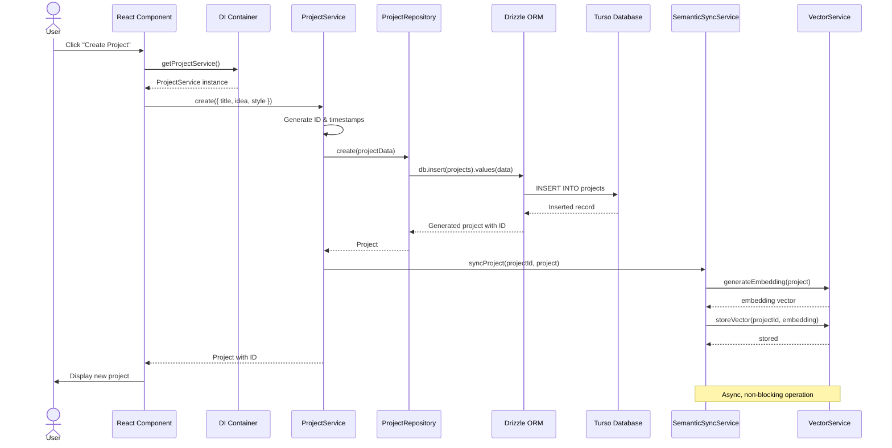
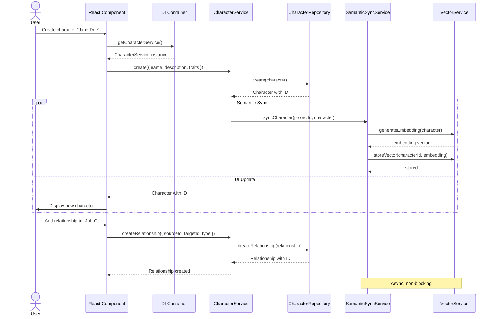
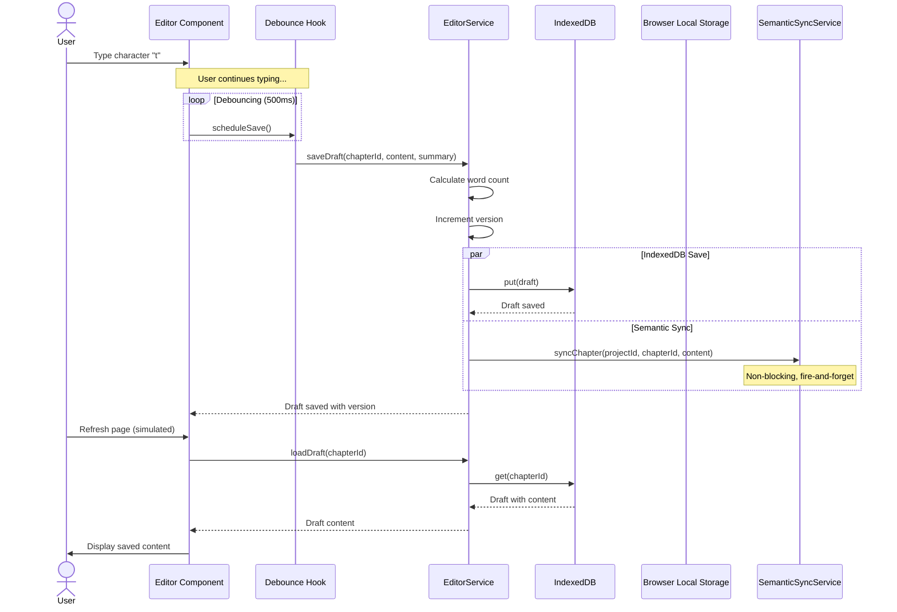
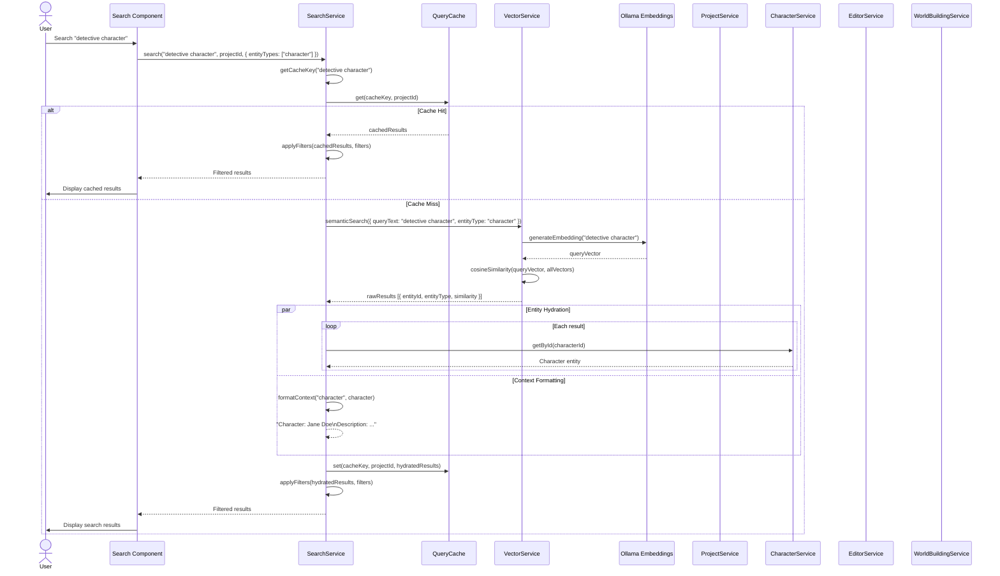
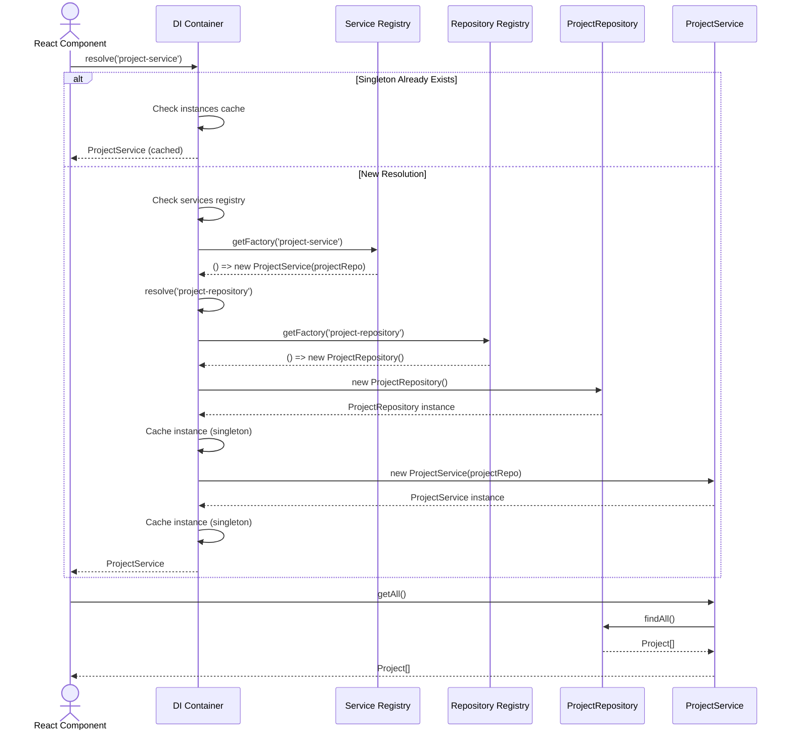
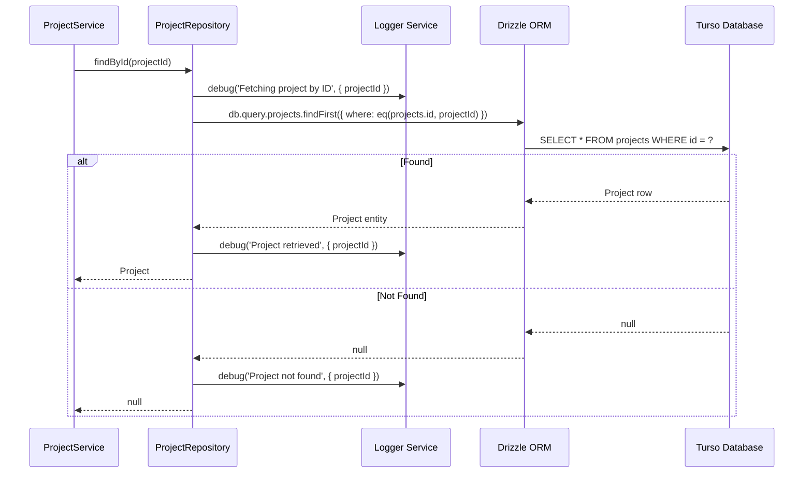

# Data Flow Diagram

**Created:** January 18, 2026 **Author:** GOAP Agent **Purpose:** End-to-end
data flow documentation for Novelist.ai

---

## Overview

This document illustrates the complete data flow through the Novelist.ai system,
from user interactions to database persistence and back. It highlights the
repository pattern, dependency injection, and semantic search integration.

---

## 1. Project Creation Flow

### Use Case: User creates a new project



### Data Transformations

| Step             | Input                    | Output              | Transformation                                            |
| ---------------- | ------------------------ | ------------------- | --------------------------------------------------------- |
| 1. UI Form       | `{ title, idea, style }` | Form data           | User input collection                                     |
| 2. Service Layer | Form data                | Full project object | Add defaults: ID, timestamps, empty world state, timeline |
| 3. Repository    | Project object           | Database record     | Drizzle schema mapping                                    |
| 4. Database      | Database record          | Persisted row       | SQL INSERT operation                                      |
| 5. Semantic Sync | Project object           | Embedding vector    | Ollama embedding generation                               |

### Error Handling Paths

```
Project Creation Failure:
    ↓
Repository throws Error
    ↓
Service logs error via Logger
    ↓
Service re-throws to UI
    ↓
UI displays error message to user
    ↓
Semantic sync catches error (async, non-blocking)
    ↓
Warning logged,不影响用户体验
```

---

## 2. Character Management Flow

### Use Case: User creates a character and links relationships



### Character Data Flow

```
Character Creation:
    [User Input]
        ↓
    { name, description, traits, projectId }
        ↓
    [CharacterService]
        ↓
    Add ID: crypto.randomUUID()
    Add timestamps
        ↓
    [CharacterRepository]
        ↓
    Drizzle ORM: db.insert(characters)
        ↓
    [Turso Database]
        ↓
    Persisted Character
        ↓
    [Semantic Sync - Async]
        ↓
    Ollama: generateEmbedding(character)
        ↓
    Vector store: save(characterId, embedding)
        ↓
    ✅ Character available for search
```

---

## 3. Editor Auto-Save Flow

### Use Case: User types in editor, draft auto-saves locally



### Auto-Save Algorithm

```
1. User types in editor
2. Content change detected by React state
3. Debounce timer: 500ms (configurable)
4. If user continues typing, reset timer
5. On timer expiry:
   a. Calculate word count
   b. Get existing draft version
   c. Increment version (existingVersion + 1)
   d. Save to IndexedDB (PUT operation)
   e. Trigger semantic sync (async, non-blocking)
   f. Update UI to show "Saved v{version}"
```

### Draft Lifecycle

```
New Draft:
    [User starts typing]
        ↓
    First save: Version 1
        ↓
    [User edits]
        ↓
    Second save: Version 2
        ↓
    [More edits]
        ↓
    Nth save: Version N
        ↓
    [User publishes chapter]
        ↓
    Draft deleted (cleanup)
```

---

## 4. Semantic Search Flow

### Use Case: User searches for "detective character"



### Search Algorithm

```
1. User submits query
2. Generate cache key (query normalized, lowercase)
3. Check cache:
   - If hit: Return cached results
   - If miss: Continue
4. Generate query embedding (Ollama)
5. Vector similarity search:
   - Compare query vector with all stored vectors
   - Calculate cosine similarity
   - Sort by similarity score (descending)
6. Apply minScore filter (default: 0.6)
7. Hydrate results:
   - Fetch full entity data from services
   - Format as context string for LLM
8. Apply filters:
   - Entity type filter
   - Result limit
9. Cache results
10. Return to UI
```

### Caching Strategy

```
Cache Key: "detective character" (normalized, lowercase)
Cache Value: HydratedSearchResult[]
Cache Duration: Session-based (no expiration)

Cache Benefits:
- Avoid repeated embedding generation (expensive)
- Avoid repeated database queries
- Faster response times
- Reduced Ollama load

Cache Invalidation:
- No automatic invalidation
- Acceptable staleness for semantic search
- Manual clear if needed
```

---

## 5. Dependency Injection Resolution Flow

### Use Case: Component requests service from DI container



### DI Container State

```
Before Resolution:
    services: {
        'project-service': () => new ProjectService(projectRepo),
        'character-service': () => new CharacterService(characterRepo),
        'project-repository': () => new ProjectRepository(),
        ...
    }
    instances: {} (empty)

After First Resolution:
    services: { ... }
    instances: {
        'project-repository': ProjectRepository{ ... },
        'project-service': ProjectService{ repo: ProjectRepository{ ... } }
    }

Subsequent Resolution:
    - Check instances cache
    - Return cached instance
    - No new instantiation
```

---

## 6. Repository Pattern Data Access Flow

### Use Case: Service queries database through repository



### Repository Benefits

| Aspect              | Before (Direct DB Access) | After (Repository Pattern) |
| ------------------- | ------------------------- | -------------------------- |
| **Testability**     | Hard (need real DB)       | Easy (mock repository)     |
| **Maintainability** | Scattered logic           | Centralized in repo        |
| **Type Safety**     | Loose                     | Strong (interfaces)        |
| **Error Handling**  | Inconsistent              | Consistent                 |
| **Logging**         | Optional                  | Structured                 |
| **Caching**         | Difficult                 | Easy to add                |

---

## 7. Error Handling Flow

### Use Case: Database operation fails

```mermaid
sequenceDiagram
    participant Service as ProjectService
    participant Repo as ProjectRepository
    participant Logger as Logger
    participant DB as Database
    participant UI as React Component

    Service->>Repo: create(projectData)
    Repo->>DB: INSERT INTO projects

    DB-->>Repo: Error: Connection timeout

    Repo->>Logger: error('Failed to create project', { error })
    Repo-->>Service: throw RepositoryError

    Service->>Logger: error('Project creation failed', { projectId, error })
    Service-->>UI: throw Error

    UI->>UI: Catch error
    UI->>User: Display error toast
        "Failed to create project: Connection timeout. Please try again."
```

### Error Handling Strategy

```
Level 1: Repository Layer
    ↓ Catch database errors
    ↓ Log with context (component, operation, error details)
    ↓ Wrap in RepositoryError
    ↓ Re-throw to service

Level 2: Service Layer
    ↓ Catch RepositoryError
    ↓ Log with business context (projectId, data summary)
    ↓ Re-throw to UI

Level 3: UI Layer
    ↓ Catch Error
    ↓ Display user-friendly message
    ↓ Provide retry option
    ↓ Optional: Report error to monitoring
```

---

## 8. Cross-Cutting Concerns

### Logging Flow

```
Every component logs structured data:
    {
        component: 'ComponentName',
        operation: 'methodName',
        timestamp: Date.now(),
        metadata: { ... },
        error?: Error
    }

Log Levels:
    - DEBUG: Detailed information for diagnostics
    - INFO: General informational messages
    - WARN: Warning messages, potentially harmful situations
    - ERROR: Error events, might still allow application to continue
    - FATAL: Critical errors, application cannot continue
```

### Semantic Synchronization Flow

```
Every create/update operation triggers async sync:
    1. Operation completes (project, character, chapter)
    2. Trigger semanticSyncService.syncEntity(id, entity)
    3. .catch() prevents sync failures from blocking main flow
    4. Non-blocking: fire-and-forget pattern
    5. Logged separately from main operation

Benefits:
    - Search index stays up-to-date
    - No performance impact on main operation
    - Graceful degradation if sync fails
```

---

## Performance Optimization Flows

### Query Optimization

```
Indexed Queries:
    WHERE id = ?              → Primary key index
    WHERE projectId = ?         → Non-unique index
    WHERE status = ?            → Non-unique index
    ORDER BY createdAt DESC      → Index on createdAt

Non-Indexed Queries (slow):
    WHERE title LIKE '%query%'    → Full table scan
    WHERE description LIKE '%...'  → Full table scan

Optimization Strategy:
    - Add indexes to frequently queried columns
    - Use WHERE with indexed columns
    - Avoid leading wildcards in LIKE
    - Use vector search instead of text search
```

### Caching Flows

```
Search Cache:
    Key: query (normalized)
    Value: HydratedSearchResult[]
    TTL: None (session-based)
    Hits: Avoid Ollama API call
    Misses: Embedding + DB query

Service Memoization:
    - Frequently accessed data (project, current user)
    - In-memory cache (Map)
    - TTL: 5-10 minutes
    - Benefits: Reduced DB queries
```

---

## Data Consistency Flows

### Transaction Management

```
Currently: No transactions
    - Each operation independent
    - Possible inconsistent state if failure mid-operation

Future: Transaction Support
    await db.transaction(async (tx) => {
        await projectRepo.create(tx, project);
        await characterRepo.createMany(tx, characters);
        await chapterRepo.createMany(tx, chapters);
    });
    - All succeed or all fail
    - Atomic operations
```

### Semantic Search Sync

```
Eventual Consistency:
    1. Entity created/updated (immediate in DB)
    2. Sync triggered (async, non-blocking)
    3. Embedding generated (seconds)
    4. Vector stored (immediate)
    5. Available for search (seconds later)

Trade-off:
    - Benefit: No blocking on main operations
    - Cost: Search delay (seconds)
    - Acceptable: Users rarely search immediately after creation
```

---

## Security Flows

### Input Validation

```
Service Layer Validation:
    1. Check required fields
    2. Validate types (TypeScript handles)
    3. Validate formats (email, UUID, etc.)
    4. Validate business rules (e.g., max chapter count)
    5. Throw ValidationError if invalid

Repository Layer Protection:
    1. Drizzle ORM parameterized queries
    2. SQL injection prevention
    3. Type safety enforced by schema
```

### Data Isolation

```
User Isolation (future):
    - Every query includes userId filter
    - WHERE userId = ?
    - Repository enforces isolation

Project Isolation (current):
    - Every query includes projectId filter
    - WHERE projectId = ?
    - Prevents cross-project data access
```

---

## Summary of Key Flows

| Flow                 | Primary Pattern      | Performance                   | Consistency                | Complexity |
| -------------------- | -------------------- | ----------------------------- | -------------------------- | ---------- |
| Project Creation     | Sync + Async sync    | Fast (ms)                     | Immediate + Search lag (s) | Low        |
| Character Management | Sync + Async sync    | Fast (ms)                     | Immediate + Search lag (s) | Low        |
| Editor Auto-Save     | Async (IndexedDB)    | Instant (ms)                  | Immediate                  | Medium     |
| Semantic Search      | Cached Vector Search | Fast (cached) / Medium (miss) | Eventual                   | High       |
| DI Resolution        | Singleton Cache      | Instant (ns)                  | Strong                     | Medium     |
| Repository Access    | Type-Safe Queries    | Fast (ms)                     | Strong                     | Low        |
| Error Handling       | Multi-Level Catch    | Overhead (ms)                 | N/A                        | Low        |

---

**Document Version:** 1.0.0 **Last Updated:** January 18, 2026 **Status:** ✅
Complete - Production Ready
