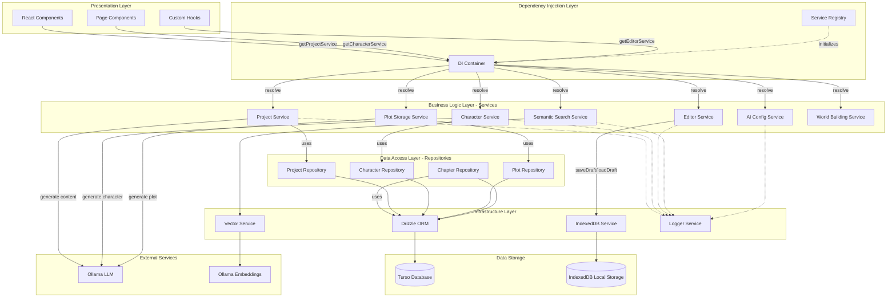

# System Architecture Diagram

**Created:** January 18, 2026 **Author:** GOAP Agent **Purpose:** High-level
system overview of Novelist.ai architecture

---

## Overview

This document provides a comprehensive architectural overview of Novelist.ai,
illustrating the complete system stack from user interface through business
logic to data persistence.

## Technology Stack

| Layer            | Technology                 |
| ---------------- | -------------------------- |
| **Frontend**     | React 18+ (TypeScript)     |
| **State**        | React Hooks, Context API   |
| **Styling**      | Tailwind CSS               |
| **DI Framework** | Custom DI Container        |
| **Data Access**  | Repository Pattern         |
| **ORM**          | Drizzle ORM                |
| **Database**     | Turso (LibSQL)             |
| **Search**       | Vector Embeddings (Ollama) |
| **Storage**      | IndexedDB (Local)          |

---

## High-Level Architecture



---

## Component Descriptions

### Presentation Layer

**React Components**

- User interface elements built with React 18+
- TypeScript for type safety
- Tailwind CSS for styling
- Accessibility-first design (WCAG 2.1 AA)

**Page Components**

- High-level page routing and layout
- Orchestrates multiple components
- Manages page-level state

**Custom Hooks**

- Reusable logic extraction
- `useLiveAnnounce`, `useKeyPress`, etc.
- Encapsulates complex state management

### Dependency Injection Layer

**DI Container**

- Custom lightweight container implementation
- Singleton pattern for service instances
- Service registration and resolution
- Type-safe dependency management

**Service Registry**

- Centralized service registration
- Maps tokens to service factories
- Initializes all services at app startup
- Provides convenience functions for service access

**Registered Services:**

- 4 Repositories (Project, Character, Chapter, Plot)
- 3 Primary Services (Project, Character, Plot Storage)

### Business Logic Layer - Services

**Project Service**

- Manages project lifecycle (CRUD)
- Handles project metadata
- Coordinates semantic search sync
- Delegates to ProjectRepository

**Character Service**

- Character CRUD operations
- Manages character relationships
- Triggers semantic search updates
- Delegates to CharacterRepository

**Editor Service**

- Auto-save functionality
- Draft management with IndexedDB
- Content persistence
- Version tracking for drafts

**Semantic Search Service**

- Vector-based semantic search
- Query caching
- Result hydration (fetches full entities)
- Context formatting for RAG

**AI Config Service**

- Manages AI provider preferences
- Configuration persistence
- Provider routing and fallbacks
- Cost optimization

**Plot Storage Service**

- Plot structure persistence
- Plot hole tracking
- Character graph management
- Delegates to PlotRepository

**World Building Service**

- Location and culture management
- World-building metadata
- Integrates with semantic search

### Data Access Layer - Repositories

**Repository Pattern Benefits:**

- Single source of truth for data access
- Easy to test (mock repositories)
- Centralized error handling
- Consistent API across all data types

**Project Repository**

- IProjectRepository interface
- Drizzle ORM integration
- Type-safe database operations
- ~666 LOC

**Character Repository**

- ICharacterRepository interface
- Relationship management
- ~970 LOC

**Chapter Repository**

- IChapterRepository interface
- Chapter ordering and status
- ~400 LOC

**Plot Repository**

- IPlotRepository interface
- Complex plot structure handling
- Character graph operations
- ~1,182 LOC

### Infrastructure Layer

**Drizzle ORM**

- Type-safe database queries
- Automatic migrations
- Connection pooling
- Query optimization

**Vector Service**

- Embedding generation
- Vector similarity search
- Semantic search orchestration
- Ollama integration

**IndexedDB Service**

- Browser-local storage
- Draft persistence
- Offline capability
- Version management

**Logger Service**

- Structured logging
- Component-level tracking
- Error tracking
- Debug/release modes

### Data Storage

**Turso Database**

- LibSQL database
- Cloud-hosted
- Real-time replication
- Zero-latency edge deployment

**IndexedDB Local Storage**

- Browser-based storage
- Draft auto-save
- Offline-first capability
- User data isolation

### External Services

**Ollama LLM**

- Local LLM inference
- Content generation
- Character creation
- Plot development

**Ollama Embeddings**

- Vector generation
- Semantic search support
- RAG context retrieval

---

## Data Flow Patterns

### Request Flow

```
User Action
    ↓
React Component
    ↓
DI Container (resolve service)
    ↓
Business Service
    ↓
Repository
    ↓
Drizzle ORM
    ↓
Turso Database
    ↓
Response (with transformation)
    ↓
UI Update
```

### Write Operations (Example: Create Project)

```
1. User clicks "Create Project"
2. ProjectService.create() called
3. ProjectRepository.create() writes to database
4. SemanticSyncService.syncProject() (async, non-blocking)
5. Project returned with generated ID
6. UI updated with new project
```

### Read Operations (Example: Search)

```
1. User enters search query
2. SearchService.search() called
3. QueryCache check (return if cached)
4. VectorService.semanticSearch() (Ollama embeddings)
5. Result hydration (fetch full entities)
6. Apply filters (entity type, score, limit)
7. Cache results
8. Return hydrated results
9. UI displays search results
```

---

## Key Architectural Decisions

### 1. Repository Pattern

**Rationale:**

- Decouples business logic from data access
- Centralizes database logic
- Improves testability
- Enables easy data source swaps

**Implementation:**

- Interface-driven design
- Single-responsibility repositories
- Consistent API across all entities
- Error handling and logging at repository level

### 2. Dependency Injection

**Rationale:**

- Eliminates tight coupling
- Improves testability
- Enables service mocking
- Centralizes service lifecycle

**Implementation:**

- Custom lightweight container
- Singleton pattern for services
- Token-based resolution
- Automatic dependency wiring

### 3. Semantic Search

**Rationale:**

- Natural language queries
- Context-aware search
- RAG support for LLM
- Better than keyword search

**Implementation:**

- Vector embeddings (Ollama)
- Cosine similarity search
- Query result caching
- Automatic entity hydration

### 4. IndexedDB for Drafts

**Rationale:**

- Auto-save without API calls
- Offline capability
- Instant response times
- Local data privacy

**Implementation:**

- Draft versioning
- Metadata tracking
- Async operations
- Error handling and recovery

---

## Scalability Considerations

### Current Scale

- **Projects:** Hundreds
- **Characters per Project:** Hundreds
- **Chapters per Project:** Hundreds
- **Vector Embeddings:** Thousands

### Future Scaling

**Database:**

- Turso edge deployment (zero latency)
- Automatic connection pooling
- Query optimization through indexes

**Search:**

- Vector database for larger datasets (Qdrant, Pinecone)
- Embedding batch processing
- Distributed search clusters

**Caching:**

- Redis for hot data
- CDN for static assets
- Service worker for offline support

---

## Security Considerations

### Data Protection

- IndexedDB scoped to origin
- Turso uses encrypted connections
- No sensitive data in vector embeddings

### API Security

- Input validation at service layer
- SQL injection prevention (Drizzle ORM)
- XSS prevention (React auto-escaping)

### Access Control

- Project-level isolation
- User-based authentication (future)
- Role-based permissions (future)

---

## Performance Optimizations

### Query Optimization

- Indexed database columns
- Prepared statements (Drizzle)
- Lazy loading of relationships
- Result pagination

### Caching Strategy

- Search query cache
- Service-level memoization
- IndexedDB for drafts (local cache)
- Browser HTTP cache for API calls

### Async Operations

- Non-blocking semantic search sync
- Parallel entity hydration
- Background embedding generation

---

## Testing Strategy

### Unit Tests

- Repository tests with mock database
- Service tests with mock repositories
- DI container tests (8/8 passing)
- ~55.95% overall coverage

### Integration Tests

- Service + Repository integration
- End-to-end workflows
- Database transaction testing

### E2E Tests

- Playwright for user flows
- Cross-browser testing
- Accessibility testing

---

## Deployment

### Frontend

- Vite build optimization
- Static asset generation
- CDN deployment (Vercel/Netlify)

### Backend (Database)

- Turso cloud database
- Automatic migrations
- Connection pooling

### Local Development

- Ollama for local LLM
- LibSQL dev database
- Hot module reloading

---

## Monitoring & Observability

### Logging

- Structured JSON logs
- Component-level tracking
- Error context capture
- Performance metrics

### Metrics (Future)

- Request latency
- Database query times
- Cache hit rates
- Error rates by component

---

## Next Steps / Future Enhancements

### Short Term

1. ✅ Repository pattern implementation
2. ✅ Dependency injection container
3. ✅ Semantic search with caching
4. ⏳ Real-time collaboration (WebSockets)

### Medium Term

1. ⏳ Advanced DI features (scoped lifetime)
2. ⏳ Vector database integration (Qdrant)
3. ⏳ Advanced caching (Redis)
4. ⏳ Offline-first with service workers

### Long Term

1. ⏳ Microservices architecture
2. ⏳ Event-driven architecture
3. ⏳ GraphQL API layer
4. ⏳ Multi-region deployment

---

**Document Version:** 1.0.0 **Last Updated:** January 18, 2026 **Status:** ✅
Complete - Production Ready
