# GOAP Orchestrator Plan: Fix E2E Test Failures in GitHub Actions

**Created:** 2025-12-03  
**Branch:** feature/e2e-test-fixes  
**GitHub Actions Run:**
[#19887796549](https://github.com/d-oit/do-novelist-ai/actions/runs/19887796549/job/56999008482)  
**Goal:**
Fix 5 failing E2E tests in CI/CD pipeline using GOAP orchestrator with
specialized agents

---

## Executive Summary

### Current State

- **Status:** 5 E2E tests failing in GitHub Actions CI/CD pipeline
- **Build Status:** ✅ Build successful, ✅ Lint passing, ❌ E2E tests failing
- **Failed Tests:**
  1. `[chromium] › tests/app.spec.ts:15:3 › Smoke Test: End-to-End Flow: Wizard -> Outline -> Export`
  2. `[chromium] › tests/specs/agents.spec.ts:38:3 › Profiler Agent: Can develop characters`
  3. `[chromium] › tests/specs/agents.spec.ts:101:3 › Doctor Agent: Can polish dialogue`
  4. `[chromium] › tests/specs/agents.spec.ts:142:3 › Writers Agent: Can draft in parallel`
  5. `[chromium] › tests/specs/dashboard.spec.ts:44:3 › Cover Generator: Can generate cover`

### Root Cause Analysis

The E2E tests are failing because:

1. **AI SDK Integration Issues:** Tests that invoke AI functionality are
   encountering errors despite environment variables set to disable AI SDK
2. **Missing Mocks:** AI service mocks are not properly injected during E2E
   tests in CI environment
3. **Environment Configuration:** Playwright config attempts to disable AI SDK
   but mocks aren't working in preview build
4. **Service Worker Issues:** Potential service worker caching causing AI
   requests to bypass mocks

### Success Criteria

- ✅ All 5 failing E2E tests pass in GitHub Actions
- ✅ No AI SDK errors in test output
- ✅ Tests run with proper mocks in place
- ✅ CI/CD pipeline fully green (Build ✅ + Lint ✅ + E2E ✅)
- ✅ No regression in existing passing tests (4 currently passing)

---

## GOAP Orchestrator Strategy

### Agent Decomposition

This plan uses **GOAP (Goal-Oriented Action Planning)** to orchestrate 4
specialized agents:

#### 🔍 **TestAnalysisAgent**

- **Responsibility:** Analyze test failures and identify patterns
- **Skills:** Log analysis, error pattern recognition, test debugging
- **Output:** Detailed failure report with root causes

#### ⚙️ **ConfigurationAgent**

- **Responsibility:** Fix environment configuration and build setup
- **Skills:** Vite config, Playwright config, CI/CD workflows
- **Output:** Updated configuration files

#### 🎭 **MockInjectionAgent**

- **Responsibility:** Implement proper AI service mocks for E2E tests
- **Skills:** Service worker mocking, MSW (Mock Service Worker), test fixtures
- **Output:** Mock implementations and injection strategy

#### ✅ **VerificationAgent**

- **Responsibility:** Verify fixes locally and in CI pipeline
- **Skills:** Test execution, CI/CD monitoring, regression testing
- **Output:** Test results confirmation and quality gate validation

### Execution Flow (GOAP)

```mermaid
graph TD
    A[Start: E2E Tests Failing] --> B[TestAnalysisAgent: Analyze Failures]
    B --> C{Root Cause Identified?}
    C -->|Yes| D[ConfigurationAgent: Fix Env Config]
    C -->|No| B
    D --> E[MockInjectionAgent: Implement Mocks]
    E --> F[VerificationAgent: Local Test]
    F --> G{Local Tests Pass?}
    G -->|Yes| H[VerificationAgent: CI Test]
    G -->|No| E
    H --> I{CI Tests Pass?}
    I -->|Yes| J[Goal Achieved ✅]
    I -->|No| K[TestAnalysisAgent: Re-analyze]
    K --> D
```



---

## Phase 1: Test Analysis (TestAnalysisAgent)

### Action 1.1: Analyze Failing Test Logs

**Agent:** TestAnalysisAgent  
**Priority:** CRITICAL  
**Estimated Effort:** 30 minutes  
**Dependencies:** None

**Atomic Steps:**

1. Review GitHub Actions logs for all 5 failing tests
2. Extract error messages and stack traces
3. Identify common error patterns (AI SDK errors)
4. Map errors to code locations
5. Document findings in failure analysis report

**Expected Findings:**

- AI service calls not properly mocked
- Environment variables not preventing AI SDK initialization
- Preview build includes AI SDK despite disable flags

**Quality Gate:** Complete failure analysis document created

---

## Phase 2: Configuration Fixes (ConfigurationAgent)

### Action 2.1: Fix Playwright Configuration for AI Mocking

**Agent:** ConfigurationAgent  
**Priority:** HIGH  
**Estimated Effort:** 1 hour  
**Dependencies:** Action 1.1 (Analysis complete)

**Atomic Steps:**

1. Review `playwright.config.ts` webServer environment variables
2. Add Vite define config to properly disable AI SDK at build time
3. Update preview build to use mock-enabled configuration
4. Add MSW (Mock Service Worker) initialization in global setup
5. Configure service worker to intercept AI API calls

**Files to Modify:**

- `playwright.config.ts` - Update webServer config
- `vite.config.ts` - Add define for AI SDK disable
- `tests/global-setup.ts` - Initialize MSW

**Quality Gate:** Preview build starts without AI SDK errors

### Action 2.2: Update CI Workflow for Test Environment

**Agent:** ConfigurationAgent  
**Priority:** HIGH  
**Estimated Effort:** 30 minutes  
**Dependencies:** Action 2.1

**Atomic Steps:**

1. Review `.github/workflows/ci.yml` E2E test job
2. Ensure Playwright browsers install with dependencies
3. Add environment variable for MSW enablement
4. Verify build artifacts include mock configuration
5. Add debug logging for E2E test environment

**Files to Modify:**

- `.github/workflows/ci.yml` - Update e2e-tests job

**Quality Gate:** CI environment properly configured for mocked tests

---

## Phase 3: Mock Implementation (MockInjectionAgent)

### Action 3.1: Implement MSW Handlers for AI Services

**Agent:** MockInjectionAgent  
**Priority:** HIGH  
**Estimated Effort:** 2 hours  
**Dependencies:** Action 2.1 (Config ready)

**Atomic Steps:**

1. Create MSW handlers in `tests/utils/msw-handlers.ts`
2. Mock AI Gateway endpoints:
   - `/v1/chat/completions` (character development, dialogue polish)
   - `/v1/images/generations` (cover generator)
   - `/v1/generations` (story drafting)
3. Return realistic mock responses matching AI SDK format
4. Handle streaming responses for chat completions
5. Add error handling for edge cases

**New Files:**

- `tests/utils/msw-handlers.ts` - AI API mock handlers
- `tests/utils/msw-server.ts` - MSW server setup

**Quality Gate:** Mock handlers return valid AI responses

### Action 3.2: Integrate MSW in Test Global Setup

**Agent:** MockInjectionAgent  
**Priority:** HIGH  
**Estimated Effort:** 1 hour  
**Dependencies:** Action 3.1 (Handlers created)

**Atomic Steps:**

1. Import MSW server in `tests/global-setup.ts`
2. Start MSW server before tests run
3. Configure service worker registration
4. Verify handlers intercept AI calls
5. Add cleanup in global teardown

**Files to Modify:**

- `tests/global-setup.ts` - Start MSW server
- `tests/global-teardown.ts` - Stop MSW server

**Quality Gate:** Service worker successfully intercepts AI requests

### Action 3.3: Update Test Utilities to Use Mocks

**Agent:** MockInjectionAgent  
**Priority:** MEDIUM  
**Estimated Effort:** 1 hour  
**Dependencies:** Action 3.2 (MSW integrated)

**Atomic Steps:**

1. Review existing mock utilities in `tests/utils/`
2. Update `mock-ai-sdk.ts` to work with MSW
3. Update `mock-ai-gateway.ts` to use MSW handlers
4. Ensure mocks work in both local dev and CI
5. Add TypeScript types for mock responses

**Files to Modify:**

- `tests/utils/mock-ai-sdk.ts`
- `tests/utils/mock-ai-gateway.ts`

**Quality Gate:** Mock utilities properly integrated with MSW

---

## Phase 4: Verification (VerificationAgent)

### Action 4.1: Local E2E Test Verification

**Agent:** VerificationAgent  
**Priority:** CRITICAL  
**Estimated Effort:** 1 hour  
**Dependencies:** Actions 2.1, 2.2, 3.1, 3.2, 3.3 complete

**Atomic Steps:**

1. Build production preview: `pnpm run build && pnpm run preview`
2. Run failing tests locally:
   `pnpm exec playwright test tests/app.spec.ts tests/specs/agents.spec.ts tests/specs/dashboard.spec.ts`
3. Verify all 5 previously failing tests now pass
4. Check for AI SDK errors in console output
5. Confirm mocks are being used (check network tab)
6. Run full E2E suite to check for regressions

**Success Criteria:**

- All 5 failing tests pass locally
- No AI SDK errors in output
- No regression in other tests
- Mock responses visible in Playwright traces

**Quality Gate:** Full local E2E suite passes (169 tests)

### Action 4.2: CI Pipeline Test Verification

**Agent:** VerificationAgent  
**Priority:** CRITICAL  
**Estimated Effort:** 30 minutes + CI time  
**Dependencies:** Action 4.1 (Local tests passing)

**Atomic Steps:**

1. Commit all changes to feature branch
2. Push to GitHub and trigger CI workflow
3. Monitor E2E test job in GitHub Actions
4. Review test output and artifacts
5. Download Playwright report if failures occur
6. Verify all quality gates pass

**Success Criteria:**

- GitHub Actions E2E test job completes successfully
- All 169 E2E tests pass in CI
- No failures or errors in CI logs
- Deployment gate passes

**Quality Gate:** CI/CD pipeline fully green ✅

---

## Dependencies Graph

```
TestAnalysisAgent (1.1) ──┐
                          ├─> ConfigurationAgent (2.1) ──> ConfigurationAgent (2.2)
                          │                               │
                          │                               v
                          └──────────────────────────> MockInjectionAgent (3.1)
                                                          │
                                                          v
                                                     MockInjectionAgent (3.2)
                                                          │
                                                          v
                                                     MockInjectionAgent (3.3)
                                                          │
                                                          v
                                                     VerificationAgent (4.1)
                                                          │
                                                          v
                                                     VerificationAgent (4.2)
```

---

## Agent Capabilities Matrix

| Agent                  | Actions  | Strengths                                         | Tools                                  |
| ---------------------- | -------- | ------------------------------------------------- | -------------------------------------- |
| **TestAnalysisAgent**  | 1.1      | Log analysis, pattern recognition, debugging      | Playwright traces, error stack parsing |
| **ConfigurationAgent** | 2.1, 2.2 | Vite config, Playwright setup, CI/CD workflows    | YAML editing, config files             |
| **MockInjectionAgent** | 3.1-3.3  | API mocking, MSW expertise, service worker setup  | MSW, TypeScript, REST API mocking      |
| **VerificationAgent**  | 4.1, 4.2 | Test execution, CI monitoring, quality validation | Playwright CLI, GitHub Actions         |

---

## Technical Implementation Details

### MSW Handler Example

```typescript
// tests/utils/msw-handlers.ts
import { http, HttpResponse } from 'msw';

export const handlers = [
  // Mock AI Gateway chat completions
  http.post('*/v1/chat/completions', async () => {
    return HttpResponse.json({
      id: 'chatcmpl-mock-123',
      object: 'chat.completion',
      created: Date.now(),
      model: 'mistral-medium-latest',
      choices: [
        {
          index: 0,
          message: {
            role: 'assistant',
            content: 'This is a mocked AI response for character development.',
          },
          finish_reason: 'stop',
        },
      ],
      usage: { prompt_tokens: 10, completion_tokens: 20, total_tokens: 30 },
    });
  }),

  // Mock image generation
  http.post('*/v1/images/generations', async () => {
    return HttpResponse.json({
      created: Date.now(),
      data: [
        {
          url: 'data:image/png;base64,iVBORw0KGgoAAAANSUhEUgAAAAEAAAABCAYAAAAfFcSJAAAADUlEQVR42mNk+M9QDwADhgGAWjR9awAAAABJRU5ErkJggg==',
        },
      ],
    });
  }),
];
```

### Vite Config Update

```typescript
// vite.config.ts
export default defineConfig({
  define: {
    // Disable AI SDK in test preview builds
    'process.env.VITE_DISABLE_AI_SDK': JSON.stringify(
      process.env.VITE_DISABLE_AI_SDK || 'false',
    ),
  },
  // ... rest of config
});
```

---

## Risk Mitigation

### Technical Risks

| Risk                          | Impact | Mitigation Strategy                       |
| ----------------------------- | ------ | ----------------------------------------- |
| MSW service worker conflicts  | HIGH   | Use playwright's service worker isolation |
| Mock responses don't match    | HIGH   | Copy real AI responses as mock templates  |
| CI cache issues               | MEDIUM | Clear Playwright cache in CI workflow     |
| Preview build timing          | MEDIUM | Add health check before running tests     |
| Network interception failures | HIGH   | Fallback to environment-based mocking     |

### Coordination Risks

| Risk                        | Impact | Mitigation Strategy                     |
| --------------------------- | ------ | --------------------------------------- |
| Agent dependency conflicts  | MEDIUM | Clear dependency graph, sequential exec |
| Incomplete mocks            | HIGH   | Comprehensive mock coverage review      |
| Regression in passing tests | HIGH   | Full suite verification before commit   |

---

## Success Metrics

| Metric              | Current    | Target     | Measurement               |
| ------------------- | ---------- | ---------- | ------------------------- |
| E2E Tests Passing   | 4/169      | 169/169    | Playwright test output    |
| E2E Test Failures   | 5          | 0          | GitHub Actions logs       |
| AI SDK Errors       | ~10+       | 0          | Console error count       |
| CI Pipeline Status  | ❌ Failing | ✅ Passing | GitHub Actions badge      |
| Test Execution Time | ~5 min     | ~5 min     | No performance regression |

---

## Rollback Plan

If fixes cause issues:

1. **Immediate:** Revert branch to previous working state
2. **Configuration:** Restore original `playwright.config.ts` and `ci.yml`
3. **Mocks:** Remove MSW integration if causing instability
4. **Tests:** Skip failing tests temporarily with `.skip()` until fixed

---

## Next Steps

### Immediate Actions (ConfigurationAgent + MockInjectionAgent)

1. Install MSW: `pnpm add -D msw@latest`
2. Initialize MSW: `pnpm exec msw init public/ --save`
3. Create mock handlers for AI endpoints
4. Update Playwright config with MSW setup
5. Test locally before pushing to CI

### Sequential Execution

1. **Phase 1:** TestAnalysisAgent analyzes failures (30 min)
2. **Phase 2:** ConfigurationAgent fixes configs (1.5 hrs)
3. **Phase 3:** MockInjectionAgent implements mocks (4 hrs)
4. **Phase 4:** VerificationAgent validates fixes (1.5 hrs)

**Total Estimated Time:** 7.5 hours

---

## Coordination with Existing Plans

This GOAP orchestrator plan **complements** existing improvement plans:

### References to Existing Plans

- **[CODEBASE-IMPROVEMENT-GOAP.md](file:///d:/git/do-novelist-ai/plans/CODEBASE-IMPROVEMENT-GOAP.md)** -
  E2E fix aligns with Priority 1.2 (Fix React Test Warnings) and Priority 5.2
  (Add E2E Accessibility Tests)
- **[improvement-implementation-goap.md](file:///d:/git/do-novelist-ai/plans/improvement-implementation-goap.md)** -
  This E2E fix is a prerequisite for Phase 3 tasks to ensure CI stability

### Integration Points

- Once E2E tests pass, proceed with Phase 3 tasks in
  `improvement-implementation-goap.md`
- E2E accessibility tests (Action 5.2 in CODEBASE-IMPROVEMENT-GOAP) require
  stable E2E foundation
- This fix unblocks CI/CD for future improvements

---

## Appendix: Failing Test Details

### Test 1: End-to-End Flow (app.spec.ts:15)

- **Error:** AI SDK initialization failure
- **Expected:** Wizard → Outline → Export flow works with mocks
- **Fix:** MSW mock for story generation endpoint

### Test 2: Profiler Agent (agents.spec.ts:38)

- **Error:** Character development AI call fails
- **Expected:** Character profiling uses mocked AI responses
- **Fix:** MSW mock for character profiling endpoint

### Test 3: Doctor Agent (agents.spec.ts:101)

- **Error:** Dialogue polishing AI call fails
- **Expected:** Dialogue improvement uses mocked AI
- **Fix:** MSW mock for dialogue refinement endpoint

### Test 4: Writers Agent (agents.spec.ts:142)

- **Error:** Parallel drafting AI calls fail
- **Expected:** Concurrent writing uses mocked AI
- **Fix:** MSW mock for parallel generation endpoints

### Test 5: Cover Generator (dashboard.spec.ts:44)

- **Error:** Image generation AI call fails
- **Expected:** Cover generation uses mocked image API
- **Fix:** MSW mock for image generation endpoint

---

**Status:** Planning Complete - Ready for Execution  
**Branch:** feature/e2e-test-fixes  
**Next Agent:** ConfigurationAgent to begin Phase 2
