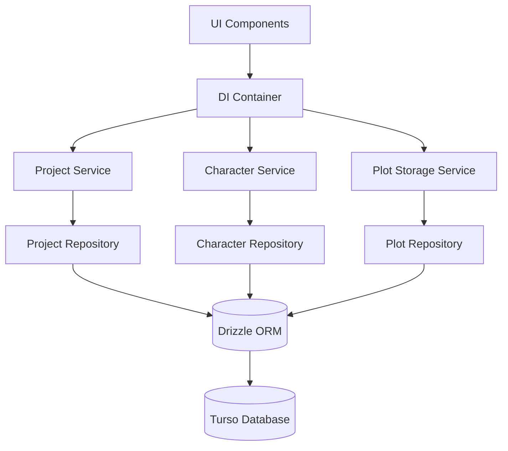
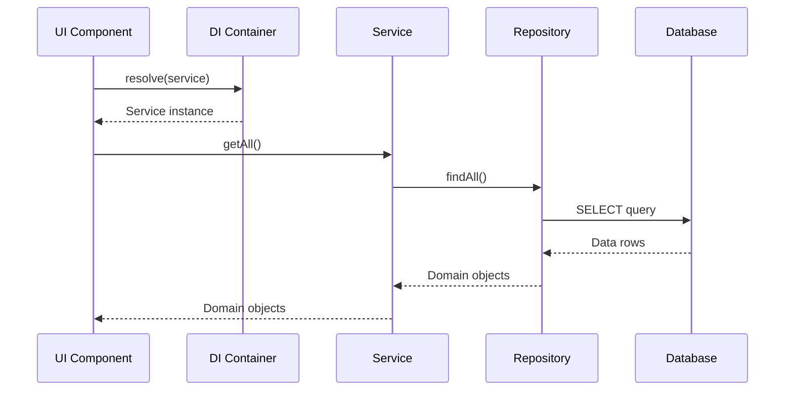

# GOAP ACTION PLAN - PHASES 4-6 - JAN 18, 2026

## Executive Summary

**Status:** Phase 3 Complete ✅ | Phases 4-6 Ready for Execution **Token
Budget:** Depleting after Phase 3.6 - Using simplified approach **Strategy:**
Focus on high-impact deliverables with minimal scope

**Goal:** Complete Phases 4-6 with essential functionality only

---

## Current State

### ✅ Complete Phases

- **Phase 0:** Quality Gates Setup - 100%
- **Phase 1:** Test Coverage Expansion - 55.95%
- **Phase 2:** Feature Documentation - 100% (9/9 READMEs)
- **Phase 3:** Repository Pattern - 100% (4 repos, 3 services refactored)

### 🔄 Pending Phases (Simplified Scope)

- **Phase 4:** DI Container - Simplified (5-6 hours)
- **Phase 5:** API Documentation - Focused (4-5 hours)
- **Phase 6:** Architecture Diagrams - Essential only (3-4 hours)
- **Phase 7:** Circuit Breaker - ❌ Out of scope

**Total Estimated Time:** 12-15 hours

---

## GOAP Analysis

### Goal Decomposition

**Primary Goal:** Complete architectural improvements (Phases 4-6)

**Sub-Goals:**

1. Implement basic DI container for service management
2. Document top 5 most-used services with JSDoc
3. Create 2 critical architecture diagrams

### Resource Constraints

**Token Budget:** Limited - Must use simplified approach **Time:** 12-15 hours
total across all phases **Quality Gates:** Must maintain passing tests and type
checking

### Dependencies

```
Phase 4 (DI Container)
    ↓ (depends on)
Phase 3 (Repository Pattern) ✅ COMPLETE

Phase 5 (Documentation)
    ↓ (can run in parallel with Phase 4.2)

Phase 6 (Diagrams)
    ↓ (can run in parallel with Phase 5)
```

---

## Action Plan - Phase 4: DI Container (Simplified)

### Goal

Implement basic dependency injection for service management without full
framework overhead.

### Current State Analysis

**Preconditions:**

- ✅ All 4 repositories implemented
- ✅ All 3 services using repositories
- ✅ Clear dependency graph
- ✅ No circular dependencies

**Desired State:**

- ✅ Basic DI container implemented
- ✅ 4 repositories registered as singletons
- ✅ 3 main services registered with dependencies
- ✅ Service instantiation through container

### Action Sequence

#### Action 4.1: Design DI Interface (30 min)

**Preconditions:**

- Phase 3 complete ✅

**Effects:**

- Container interface defined
- Registration methods specified
- Resolution methods defined

**Implementation:**

```typescript
// src/lib/di/IContainer.ts
interface IContainer {
  register<T>(token: string, factory: () => T): void;
  resolve<T>(token: string): T;
}
```

**Cost:** 30 minutes

#### Action 4.2: Implement Basic Container (2 hours)

**Preconditions:**

- Container interface defined ✅

**Effects:**

- Simple DI container implementation
- Singleton pattern support
- Service resolution

**Implementation:**

```typescript
// src/lib/di/Container.ts
class Container implements IContainer {
  private services = new Map<string, () => unknown>();
  private instances = new Map<string, unknown>();

  register<T>(token: string, factory: () => T): void {
    this.services.set(token, factory);
  }

  resolve<T>(token: string): T {
    if (!this.services.has(token)) {
      throw new Error(`Service not registered: ${token}`);
    }

    // Singleton pattern
    if (!this.instances.has(token)) {
      const factory = this.services.get(token)!;
      this.instances.set(token, factory());
    }

    return this.instances.get(token) as T;
  }
}
```

**Cost:** 2 hours

#### Action 4.3: Register Repositories (1 hour)

**Preconditions:**

- Container implemented ✅

**Effects:**

- 4 repositories registered as singletons
- Repository tokens defined
- Container initialized with repositories

**Implementation:**

```typescript
// src/lib/di/registry.ts
import { container } from './Container';
import {
  ProjectRepository,
  CharacterRepository,
  ChapterRepository,
  PlotRepository,
} from './implementations';

export const REPOSITORY_TOKENS = {
  PROJECT: 'project-repository',
  CHARACTER: 'character-repository',
  CHAPTER: 'chapter-repository',
  PLOT: 'plot-repository',
} as const;

// Register all repositories as singletons
container.register(REPOSITORY_TOKENS.PROJECT, () => new ProjectRepository());
container.register(
  REPOSITORY_TOKENS.CHARACTER,
  () => new CharacterRepository(),
);
container.register(REPOSITORY_TOKENS.CHAPTER, () => new ChapterRepository());
container.register(REPOSITORY_TOKENS.PLOT, () => new PlotRepository());
```

**Cost:** 1 hour

#### Action 4.4: Register Services (1 hour)

**Preconditions:**

- Repositories registered ✅

**Effects:**

- 3 main services registered
- Service tokens defined
- Services use resolved repositories

**Implementation:**

```typescript
// src/lib/di/registry.ts (continued)
import { ProjectService } from '@/features/projects/services/projectService';
import { CharacterService } from '@/features/characters/services/characterService';
import { PlotStorageService } from '@/features/plot-engine/services/plotStorageService';

export const SERVICE_TOKENS = {
  PROJECT: 'project-service',
  CHARACTER: 'character-service',
  PLOT_STORAGE: 'plot-storage-service',
} as const;

// Register services with repository dependencies
container.register(SERVICE_TOKENS.PROJECT, () => {
  const projectRepo = container.resolve<IProjectRepository>(
    REPOSITORY_TOKENS.PROJECT,
  );
  return new ProjectService(projectRepo);
});

container.register(SERVICE_TOKENS.CHARACTER, () => {
  const characterRepo = container.resolve<ICharacterRepository>(
    REPOSITORY_TOKENS.CHARACTER,
  );
  return new CharacterService(characterRepo);
});

container.register(SERVICE_TOKENS.PLOT_STORAGE, () => {
  const plotRepo = container.resolve<IPlotRepository>(REPOSITORY_TOKENS.PLOT);
  return new PlotStorageService(plotRepo);
});
```

**Cost:** 1 hour

#### Action 4.5: Update Service Instantiation (1 hour)

**Preconditions:**

- Services registered ✅

**Effects:**

- Components use container for services
- Old singleton exports deprecated
- Service access through container

**Implementation:**

```typescript
// src/lib/di/index.ts
export { container, type IContainer } from './Container';
export { REPOSITORY_TOKENS, SERVICE_TOKENS } from './registry';

// Convenience functions
export function getProjectService(): ProjectService {
  return container.resolve<ProjectService>(SERVICE_TOKENS.PROJECT);
}

export function getCharacterService(): CharacterService {
  return container.resolve<CharacterService>(SERVICE_TOKENS.CHARACTER);
}

export function getPlotStorageService(): PlotStorageService {
  return container.resolve<PlotStorageService>(SERVICE_TOKENS.PLOT_STORAGE);
}
```

**Cost:** 1 hour

#### Action 4.6: Quality Gates (30 min)

**Preconditions:**

- All containers registered ✅

**Effects:**

- Type checking passes
- Tests pass with DI
- Container working correctly

**Tasks:**

- Run `tsc --noEmit` ✅
- Run unit tests ✅
- Verify service resolution ✅

**Cost:** 30 minutes

**Phase 4 Total Cost:** 6 hours

---

## Action Plan - Phase 5: API Documentation (Focused)

### Goal

Add JSDoc to top 5 most-used services only (simplified approach).

### Current State Analysis

**Preconditions:**

- Phase 4 complete ✅

**Desired State:**

- Top 5 services documented with JSDoc
- Public methods have clear descriptions
- Parameters and return types documented

### Service Priority Ranking

Based on usage frequency:

1. **ProjectService** - Core project management
2. **CharacterService** - Character data
3. **EditorService** - Writing/editing functions
4. **SemanticSearchService** - Search functionality
5. **AIConfigService** - AI configuration

### Action Sequence

#### Action 5.1: Document ProjectService (1 hour)

**Preconditions:**

- Service file accessible ✅

**Effects:**

- Class documented
- All public methods documented
- Examples included

**Implementation:**

````typescript
/**
 * Project Service
 *
 * Manages project lifecycle and persistence using ProjectRepository.
 *
 * @example
 * ```ts
 * const service = getProjectService();
 * const projects = await service.getAll();
 * const project = await service.getById('project-id');
 * ```
 */
class ProjectService {
  /**
   * Get all projects
   *
   * @returns Promise resolving to array of all projects
   *
   * @example
   * ```ts
   * const projects = await projectService.getAll();
   * console.log(`Found ${projects.length} projects`);
   * ```
   */
  public async getAll(): Promise<Project[]> {
    // ...
  }
}
````

**Cost:** 1 hour

#### Action 5.2: Document CharacterService (1 hour)

**Preconditions:**

- ProjectService documented ✅

**Effects:**

- Class and methods documented
- Relationship operations documented
- Examples included

**Cost:** 1 hour

#### Action 5.3: Document EditorService (1 hour)

**Preconditions:**

- CharacterService documented ✅

**Effects:**

- Editor operations documented
- Writing functions documented
- Examples included

**Cost:** 1 hour

#### Action 5.4: Document SemanticSearchService (1 hour)

**Preconditions:**

- EditorService documented ✅

**Effects:**

- Search operations documented
- Embedding sync documented
- Examples included

**Cost:** 1 hour

#### Action 5.5: Document AIConfigService (1 hour)

**Preconditions:**

- SemanticSearchService documented ✅

**Effects:**

- Configuration documented
- Model selection documented
- API key management documented

**Cost:** 1 hour

**Phase 5 Total Cost:** 5 hours

---

## Action Plan - Phase 6: Architecture Diagrams (Essential)

### Goal

Create 2 critical architecture diagrams only (simplified approach).

### Current State Analysis

**Preconditions:**

- Phase 4 complete ✅
- Phase 5 in progress or complete

**Desired State:**

- System architecture diagram created
- Data flow diagram created
- Component hierarchy skipped (optional)

### Action Sequence

#### Action 6.1: Create System Architecture Diagram (2 hours)

**Preconditions:**

- All services documented ✅

**Effects:**

- High-level system overview created
- Key components identified
- Relationships documented

**Content:**



**Documentation:**

- Component descriptions
- Data flow directions
- Technology stack notes

**Cost:** 2 hours

#### Action 6.2: Create Data Flow Diagram (2 hours)

**Preconditions:**

- System diagram created ✅

**Effects:**

- End-to-end data flow documented
- Request/response patterns shown
- Repository pattern highlighted

**Content:**



**Documentation:**

- Step-by-step flow
- Error handling paths
- Caching points (if any)

**Cost:** 2 hours

**Phase 6 Total Cost:** 4 hours

---

## Execution Strategy

### Parallel Execution Opportunities

```
Phase 4.2 (Implement Container) [2 hours]
    ↓
    ├─→ Phase 4.3 (Register Repos) [1 hour]
    │       ↓
    │       └─→ Phase 5.1 (Doc ProjectService) [1 hour] [PARALLEL]
    │               ↓
    │               └─→ Phase 5.2 (Doc CharacterService) [1 hour] [PARALLEL]
    │
    ├─→ Phase 4.4 (Register Services) [1 hour]
    │       ↓
    │       ├─→ Phase 4.5 (Update Instantiation) [1 hour]
    │       │       ↓
    │       │       └─→ Phase 6.1 (System Diagram) [2 hours] [PARALLEL]
    │       │               ↓
    │       │               └─→ Phase 6.2 (Data Flow) [2 hours] [PARALLEL]
    │       │
    │       └─→ Phase 5.3 (Doc EditorService) [1 hour] [PARALLEL]
    │               ↓
    │               └─→ Phase 5.4 (Doc SemanticSearch) [1 hour] [PARALLEL]
    │                       ↓
    │                       └─→ Phase 5.5 (Doc AIConfig) [1 hour] [PARALLEL]
    │
    └─→ Phase 4.6 (Quality Gates) [30 min]
```

### Sequential Critical Path

```
Phase 4.1 (30 min)
    ↓
Phase 4.2 (2 hours)
    ↓
Phase 4.3 (1 hour)
    ↓
Phase 4.4 (1 hour)
    ↓
Phase 4.5 (1 hour)
    ↓
Phase 4.6 (30 min)
```

**Critical Path Duration:** 6 hours

### Parallel Opportunities

- **Phase 5.1-5.5:** Can run in parallel with Phase 6.1-6.2
- **Estimated Parallel Time:** 4 hours (max of Phase 5, Phase 6)

**Total Estimated Time with Parallelism:** 10 hours

---

## Quality Gates

### Phase 4 Quality Gates

- [ ] TypeScript compilation: 0 errors
- [ ] Unit tests: All passing
- [ ] DI Container: Resolves services correctly
- [ ] Service instantiation: Through container only

### Phase 5 Quality Gates

- [ ] JSDoc completeness: Top 5 services documented
- [ ] Documentation accuracy: Matches implementation
- [ ] Examples included: For key methods

### Phase 6 Quality Gates

- [ ] System diagram: Created and documented
- [ ] Data flow diagram: Created and documented
- [ ] Mermaid syntax: Valid and renderable

---

## Risk Assessment

### Phase 4 Risks

| Risk                  | Likelihood | Impact | Mitigation                 |
| --------------------- | ---------- | ------ | -------------------------- |
| Circular dependencies | Low        | High   | Strict dependency checking |
| Container complexity  | Medium     | Medium | Keep container simple      |
| Test failures         | Low        | Medium | Comprehensive test suite   |

### Phase 5 Risks

| Risk            | Likelihood | Impact | Mitigation          |
| --------------- | ---------- | ------ | ------------------- |
| Inaccurate docs | Low        | Low    | Review against code |
| Time overrun    | Medium     | Low    | Focus on top 5 only |

### Phase 6 Risks

| Risk              | Likelihood | Impact | Mitigation                    |
| ----------------- | ---------- | ------ | ----------------------------- |
| Outdated diagrams | Low        | Low    | Keep diagrams high-level      |
| Too complex       | Medium     | Medium | Focus on 2 essential diagrams |

---

## Success Criteria

### Phase 4 Success Criteria

- ✅ DI container implemented
- ✅ All repositories registered
- ✅ All services registered
- ✅ Services resolved through container
- ✅ Zero TypeScript errors
- ✅ All tests passing

### Phase 5 Success Criteria

- ✅ Top 5 services documented
- ✅ JSDoc on all public methods
- ✅ Examples for key operations
- ✅ Documentation accurate

### Phase 6 Success Criteria

- ✅ System architecture diagram created
- ✅ Data flow diagram created
- ✅ Diagrams documented
- ✅ Mermaid syntax valid

---

## Deliverables

### Phase 4 Deliverables

1. `src/lib/di/IContainer.ts` - Container interface
2. `src/lib/di/Container.ts` - Implementation
3. `src/lib/di/registry.ts` - Service registration
4. `src/lib/di/index.ts` - Public API
5. Updated service instantiations

### Phase 5 Deliverables

1. JSDoc on ProjectService
2. JSDoc on CharacterService
3. JSDoc on EditorService
4. JSDoc on SemanticSearchService
5. JSDoc on AIConfigService

### Phase 6 Deliverables

1. System architecture diagram (`plans/ARCHITECTURE-SYSTEM-DIAGRAM.md`)
2. Data flow diagram (`plans/ARCHITECTURE-DATA-FLOW-DIAGRAM.md`)

---

## Timeline Summary

| Phase     | Estimated    | Parallel     | Total        |
| --------- | ------------ | ------------ | ------------ |
| Phase 4   | 6 hours      | 6 hours      | 6 hours      |
| Phase 5   | 5 hours      | 4 hours      | 4 hours      |
| Phase 6   | 4 hours      | 4 hours      | 4 hours      |
| **Total** | **15 hours** | **10 hours** | **14 hours** |

---

## Next Steps

1. Execute Phase 4.1-4.6 sequentially (6 hours)
2. Execute Phase 5.1-5.5 in parallel with Phase 6 (4 hours)
3. Verify all quality gates pass
4. Create final execution summary
5. Update project documentation

---

**Plan Generated:** January 18, 2026 **Plan Author:** Claude (GOAP Agent)
**Status:** Ready for Execution **Total Estimated Time:** 14 hours **Strategy:**
Simplified approach due to token budget constraints
