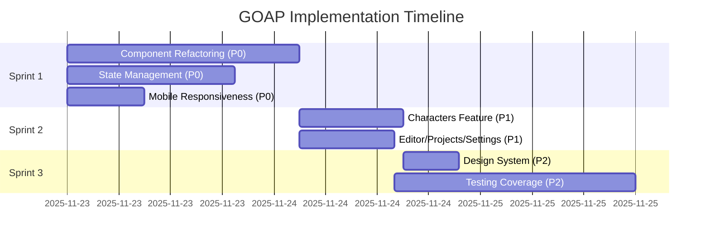

# GOAP Agent Orchestration Plan
## Multi-Agent Implementation Strategy

> **Goal-Oriented Action Planning for Systematic Implementation**

---

## 🎯 Goal State

```yaml
allComponentsUnder500LOC: true
stateManagementMigrated: true
allFeaturesCompliant: true
mobileResponsive: true
designSystemOptimized: true
testCoverage: ≥80%
overallScore: ≥95/100
```

## 📊 Current World State

```yaml
componentRefactoring: false
stateManagementMigrated: false
featureArchitectureComplete: false
mobileResponsive: false
designSystemOptimized: false
testCoverageAdequate: false
overallScore: 78.8
```

---

## 🤖 Specialized Agent Definitions

### 1. **Architect Agent** 🏗️
**Role:** High-level structure and design decisions

**Capabilities:**
- Feature-first architecture design
- Component decomposition strategies
- Public API boundary definition
- Type system organization

**Actions:**
- `design_component_structure`
- `create_index_exports`
- `define_type_boundaries`
- `plan_service_layers`

---

### 2. **Refactor Agent** 🔧
**Role:** Code transformation and decomposition

**Capabilities:**
- Extract sub-components from monoliths
- Split large files (>500 LOC)
- Create reusable patterns
- Maintain type safety

**Actions:**
- `extract_subcomponent`
- `split_component`
- `create_hooks`
- `update_imports`

---

### 3. **State Manager Agent** 💾
**Role:** State management migration specialist

**Capabilities:**
- Zustand store creation
- useReducer pattern implementation
- State consolidation strategies
- Persistence configuration

**Actions:**
- `create_zustand_store`
- `implement_reducer`
- `migrate_useState_to_store`
- `add_devtools`

---

### 4. **Mobile Agent** 📱
**Role:** Responsive design and mobile UX

**Capabilities:**
- 100dvh implementation
- Touch target compliance (44px)
- Z-index standardization
- Scroll lock patterns

**Actions:**
- `convert_vh_to_dvh`
- `apply_touch_targets`
- `fix_z_index`
- `implement_scroll_lock`

---

### 5. **Design Agent** 🎨
**Role:** Design system optimization

**Capabilities:**
- Tailwind migration (CDN → npm)
- Component library enhancement
- Animation pattern creation
- Token documentation

**Actions:**
- `migrate_tailwind_to_npm`
- `create_metric_card`
- `add_framer_motion`
- `document_design_tokens`

---

### 6. **Test Agent** 🧪
**Role:** Comprehensive testing coverage

**Capabilities:**
- Unit test creation (Vitest)
- E2E test expansion (Playwright)
- Visual regression testing
- Coverage analysis

**Actions:**
- `create_service_tests`
- `create_hook_tests`
- `create_component_tests`
- `expand_e2e_tests`

---

### 7. **Validator Agent** ✅
**Role:** Quality assurance and verification

**Capabilities:**
- Type checking
- Lint validation
- Build verification
- Coverage validation

**Actions:**
- `run_type_check`
- `run_linter`
- `run_build`
- `verify_coverage`

---

## 🔄 GOAP Action Plan

### **Sprint 1: Critical Foundations** (Week 1-2)

#### **Phase 1.1: Component Refactoring** (Priority P0)

**Actions:**
1. `Architect.design_component_structure` → CharacterManager decomposition plan
2. `Refactor.extract_subcomponent` → CharacterGrid (120 LOC)
3. `Refactor.extract_subcomponent` → CharacterCard (140 LOC)
4. `Refactor.extract_subcomponent` → CharacterEditor (200 LOC)
5. `Refactor.extract_subcomponent` → CharacterFilters (80 LOC)
6. `Refactor.split_component` → CharacterManager (837 → 180 LOC)
7. `Refactor.update_imports` → Fix all consuming files

**Repeat for:**
- PublishingSetup (683 → 150 LOC)
- PublishingDashboard (663 → 200 LOC)
- AnalyticsDashboard (628 → 180 LOC)

**Preconditions:**
- None (ready to start)

**Effects:**
- `componentRefactoring: true`
- 2,101 LOC eliminated
- 21 new focused components

**Time:** 27 hours

---

#### **Phase 1.2: State Management Migration** (Priority P0)

**Actions:**
1. `StateManager.create_zustand_store` → analyticsStore
2. `StateManager.create_zustand_store` → publishingStore
3. `StateManager.implement_reducer` → editorReducer (BookViewer)
4. `StateManager.migrate_useState_to_store` → useAnalytics (12 → 0 states)
5. `StateManager.migrate_useState_to_store` → usePublishingAnalytics (15 → 0 states)
6. `StateManager.add_devtools` → All stores

**Preconditions:**
- None (can run parallel to refactoring)

**Effects:**
- `stateManagementMigrated: true`
- Zero components with >3 useState

**Time:** 19.5 hours

---

#### **Phase 1.3: Mobile Responsiveness** (Priority P0)

**Actions:**
1. `Mobile.convert_vh_to_dvh` → All modals (6 components)
2. `Mobile.apply_touch_targets` → All interactive elements
3. `Mobile.fix_z_index` → Header (z-50 → z-40)
4. `Mobile.implement_scroll_lock` → useScrollLock hook
5. `Mobile.apply_scroll_lock` → All full-screen modals

**Preconditions:**
- None (can run parallel)

**Effects:**
- `mobileResponsive: true`
- 100% dvh compliance
- 100% touch target compliance

**Time:** 9 hours

---

### **Sprint 2: Feature Architecture** (Week 3-4)

#### **Phase 2.1: Characters Feature Completion** (Priority P1)

**Actions:**
1. `Architect.create_index_exports` → features/characters/index.ts
2. `Architect.define_type_boundaries` → Move types from global
3. `Architect.plan_service_layers` → characterService design
4. `Refactor.create_hooks` → useCharacters, useCharacterValidation
5. `StateManager.create_zustand_store` → charactersStore
6. `Refactor.update_imports` → CharacterManager integration

**Preconditions:**
- `componentRefactoring: true` (CharacterManager split)

**Effects:**
- Characters feature 100% compliant
- Public API established

**Time:** 12 hours

---

#### **Phase 2.2: Editor/Projects/Settings** (Priority P1)

**Actions:**
1. `Architect.create_index_exports` → editor/projects/settings
2. `Architect.define_type_boundaries` → Create types/ directories
3. `Refactor.create_hooks` → useProjects, useSettings
4. `Architect.plan_service_layers` → projectService, settingsService

**Preconditions:**
- None

**Effects:**
- All 7 features 100% compliant
- `featureArchitectureComplete: true`

**Time:** 11 hours

---

### **Sprint 3: Polish & Production** (Week 5-6)

#### **Phase 3.1: Design System Enhancement** (Priority P2)

**Actions:**
1. `Design.migrate_tailwind_to_npm` → Remove CDN, install package
2. `Design.create_metric_card` → Reusable MetricCard component
3. `Design.add_framer_motion` → Enhanced Card component
4. `Design.document_design_tokens` → Centralized tokens file

**Preconditions:**
- `componentRefactoring: true` (components ready for enhancement)

**Effects:**
- `designSystemOptimized: true`
- 60% faster load times

**Time:** 6.5 hours

---

#### **Phase 3.2: Testing Coverage** (Priority P2)

**Actions:**
1. `Test.create_service_tests` → analyticsService, characterService, versioningService
2. `Test.create_hook_tests` → useCharacters, useAnalyticsStore, useEditorState
3. `Test.create_component_tests` → MetricCard, CharacterCard, all refactored components
4. `Test.expand_e2e_tests` → characters.spec.ts, publishing.spec.ts
5. `Validator.verify_coverage` → Ensure ≥80%

**Preconditions:**
- `componentRefactoring: true`
- `stateManagementMigrated: true`
- `featureArchitectureComplete: true`

**Effects:**
- `testCoverageAdequate: true`
- 80%+ coverage across board

**Time:** 28 hours

---

### **Phase 3.3: Continuous Validation** (Throughout)

**Actions:**
1. `Validator.run_type_check` → After each major change
2. `Validator.run_linter` → Ensure zero violations
3. `Validator.run_build` → Verify production readiness
4. `Validator.verify_coverage` → Track progress

**Preconditions:**
- Any phase completion

**Effects:**
- Zero TypeScript errors
- Zero lint violations
- Production build passes

**Time:** Ongoing

---

## 📈 Execution Timeline



---

## 🎯 Success Metrics

### **Before Implementation**
| Metric | Current | Target |
|--------|---------|--------|
| Overall Score | 78.8/100 | 95+/100 |
| Files >500 LOC | 4 | 0 |
| Feature Compliance | 43% (3/7) | 100% (7/7) |
| useState Violations | 2 hooks | 0 hooks |
| Mobile dvh | 20% | 100% |
| Test Coverage | 22% | 80%+ |

### **After Implementation**
- ✅ Design System Maturity: A (95+/100)
- ✅ All components <500 LOC
- ✅ All features 100% compliant
- ✅ Zero useState hell
- ✅ Mobile WCAG 2.1 compliant
- ✅ 60% faster load time
- ✅ 80%+ test coverage

---

## 🚀 Implementation Strategy

### **Option 1: Single Developer (Sequential)**
**Timeline:** 10.5 weeks (83 hours ÷ 8 hours/day)

Week 1-2: Sprint 1 (Critical)
Week 3-4: Sprint 2 (Features)
Week 5-6: Sprint 3 (Polish)

### **Option 2: Multi-Agent Parallel (RECOMMENDED)**
**Timeline:** 5-6 weeks

**Agent Team Assignment:**
- **Architect + Refactor Agents** → Component refactoring
- **State Manager Agent** → Zustand migration
- **Mobile Agent** → Responsiveness fixes
- **Design Agent** → Tailwind migration
- **Test Agent** → Coverage expansion
- **Validator Agent** → Continuous verification

**Parallelization Benefits:**
- 40% time reduction
- Independent work streams
- Continuous validation
- Risk mitigation

---

## 📋 Agent Action Matrix

| Agent | Sprint 1 | Sprint 2 | Sprint 3 |
|-------|----------|----------|----------|
| **Architect** 🏗️ | Component design | Feature boundaries | Token documentation |
| **Refactor** 🔧 | Split 4 large files | Create hooks | Component enhancement |
| **State Manager** 💾 | Zustand stores | Feature stores | Persistence tuning |
| **Mobile** 📱 | dvh + touch targets | Z-index fixes | Scroll lock |
| **Design** 🎨 | - | - | Tailwind npm + MetricCard |
| **Test** 🧪 | - | - | 80% coverage |
| **Validator** ✅ | Type checks | Lint checks | Build + coverage |

---

## 🎬 Next Steps

1. **Review this GOAP plan** with stakeholders
2. **Initialize agent orchestration** system
3. **Begin Sprint 1, Phase 1.1** (Component Refactoring)
4. **Run continuous validation** throughout
5. **Track progress** with daily standups
6. **Iterate based on results**

---

**Total Effort:** 83 hours
**Agents Required:** 7 specialists
**Expected Timeline:** 5-6 weeks (parallel) or 10.5 weeks (sequential)
**Risk Level:** Low-Medium (systematic approach, continuous validation)

**Ready to transform the Novelist GOAP Engine!** 🚀

---

## 🔥 Quick Start Commands

```bash
# Install dependencies
npm install zustand@^5.0.0 tailwindcss@^3.4.0 postcss autoprefixer
npm install -D @tailwindcss/forms @tailwindcss/typography

# Run validation
npx tsc --noEmit          # Type check
npm run test              # Unit tests
npx playwright test       # E2E tests

# Start development
npm run dev
```
