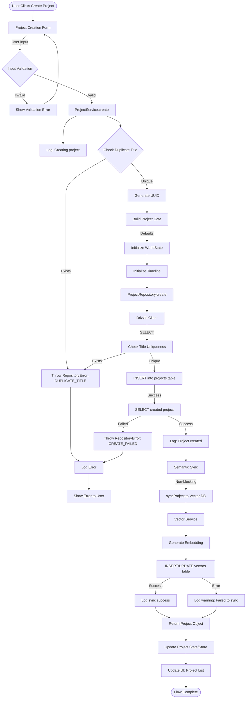
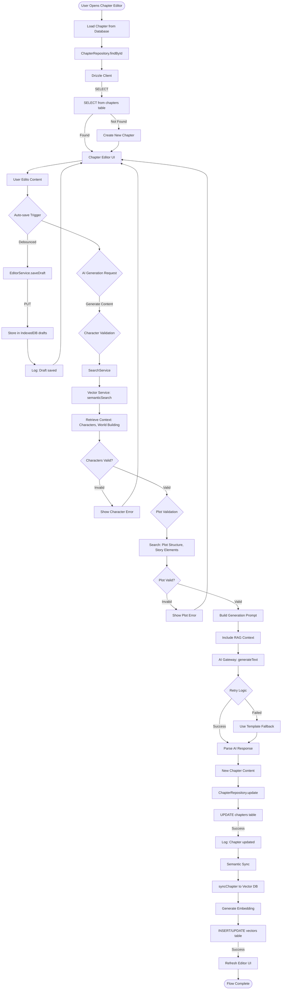
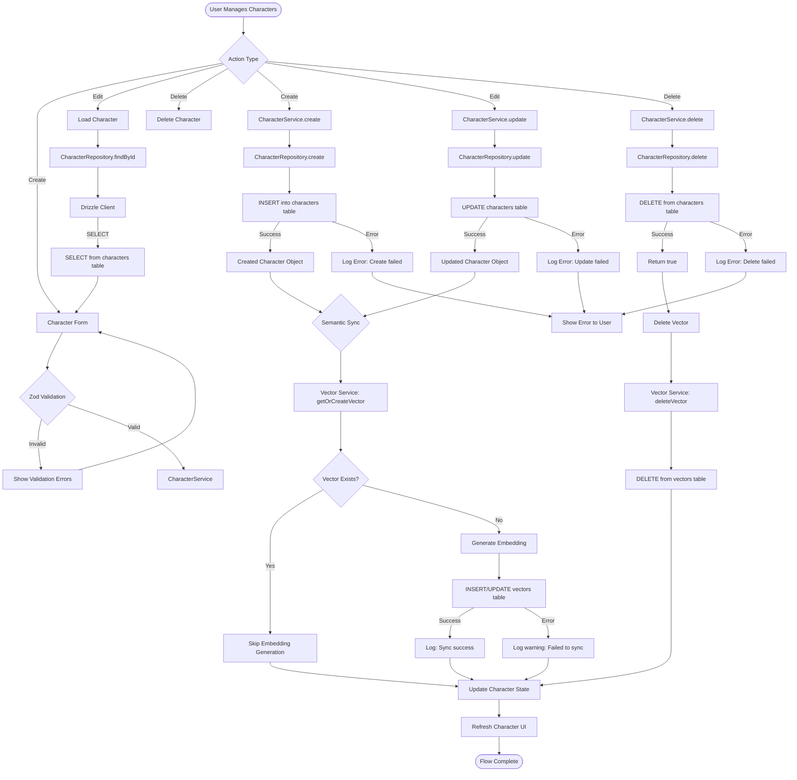

# Data Flow Diagrams - Novelist.ai

This document describes the data flows through Novelist.ai's architecture,
showing how data moves between UI components, services, repositories, databases,
and external systems.

## Table of Contents

1. [Project Creation Flow](#1-project-creation-flow)
2. [Chapter Writing Flow](#2-chapter-writing-flow)
3. [Character Management Flow](#3-character-management-flow)
4. [Publishing Flow](#4-publishing-flow)
5. [Search/Semantic Flow](#5-searchsemantic-flow)

---

## 1. Project Creation Flow

Shows how a new project is created, validated, persisted, and synchronized.

### Key Data Path

1. **User Input** → **Zod Validation** → **ProjectService**
2. **ProjectService** → **ProjectRepository** → **Drizzle ORM**
3. **Drizzle ORM** → **Turso Database** (SQLite)
4. **Async** → **Semantic Sync** → **Vector Service** → **Vector Table**
5. **Project Data** → **State/Store** → **UI Update**

### Error Handling

- **Validation Errors**: Caught and displayed immediately in UI
- **Duplicate Title**: RepositoryError with code `DUPLICATE_TITLE`
- **DB Connection**: RepositoryError with code `DB_CONNECTION_ERROR`
- **Create Failure**: RepositoryError with code `CREATE_FAILED`
- **Semantic Sync**: Non-blocking, logged as warning if fails

### Caching Strategy

- No caching for project creation (writes should be consistent)
- Vector embeddings cached in database for future searches

---

## 2. Chapter Writing Flow

Shows the complete flow from editing to AI-assisted generation, including
validation and persistence.

### Key Data Path

1. **Load** → **ChapterRepository** → **Drizzle** → **Turso**
2. **Auto-save** → **IndexedDB** (local drafts)
3. **AI Generation** → **SearchService** → **Vector DB** → **Context Retrieval**
4. **RAG Context** → **AI Gateway** → **Generated Content**
5. **Save** → **ChapterRepository** → **Drizzle** → **Turso**
6. **Async** → **Vector Sync** → **Vector Service** → **Vector Table**

### Error Handling

- **Chapter Not Found**: Creates new chapter automatically
- **Character Validation**: Shows error in UI, blocks generation
- **Plot Validation**: Shows error in UI, blocks generation
- **AI Gateway Failure**: Retry with exponential backoff, fallback to template
- **Vector Sync**: Non-blocking, logged as warning

### Caching Strategy

- **IndexedDB**: Stores local drafts for offline editing
- **Query Cache**: SearchService caches query results (queryCache)
- **Vector Embeddings**: Cached in Vector DB for future RAG
- **Auto-save**: Debounced to avoid excessive writes

---

## 3. Character Management Flow

Shows how characters are created, updated, and synchronized with the semantic
search system.

### Key Data Path

1. **UI Form** → **CharacterService** → **CharacterRepository**
2. **CharacterRepository** → **Drizzle ORM** → **Turso** (characters table)
3. **Async** → **Semantic Sync** → **Vector Service**
4. **Vector Service** → **Generate Embedding** → **Vector Table**

### Error Handling

- **Validation Errors**: Caught by Zod, displayed in UI
- **Create/Update/Delete Failures**: Logged, shown as error toast
- **Vector Sync**: Non-blocking, logged as warning if fails
- **DB Connection**: RepositoryError with code `DB_CONNECTION_ERROR`

### Caching Strategy

- **Vector Embeddings**: Cached in Vector DB (checked with `vectorExists`)
- **Relationships**: Queried from `characters.relationships` field (JSON array)
- **Query Cache**: SearchService caches character search results

---

## 4. Publishing Flow

Shows the complete EPUB generation process from project data to downloadable
file.

```mermaid
flowchart TD
    Start([User Clicks Publish]) --> Validate{Project Validation}

    Validate -->|Invalid| ShowError[Show Validation Error]
    Validate -->|Valid| LoadProject[Load Project Data]

    LoadProject --> ProjectService[ProjectService.getById]
    ProjectService --> ProjectRepo[ProjectRepository.findById]
    ProjectRepo --> DrizzleDB[Drizzle Client]
    DrizzleDB -->|SELECT| GetProject[SELECT from projects table]

    GetProject --> LoadChapters[Load All Chapters]
    LoadChapters --> ChapterRepo[ChapterRepository.findByProjectId]
    ChapterRepo --> GetChapters[SELECT from chapters table]

    GetChapters --> PrepareProject[Prepare Project Object]
    PrepareProject --> CoverImage{Has Cover Image?}

    CoverImage -->|Yes| DecodeImage[Decode Base64 Image]
    CoverImage -->|No| SkipCover[Skip Cover]

    DecodeImage --> JSZip[Initialize JSZip]
    SkipCover --> JSZip

    JSZip --> MimeType[Add mimetype]
    MimeType --> Container[Add META-INF/container.xml]
    Container --> Styles[Add OEBPS/styles.css]

    Styles --> DropCaps{Enable Drop Caps?}
    DropCaps -->|Yes| AddDropCapCSS[Add drop-cap CSS]
    DropCaps -->|No| NoDropCap[No drop-cap CSS]
    AddDropCapCSS --> OEBPS
    NoDropCap --> OEBPS

    OEBPS --> CoverImageFile{Has Cover?}
    CoverImageFile -->|Yes| AddCoverImage[Add images/cover.png]
    CoverImageFile -->|No| NoCoverImage[No cover image]
    AddCoverImage --> CoverXHTML[Add cover.xhtml]
    NoCoverImage --> TitlePage

    CoverXHTML --> TitlePage[Add title.xhtml]
    TitlePage --> ProcessChapters[Process Chapters]

    ProcessChapters --> ForEach[For Each Chapter]
    ForEach --> ParseMarkdown[Parse Markdown to HTML]
    ParseMarkdown --> ApplyDropCap{Apply Drop Cap?}
    ApplyDropCap -->|Yes| AddDropCapSpan[Wrap first letter in span]
    ApplyDropCap -->|No| NoDropCapSpan[No wrapping]
    AddDropCapSpan --> ChapterXHTML[Add chapter-N.xhtml]
    NoDropCapSpan --> ChapterXHTML

    ChapterXHTML --> NextChapter{Next Chapter?}
    NextChapter -->|Yes| ForEach
    NextChapter -->|No| Manifest

    Manifest[Add content.opf] --> Spine[Add spine items]
    Spine --> TOC[Add toc.ncx]
    TOC --> GenerateBlob[Generate Blob]

    GenerateBlob --> ZipFile[zip.generateAsync]
    ZipFile -->|Success| EPUBBlob[EPUB Blob Object]
    ZipFile -->|Error| ZipError[Log Error: Zip failed]

    EPUBBlob --> Download{Action Type}
    Download -->|Download| TriggerDownload[Trigger Browser Download]
    Download -->|Share| CopyToClipboard[Copy to Clipboard]

    TriggerDownload --> End([Flow Complete])
    CopyToClipboard --> End

    ShowError --> End
    ZipError --> UIErrorMessage[Show Error to User]
    UIErrorMessage --> End
```

### Key Data Path

1. **Project Service** → **Project Repository** → **Drizzle** → **Project Data**
2. **Chapter Repository** → **Drizzle** → **Chapter Data**
3. **JSZip** → **Build EPUB Structure** → **Add Files**
4. **Markdown → HTML** → **Apply Styling** → **Chapter Files**
5. **Generate Blob** → **Download/Share**

### Error Handling

- **Project Validation**: Required fields must be populated
- **Chapter Loading**: All chapters must be accessible
- **Image Decoding**: Base64 images must be valid
- **Zip Generation**: Errors logged, shown to user

### Caching Strategy

- No caching for EPUB generation (always uses latest data)
- Project and chapter data cached in state prior to publishing

---

## 5. Search/Semantic Flow

Shows how semantic search works with embedding generation, vector similarity,
and result hydration.

```mermaid
flowchart TD
    Start([User Enters Search Query]) --> SearchUI[Search Input Component]
    SearchUI --> UserQuery[User Types Query]
    UserQuery --> Debounce{Debounce 300ms}

    Debounce --> SearchService[SearchService.search]
    SearchService --> GenerateKey[Generate Cache Key]
    GenerateKey --> QueryCache{QueryCache.check}

    QueryCache -->|Hit| CachedResults[Return Cached Results]
    QueryCache -->|Miss| GenerateEmbedding[Generate Query Embedding]

    CachedResults --> ApplyFilters{Apply Filters?}
    ApplyFilters -->|Yes| FilterResults[Filter by entityTypes, minScore, limit]
    ApplyFilters -->|No| NoFilter[No Filtering]
    FilterResults --> UIResults[Return to UI]
    NoFilter --> UIResults

    GenerateEmbedding --> EmbeddingService[Embedding Service]
    EmbeddingService --> APIGateway[OpenAI API: text-embedding-3-small]
    APIGateway -->|Success| QueryVector[Query Embedding Vector]
    APIGateway -->|Error| EmbeddingError[Log Error: Embedding failed]

    QueryVector --> VectorSearch[Vector Service: semanticSearch]
    VectorSearch --> DrizzleDB[Drizzle Client]
    DrizzleDB -->|SELECT| FetchVectors[SELECT from vectors table]

    FetchVectors --> FilterProject{Filter by ProjectId}
    FilterProject -->|Yes| ProjectFilter[WHERE projectId = ?]
    FilterProject -->|No| NoProjectFilter[No project filter]

    ProjectFilter --> FilterType{Filter by EntityType}
    NoProjectFilter --> FilterType

    FilterType -->|Yes| TypeFilter[WHERE entityType = ?]
    FilterType -->|No| NoTypeFilter[No entity type filter]

    TypeFilter --> CandidateVectors[Candidate Vectors]
    NoTypeFilter --> CandidateVectors

    CandidateVectors --> CalculateSimilarity[For Each Candidate]
    CalculateSimilarity --> ParseEmbedding[Parse embedding JSON]
    ParseEmbedding --> CosineSimilarity[Calculate Cosine Similarity]

    CosineSimilarity --> ThresholdCheck{Similarity >= Threshold?}
    ThresholdCheck -->|Yes| AddResult[Add to results]
    ThresholdCheck -->|No| SkipResult[Skip result]

    AddResult --> NextVector{Next Vector?}
    SkipResult --> NextVector
    NextVector -->|Yes| CalculateSimilarity
    NextVector -->|No| SortResults[Sort by similarity DESC]

    SortResults --> LimitResults[Limit to N results]
    LimitResults --> RawResults[Raw Search Results]

    RawResults --> HydrateResults[Hydrate with Entity Data]
    HydrateResults --> ForEachResult[For Each Result]

    ForEachResult --> EntityType{Entity Type?}
    EntityType -->|character| CharService[CharacterService.getById]
    EntityType -->|chapter| EditorService[EditorService.loadDraft]
    EntityType -->|world_building| WorldService[WorldBuildingService.getLocation/getCulture]
    EntityType -->|project| ProjectService2[ProjectService.getById]

    CharService --> GetChar[SELECT from characters]
    GetChar --> EntityData[Entity Data]
    EditorService --> LoadDraft[Load from IndexedDB]
    LoadDraft --> EntityData
    WorldService --> GetWorld[SELECT from world_building]
    GetWorld --> EntityData
    ProjectService2 --> GetProj[SELECT from projects]
    GetProj --> EntityData

    EntityData --> FormatContext[Format Context String]
    FormatContext --> HydratedResult[Hydrated Search Result]

    HydratedResult --> NextResult{Next Result?}
    NextResult -->|Yes| ForEachResult
    NextResult -->|No| FilterNull[Filter out null results]

    FilterNull --> StoreCache[Store in QueryCache]
    StoreCache --> ApplyFilters

    EmbeddingError --> UIError[Show Error to User]
    UIError --> End([Flow Complete])
    UIResults --> End
```

### Key Data Path

1. **User Query** → **Generate Embedding** → **OpenAI API**
2. **Query Embedding** → **Vector Search** → **Drizzle** → **Vector Table**
3. **Candidate Vectors** → **Cosine Similarity** → **Raw Results**
4. **Hydration** → **Service** → **Database** → **Entity Data**
5. **Cache** → **Query Cache** → **Future Queries**

### Error Handling

- **Embedding Generation**: API errors logged, shown to user
- **Vector Search**: Database errors logged, return empty results
- **Entity Hydration**: Failed entities filtered out (null)
- **Query Cache**: Failures logged but don't block search

### Caching Strategy

- **Query Cache**: In-memory cache (Map) for recent queries
- **Cache Key**: Normalized query string (lowercase, trimmed)
- **Cache Hit**: Filters applied post-cache for broader utility
- **Cache TTL**: Not implemented (consider adding)
- **Vector Embeddings**: Stored in Vector DB for persistence

### Performance Optimizations

- **Debouncing**: 300ms debounce on user input
- **Limit**: Limits candidate vectors before similarity calculation
- **Threshold**: Early filtering by similarity threshold
- **Type Filter**: Reduces search scope when entityType specified
- **Batching**: Hydration done in parallel with `Promise.all`

---

## Data Store Summary

| Store              | Technology            | Purpose                                             | Latency  |
| ------------------ | --------------------- | --------------------------------------------------- | -------- |
| **Turso (SQLite)** | Cloud Database        | Persistent storage (projects, chapters, characters) | 50-200ms |
| **Vector Table**   | Turso with embeddings | Semantic search vectors                             | 50-200ms |
| **IndexedDB**      | Browser Local Storage | Auto-save drafts                                    | 5-20ms   |
| **Query Cache**    | In-Memory Map         | Recent search queries                               | <1ms     |
| **State/Store**    | Zustand               | React state management                              | <1ms     |

## Database Operations Summary

| Operation               | Table                         | Frequency | Indexes               |
| ----------------------- | ----------------------------- | --------- | --------------------- |
| **SELECT by ID**        | All tables                    | High      | PRIMARY KEY           |
| **SELECT by projectId** | chapters, characters, vectors | High      | projectId index       |
| **INSERT**              | All tables                    | Medium    | -                     |
| **UPDATE**              | All tables                    | Medium    | -                     |
| **DELETE**              | All tables                    | Low       | -                     |
| **Vector Search**       | vectors                       | High      | UpdatedAt, entityType |

## External API Dependencies

| API                        | Purpose             | Rate Limit     | Fallback          |
| -------------------------- | ------------------- | -------------- | ----------------- |
| **OpenAI Embeddings**      | Generate embeddings | 3,000 RPM/min  | -                 |
| **AI Gateway (Anthropic)** | Generate content    | Model-specific | Template fallback |
| **Turso**                  | Database operations | 1,000 RQPS     | Local IndexedDB   |

---

**Document Version**: 1.0.0 **Last Updated**: 2026-01-18 **Source of Truth**:
`plans/architecture/data-flows.md`
