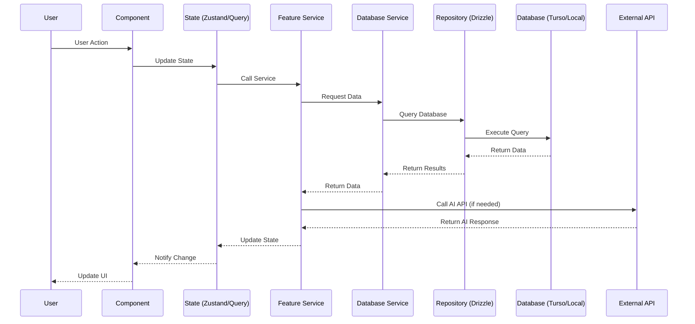

# Novelist.ai System Architecture

## Overview

Novelist.ai is a feature-rich AI-assisted novel writing platform built with
React, TypeScript, and a modern web stack. The architecture follows clean
architecture principles with clear separation of concerns across layers.

## System Architecture Diagram

```mermaid
graph TB
    subgraph "UI Layer - Presentation"
        A[App.tsx]
        B[MainLayout]
        C[Feature Components]
        D[Shared Components]

        A --> B
        B --> C
        B --> D

        subgraph "Feature Modules"
            C1[Projects]
            C2[Generation]
            C3[Plot Engine]
            C4[World Building]
            C5[Dialogue]
            C6[Characters]
            C7[Writing Assistant]
            C8[Analytics]
            C9[Gamification]
            C10[Publishing]
            C11[Settings]
            C12[Versioning]
            C13[Semantic Search]

            C --> C1
            C --> C2
            C --> C3
            C --> C4
            C --> C5
            C --> C6
            C --> C7
            C --> C8
            C --> C9
            C --> C10
            C --> C11
            C --> C12
            C --> C13
        end

        subgraph "Shared UI Components"
            D1[Button]
            D2[Card]
            D3[Dialog]
            D4[Progress]
            D5[Toaster]
            D6[MetricCard]
            D7[Skeleton]
            D8[Badge]

            D --> D1
            D --> D2
            D --> D3
            D --> D4
            D --> D5
            D --> D6
            D --> D7
            D --> D8
        end
    end

    subgraph "State Management Layer"
        E[Zustand Stores]
        F[React Query]

        subgraph "Zustand Stores"
            E1[toastStore]
            E2[featureFlagsStore]
            E3[publishingStore]
            E4[versioningStore]
            E5[analyticsStore]
            E6[timelineStore]

            E --> E1
            E --> E2
            E --> E3
            E --> E4
            E --> E5
            E --> E6
        end

        C --> E
        C --> F
        F --> G
    end

    subgraph "Service Layer - Business Logic"
        G[Feature Services]
        H[Database Services]
        I[AI Services]

        subgraph "Feature Services"
            G1[projectService]
            G2[plotGenerationService]
            G3[characterGraphService]
            G4[dialogueAnalysisService]
            G5[worldBuildingService]
            G6[writingAssistantService]
            G7[gamificationService]
            G8[publishingService]
            G9[analyticsService]
            G10[versioningService]
            G11[styleAnalysisService]
            G12[editorService]
            G13[imageGenerationService]

            G --> G1
            G --> G2
            G --> G3
            G --> G4
            G --> G5
            G --> G6
            G --> G7
            G --> G8
            G --> G9
            G --> G10
            G --> G11
            G --> G12
            G --> G13
        end

        subgraph "Database Services"
            H1[projectService]
            H2[characterService]
            H3[dialogueService]
            H4[worldBuildingService]
            H5[versioningService]
            H6[publishingService]
            H7[writingAssistantService]
            H8[vectorService]
            H9[drizzleDbService]

            H --> H1
            H --> H2
            H --> H3
            H --> H4
            H --> H5
            H --> H6
            H --> H7
            H --> H8
            H --> H9
        end

        subgraph "AI Services"
            I1[aiConfigService]
            I2[aiHealthService]
            I3[aiAnalyticsService]
            I4[openrouterModelsService]
            I5[openrouterAdvancedService]

            I --> I1
            I --> I2
            I --> I3
            I --> I4
            I --> I5
        end

        E --> G
        F --> G
    end

    subgraph "Repository Layer - Data Access"
        J[Drizzle ORM]
        K[Schema Definitions]

        subgraph "Schema Tables"
            K1[projects]
            K2[chapters]
            K3[plots]
            K4[characters]
            K5[dialogue]
            K6[worldBuilding]
            K7[versioning]
            K8[publishing]
            K9[writingAssistant]
            K10[vectors]

            K --> K1
            K --> K2
            K --> K3
            K --> K4
            K --> K5
            K --> K6
            K --> K7
            K --> K8
            K --> K9
            K --> K10
        end

        H --> J
        J --> K
    end

    subgraph "DI Container"
        L[Container]
        M[Service Registry]

        L --> M
        M --> G
        M --> H
        M --> I
    end

    subgraph "Database Layer"
        N[Turso/SQLite]
        O[LocalStorage Fallback]

        J --> N
        J --> O
    end

    subgraph "External APIs"
        P[OpenAI]
        Q[Google AI]
        R[OpenRouter]

        I --> P
        I --> Q
        I --> R
    end

    subgraph "Infrastructure"
        S[Logger Service]
        T[Analytics Service]
        U[PWA Manager]
        V[Performance Monitor]

        A --> S
        A --> T
        A --> U
        A --> V
    end

    subgraph "Build & Tooling"
        W[Vite]
        X[TypeScript]
        Y[ESLint]
        Z[Vitest]
        AA[Playwright]
        AB[Drizzle Kit]

        W --> X
        X --> Y
        Y --> Z
        Z --> AA
        J --> AB
    end

    style A fill:#e1f5ff
    style E fill:#fff4e6
    style G fill:#f3e8ff
    style J fill:#e8f5e9
    style L fill:#fce4ec
    style N fill:#ffebee
    style P fill:#f3e5f5
    style Q fill:#e8eaf6
    style R fill:#e8f5e9
```



## Component Hierarchy

### Feature-Based Structure

```
src/
├── app/                          # Application entry & routing
│   ├── App.tsx                  # Root component with view routing
│   ├── loading-states.tsx       # Loading components
│   └── error-boundaries.tsx     # Error boundaries
│
├── features/                     # Feature modules (colocation principle)
│   ├── analytics/               # Analytics dashboard
│   │   ├── components/
│   │   ├── hooks/
│   │   └── services/
│   │
│   ├── characters/              # Character management
│   │   ├── components/
│   │   └── services/
│   │
│   ├── dialogue/                # Dialogue analysis
│   │   ├── components/
│   │   └── services/
│   │
│   ├── editor/                  # Rich text editor
│   │   └── services/
│   │
│   ├── gamification/            # Achievements & streaks
│   │   ├── components/
│   │   └── services/
│   │
│   ├── generation/              # AI story generation
│   │   ├── components/
│   │   ├── hooks/
│   │   └── services/
│   │
│   ├── onboarding/              # User onboarding
│   │   └── components/
│   │
│   ├── plot-engine/             # GOAP plot generation
│   │   ├── components/
│   │   ├── hooks/
│   │   └── services/
│   │
│   ├── projects/                # Project management
│   │   ├── components/
│   │   └── services/
│   │
│   ├── publishing/              # eBook publishing
│   │   ├── components/
│   │   └── services/
│   │
│   ├── semantic-search/         # Vector search
│   │   ├── components/
│   │   └── services/
│   │
│   ├── settings/                # Application settings
│   │   └── components/
│   │
│   ├── timeline/                # Story timeline
│   │   └── stores/
│   │
│   ├── versioning/              # Content versioning
│   │   └── services/
│   │
│   ├── world-building/         # World building tools
│   │   ├── components/
│   │   └── services/
│   │
│   └── writing-assistant/      # Writing aids
│       ├── components/
│       ├── hooks/
│       └── services/
│
├── lib/                         # Core infrastructure
│   ├── database/               # Database layer
│   │   ├── schemas/           # Drizzle schema definitions
│   │   ├── services/          # Database operations
│   │   ├── config.ts          # Database configuration
│   │   ├── drizzle.ts         # Drizzle client
│   │   └── index.ts           # Module exports
│   │
│   ├── di/                     # Dependency injection
│   │   ├── Container.ts       # DI container implementation
│   │   ├── IContainer.ts      # Container interface
│   │   ├── registry.ts        # Service registry
│   │   └── index.ts           # Module exports
│   │
│   ├── logging/                # Logging service
│   ├── stores/                # Zustand state stores
│   ├── react-query/           # React Query configuration
│   └── utils/                 # Utility functions
│
├── shared/                      # Shared components
│   ├── components/
│   │   ├── layout/            # Layout components
│   │   ├── ui/                # UI components
│   │   └── a11y/              # Accessibility components
│   └── types/                 # Shared TypeScript types
│
├── components/                  # Global components
│   ├── ai/                     # AI-related components
│   ├── layout/                 # Layout components
│   └── [other components]
│
├── hooks/                       # Global React hooks
├── types/                       # TypeScript type definitions
├── utils/                       # Utility functions
└── services/                    # Global services
```

### Shared Components

**Layout Components**

- `MainLayout` - App layout wrapper
- `Header`/`Navbar` - Navigation header
- `Sidebar` - Side navigation
- `BottomNav` - Mobile bottom navigation
- `AppBackground` - Background styling

**UI Components** (Design System)

- `Button` - Action buttons with variants
- `Card` - Card containers
- `Dialog` - Modal dialogs
- `Progress` - Progress indicators
- `Toaster` - Toast notifications
- `MetricCard` - Metric display cards
- `Skeleton` - Loading skeletons
- `Badge` - Status badges

**Accessibility Components**

- `LiveRegion` - ARIA live regions
- Skip links for keyboard navigation

## Key Integration Points

### 1. UI Layer ↔ State Management

**Zustand Stores**

- Used for global state like toasts, feature flags, publishing state
- Stores are accessed via hooks in components
- Example: `useToastStore()`, `usePublishingStore()`

**React Query**

- Used for server state and async operations
- Provides caching, refetching, and optimistic updates
- Query client configured in `lib/react-query/`

### 2. State Management ↔ Service Layer

**Direct Service Access**

- Components and hooks import services directly
- Services handle business logic and orchestration
- Example: `projectService.getAll()`, `plotGenerationService.generate()`

**DI Container Integration**

- Services are registered in DI container at startup
- Container manages service lifecycle (singleton pattern)
- Services can depend on other services via container resolution

### 3. Service Layer ↔ Repository Layer

**Database Services**

- Feature services call database services for persistence
- Database services use Drizzle ORM for data access
- Example: `drizzleDbService.saveProject()`

**Vector Service**

- Specialized service for vector search operations
- Integrates with semantic search feature
- Manages embeddings and similarity search

### 4. Repository Layer ↔ Database Layer

**Drizzle ORM**

- Provides type-safe database access
- Uses schema definitions for type safety
- Supports both Turso (cloud) and localStorage (local)

**Connection Management**

- Database client initialized at app startup
- Automatic fallback to localStorage if Turso unavailable
- Connection pooling and error handling

### 5. External API Integration

**AI Services**

- `aiConfigService` - Manages AI provider configuration
- `aiHealthService` - Monitors AI provider health
- `aiAnalyticsService` - Tracks AI usage and costs
- `openrouterModelsService` - Fetches available models
- `openrouterAdvancedService` - Advanced AI operations

**API Calls**

- Services call external APIs via dedicated AI services
- Error handling with fallback providers
- Request/response caching where appropriate

### 6. Infrastructure Integration

**Logger Service**

- All layers use centralized logger
- Structured logging with metadata
- Development vs production log levels

**Analytics Service**

- Tracks feature usage
- User behavior analytics
- Performance metrics

**PWA Manager**

- Offline capability
- Background sync
- Update management

## Data Flow Overview



### Key Data Flows

**Project Creation Flow**

1. User fills project wizard form
2. Component calls `projectService.create()`
3. Service validates and creates project object
4. Database service saves to Turso/localStorage
5. State updated via Zustand/Query
6. UI navigates to dashboard

**Chapter Generation Flow**

1. User selects "Generate Chapter" action
2. Component triggers `plotGenerationService.generateChapter()`
3. Service retrieves context (characters, plot, world)
4. Service calls `aiConfigService` to get AI provider
5. Service calls external AI API (OpenAI/Google/OpenRouter)
6. Service parses and validates response
7. Database service saves new chapter
8. State updated with new chapter
9. UI displays generated content

**Semantic Search Flow**

1. User opens search modal (Cmd/Ctrl+K)
2. Component calls `searchService.search(query)`
3. Service uses `vectorService` for similarity search
4. Service retrieves relevant content from database
5. Results sorted by relevance score
6. UI displays search results
7. User clicks result to navigate

**Publishing Flow**

1. User configures publishing metadata
2. Component updates `publishingStore`
3. User clicks "Generate EPUB"
4. Service calls `epubService.generate()`
5. Service retrieves all chapters from database
6. Service formats content as EPUB
7. Service triggers browser download
8. Analytics track publishing event

## Technology Stack

### Frontend Framework

- **React 19.2.3** - UI library
- **TypeScript 5.9.3** - Type safety
- **Vite 6.2.0** - Build tool & dev server

### Styling & UI

- **Tailwind CSS 3.4.18** - Utility-first CSS
- **Framer Motion 12.26.2** - Animation library
- **Lucide React 0.562.0** - Icon library
- **class-variance-authority** - Component variants
- **clsx & tailwind-merge** - Class utilities

### State Management

- **Zustand 5.0.8** - Global state management
- **@tanstack/react-query 5.90.16** - Server state management
- **@tanstack/react-query-devtools 5.91.2** - Query debugging

### Database & ORM

- **@libsql/client 0.15.15** - Turso/SQLite client
- **Drizzle ORM 0.45.1** - Type-safe ORM
- **drizzle-kit 0.31.8** - Database CLI tools

### AI & ML

- **@google/genai 1.30.0** - Google AI SDK
- **@openrouter/sdk 0.3.10** - OpenRouter SDK
- **Custom AI Services** - AI provider abstraction layer

### Publishing

- **JSZip 3.10.1** - EPUB generation
- **sanitize-html 2.13.1** - HTML sanitization

### Data Visualization

- **Recharts 3.4.1** - Charts and graphs
- **Lazy Loading** - Code splitting for chart library

### Validation & Types

- **Zod 4.1.12** - Schema validation
- **TypeScript** - Static typing

### Testing

- **Vitest 4.0.13** - Unit testing
- **@vitest/coverage-v8 4.0.14** - Code coverage
- **Playwright 1.57.0** - E2E testing
- **@testing-library/react 16.3.1** - React testing utilities
- **MSW 2.12.3** - API mocking

### Linting & Code Quality

- **ESLint 9.39.2** - Linting
- **typescript-eslint 8.53.0** - TypeScript linting
- **Prettier 3.7.2** - Code formatting
- **Husky 9.1.7** - Git hooks
- **lint-staged 16.2.7** - Pre-commit linting

### PWA & Performance

- **vite-plugin-pwa 1.2.0** - PWA support
- **workbox-window 7.4.0** - Service worker management
- **PostHog 1.310.1** - Product analytics

### Build & Development

- **TypeScript** - Strict mode enabled
- **Vite** - Fast HMR and optimized builds
- **Rollup Plugin Visualizer** - Bundle analysis
- **Terser** - Code minification

## Architecture Principles

### 1. Feature-Based Architecture

- Related code organized by feature
- Colocation of components, hooks, and services
- Clear feature boundaries

### 2. Clean Architecture

- Separation of concerns across layers
- Dependency inversion via DI container
- Business logic independent of framework

### 3. Type Safety

- Strict TypeScript mode
- Zod validation for external data
- Drizzle provides typed database access

### 4. Performance

- Code splitting with lazy loading
- React Query for efficient data fetching
- Optimistic updates for better UX
- Bundle size monitoring

### 5. Accessibility

- WCAG 2.1 AA compliance
- ARIA attributes for screen readers
- Keyboard navigation support
- Focus management

### 6. Testability

- Unit tests with Vitest
- E2E tests with Playwright
- MSW for API mocking
- Isolated component testing

### 7. Developer Experience

- Hot Module Replacement (HMR)
- TypeScript intellisense
- ESLint auto-fix
- Clear error messages

## Scalability Considerations

### Current Limitations

- Single-user application (no multi-tenancy)
- Local database (Turso sync needed for cloud)
- Browser-based processing limits

### Future Enhancements

- Multi-user collaboration
- Real-time sync with Turso
- Cloud AI inference (reduce client load)
- Progressive loading of large projects
- Offline-first with background sync

## Security Considerations

- API keys stored in environment variables
- User input sanitization (sanitize-html)
- Content Security Policy headers
- HTTPS enforcement in production
- No sensitive data in localStorage
- Zod validation for all external inputs

---

_Last Updated: January 2026_ _Version: 1.0.0_
