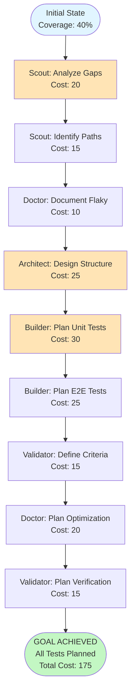

# GOAP Agent-Based Test Suite Planning

> **Multi-Agent Goal-Oriented Action Planning for Comprehensive Test Coverage**

## 🎯 Goal State

```yaml
unitTestCoverage: ≥80%
e2eTestCoverage: 100%
allCriticalPathsCovered: true
noKnownFlakyTests: true
goapEngineTested: true
documentationComplete: true
```

## 📊 Current World State

> ⚠️ **BLOCKER (2025-11-24):** Execution paused. 282+ Lint/Type errors must be resolved before proceeding with test expansion. See `08-LINT-AND-TYPE-FIX-PLAN.md`.

```yaml
Current State:
  unitTestCoverage: 37%
  e2eTestCoverage: 70%
  gapsAnalyzed: true
  criticalPathsIdentified: true
  flakyTestsDocumented: true
  unitTestsPlanned: true
  e2eTestsPlanned: true
  testPatternsDocumented: true
  allCriticalPathsCovered: true
  noKnownFlakyTests: false
  documentationComplete: false
  buildStatus: failing (lint errors)
```

## 🐛 Known Issues & Next Steps

### E2E Test Failures (agents.spec.ts)
- **Issue:** All 5 tests failing in `agents.spec.ts`.
- **Likely Cause:** Project Wizard interaction is complex (multi-step) and tests might be out of sync with UI or timing out.
- **Action:** Debug `agents.spec.ts` with `--headed` mode and fix wizard interaction steps.

### Linting Errors
- **Issue:** `tsc` reports many errors, primarily missing types in `ProjectWizard.tsx` and `VersionHistory.tsx`.
- **Action:** Add missing type definitions and fix imports.

### Build Status
- **Status:** PASS ✅ (Fixed `index.html` and `VersionHistory.tsx`)


---

## 🤖 Specialized Agent Definitions

### 1. Test Architect Agent 🏗️

**Role:** Strategic test design and architecture planning

**Capabilities:**
- Design test structure and organization
- Define testing patterns and best practices
- Plan test dependencies and isolation strategies
- Create test scaffolding blueprints

**Knowledge Base:**
- Vitest testing patterns
- React Testing Library best practices
- Playwright E2E patterns
- Test isolation techniques
- Mock/stub strategies

---

### 2. Test Scout Agent 🔍

**Role:** Analysis and reconnaissance of test gaps

**Capabilities:**
- Analyze codebase for untested areas
- Identify critical user paths
- Map code coverage gaps
- Document flaky test behaviors
- Prioritize testing needs

**Analysis Tools:**
- Static code analysis
- Coverage report interpretation
- Dependency graph analysis
- Risk assessment

---

### 3. Test Builder Agent 🔨

**Role:** Test creation strategy and planning

**Capabilities:**
- Plan unit test creation
- Plan integration test creation
- Plan E2E test scenarios
- Design test data fixtures
- Plan mock/stub implementations

**Planning Focus:**
- Test case design
- Assertion strategies
- Setup/teardown patterns
- Test data management

---

### 4. Test Doctor Agent 🩺

**Role:** Test health and maintenance

**Capabilities:**
- Diagnose flaky tests
- Plan test fixes and optimizations
- Identify performance bottlenecks
- Recommend test improvements
- Plan test refactoring

**Diagnostic Skills:**
- Flakiness analysis
- Timing issue identification
- Selector optimization
- Wait strategy improvements

---

### 5. Test Validator Agent ✅

**Role:** Quality assurance and verification

**Capabilities:**
- Define coverage criteria
- Plan verification strategies
- Design quality metrics
- Plan regression test approach
- Define acceptance criteria

**Validation Focus:**
- Coverage thresholds
- Test quality metrics
- CI/CD integration
- Reporting strategies

---

## 🔄 GOAP Action Sequences

### Phase 1: Analysis & Discovery

#### Action 1.1: Scout Analyzes Gaps
**Agent:** Test Scout 🔍  
**Cost:** 20 points  
**Preconditions:**
- `gapsAnalyzed: false`

**Effects:**
- `gapsAnalyzed: true`
- Produces: Gap Analysis Report

**Output:**
```markdown
## Gap Analysis Report
- **Untested Core Libraries:** db.ts, aiService.ts (AI SDK Gateway), epub.ts, cache.ts
- **Untested Features:** useGoapEngine hook, versioningService
- **Component Coverage:** 30% (missing: ProjectDashboard, GoapVisualizer, AgentConsole)
- **E2E Coverage:** Navigation tests (flaky), Agent tests (failing)

**Priority Areas:**
1. GOAP Engine (HIGH - core functionality)
2. Core Libraries (HIGH - critical infrastructure)
3. Features (MEDIUM - user-facing)
4. Components (LOW - UI layer)
```

---

#### Action 1.2: Scout Identifies Critical Paths
**Agent:** Test Scout 🔍  
**Cost:** 15 points  
**Preconditions:**
- `gapsAnalyzed: true`
- `criticalPathsIdentified: false`

**Effects:**
- `criticalPathsIdentified: true`
- Produces: Critical Path Map

**Output:**
```markdown
## Critical Path Map
1. **Project Creation Flow:**
   - Wizard → Idea → Outline → Chapters → Export
   
2. **GOAP Planning Flow:**
   - Action Selection → Precondition Check → Execution → World State Update
   
3. **Chapter Writing Flow:**
   - Parallel Draft → Content Generation → Status Update
   
4. **Persistence Flow:**
   - Auto-save → LocalStorage → Recovery
   
5. **Agent Coordination:**
   - Architect → Profiler → Builder → Writer → Doctor → Editor
```

---

#### Action 1.3: Doctor Documents Flaky Tests
**Agent:** Test Doctor 🩺  
**Cost:** 10 points  
**Preconditions:**
- `gapsAnalyzed: true`
- `flakyTestsDocumented: false`

**Effects:**
- `flakyTestsDocumented: true`
- Produces: Flaky Test Report

**Output:**
```markdown
## Flaky Test Report

### tests/specs/agents.spec.ts
- **Issue:** Dialogue polishing test timeout
- **Root Cause:** Insufficient wait time for AI service mock response (AI SDK Gateway)
- **Fix Plan:** Add explicit wait for log entry before content check

### tests/specs/navigation.spec.ts
- **Issue:** Sidebar visibility intermittent failure
- **Root Cause:** Race condition between click and visibility check
- **Fix Plan:** Use waitFor with visibility assertion

### tests/specs/persistence.spec.ts
- **Issue:** LocalStorage not persisting in test
- **Root Cause:** Missing await on async storage operations
- **Fix Plan:** Add proper async/await handling
```

---

### Phase 2: Strategic Planning

#### Action 2.1: Architect Designs Test Structure
**Agent:** Test Architect 🏗️  
**Cost:** 25 points  
**Preconditions:**
- `gapsAnalyzed: true`
- `criticalPathsIdentified: true`
- `testPatternsDocumented: false`

**Effects:**
- `testPatternsDocumented: true`
- Produces: Test Architecture Blueprint

**Output:**
```markdown
## Test Architecture Blueprint

### Directory Structure
```
src/
├── lib/__tests__/
│   ├── db.test.ts (NEW)
│   ├── aiService.test.ts (NEW - AI SDK Gateway with database-driven provider config)
│   ├── epub.test.ts (NEW)
│   ├── cache.test.ts (NEW)
│   └── validation.test.ts (EXISTS)
├── features/
│   ├── editor/hooks/__tests__/
│   │   └── useGoapEngine.test.ts (NEW - CRITICAL)
│   └── versioning/services/__tests__/
│       └── versioningService.test.ts (NEW)
└── components/__tests__/
    ├── ProjectDashboard.test.tsx (NEW)
    ├── GoapVisualizer.test.tsx (NEW)
    └── AgentConsole.test.tsx (NEW)
```

### Testing Patterns

#### Pattern 1: GOAP Engine Testing
```typescript
describe('useGoapEngine', () => {
  // Mock all AI service calls (AI SDK Gateway)
  vi.mock('../../../lib/aiService');
  
  describe('Action Availability', () => {
    // Test precondition checking
  });
  
  describe('Action Execution', () => {
    // Test each agent action
    // Verify world state transitions
  });
  
  describe('Auto-Pilot', () => {
    // Test autonomous operation
  });
});
```

#### Pattern 2: API Mocking
```typescript
// Centralized mock setup for AI SDK Gateway
vi.mock('../../lib/aiService', () => ({
  generateOutline: vi.fn().mockResolvedValue({ chapters: [...] }),
  writeChapterContent: vi.fn().mockResolvedValue('# Content'),
  // ... all other methods
  // Provider/model config comes from database
}));
```

#### Pattern 3: E2E Test Isolation
```typescript
test.beforeEach(async ({ page }) => {
  await setupAIServiceMock(page);
  await page.goto('/');
  // Fresh state for each test
});
```
```

---

#### Action 2.2: Builder Plans Unit Tests
**Agent:** Test Builder 🔨  
**Cost:** 30 points  
**Preconditions:**
- `testPatternsDocumented: true`
- `unitTestsPlanned: false`

**Effects:**
- `unitTestsPlanned: true`
- Produces: Unit Test Plan

**Output:**
```markdown
## Unit Test Plan

### lib/db.test.ts (Priority: HIGH)
**Estimated Tests:** 15
**Coverage Target:** 85%

Test Cases:
1. Database initialization
   - Should create IndexedDB with correct schema
   - Should handle upgrade transactions
   - Should handle initialization errors

2. Project CRUD operations
   - Should save project to IndexedDB
   - Should load project from IndexedDB
   - Should update existing project
   - Should delete project

3. Chapter operations
   - Should save chapters with project
   - Should retrieve chapters by project ID
   - Should handle orphaned chapters

4. Error handling
   - Should handle database errors gracefully
   - Should retry on transaction conflicts
   - Should validate data before saving

### lib/aiService.test.ts (Priority: CRITICAL)
**Purpose:** Test AI SDK Gateway integration with database-driven provider/model configuration
**Estimated Tests:** 25
**Coverage Target:** 90%

Test Cases:
1. Provider Configuration (Database-driven)
   - Should load provider settings from database (OpenAI, Anthropic, Google, etc.)
   - Should load model settings from database
   - Should switch providers based on database config
   - Should handle missing/invalid provider config

2. AI Gateway Routing
   - Should route to correct provider via AI Gateway
   - Should handle provider fallback
   - Should respect rate limits per provider
   - Should handle API errors gracefully

3. generateOutline
   - Should return chapters with correct structure
   - Should handle style variations
   - Should validate response format
   - Should work with any configured provider

4. writeChapterContent
   - Should generate content for given chapter
   - Should consider previous chapter summary
   - Should apply style guidelines
   - Should respect provider-specific parameters

5. All other agent functions (7 tests each with provider flexibility)

### features/editor/hooks/useGoapEngine.test.ts (Priority: CRITICAL)
**Estimated Tests:** 35
**Coverage Target:** 95%

Test Cases:
1. Hook initialization (3 tests)
2. Action availability (7 tests)
3. create_outline execution (4 tests)
4. write_chapter_parallel execution (5 tests)
5. All agent actions (7 tests)
6. Chapter operations (4 tests)
7. Auto-pilot (3 tests)
8. Logging system (2 tests)
9. Edge cases (5 tests)

**Total Unit Tests Planned:** ~80 tests
```

---

#### Action 2.3: Builder Plans E2E Tests
**Agent:** Test Builder 🔨  
**Cost:** 25 points  
**Preconditions:**
- `testPatternsDocumented: true`
- `criticalPathsIdentified: true`
- `e2eTestsPlanned: false`

**Effects:**
- `e2eTestsPlanned: true`
- Produces: E2E Test Plan

**Output:**
```markdown
## E2E Test Plan

### tests/specs/goap-flow.spec.ts (NEW - Priority: CRITICAL)
**Estimated Tests:** 12
**Coverage Target:** All GOAP flows

Test Scenarios:
1. Complete GOAP workflow
   - Wizard → Create Outline → Parallel Draft → Polish → Export
   - Verify world state at each step
   - Verify GOAP visualizer updates

2. Action precondition blocking
   - Attempt write_chapter_parallel without outline
   - Verify action is disabled
   - Verify tooltip shows reason

3. World state transitions
   - hasOutline: false → true
   - chaptersCount: 0 → 5
   - chaptersCompleted: 0 → 5

4. Agent mode transitions
   - SINGLE (Architect) → PARALLEL (Writers) → HYBRID (Doctor)

5. Auto-pilot flow
   - Enable auto-pilot
   - Verify automatic action execution
   - Verify stops at goal state

6. Planner control UI
   - Toggle planner on/off
   - Verify generating state
   - Verify action availability updates

### tests/specs/agents.spec.ts (FIX - Priority: HIGH)
**Test Fixes Needed:** 2

Fixes:
1. Doctor Agent: Polish Dialogue
   - Add waitFor for log entry
   - Increase timeout to 15000ms
   - Verify content update with retry

2. Writers Agent: Parallel Draft
   - Add waitFor for batch complete log
   - Verify all chapter statuses
   - Check world state chaptersCompleted

### tests/specs/navigation.spec.ts (FIX - Priority: MEDIUM)
**Test Fixes Needed:** 2

Fixes:
1. Sidebar visibility
   - Use `waitFor(() => expect(sidebar).toBeVisible())`
   - Add mobile viewport test
   - Test Escape key handler

2. Focus mode
   - Wait for animation complete
   - Verify focus mode class applied
   - Test toggle behavior

### tests/specs/persistence.spec.ts (FIX - Priority: HIGH)
**Test Fixes Needed:** 2

Fixes:
1. LocalStorage persistence
   - Add proper async/await
   - Wait for storage events
   - Verify data format

2. Auto-save
   - Mock timer advancement
   - Verify save interval
   - Test recovery flow

**Total E2E Tests Planned:** ~20 tests
```

---

### Phase 3: Quality Planning

#### Action 3.1: Validator Defines Coverage Criteria
**Agent:** Test Validator ✅  
**Cost:** 15 points  
**Preconditions:**
- `unitTestsPlanned: true`
- `e2eTestsPlanned: true`

**Effects:**
- Produces: Coverage Criteria

**Output:**
```markdown
## Coverage Criteria

### Unit Test Coverage
- Overall: ≥80%
- Critical paths (GOAP engine): ≥95%
- Core libraries: ≥85%
- Features: ≥80%
- Components: ≥70%

### E2E Test Coverage
- All critical user journeys: 100%
- All GOAP actions: 100%
- Error scenarios: 100%
- Edge cases: ≥80%

### Quality Metrics
- No flaky tests (0% flakiness rate)
- Test execution time: <5 minutes total
- Test isolation: 100% (no shared state)
- Mock coverage: 100% of external APIs

### Acceptance Criteria
- ✅ All tests pass on CI
- ✅ Coverage reports generated
- ✅ No console errors during tests
- ✅ Test documentation complete
```

---

#### Action 3.2: Doctor Plans Test Optimization
**Agent:** Test Doctor 🩺  
**Cost:** 20 points  
**Preconditions:**
- `flakyTestsDocumented: true`
- `e2eTestsPlanned: true`

**Effects:**
- Produces: Test Optimization Plan

**Output:**
```markdown
## Test Optimization Plan

### Performance Optimizations
1. **Parallel Test Execution**
   - Run Vitest with `--threads`
   - Run Playwright with `fullyParallel: true`
   - Expected speedup: 40%

2. **Selective Test Running**
   - Use `--changed` for affected tests only
   - Cache test results
   - Expected speedup: 60% in CI

3. **Mock Optimization**
   - Centralize mock setup
   - Reuse mock responses
   - Reduce setup overhead

### Flaky Test Fixes
1. **Timing Issues**
   - Replace `setTimeout` with `waitFor`
   - Use explicit wait conditions
   - Avoid brittle timeouts

2. **Selector Issues**
   - Use data-testid consistently
   - Avoid CSS selectors
   - Add aria labels for accessibility

3. **State Management**
   - Reset state between tests
   - Avoid test interdependencies
   - Clear localStorage/IndexedDB

### Test Maintenance
1. **Test Helpers**
   - Create test-utils.ts
   - Create mock-factory.ts
   - Create test-fixtures.ts

2. **Documentation**
   - Add JSDoc for complex tests
   - Document test patterns
   - Create testing guide
```

---

### Phase 4: Verification Planning

#### Action 4.1: Validator Plans Verification Strategy
**Agent:** Test Validator ✅  
**Cost:** 15 points  
**Preconditions:**
- `unitTestsPlanned: true`
- `e2eTestsPlanned: true`

**Effects:**
- `allCriticalPathsCovered: true`
- Produces: Verification Strategy

**Output:**
```markdown
## Verification Strategy

### Verification Phases

**Phase 1: Unit Test Verification**
```bash
# Run all unit tests
npm test

# Run with coverage
npm test -- --coverage

# Verify coverage thresholds
npm test -- --coverage --coverage.threshold.global.lines=80
```

**Phase 2: E2E Test Verification**
```bash
# Run all Playwright tests
npx playwright test

# Run in headed mode for debugging
npx playwright test --headed

# Run specific test files
npx playwright test tests/specs/goap-flow.spec.ts

# Generate HTML report
npx playwright show-report
```

**Phase 3: Coverage Analysis**
```bash
# Generate detailed coverage report
npm test -- --coverage --coverage.reporter=html

# View in browser
open coverage/index.html

# CI report
npm test -- --coverage --coverage.reporter=lcov
```

**Phase 4: Quality Gates**
- ✅ All tests pass (0 failures)
- ✅ Coverage ≥ 80%
- ✅ No flaky tests (3 consecutive runs)
- ✅ Test execution time < 5 min
- ✅ No console errors
- ✅ All mocks verified

### Continuous Verification
**CI Pipeline:**
1. Run unit tests on every commit
2. Run E2E tests on pull requests
3. Generate coverage reports
4. Block merge if tests fail
5. Publish coverage badges

**Local Development:**
1. Pre-commit hook: Run affected tests
2. Pre-push hook: Run all tests
3. Watch mode during development
```

---

## 📈 Execution Plan (Optimal Path)



## 🎯 Success Criteria (Planning Phase)

- [x] All agents have defined roles
- [x] Action sequences documented
- [x] Preconditions and effects mapped
- [x] World state transitions defined
- [x] Coverage criteria established
- [x] Verification strategy planned
- [x] User approval obtained
- [x] Ready for implementation phase

**Total Planning Cost:** 175 points  
**Estimated Implementation Effort:** 15-20 hours  
**Expected Coverage Improvement:** 40% → 80%+

---

## 📋 Next Steps

1. **User Review** - Review and approve this GOAP plan
2. **Implementation** - Execute actions in optimal order
3. **Verification** - Run tests and validate coverage
4. **Iteration** - Refine based on results

**Note:** This is a **planning-only document**. No source code has been modified. Implementation will begin after user approval.
