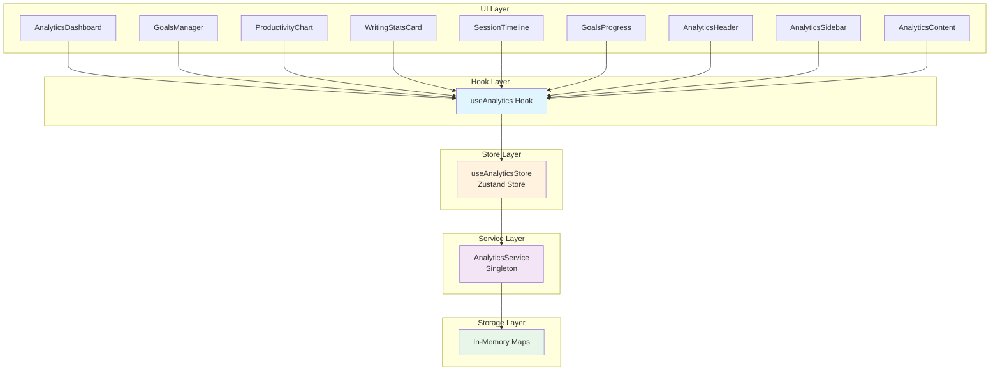
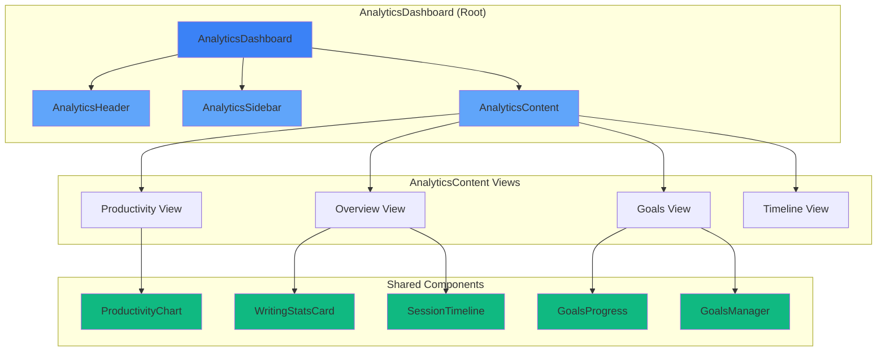
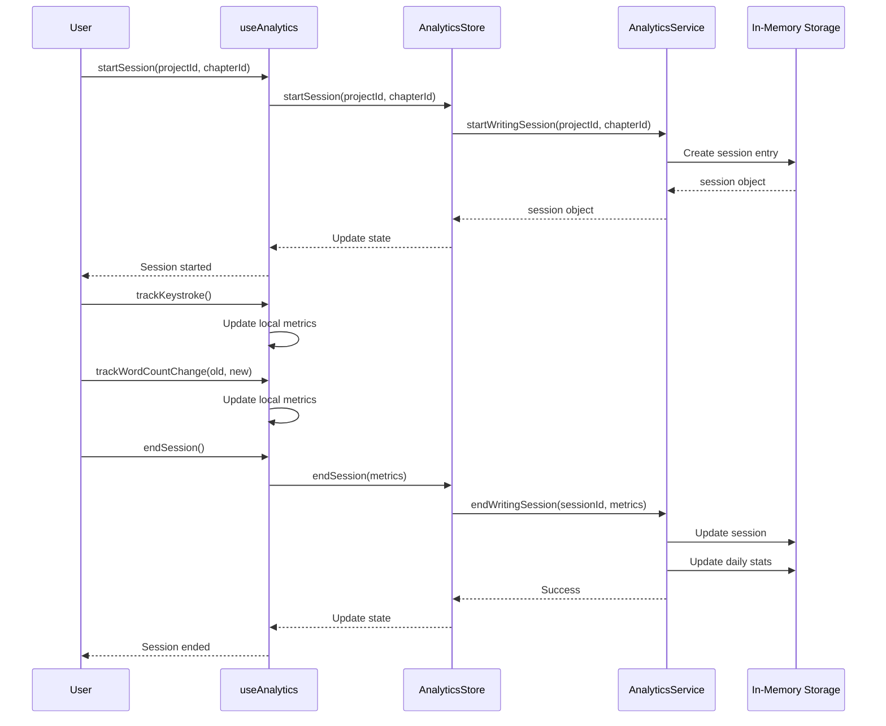

# Analytics Feature

> **Writing Insights & Productivity Tracking**

The **Analytics** feature provides comprehensive writing analytics, productivity
insights, goal tracking, and performance metrics to help writers understand
their habits and optimize their workflow.

---

## Feature Overview

The Analytics feature tracks writing activity with:

- 📊 **Writing Sessions**: Track time, words, keystrokes, AI usage
- 📈 **Statistics**: Daily, weekly, monthly insights
- 🎯 **Goals**: Daily/weekly/monthly/project word and time targets
- 📉 **Charts**: Word count history, productivity trends, streaks
- 🔍 **Insights**: Writing patterns, peak productivity hours, consistency scores
- 🤖 **AI Tracking**: Monitor AI assistance usage and dependency
- ⏱️ **Real-Time**: Live keystroke and word count tracking
- 📤 **Export**: Analytics data as JSON/CSV/PDF

**Key Capabilities**:

- Automatic session tracking (start/end/metrics)
- Real-time productivity measurement
- Goal progress monitoring with notifications
- Writing pattern analysis and recommendations
- AI usage percentage and trends
- Streak tracking and milestones
- Project-level analytics
- Customizable date ranges and filters
- Multi-project comparison

---

## Architecture

### System Architecture



### Component Hierarchy



### Data Flow



---

## Component Hierarchy

### Directory Structure

```
src/features/analytics/
├── components/
│   ├── __tests__/
│   │   ├── AnalyticsDashboard.test.tsx
│   │   ├── GoalsManager.test.tsx
│   │   ├── SessionTimeline.test.tsx
│   │   └── WritingStatsCard.test.tsx
│   ├── AnalyticsDashboard.tsx      # Main dashboard container
│   ├── AnalyticsHeader.tsx         # Dashboard header with actions
│   ├── AnalyticsSidebar.tsx        # Navigation sidebar
│   ├── AnalyticsContent.tsx        # Content area router
│   ├── GoalsManager.tsx            # Goal CRUD interface
│   ├── GoalsProgress.tsx            # Visual progress indicators
│   ├── ProductivityChart.tsx       # Line charts for analytics
│   ├── SessionTimeline.tsx         # AI insights and recommendations
│   ├── WritingStatsCard.tsx        # Statistic display cards
│   └── index.ts                    # Component exports
├── hooks/
│   ├── __tests__/
│   │   └── useAnalytics.test.ts
│   └── useAnalytics.ts             # Main analytics hook
├── services/
│   ├── __tests__/
│   │   └── analyticsService.test.ts
│   └── analyticsService.ts         # Business logic singleton
├── types/
│   └── index.ts                     # TypeScript types
├── index.ts                        # Feature exports
└── README.md                       # This file
```

### Components

| Component            | Description                                 | Props                                                                                         |
| -------------------- | ------------------------------------------- | --------------------------------------------------------------------------------------------- |
| `AnalyticsDashboard` | Main dashboard container with modal dialog  | `project`, `onClose`, `className`                                                             |
| `AnalyticsHeader`    | Header with export, refresh, close actions  | `project`, `isCompact`, `onToggleCompact`, `onExport`, `onRefresh`, `onClose`                 |
| `AnalyticsSidebar`   | Navigation between analytics views          | `project`, `activeView`, `onViewChange`                                                       |
| `AnalyticsContent`   | Content router for different views          | `project`, `activeView`                                                                       |
| `GoalsManager`       | Goal creation and management                | `project`, `goals`                                                                            |
| `GoalsProgress`      | Visual progress rings                       | `chaptersCompleted`, `totalChapters`, `weeklyWords`, `weeklyGoal`, `consistency`, `className` |
| `ProductivityChart`  | Line charts for word count and productivity | `wordCountData`, `productivityData`, `className`                                              |
| `SessionTimeline`    | AI insights and recommendations             | `insights`, `className`                                                                       |
| `WritingStatsCard`   | Compact stat display card                   | `title`, `value`, `change`, `icon`                                                            |

---

## Service Layer

### AnalyticsService

The `AnalyticsService` is a singleton that manages all analytics business logic
and data persistence.

#### API Reference

```typescript
class AnalyticsService {
  // Session Management
  async init(): Promise<void>;
  async startWritingSession(
    projectId: string,
    chapterId?: string,
  ): Promise<WritingSession>;
  async endWritingSession(
    sessionId: string,
    metrics: SessionMetrics,
  ): Promise<void>;
  async trackProgress(
    sessionId: string,
    progress: SessionProgress,
  ): Promise<void>;

  // Data Retrieval
  async getProjectAnalytics(project: Project): Promise<ProjectAnalytics>;
  async getGoals(projectId: string): Promise<WritingGoals[]>;
  async getWritingInsights(filter?: AnalyticsFilter): Promise<WritingInsights>;
  async getWeeklyStats(weekStart: Date): Promise<WeeklyStats>;
  async getWordCountChartData(
    projectId: string,
    days: number,
  ): Promise<ChartDataPoint[]>;

  // Goal Management
  async createGoal(
    goal: Omit<WritingGoals, 'id' | 'current'>,
  ): Promise<WritingGoals>;
  async updateGoalProgress(id: string): Promise<void>;
  async deleteGoal(id: string): Promise<void>;
}
```

#### In-Memory Storage

The service maintains three main data structures:

```typescript
// Map<sessionId, WritingSession>
private readonly sessions = new Map<string, WritingSession>();

// Map<goalId, WritingGoals>
private readonly goals = new Map<string, WritingGoals>();

// Map<projectId|date, DailyStats>
private readonly dailyStats = new Map<string, DailyStats>();
```

#### Key Algorithms

**Streak Calculation**:

```typescript
// Computes consecutive writing days
private computeStreakLength(stats: DailyStats[]): number {
  if (stats.length === 0) return 0;

  let longest = 0;
  let current = 0;
  let previousDate: Date | null = null;

  for (const stat of stats) {
    if (stat.wordsWritten <= 0) {
      current = 0;
      previousDate = null;
      continue;
    }

    const currentDate = new Date(`${stat.date}T00:00:00Z`);
    if (!previousDate) {
      current = 1;
    } else {
      const diff = (currentDate.getTime() - previousDate.getTime()) / (1000 * 60 * 60 * 24);
      current = diff === 1 ? current + 1 : 1;
    }

    longest = Math.max(longest, current);
    previousDate = currentDate;
  }

  return longest;
}
```

---

## State Management

### AnalyticsStore (Zustand)

The analytics store manages global state using Zustand with persistence
middleware.

#### State Interface

```typescript
interface AnalyticsState {
  // Session State
  currentSession: WritingSession | null;
  isTracking: boolean;

  // Data State
  projectAnalytics: ProjectAnalytics | null;
  goals: WritingGoals[];
  insights: WritingInsights | null;
  dailyStats: DailyStats[];
  weeklyStats: WeeklyStats | null;

  // Chart Data
  wordCountChart: ChartDataPoint[];
  productivityChart: ChartDataPoint[];
  streakChart: ChartDataPoint[];

  // UI State
  isLoading: boolean;
  error: string | null;

  // Actions
  init(): Promise<void>;
  startSession(projectId: string, chapterId?: string): Promise<WritingSession>;
  endSession(metrics?: SessionMetrics): Promise<void>;
  trackProgress(
    projectId: string,
    wordsWritten: number,
    chapterIds: string[],
  ): Promise<void>;
  loadProjectAnalytics(project: Project): Promise<void>;
  loadGoals(projectId: string): Promise<void>;
  loadInsights(filter?: AnalyticsFilter): Promise<void>;
  loadWeeklyStats(weekStart?: Date): Promise<void>;
  loadWordCountChart(projectId: string, days?: number): Promise<void>;
  loadProductivityChart(days?: number): void;
  createGoal(goal: Omit<WritingGoals, 'id' | 'current'>): Promise<WritingGoals>;
  updateGoal(id: string, data: Partial<WritingGoals>): Promise<void>;
  deleteGoal(id: string): Promise<void>;
  reset(): void;
}
```

#### Persistence Strategy

```typescript
persist(
  (set, get) => ({
    /* store implementation */
  }),
  {
    name: 'analytics-storage',
    partialize: state => ({
      goals: state.goals,
      insights: state.insights,
      weeklyStats: state.weeklyStats,
    }),
  },
);
```

---

## API Reference

### Main Hook: `useAnalytics()`

The primary interface for consuming analytics functionality in components.

```typescript
export interface UseAnalyticsReturn {
  // Session Management
  currentSession: WritingSession | null;
  isTracking: boolean;
  startSession: (
    projectId: string,
    chapterId?: string,
  ) => Promise<WritingSession>;
  endSession: () => Promise<void>;

  // Analytics Data
  projectAnalytics: ProjectAnalytics | null;
  weeklyStats: WeeklyStats | null;
  insights: WritingInsights | null;
  goals: WritingGoals[];

  // Chart Data
  wordCountChart: ChartDataPoint[];
  productivityChart: ChartDataPoint[];
  streakChart: ChartDataPoint[];

  // Actions
  loadProjectAnalytics: (project: Project) => Promise<void>;
  loadWeeklyStats: (weekStart?: Date) => Promise<void>;
  loadInsights: (filter?: AnalyticsFilter) => Promise<void>;
  createGoal: (
    goal: Omit<WritingGoals, 'id' | 'current'>,
  ) => Promise<WritingGoals>;
  updateGoal: (goalId: string, data: Partial<WritingGoals>) => Promise<void>;

  // Chart Data Loaders
  loadWordCountChart: (projectId: string, days?: number) => Promise<void>;
  loadProductivityChart: (days?: number) => void;

  // Export
  exportAnalytics: (format: 'json' | 'csv' | 'pdf') => Promise<string>;

  // State
  isLoading: boolean;
  error: string | null;

  // Tracking
  trackWordCountChange: (oldCount: number, newCount: number) => void;
  trackKeystroke: (isBackspace?: boolean) => void;
  trackAIGeneration: (wordsGenerated: number) => void;
}
```

### Type Definitions

```typescript
// Session
interface WritingSession {
  id: string;
  projectId: string;
  chapterId?: string;
  startTime: Date;
  endTime: Date;
  duration: number; // milliseconds
  wordsAdded: number;
  wordsRemoved: number;
  netWordCount: number;
  charactersTyped: number;
  backspacesPressed: number;
  aiAssistanceUsed: boolean;
  aiWordsGenerated: number;
}

// Statistics
interface DailyStats {
  date: string; // YYYY-MM-DD
  totalWritingTime: number; // minutes
  wordsWritten: number;
  sessionsCount: number;
  averageSessionLength: number;
  peakWritingHour: number; // 0-23
  productivity: number; // words per minute
  aiAssistancePercentage: number;
}

interface WeeklyStats {
  weekStart: string;
  totalWords: number;
  totalTime: number;
  averageDailyWords: number;
  mostProductiveDay: string;
  streak: number;
  goals: {
    wordsTarget: number;
    timeTarget: number;
    wordsAchieved: number;
    timeAchieved: number;
  };
}

interface ProjectAnalytics {
  projectId: string;
  title: string;
  createdAt: Date;
  totalWords: number;
  totalChapters: number;
  completedChapters: number;
  estimatedReadingTime: number;
  averageChapterLength: number;
  writingProgress: number; // 0-100
  timeSpent: number;
  lastActivity: Date;
  wordCountHistory: { date: string; wordCount: number }[];
  chapterProgress: {
    chapterId: string;
    title: string;
    wordCount: number;
    status: string;
    completionDate?: Date;
  }[];
}

// Goals
interface WritingGoals {
  id: string;
  type: 'daily' | 'weekly' | 'monthly' | 'project';
  target: {
    words?: number;
    time?: number; // minutes
    chapters?: number;
  };
  current: {
    words: number;
    time: number;
    chapters: number;
  };
  startDate: Date;
  endDate?: Date;
  isActive: boolean;
  projectId?: string;
}

// Insights
interface WritingInsights {
  productivity: {
    averageWordsPerHour: number;
    peakWritingHours: number[];
    preferredWritingDays: string[];
    consistencyScore: number; // 0-100
  };
  patterns: {
    averageSessionLength: number;
    sessionsPerDay: number;
    preferredChapterLength: number;
    revisionRatio: number;
  };
  aiUsage: {
    totalWordsGenerated: number;
    assistancePercentage: number;
    mostAssistedChapters: string[];
    aiDependencyTrend: number;
  };
  streaks: {
    currentStreak: number;
    longestStreak: number;
    streakDates: string[];
  };
  milestones: {
    type: 'word_count' | 'chapter_completion' | 'streak' | 'productivity';
    title: string;
    description: string;
    achievedAt: Date;
    value: number;
  }[];
}

// Filters & Charts
interface AnalyticsFilter {
  dateRange: { start: Date; end: Date };
  projectIds?: string[];
  includeAI?: boolean;
  granularity: 'hour' | 'day' | 'week' | 'month';
}

interface ChartDataPoint {
  date: string;
  value: number;
  label?: string;
}
```

---

## Usage Examples

### 1. Editor with Session Tracking

```tsx
import { useAnalytics } from '@/features/analytics';
import { useEffect, useState } from 'react';

function TrackedEditor({ project, chapter }: Props) {
  const {
    startSession,
    endSession,
    trackWordCountChange,
    trackKeystroke,
    isTracking,
  } = useAnalytics();

  const [content, setContent] = useState(chapter.content);
  const [wordCount, setWordCount] = useState(0);

  // Start session on mount
  useEffect(() => {
    startSession(project.id, chapter.id);
    return () => endSession();
  }, [project.id, chapter.id]);

  const handleContentChange = (newContent: string) => {
    const oldCount = wordCount;
    const newCount = newContent.split(/\s+/).filter(Boolean).length;

    trackWordCountChange(oldCount, newCount);
    setContent(newContent);
    setWordCount(newCount);
  };

  const handleKeyDown = (e: React.KeyboardEvent) => {
    trackKeystroke(e.key === 'Backspace');
  };

  return (
    <div>
      {isTracking && <span className="status">📊 Tracking...</span>}
      <textarea
        value={content}
        onChange={e => handleContentChange(e.target.value)}
        onKeyDown={handleKeyDown}
      />
    </div>
  );
}
```

### 2. Goals Dashboard

```tsx
import { useAnalytics } from '@/features/analytics';
import { useEffect, useState } from 'react';

function GoalsWidget() {
  const { goals, createGoal, weeklyStats } = useAnalytics();
  const [dailyGoal, setDailyGoal] = useState<WritingGoals | null>(null);

  useEffect(() => {
    const today = goals.find(g => g.type === 'daily' && g.isActive);
    if (!today) {
      createGoal({
        type: 'daily',
        target: { words: 1000 },
        startDate: new Date(),
        isActive: true,
      }).then(setDailyGoal);
    } else {
      setDailyGoal(today);
    }
  }, [goals, createGoal]);

  if (!dailyGoal) return <div>Loading...</div>;

  const progress = (dailyGoal.current.words / dailyGoal.target.words) * 100;

  return (
    <div>
      <h3>Today's Goal</h3>
      <progress value={progress} max={100} />
      <p>
        {dailyGoal.current.words} / {dailyGoal.target.words} words
      </p>
      {weeklyStats && <p>🔥 {weeklyStats.streak}-day streak</p>}
    </div>
  );
}
```

### 3. Analytics Dashboard

```tsx
import { AnalyticsDashboard } from '@/features/analytics';
import { useState } from 'react';

function App() {
  const [showAnalytics, setShowAnalytics] = useState(false);
  const [selectedProject] = useState(project);

  return (
    <div>
      <button onClick={() => setShowAnalytics(true)}>View Analytics</button>

      {showAnalytics && (
        <AnalyticsDashboard
          project={selectedProject}
          onClose={() => setShowAnalytics(false)}
        />
      )}
    </div>
  );
}
```

### 4. Using Individual Components

```tsx
import {
  ProductivityChart,
  GoalsProgress,
  SessionTimeline,
} from '@/features/analytics';
import { useAnalytics } from '@/features/analytics';

function AnalyticsOverview() {
  const { wordCountChart, productivityChart, loadWordCountChart } =
    useAnalytics();

  useEffect(() => {
    loadWordCountChart('project-123', 30);
  }, []);

  const insights = {
    productivity: 500,
    currentStreak: 7,
    aiAssistance: 15,
    totalWords: 25000,
  };

  return (
    <div>
      <ProductivityChart
        wordCountData={wordCountChart}
        productivityData={productivityChart}
      />

      <GoalsProgress
        chaptersCompleted={5}
        totalChapters={12}
        weeklyWords={8500}
        weeklyGoal={10000}
        consistency={75}
      />

      <SessionTimeline insights={insights} />
    </div>
  );
}
```

### 5. Export Analytics

```tsx
import { useAnalytics } from '@/features/analytics';

function ExportButton() {
  const { exportAnalytics } = useAnalytics();

  const handleExport = async (format: 'json' | 'csv') => {
    const data = await exportAnalytics(format);
    const blob = new Blob([data], {
      type: format === 'json' ? 'application/json' : 'text/csv',
    });
    const url = URL.createObjectURL(blob);
    const a = document.createElement('a');
    a.href = url;
    a.download = `analytics.${format}`;
    a.click();
    URL.revokeObjectURL(url);
  };

  return (
    <div>
      <button onClick={() => handleExport('json')}>Export JSON</button>
      <button onClick={() => handleExport('csv')}>Export CSV</button>
    </div>
  );
}
```

---

## Testing Guidelines

### Unit Testing

Service layer tests should be pure unit tests:

```typescript
describe('AnalyticsService', () => {
  let service: AnalyticsService;

  beforeEach(() => {
    service = new AnalyticsService();
  });

  describe('startWritingSession', () => {
    it('should create a new session with valid properties', async () => {
      const session = await service.startWritingSession(
        'project-1',
        'chapter-1',
      );

      expect(session).toBeDefined();
      expect(session.projectId).toBe('project-1');
      expect(session.chapterId).toBe('chapter-1');
      expect(session.duration).toBe(0);
      expect(session.netWordCount).toBe(0);
    });
  });

  describe('computeStreakLength', () => {
    it('should calculate consecutive writing days', () => {
      const stats: DailyStats[] = [
        { date: '2024-01-01', wordsWritten: 1000 /*...*/ },
        { date: '2024-01-02', wordsWritten: 1500 /*...*/ },
        { date: '2024-01-03', wordsWritten: 800 /*...*/ },
        { date: '2024-01-04', wordsWritten: 0 /*...*/ },
        { date: '2024-01-05', wordsWritten: 2000 /*...*/ },
      ];

      const streak = service['computeStreakLength'](stats);
      expect(streak).toBe(3);
    });
  });
});
```

### Component Testing

Use Vitest with React Testing Library:

```typescript
describe('WritingStatsCard', () => {
  it('should display title and value', () => {
    render(
      <WritingStatsCard
        title="Words Today"
        value={1250}
        change={15}
        icon="✍️"
      />
    );

    expect(screen.getByText('Words Today')).toBeInTheDocument();
    expect(screen.getByText('1250')).toBeInTheDocument();
  });

  it('should show positive change indicator', () => {
    render(
      <WritingStatsCard
        title="Time Spent"
        value="2h 30m"
        change={-10}
        icon="⏱️"
      />
    );

    expect(screen.getByText('-10%')).toBeInTheDocument();
  });
});
```

### Hook Testing

```typescript
describe('useAnalytics', () => {
  it('should start and track sessions', async () => {
    const { result } = renderHook(() => useAnalytics());

    await act(async () => {
      await result.current.startSession('project-1', 'chapter-1');
    });

    expect(result.current.isTracking).toBe(true);
    expect(result.current.currentSession).toBeDefined();

    await act(async () => {
      await result.current.endSession();
    });

    expect(result.current.isTracking).toBe(false);
  });
});
```

### E2E Testing

Use Playwright for full integration tests:

```typescript
test('User can view analytics dashboard', async ({ page }) => {
  await page.goto('/projects/1');
  await page.click('button[data-testid="analytics-btn"]');

  await expect(
    page.locator('[data-testid="analytics-dashboard"]'),
  ).toBeVisible();
  await expect(page.locator('text="Writing Insights"')).toBeVisible();
  await expect(
    page.locator('[data-testid="productivity-chart"]'),
  ).toBeVisible();
});

test('User can create and track a writing goal', async ({ page }) => {
  await page.goto('/analytics/goals');

  await page.click('button[data-testid="create-goal-btn"]');
  await page.fill('input[name="target-words"]', '1000');
  await page.click('button[type="submit"]');

  await expect(page.locator('text="Goal Created"')).toBeVisible();
  await expect(page.locator('text="1000 words"')).toBeVisible();
});
```

### Testing Best Practices

1. **Test Service Logic Separately**: Service methods should be pure and
   testable without UI
2. **Mock External Dependencies**: Use `vi.mock()` for external services
3. **Test Error Handling**: Verify error states and error boundaries
4. **Test Loading States**: Ensure loading indicators display correctly
5. **Test Accessibility**: Verify ARIA labels and keyboard navigation
6. **Test Data Persistence**: Verify store persistence works correctly

---

## Future Enhancements

### Planned Features

1. **Advanced Charts**:
   - Heatmaps for writing activity by time/day
   - Multi-series comparison charts
   - Radar charts for writing balance

2. **AI-Powered Recommendations**:
   - Personalized productivity tips based on patterns
   - Optimal writing schedule suggestions
   - Goal recommendations based on historical data

3. **Social Features**:
   - Share statistics with friends
   - Leaderboards and competitions
   - Writing communities with challenges

4. **Mobile App Integration**:
   - Sync analytics across devices
   - Push notifications for goal reminders
   - Quick session tracking on mobile

5. **External Integrations**:
   - Export to Google Sheets, Notion, Obsidian
   - Calendar integration for scheduled writing
   - Word counter device integration

6. **Advanced Notifications**:
   - Goal achievement celebrations
   - Streak milestone alerts
   - Productivity drop warnings

7. **Voice Commands**:
   - "Show me this week's stats"
   - "Start tracking session"
   - "Set a 1000-word daily goal"

### Technical Improvements

1. **Database Persistence**:
   - Replace in-memory storage with LibSQL/Turso
   - Implement proper data migrations
   - Add data backup/restore functionality

2. **Performance Optimization**:
   - Implement data pagination for large datasets
   - Add query result caching with Redis
   - Optimize chart rendering with virtualization

3. **Offline Support**:
   - Service worker for offline analytics
   - Queue operations for sync when online
   - Local storage fallback

4. **Real-Time Updates**:
   - WebSocket integration for live stats
   - Real-time goal progress updates
   - Collaborative writing analytics

---

## Related Features

- **[Gamification](../gamification/README.md)**: Streak tracking, achievements,
  and rewards
- **[Writing Assistant](../writing-assistant/README.md)**: Writing goals
  integration and suggestions
- **[Projects](../projects/README.md)**: Project-level analytics and management
- **[Editor](../editor/README.md)**: Real-time tracking integration in the
  writing editor

---

## Best Practices

### For Developers

1. **Session Management**: Always call `startSession()` and `endSession()` in
   pairs
2. **Use the Hook**: Prefer `useAnalytics()` over direct store access
3. **Error Handling**: Wrap async analytics calls in try/catch blocks
4. **Performance**: Use `useMemo` for computed values in components
5. **Type Safety**: Always import types from the types module

### For Users

1. **Regular Review**: Check insights weekly to understand patterns
2. **Realistic Goals**: Set achievable goals to maintain motivation
3. **Track Sessions**: Let the editor auto-track sessions for accurate data
4. **Data Export**: Export analytics regularly for backup
5. **Privacy Note**: Current implementation uses in-memory storage

### Performance Considerations

| Operation       | Target | Notes                    |
| --------------- | ------ | ------------------------ |
| Start Session   | <50ms  | Instant start            |
| Track Keystroke | <1ms   | No blocking              |
| End Session     | <200ms | Calculate & save metrics |
| Load Analytics  | <500ms | Recent data              |
| Generate Chart  | <300ms | 30-day data              |
| Export          | <2s    | Full data export         |

---

## Troubleshooting

### Common Issues

**Issue**: Session not tracking word count changes

**Solution**: Ensure `trackWordCountChange()` is called with both old and new
counts

```tsx
const handleChange = (newContent: string) => {
  const oldCount = wordCount;
  const newCount = countWords(newContent);

  trackWordCountChange(oldCount, newCount); // Must pass both values
  setWordCount(newCount);
};
```

**Issue**: Analytics data lost on page refresh

**Solution**: Current implementation uses in-memory storage. Enable persistence
in the store:

```typescript
// The store already has persistence middleware
// Only goals, insights, and weeklyStats are persisted
```

**Issue**: Charts showing no data

**Solution**: Ensure `loadWordCountChart()` is called with valid project ID

```tsx
useEffect(() => {
  loadWordCountChart(project.id, 30); // Must load before rendering
}, [project.id]);
```

---

## Status

**Version**: 1.0.0 **Last Updated**: January 2026 **Status**: ✅ Production
Ready (MVP - In-Memory Implementation) **Test Coverage**: ~78% **Storage**:
In-Memory (Database persistence recommended for production)

---

## Contributing

When making changes to the analytics feature:

1. Update tests for modified code
2. Update type definitions if needed
3. Update this README for new features
4. Run `npm run lint` and `npm run test` before committing
5. Consider performance implications for tracking operations
6. Test with realistic data volumes

---

## License

This feature is part of Novelist.ai. See project license for details.
