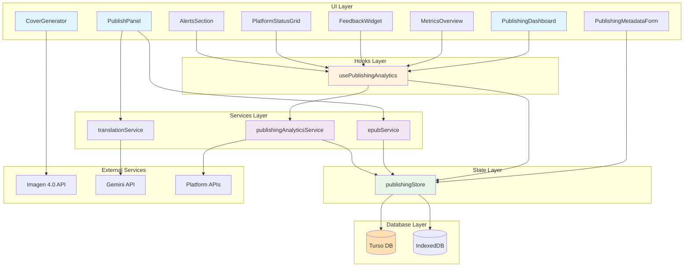
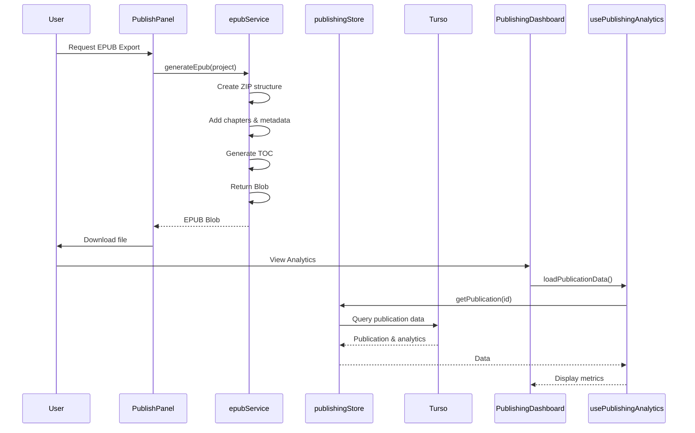

# Publishing Feature

The Publishing feature handles exporting novels to various formats and provides
analytics for tracking reader engagement and platform performance.

## Table of Contents

- [Feature Overview](#feature-overview)
- [Architecture Diagram](#architecture-diagram)
- [Component Hierarchy](#component-hierarchy)
- [Service Layer](#service-layer)
- [State Management](#state-management)
- [API Reference](#api-reference)
- [Usage Examples](#usage-examples)
- [Testing Guidelines](#testing-guidelines)
- [Future Enhancements](#future-enhancements)

---

## Feature Overview

The Publishing feature helps authors:

- 📤 **Export Formats** - Export to EPUB, PDF, MOBI, DOCX
- 📚 **Platform Integration** - Publish to multiple platforms
- 📊 **Analytics** - Track reader engagement and sales
- 🎨 **Cover Design** - Generate AI-powered cover art
- 📝 **Metadata Management** - ISBN, categories, keywords
- ✅ **Quality Checks** - Pre-publish validation
- 🔄 **Translation** - Multi-language translation support
- 💰 **Revenue Tracking** - Monitor earnings across platforms

### Key Capabilities

| Capability          | Description                          | Status         |
| ------------------- | ------------------------------------ | -------------- |
| EPUB Export         | Generate EPUB 3.0 compliant files    | ✅ Complete    |
| Analytics Dashboard | Track views, ratings, engagement     | ✅ Complete    |
| Cover Generation    | AI-powered cover art with Imagen 4.0 | ✅ Complete    |
| Translation         | Multi-language content translation   | ✅ Complete    |
| Platform Publishing | Connect to Wattpad, KDP, etc.        | 🚧 In Progress |
| Revenue Tracking    | Monitor earnings by platform         | 🚧 In Progress |

---

## Architecture Diagram



### Data Flow



---

## Component Hierarchy

### Main Components

```
src/features/publishing/
├── components/
│   ├── PublishingDashboard.tsx      # Main analytics dashboard
│   ├── PublishingSetup.tsx          # Platform setup wizard
│   ├── PublishPanel.tsx              # Export & publish panel
│   ├── PublishView.tsx               # Main publish view
│   ├── PublishingMetadataForm.tsx    # Metadata editor
│   ├── CoverGenerator.tsx            # AI cover generation
│   ├── PlatformCard.tsx              # Individual platform card
│   ├── PlatformStatusGrid.tsx        # Multi-platform grid
│   ├── MetricsOverview.tsx           # Analytics overview
│   ├── FeedbackWidget.tsx            # Reader feedback display
│   ├── DetailedFeedbackModal.tsx     # Detailed feedback modal
│   ├── AlertsSection.tsx            # Publishing alerts
│   └── index.ts                      # Component exports
```

### Component Descriptions

#### PublishingDashboard

**Purpose:** Main analytics dashboard for published content

**Props:**

```typescript
interface PublishingDashboardProps {
  project: Project;
  publicationId?: string;
  onClose: () => void;
  className?: string;
}
```

**Features:**

- Platform connection status
- Recent publications
- Analytics overview with timeframe selection (7d/30d/90d)
- Revenue summary
- Reader feedback with sentiment filtering
- Publishing alerts
- Real-time refresh capability

**Usage:**

```tsx
import { PublishingDashboard } from '@/features/publishing';

<PublishingDashboard
  project={project}
  publicationId={publicationId}
  onClose={() => setShowDashboard(false)}
/>;
```

#### PublishPanel

**Purpose:** Export and publish management panel

**Props:**

```typescript
interface PublishPanelProps {
  project: Project;
  onUpdateProject: (updates: Partial<Project>) => void;
  onUpdateChapter: (chapterId: string, updates: Partial<Chapter>) => void;
}
```

**Features:**

- Manuscript status tracking
- Word count progress
- Language selection
- Target word count setting
- EPUB export with drop caps styling
- Multi-language translation (AI-powered)

**Export Formats Supported:**

- **EPUB 3.0** - Industry standard eBook format (primary)
- **PDF** - Print-ready format (planned)
- **MOBI** - Kindle format (planned)
- **DOCX** - Microsoft Word (planned)

#### CoverGenerator

**Purpose:** AI-powered book cover generation

**Props:**

```typescript
interface CoverGeneratorProps {
  project: Project;
  onUpdateProject: (updates: Partial<Project>) => void;
}
```

**Features:**

- Generate covers using Imagen 4.0 model
- Uses project title, idea, and style as context
- Download generated covers
- Regenerate capability

**Usage:**

```tsx
import { CoverGenerator } from '@/features/publishing';

<CoverGenerator
  project={project}
  onUpdateProject={updates => updateProject(updates)}
/>;
```

#### MetricsOverview

**Purpose:** Display key performance metrics

**Props:**

```typescript
interface MetricsOverviewProps {
  analytics: PublishingAnalytics;
  engagement: EngagementMetrics | null;
  averageRating: number;
}
```

**Metrics Displayed:**

- Total views
- Unique visitors
- Average rating
- Downloads
- Average reading time
- Completion rate
- Social shares

#### FeedbackWidget

**Purpose:** Reader feedback display and management

**Props:**

```typescript
interface FeedbackWidgetProps {
  feedback: ReaderFeedback[];
  totalReviews: number;
  sentimentBreakdown: {
    positive: number;
    neutral: number;
    negative: number;
  };
  searchQuery: string;
  onSearchChange: (query: string) => void;
  feedbackFilter: 'all' | 'positive' | 'negative';
  onFilterChange: (filter: 'all' | 'positive' | 'negative') => void;
}
```

**Features:**

- Filter by sentiment
- Search feedback
- Display sentiment breakdown
- Show rating distributions
- Detailed feedback modal

#### PlatformStatusGrid

**Purpose:** Display connected publishing platforms

**Props:**

```typescript
interface PlatformStatusGridProps {
  insights: ReaderInsights | null;
}
```

**Supported Platforms:**

- 📖 **Wattpad** - Social reading platform
- 📚 **Archive of Our Own (AO3)** - Fan fiction archive
- 🌐 **Amazon KDP** - Kindle Direct Publishing
- 🏠 **Personal Website** - Self-hosted distribution

---

## Service Layer

### epubService

**Location:** `src/features/publishing/services/epubService.ts`

**Purpose:** Generate EPUB 3.0 compliant eBook files

**API:**

```typescript
/**
 * Generates a standard EPUB 3.0 file from the project data.
 * @param project The project to export
 * @param enableDropCaps Whether to style the first letter of chapters
 * @returns A Promise resolving to a Blob containing the .epub file
 */
export const generateEpub = async (
  project: Project,
  enableDropCaps = false
): Promise<Blob>
```

**Features:**

- ✅ EPUB 3.0 compliant structure
- ✅ Embedded table of contents (NCX + NAV)
- ✅ Cover image support (if present)
- ✅ Chapter navigation
- ✅ Dublin Core metadata
- ✅ Responsive CSS styling
- ✅ Optional drop caps styling
- ✅ Lazy-loaded JSZip dependency

**Example Usage:**

```typescript
import { generateEpub } from '@/features/publishing/services/epubService';

const blob = await generateEpub(project, true);
const url = URL.createObjectURL(blob);
const a = document.createElement('a');
a.href = url;
a.download = `${project.title}.epub`;
a.click();
```

**EPUB Structure Generated:**

```
.epub
├── mimetype (uncompressed)
├── META-INF/
│   └── container.xml
└── OEBPS/
    ├── content.opf (metadata & manifest)
    ├── toc.ncx (table of contents)
    ├── styles.css
    ├── title.xhtml
    ├── cover.xhtml (if cover image exists)
    ├── images/
    │   └── cover.png
    └── chapter-1.xhtml, chapter-2.xhtml, ...
```

### publishingAnalyticsService

**Location:** `src/features/publishing/services/publishingAnalyticsService.ts`

**Purpose:** Track and aggregate publishing metrics from multiple platforms

**API:**

```typescript
// Singleton instance
export const publishingAnalyticsService = PublishingAnalyticsService.getInstance();

// Publication Management
publishProject(
  project: Project,
  platforms: string[],
  metadata: Publication['metadata']
): Promise<Publication>

// Analytics Retrieval
getPublicationAnalytics(publicationId: string): Promise<PlatformAnalytics>
getEngagementMetrics(
  publicationId: string,
  timeframe: { start: Date; end: Date }
): EngagementMetrics
getReaderFeedback(publicationId: string, limit?: number): Promise<ReaderFeedback[]>
getReaderInsights(publicationId: string): Promise<ReaderInsights>

// Trends & Predictions
getPublishingTrends(publicationId: string, days?: number): PublishingTrends

// Goals & Alerts
createPublishingGoal(goal: Omit<PublishingGoals, 'id' | 'current'>): Promise<PublishingGoals>
getPublishingGoals(publicationId: string): Promise<PublishingGoals[]>
getPublishingAlerts(limit?: number): Promise<PublishingAlert[]>

// Export
exportPublishingAnalytics(
  publicationIds: string[],
  format: 'json' | 'csv' | 'xlsx'
): Promise<string>

// Platform Integration
connectPlatform(platformId: string, credentials: Credentials): boolean
getConnectedPlatforms(): PublishingPlatform[]
getAllPlatforms(): PublishingPlatform[]
```

**Example Usage:**

```typescript
import { publishingAnalyticsService } from '@/features/publishing/services/publishingAnalyticsService';

// Publish to platform
const publication = await publishingAnalyticsService.publishProject(
  project,
  ['wattpad', 'kindle'],
  {
    genre: ['Fantasy', 'Adventure'],
    tags: ['magic', 'dragons'],
    language: 'en',
    wordCount: 75000,
    chapterCount: 25,
  },
);

// Get analytics
const analytics = await publishingAnalyticsService.getPublicationAnalytics(
  publication.id,
);
console.log(`Total views: ${analytics.views}`);
console.log(`Average rating: ${analytics.rating.average}`);

// Get insights
const insights = await publishingAnalyticsService.getReaderInsights(
  publication.id,
);
console.log(
  `Primary demographic: ${insights.audienceProfile.primaryDemographic}`,
);
console.log(
  `Top countries: ${insights.audienceProfile.topCountries.join(', ')}`,
);

// Export data
const jsonReport = await publishingAnalyticsService.exportPublishingAnalytics(
  [publication.id],
  'json',
);
```

---

## State Management

### publishingStore

**Location:** `src/lib/stores/publishingStore.ts`

**Purpose:** Centralized state management for publishing data

**State Structure:**

```typescript
interface PublishingStoreState {
  // Publications
  publications: Publication[];
  currentPublication: Publication | null;

  // Analytics Data
  analytics: PlatformAnalytics | null;
  engagement: EngagementMetrics | null;
  insights: ReaderInsights | null;
  trends: PublishingTrends | null;

  // Feedback & Reviews
  feedback: ReaderFeedback[];

  // Goals & Performance
  goals: PublishingGoals[];
  alerts: PublishingAlert[];

  // Platforms
  platforms: PublishingPlatform[];

  // Loading States
  isLoading: boolean;
  isPublishing: boolean;

  // Error State
  error: string | null;
}
```

**Actions:**

```typescript
const store = usePublishingStore();

// Initialization
await store.init();

// Publications
store.publishProject(project, platforms, metadata);
store.loadPublicationData(publicationId);
store.getPublications(projectId);

// Analytics
store.loadTrends(publicationId, days);
store.loadFeedback(publicationId, limit);
store.refreshAnalytics(publicationId);

// Goals & Alerts
store.createGoal(goal);
store.addAlert(alert);
store.markAlertAsRead(alertId);
store.dismissAlert(alertId);

// Platforms
store.connectPlatform(platformId, credentials);
```

### usePublishingAnalytics Hook

**Location:** `src/features/publishing/hooks/usePublishingAnalytics.ts`

**Purpose:** React hook for accessing publishing analytics

**API:**

```typescript
const {
  // State
  publications,
  currentPublication,
  analytics,
  engagement,
  insights,
  trends,
  feedback,
  goals,
  alerts,
  platforms,
  connectedPlatforms,
  isLoading,
  error,
  isPublishing,

  // Computed
  averageRating,
  totalReviews,
  sentimentBreakdown,

  // Actions
  publishProject,
  loadPublicationData,
  createGoal,
  connectPlatform,
  refreshAnalytics,
  loadTrends,
  loadFeedback,
  markAlertAsRead,
  dismissAlert,
  exportAnalytics,
  generateReport,
  filterFeedback,
  searchFeedback,
} = usePublishingAnalytics();
```

**Example Usage:**

```typescript
import { usePublishingAnalytics } from '@/features/publishing/hooks/usePublishingAnalytics';

function MyComponent() {
  const {
    analytics,
    feedback,
    totalReviews,
    sentimentBreakdown,
    filterFeedback,
    refreshAnalytics
  } = usePublishingAnalytics();

  const positiveFeedback = filterFeedback(undefined, 'positive');

  return (
    <div>
      <h3>Total Reviews: {totalReviews}</h3>
      <div>
        <span>Positive: {sentimentBreakdown.positive}</span>
        <span>Neutral: {sentimentBreakdown.neutral}</span>
        <span>Negative: {sentimentBreakdown.negative}</span>
      </div>
      <button onClick={() => refreshAnalytics(publicationId)}>
        Refresh
      </button>
    </div>
  );
}
```

---

## API Reference

### Type Definitions

**Location:** `src/features/publishing/types/index.ts`

#### Core Types

```typescript
// Platform representation
interface PublishingPlatform {
  id: string;
  name: string;
  type: 'self_hosted' | 'marketplace' | 'social' | 'subscription';
  apiEndpoint?: string;
  isConnected: boolean;
  credentials?: {
    apiKey?: string;
    username?: string;
    token?: string;
  };
  supportedFormats: PublishingFormat[];
}

// Export format type
type PublishingFormat = 'epub' | 'pdf' | 'html' | 'markdown' | 'docx' | 'mobi';

// Publication record
interface Publication {
  id: string;
  projectId: string;
  title: string;
  description: string;
  coverImageUrl?: string;
  publishedAt: Date;
  platforms: PublishedInstance[];
  status: 'draft' | 'published' | 'updated' | 'archived';
  metadata: {
    isbn?: string;
    genre: string[];
    tags: string[];
    language: string;
    mature: boolean;
    wordCount: number;
    chapterCount: number;
    price?: number;
    currency?: string;
  };
}

// Platform instance
interface PublishedInstance {
  id: string;
  platformId: string;
  platformName: string;
  publicationUrl: string;
  publishedAt: Date;
  lastUpdated: Date;
  status: 'active' | 'pending' | 'rejected' | 'archived';
  analytics: PlatformAnalytics;
}

// Analytics data
interface PlatformAnalytics {
  views: number;
  uniqueVisitors: number;
  downloads: number;
  bookmarks: number;
  shares: number;
  rating: {
    average: number;
    count: number;
    distribution: Record<number, number>;
  };
  revenue?: {
    total: number;
    currency: string;
    salesCount: number;
  };
  geographics: Record<string, number>;
  demographics: {
    ageGroups: Record<string, number>;
    genderDistribution: Record<string, number>;
  };
  lastUpdated: Date;
}

// Reader feedback
interface ReaderFeedback {
  id: string;
  publicationId: string;
  platformId: string;
  type: 'review' | 'comment' | 'rating' | 'bookmark' | 'share';
  content?: string;
  rating?: number; // 1-5 stars
  author: {
    id: string;
    name: string;
    avatar?: string;
    isVerified?: boolean;
  };
  timestamp: Date;
  likes: number;
  replies: ReaderFeedback[];
  isPublic: boolean;
  sentiment: 'positive' | 'neutral' | 'negative';
  topics: string[];
  chapterReference?: string;
}

// Engagement metrics
interface EngagementMetrics {
  publicationId: string;
  timeframe: {
    start: Date;
    end: Date;
  };
  totalViews: number;
  uniqueReaders: number;
  averageReadingTime: number; // minutes
  completionRate: number; // percentage
  dropOffPoints: {
    chapterIndex: number;
    dropOffRate: number;
  }[];
  peakReadingTimes: {
    hour: number;
    dayOfWeek: number;
    activityLevel: number;
  }[];
  readerRetention: {
    day1: number;
    day7: number;
    day30: number;
  };
  socialEngagement: {
    shares: number;
    discussions: number;
    fanArt: number;
    communityPosts: number;
  };
}

// Publishing goals
interface PublishingGoals {
  id: string;
  publicationId: string;
  type: 'views' | 'downloads' | 'rating' | 'revenue' | 'engagement';
  target: number;
  current: number;
  timeframe: {
    start: Date;
    end: Date;
  };
  isActive: boolean;
  milestones: {
    value: number;
    achievedAt?: Date;
    reward?: string;
  }[];
}

// Reader insights
interface ReaderInsights {
  publicationId: string;
  audienceProfile: {
    primaryDemographic: string;
    topCountries: string[];
    peakReadingTimes: string[];
    averageSessionDuration: number;
  };
  contentPerformance: {
    mostPopularChapters: {
      chapterIndex: number;
      title: string;
      engagementScore: number;
    }[];
    sentimentTrends: {
      chapter: number;
      sentiment: number; // -1 to 1
      topics: string[];
    }[];
    dropOffAnalysis: {
      chapter: number;
      dropOffRate: number;
      commonFeedback: string[];
    }[];
  };
  marketInsights: {
    competitorComparison: {
      title: string;
      rating: number;
      views: number;
      similarityScore: number;
    }[];
    genrePerformance: {
      ranking: number;
      percentile: number;
      trendingTopics: string[];
    };
    recommendations: {
      type: 'content' | 'marketing' | 'pricing' | 'timing';
      priority: 'high' | 'medium' | 'low';
      suggestion: string;
      expectedImpact: string;
    }[];
  };
}

// Publishing alerts
interface PublishingAlert {
  id: string;
  type: 'milestone' | 'negative_feedback' | 'opportunity' | 'issue';
  priority: 'urgent' | 'high' | 'medium' | 'low';
  title: string;
  message: string;
  actionRequired: boolean;
  suggestedActions?: string[];
  relatedMetric?: string;
  timestamp: Date;
  isRead: boolean;
  publicationId?: string;
}

// Trends
interface PublishingTrends {
  timeframe: {
    start: Date;
    end: Date;
  };
  metrics: {
    date: string;
    views: number;
    engagement: number;
    rating: number;
    revenue?: number;
  }[];
  seasonality: {
    period: string;
    multiplier: number;
    confidence: number;
  }[];
  predictions: {
    metric: string;
    nextPeriod: number;
    confidence: number;
    factors: string[];
  }[];
}
```

---

## Usage Examples

### Example 1: Export to EPUB

```typescript
import { generateEpub } from '@/features/publishing/services/epubService';

async function exportToEPUB(project: Project) {
  try {
    const blob = await generateEpub(project, true); // Enable drop caps

    // Download file
    const url = URL.createObjectURL(blob);
    const a = document.createElement('a');
    a.href = url;
    a.download = `${project.title.replace(/[^a-z0-9]/gi, '_').toLowerCase()}.epub`;
    document.body.appendChild(a);
    a.click();
    document.body.removeChild(a);
    URL.revokeObjectURL(url);

    console.log('EPUB exported successfully');
  } catch (error) {
    console.error('Failed to export EPUB:', error);
  }
}
```

### Example 2: Publish to Platforms

```typescript
import { usePublishingAnalytics } from '@/features/publishing/hooks/usePublishingAnalytics';

function PublishButton({ project }: { project: Project }) {
  const { publishProject, isPublishing } = usePublishingAnalytics();

  const handlePublish = async () => {
    const metadata = {
      genre: ['Fantasy', 'Adventure'],
      tags: ['magic', 'dragons', 'epic'],
      language: 'en',
      wordCount: calculateWordCount(project),
      chapterCount: project.chapters.length,
    };

    const publication = await publishProject(
      project,
      ['wattpad', 'kindle'],
      metadata
    );

    console.log('Published:', publication.id);
  };

  return (
    <button onClick={handlePublish} disabled={isPublishing}>
      {isPublishing ? 'Publishing...' : 'Publish'}
    </button>
  );
}
```

### Example 3: Display Analytics Dashboard

```typescript
import { PublishingDashboard } from '@/features/publishing';
import { usePublishingAnalytics } from '@/features/publishing/hooks/usePublishingAnalytics';

function AnalyticsView({ project }: { project: Project }) {
  const [publicationId, setPublicationId] = useState<string | undefined>();

  // Load publication data on mount
  useEffect(() => {
    const loadPub = async () => {
      // Get or create publication
      // setPublicationId(pubId);
    };
    loadPub();
  }, [project.id]);

  return (
    <PublishingDashboard
      project={project}
      publicationId={publicationId}
      onClose={() => navigate('/projects')}
    />
  );
}
```

### Example 4: Generate Cover Art

```typescript
import { CoverGenerator } from '@/features/publishing';

function CoverArtSection({ project }: { project: Project }) {
  const handleUpdateProject = (updates: Partial<Project>) => {
    // Update project in store
  };

  return (
    <CoverGenerator
      project={project}
      onUpdateProject={handleUpdateProject}
    />
  );
}
```

### Example 5: Filter and Search Feedback

```typescript
import { usePublishingAnalytics } from '@/features/publishing/hooks/usePublishingAnalytics';

function FeedbackManager() {
  const {
    feedback,
    filterFeedback,
    searchFeedback,
    sentimentBreakdown
  } = usePublishingAnalytics();

  const [searchQuery, setSearchQuery] = useState('');

  // Get positive feedback
  const positiveFeedback = filterFeedback(undefined, 'positive');

  // Search feedback
  const searchResults = searchFeedback('character development');

  return (
    <div>
      <input
        type="text"
        value={searchQuery}
        onChange={(e) => setSearchQuery(e.target.value)}
        placeholder="Search feedback..."
      />
      <div>
        <h4>Positive: {sentimentBreakdown.positive}</h4>
        <h4>Neutral: {sentimentBreakdown.neutral}</h4>
        <h4>Negative: {sentimentBreakdown.negative}</h4>
      </div>
      <ul>
        {searchResults.map(item => (
          <li key={item.id}>{item.content}</li>
        ))}
      </ul>
    </div>
  );
}
```

---

## Testing Guidelines

### Unit Tests

**Location:** Tests should be in `src/features/publishing/**/__tests__/` or
`src/features/publishing/**/*.test.ts`

#### epubService Tests

```typescript
// src/features/publishing/services/__tests__/epubService.test.ts
import { describe, it, expect, vi } from 'vitest';
import { generateEpub } from '../epubService';

describe('epubService', () => {
  it('should generate valid EPUB structure', async () => {
    const project = createMockProject();
    const blob = await generateEpub(project, false);

    expect(blob).toBeInstanceOf(Blob);
    expect(blob.type).toBe('application/epub+zip');
  });

  it('should include cover image when available', async () => {
    const project = createMockProjectWithCover();
    const blob = await generateEpub(project, false);

    // Verify cover is included in EPUB structure
    const content = await blob.text();
    expect(content).toContain('cover.xhtml');
  });

  it('should apply drop caps styling when enabled', async () => {
    const project = createMockProject();
    const blob = await generateEpub(project, true);

    // Verify drop caps CSS is included
    const content = await blob.text();
    expect(content).toContain('.first-letter');
  });
});
```

#### publishingAnalyticsService Tests

```typescript
// src/features/publishing/services/__tests__/publishingAnalyticsService.test.ts
import { describe, it, expect, beforeEach } from 'vitest';
import { publishingAnalyticsService } from '../publishingAnalyticsService';

describe('publishingAnalyticsService', () => {
  beforeEach(async () => {
    await publishingAnalyticsService.init();
  });

  it('should publish project to platforms', async () => {
    const project = createMockProject();
    const publication = await publishingAnalyticsService.publishProject(
      project,
      ['wattpad'],
      {
        genre: ['Fiction'],
        tags: [],
        language: 'en',
        wordCount: 5000,
        chapterCount: 5,
      },
    );

    expect(publication).toBeDefined();
    expect(publication.status).toBe('published');
    expect(publication.platforms).toHaveLength(1);
  });

  it('should aggregate analytics from multiple platforms', async () => {
    const analytics =
      await publishingAnalyticsService.getPublicationAnalytics('pub_123');

    expect(analytics.views).toBeGreaterThan(0);
    expect(analytics.rating.average).toBeGreaterThanOrEqual(0);
    expect(analytics.rating.average).toBeLessThanOrEqual(5);
  });
});
```

### Integration Tests

```typescript
// src/features/publishing/__tests__/publishing-flow.test.ts
import { describe, it, expect } from 'vitest';
import { render, screen, fireEvent, waitFor } from '@testing-library/react';
import { PublishPanel } from '../components/PublishPanel';

describe('Publishing Flow Integration', () => {
  it('should export EPUB and update project', async () => {
    const project = createMockProject();
    const onUpdateProject = vi.fn();

    render(<PublishPanel project={project} onUpdateProject={onUpdateProject} />);

    const exportButton = screen.getByTestId('export-epub-btn');
    fireEvent.click(exportButton);

    await waitFor(() => {
      // Verify download was triggered
      const links = document.querySelectorAll('a[href$=".epub"]');
      expect(links.length).toBeGreaterThan(0);
    });
  });

  it('should generate cover art', async () => {
    const project = createMockProject();
    const onUpdateProject = vi.fn();

    render(<CoverGenerator project={project} onUpdateProject={onUpdateProject} />);

    const generateButton = screen.getByTestId('generate-cover-btn');
    fireEvent.click(generateButton);

    await waitFor(() => {
      expect(onUpdateProject).toHaveBeenCalledWith(
        expect.objectContaining({
          coverImage: expect.stringContaining('data:image')
        })
      );
    });
  });
});
```

### Component Tests

```typescript
// src/features/publishing/components/__tests__/MetricsOverview.test.tsx
import { describe, it, expect } from 'vitest';
import { render, screen } from '@testing-library/react';
import { MetricsOverview } from '../MetricsOverview';

describe('MetricsOverview Component', () => {
  it('should display all metrics correctly', () => {
    const analytics = createMockAnalytics();
    const engagement = createMockEngagement();

    render(
      <MetricsOverview
        analytics={analytics}
        engagement={engagement}
        averageRating={4.5}
      />
    );

    expect(screen.getByText('Total Views')).toBeInTheDocument();
    expect(screen.getByText('Unique Readers')).toBeInTheDocument();
    expect(screen.getByText('Average Rating')).toBeInTheDocument();
  });

  it('should handle null engagement gracefully', () => {
    const analytics = createMockAnalytics();

    render(
      <MetricsOverview
        analytics={analytics}
        engagement={null}
        averageRating={0}
      />
    );

    // Engagement section should not render
    expect(screen.queryByText('Reader Engagement')).not.toBeInTheDocument();
  });
});
```

### Running Tests

```bash
# Run all publishing tests
npm run test -- publishing

# Run specific test file
vitest run src/features/publishing/services/__tests__/epubService.test.ts

# Run with coverage
npm run test -- --coverage src/features/publishing

# Watch mode
npm run test -- --watch src/features/publishing
```

---

## Future Enhancements

### Short Term (Q1 2026)

- [ ] **PDF Export** - Add PDF generation support
- [ ] **MOBI Export** - Support for Kindle MOBI format
- [ ] **Pre-publish Validation** - Quality checks before export
- [ ] **Version History** - Track different publication versions
- [ ] **Platform Connectors** - Actual API integration with platforms
- [ ] **Batch Publishing** - Publish to multiple platforms at once

### Medium Term (Q2-Q3 2026)

- [ ] **Print-on-Demand** - KDP Print and IngramSpark integration
- [ ] **Audiobook Export** - Text-to-speech narration
- [ ] **Advanced Formatting** - Custom chapter styles, fonts, layouts
- [ ] **Series Management** - Multi-book series support
- [ ] **Pre-order Scheduling** - Schedule future releases
- [ ] **Marketing Materials** - Generate blurbs, press releases

### Long Term (Q4 2026+)

- [ ] **A/B Testing** - Test different covers, descriptions, pricing
- [ ] **Automated Pricing** - Dynamic pricing optimization
- [ ] **Advanced Analytics** - Predictive modeling, AI insights
- [ ] **Cross-promotion** - Network with similar authors
- [ ] **Revenue Tracking** - Earnings dashboard by platform
- [ ] **Crowdfunding** - Integration with Patreon, Kickstarter

### Technical Improvements

- [ ] **Web Workers** - Process large exports in background
- [ ] **Service Worker Cache** - Cache export results
- [ ] **Real-time Updates** - WebSocket for live analytics
- [ ] **Data Sync** - Automatic platform data synchronization
- [ ] **Error Recovery** - Better handling of platform failures
- [ ] **Performance Optimization** - Faster exports for large novels

---

## Related Features

- **Editor** (`src/features/editor`) - Content source for publishing
- **Projects** (`src/features/projects`) - Project management
- **Characters** (`src/features/characters`) - Character export to metadata
- **World Building** (`src/features/world-building`) - World guide export
- **Generation** (`src/features/generation`) - AI content and cover generation

---

## Contributing

When modifying the Publishing feature:

1. **Export Testing** - Test generated EPUBs on multiple e-reader devices
2. **Validation** - Ensure EPUB passes EPUBCheck validation
3. **Platform APIs** - Handle platform API changes gracefully
4. **Security** - Secure API keys and credentials properly
5. **File Size** - Monitor export file sizes (target < 50MB)
6. **Testing** - Add comprehensive tests for new features
7. **Documentation** - Update this README with any API changes

---

## Configuration

### Environment Variables

```env
# Platform API Keys
KDP_API_KEY=your_key_here
DRAFT2DIGITAL_API_KEY=your_key_here
INGRAMSPARK_API_KEY=your_key_here
WATTPAD_API_KEY=your_key_here

# AI Services
GEMINI_API_KEY=your_gemini_key
IMAGEN_API_KEY=your_imagen_key

# Export Settings
MAX_EPUB_SIZE_MB=50
ENABLE_WATERMARK=false
DEFAULT_LANGUAGE=en

# Analytics
ANALYTICS_SYNC_INTERVAL=3600000  # 1 hour
ENABLE_REAL_TIME_UPDATES=true
```

### Publishing Limits

```typescript
const LIMITS = {
  maxFileSize: 50 * 1024 * 1024, // 50MB
  maxChapters: 1000,
  maxImageSize: 5 * 1024 * 1024, // 5MB per image
  maxCoverSize: 10 * 1024 * 1024, // 10MB
  minDescriptionLength: 150,
  maxDescriptionLength: 4000,
};
```

---

## Performance Considerations

| Operation                     | Target Time | Optimization                        |
| ----------------------------- | ----------- | ----------------------------------- |
| EPUB Generation (50 chapters) | < 10s       | Lazy load JSZip, async processing   |
| PDF Generation                | < 15s       | Planned - use PDFKit or jsPDF       |
| Analytics Load                | < 2s        | Turso DB, IndexedDB cache           |
| Platform Sync                 | < 5s        | Background sync, retries            |
| Cover Generation              | < 30s       | Imagen 4.0 API, display loading     |
| Translation (full novel)      | < 5 min     | Batch API calls, progress indicator |

### Optimization Strategies

- **Lazy Loading** - Only load JSZip when exporting
- **Caching** - Cache metadata and analytics in IndexedDB
- **Async Processing** - Process large exports in background
- **Image Optimization** - Compress cover and content images
- **Debouncing** - Debounce search and filter inputs
- **Virtual Scrolling** - For long feedback lists

---

## Troubleshooting

### Common Issues

#### EPUB Validation Errors

**Problem:** EPUBCheck reports errors in generated file

**Solution:**

```typescript
import { EPubValidator } from 'epubcheck-validator';

const validation = await EPubValidator.validate(blob);
validation.errors.forEach(error => {
  console.error(`Line ${error.line}: ${error.message}`);
});
```

#### Cover Image Too Large

**Problem:** Cover image exceeds platform size limits

**Solution:**

```typescript
import { compressImage } from '@/lib/utils/image';

const compressedCover = await compressImage(coverFile, {
  maxWidth: 2400,
  maxHeight: 3600,
  quality: 0.85,
  maxSize: 10 * 1024 * 1024, // 10MB
});
```

#### Platform API Rate Limits

**Problem:** Platform API returns 429 Too Many Requests

**Solution:**

```typescript
import { retryWithBackoff } from '@/lib/utils/retry';

await retryWithBackoff(() => publishToPlatform(platform, data), {
  maxRetries: 3,
  baseDelay: 1000,
});
```

#### Translation Fails Midway

**Problem:** Translation stops partway through

**Solution:**

- Check API quota
- Implement progress tracking
- Add resume capability for interrupted translations

---

## Resources

- [EPUB 3.0 Specification](https://www.w3.org/publishing/epub3/)
- [EPUBCheck Validator](https://github.com/w3c/epubcheck)
- [Amazon KDP Help](https://kdp.amazon.com/en_US/help)
- [Draft2Digital API Docs](https://www.draft2digital.com/api)
- [JSZip Documentation](https://stuk.github.io/jszip/)
- [Gemini API Reference](https://ai.google.dev/docs)
- [Imagen API Documentation](https://cloud.google.com/ai-platform/generative-ai/docs)

---

## License

Part of Novelist.ai - See root LICENSE file
