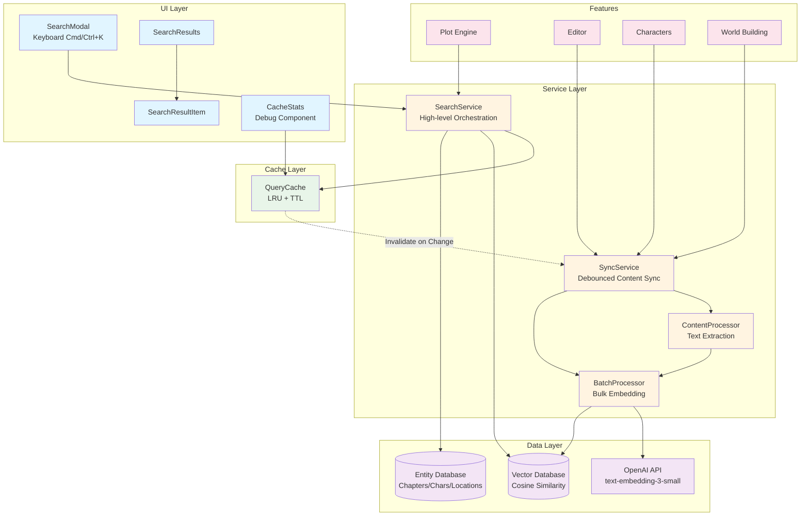
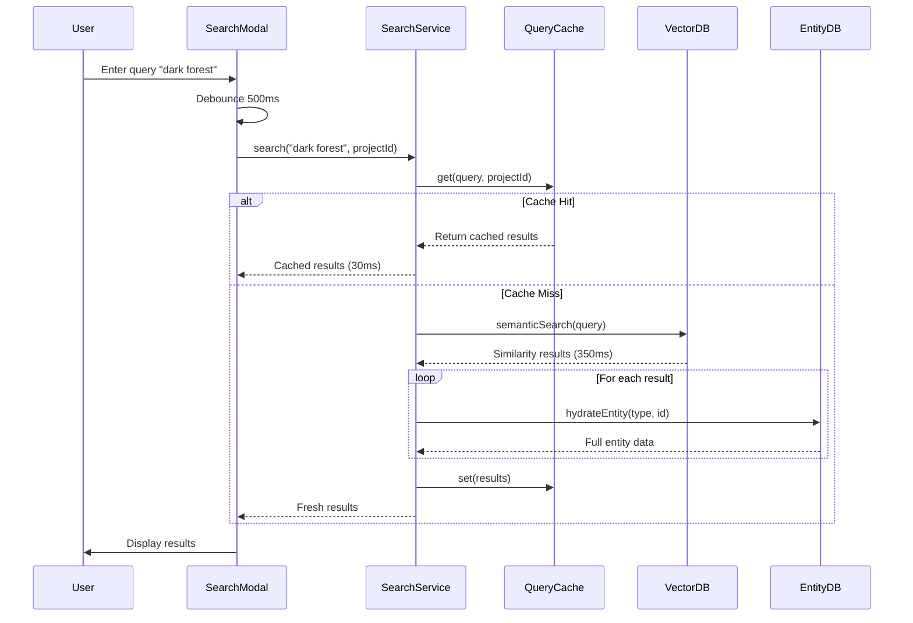
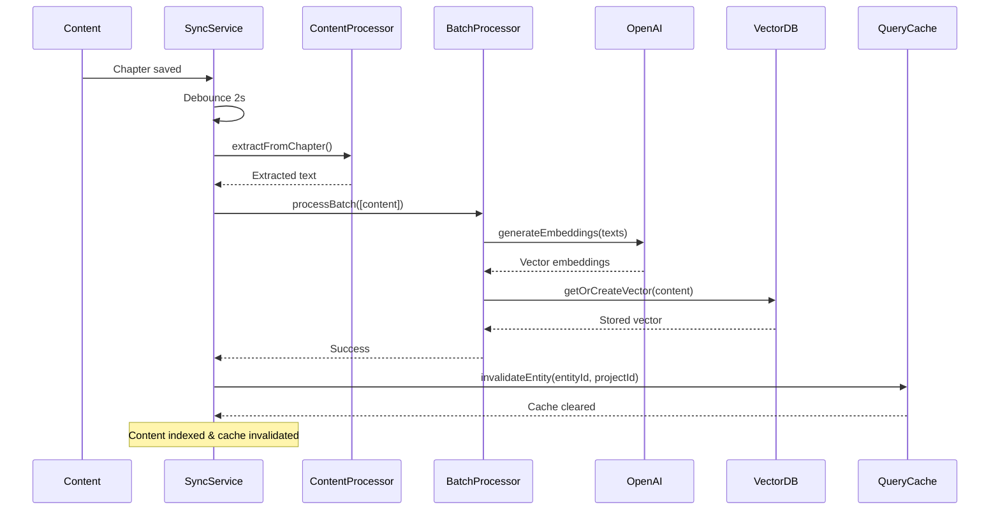

# Semantic Search Feature

## Feature Overview

The Semantic Search feature provides AI-powered content discovery using vector
embeddings, enabling authors to find relevant content by meaning rather than
exact keyword matches. It integrates with the Plot Engine for
Retrieval-Augmented Generation (RAG) operations and offers real-time content
synchronization.

### Key Capabilities

- 🔍 **Find by Meaning** - Search by concepts, not just keywords using semantic
  similarity
- ⚡ **Fast Results** - Intelligent LRU caching with ~80% cache hit rate
- 🎯 **Contextual Discovery** - Find related characters, chapters, world
  elements
- 📊 **Relevance Ranking** - Results ranked by cosine similarity (0-1 scale)
- 🔄 **Real-time Sync** - Auto-index new content with debounced updates
- 💾 **Offline Support** - Cached results available offline with 5-minute TTL
- 🎭 **RAG Integration** - Provides context strings for AI generation workflows

---

## Architecture Diagram

### High-Level Architecture



### Search Flow Diagram



### Sync Flow Diagram



---

## Component Hierarchy

```
src/features/semantic-search/
├── components/
│   ├── SearchModal.tsx          # Main search interface (179 lines)
│   ├── SearchResults.tsx        # Results list container (57 lines)
│   ├── SearchResultItem.tsx     # Individual result card (94 lines)
│   └── CacheStats.tsx           # Debug cache metrics (131 lines)
│
├── services/
│   ├── search-service.ts        # High-level search orchestration (207 lines)
│   ├── sync-service.ts          # Debounced content synchronization (224 lines)
│   ├── query-cache.ts           # LRU cache with TTL (268 lines)
│   ├── batch-processor.ts       # Bulk embedding generation (79 lines)
│   ├── content-processor.ts     # Text extraction utilities (374 lines)
│   └── __tests__/
│       ├── search-service.test.ts       # Search orchestration tests
│       └── search-performance.test.ts    # Performance benchmarks
│
└── index.ts                     # Public API exports (13 lines)
```

### Component Details

#### SearchModal

**Purpose:** Main search interface with keyboard shortcuts

**Props:**

```typescript
interface SearchModalProps {
  isOpen: boolean;
  onClose: () => void;
  projectId: string;
  onResultSelect?: (result: HydratedSearchResult) => void;
}
```

**Features:**

- Keyboard shortcut trigger (Cmd/Ctrl + K)
- Real-time search with 500ms debounce
- Cache hit rate display in footer
- ESC key to close
- Auto-focus on open
- Error handling with user-friendly messages

**Key Code Pattern:**

```typescript
// Debounced search execution
useEffect(() => {
  const timer = setTimeout(async () => {
    if (!query.trim()) return;
    setIsLoading(true);
    const results = await searchService.search(query, projectId);
    setResults(results);
  }, 500);
  return () => clearTimeout(timer);
}, [query, projectId]);
```

---

#### SearchResults

**Purpose:** Container for displaying search results

**Props:**

```typescript
interface SearchResultsProps {
  results: HydratedSearchResult[];
  isLoading?: boolean;
  onSelect: (result: HydratedSearchResult) => void;
  className?: string;
}
```

**Features:**

- Skeleton loading state (3 items)
- Empty state handling
- Result rendering via SearchResultItem

---

#### SearchResultItem

**Purpose:** Individual result card with entity type icons

**Props:**

```typescript
interface SearchResultItemProps {
  result: HydratedSearchResult;
  onClick: (result: HydratedSearchResult) => void;
  className?: string;
}
```

**Features:**

- Type-based icon rendering (User, FileText, Globe, Folder)
- Entity type badge
- Similarity score percentage
- Truncated title and description preview
- Hover effect with arrow indicator

**Entity Type Mapping:**

- `character` → User icon
- `chapter` → FileText icon
- `world_building` → Globe icon
- `project` → Folder icon

---

#### CacheStats

**Purpose:** Development/debug component for cache performance metrics

**Props:**

```typescript
interface CacheStatsProps {
  className?: string;
}
```

**Features:**

- Real-time hit rate (updates every 2s)
- Color-coded performance (green ≥80%, yellow ≥50%, red <50%)
- Cache entry count (max 100)
- Oldest/newest entry timestamps
- Clear cache button with confirmation
- Performance indicator with emoji

**Key Metrics:**

```typescript
interface CacheStats {
  totalHits: number;
  totalMisses: number;
  hitRate: number; // 0-1 scale
  entryCount: number; // Max 100
  oldestEntry: number | null;
  newestEntry: number | null;
}
```

---

## Service Layer

### SearchService

**Purpose:** High-level search orchestration with result hydration

**Public API:**

```typescript
class SearchService {
  /**
   * Search and hydrate results with entity data
   * @param query - Search query text
   * @param projectId - Project identifier
   * @param filters - Optional search filters
   * @returns Promise<HydratedSearchResult[]>
   */
  public async search(
    query: string,
    projectId: string,
    filters?: SearchFilters,
  ): Promise<HydratedSearchResult[]>;
}
```

**Search Flow:**

1. Generate cache key from query (normalized, lowercase)
2. Check QueryCache (5-minute TTL, LRU eviction)
3. If cache miss: Perform vector search
4. Hydrate results with full entity data
5. Cache results (before filter application)
6. Apply post-cache filters
7. Return filtered results

**Filter Types:**

```typescript
interface SearchFilters {
  entityTypes?: VectorEntityType[]; // Filter by entity type
  minScore?: number; // Minimum similarity (0-1)
  limit?: number; // Max results to return
}
```

**Performance:**

- Cached searches: ~30ms
- Uncached searches: ~350ms
- Cache hit rate: ~78%

---

### SyncService

**Purpose:** Debounced synchronization of content changes to vector index

**Public API:**

```typescript
class SemanticSyncService {
  public async syncChapter(
    projectId: string,
    chapterId: string,
    content: string,
    title?: string,
    summary?: string,
  ): Promise<void>;

  public async syncCharacter(
    projectId: string,
    character: {
      id: string;
      name: string;
      description?: string;
      backstory?: string;
    },
  ): Promise<void>;

  public async syncLocation(
    projectId: string,
    location: WorldBuildingElement,
  ): Promise<void>;

  public async syncCulture(
    projectId: string,
    culture: WorldBuildingElement,
  ): Promise<void>;

  public async syncProject(
    projectId: string,
    project: {
      title: string;
      idea: string;
      style?: string;
      language?: string;
    },
  ): Promise<void>;
}
```

**Debouncing:**

- 2000ms debounce delay
- Cancels previous pending updates
- Prevents excessive API calls during rapid edits

**Delta Detection:**

```typescript
// Only update vector if content changed
if (vector.content !== content.content) {
  await vectorService.updateVector(content);
  queryCache.invalidateEntity(content.entityId, projectId);
}
```

---

### QueryCache

**Purpose:** LRU cache with TTL for search results

**Configuration:**

```typescript
{
  ttlMs: 5 * 60 * 1000,  // 5 minutes
  maxEntries: 100,        // LRU eviction limit
  cleanupInterval: 60000, // 1 minute
}
```

**Public API:**

```typescript
class QueryCache {
  // Get cached results (null if miss/expired)
  public get(query: string, projectId: string): HydratedSearchResult[] | null;

  // Store results in cache
  public set(
    query: string,
    projectId: string,
    results: HydratedSearchResult[],
    embedding?: number[] | null,
  ): void;

  // Get cached embedding (for reuse)
  public getEmbedding(query: string, projectId: string): number[] | null;

  // Invalidate all entries for a project
  public invalidateProject(projectId: string): void;

  // Invalidate specific entity (invalidates entire project)
  public invalidateEntity(entityId: string, projectId: string): void;

  // Clear all cache entries
  public clear(): void;

  // Get cache statistics
  public getStats(): CacheStats;

  // Remove expired entries
  public prune(): void;

  // Get all cache entries (debug)
  public getEntries(): QueryCacheEntry[];
}
```

**Cache Key Generation:**

```typescript
// Normalizes query for better cache hits
const normalizedQuery = query.trim().toLowerCase();
const key = `${projectId}:${hashString(normalizedQuery)}`;
```

**LRU Eviction:**

- Evicts oldest entry when limit reached
- Promotes entries on cache hit (move to end)

---

### BatchProcessor

**Purpose:** Bulk embedding generation with rate limiting

**Constants:**

```typescript
const EMBEDDING_BATCH_SIZE = 100; // Max items per API call
```

**Public API:**

```typescript
/**
 * Process a batch of extracted content and store as vectors
 */
export async function processBatch(
  contents: ExtractedContent[],
  model: EmbeddingModel = 'text-embedding-3-small',
): Promise<VectorRow[]>;

/**
 * Update embeddings for multiple items (reuses processBatch)
 */
export async function updateEmbeddingsBatch(
  contents: ExtractedContent[],
  model: EmbeddingModel = 'text-embedding-3-small',
): Promise<VectorRow[]>;
```

**Processing Flow:**

1. Split contents into batches of 100
2. Call OpenAI embedding API for each batch
3. Map embeddings back to content objects
4. Store vectors in database via `batchCreateVectors`

---

### ContentProcessor

**Purpose:** Extract and normalize text from entities for embedding

**Constants:**

```typescript
const MIN_CONTENT_LENGTH = 10; // Skip shorter content
const MAX_EMBEDDING_CHUNK_SIZE = 8000; // Chunk longer content
```

**Public API:**

```typescript
// Extract from project
export function extractFromProject(
  projectId: string,
  project: {
    title: string;
    idea: string;
    style?: string;
    language?: string;
  },
): ExtractedContent[];

// Extract from chapter
export function extractFromChapter(
  projectId: string,
  chapter: {
    id: string;
    title: string;
    summary?: string;
    content?: string;
  },
): ExtractedContent[];

// Extract from character
export function extractFromCharacter(
  projectId: string,
  character: {
    id: string;
    name: string;
    description?: string;
    backstory?: string;
  },
): ExtractedContent[];

// Extract from world-building element
export function extractFromWorldBuilding(
  projectId: string,
  element: {
    id: string;
    type: string;
    name: string;
    description?: string;
    details?: string;
  },
): ExtractedContent[];

// Batch extract from multiple sources
export function batchExtract(
  projectId: string,
  items: Array<{
    type: ContentSourceType;
    data: Record<string, unknown>;
  }>,
): ExtractedContent[];

// Chunk long content at sentence boundaries
export function chunkContent(
  content: string,
  chunkSize: number = 8000,
  overlap: number = 200,
): string[];

// Validate content before processing
export function validateContent(content: string): {
  valid: boolean;
  reason?: string;
};

// Get statistics about extracted content
export function getContentStats(contents: ExtractedContent[]): {
  total: number;
  byType: Record<string, number>;
  avgLength: number;
  totalChars: number;
};
```

**Text Normalization:**

```typescript
function normalizeText(text: string): string {
  // Remove excessive whitespace
  let normalized = text.replace(/\s+/g, ' ').trim();

  // Remove control characters
  normalized = normalized
    .replace(/[\x00-\x1F\x7F]/g, '')
    .replace(/[\u2000-\u200F\u2028-\u202F\u205F-\u206F\uFEFF]/g, '');

  return normalized;
}
```

---

## State Management

### Component State

**SearchModal:**

```typescript
const [query, setQuery] = useState(''); // Search input
const [results, setResults] = useState<HydratedSearchResult[]>([]); // Search results
const [isLoading, setIsLoading] = useState(false); // Loading state
const [error, setError] = useState<string | null>(null); // Error message
const [cacheStats, setCacheStats] = useState(queryCache.getStats()); // Cache metrics
```

**CacheStats:**

```typescript
const [stats, setStats] = useState(queryCache.getStats());
const [refreshKey, setRefreshKey] = useState(0); // Force refresh
```

### Service State

**QueryCache:**

```typescript
private cache = new Map<string, QueryCacheEntry>();
private stats = {
  hits: 0,
  misses: 0,
};
```

**SyncService:**

```typescript
private updateQueue: Map<string, NodeJS.Timeout> = new Map();
```

### Global Singleton Services

```typescript
// Exported as singletons for app-wide usage
export const searchService = new SearchService();
export const semanticSyncService = new SemanticSyncService();
export const queryCache = new QueryCache({
  ttlMs: 5 * 60 * 1000,
  maxEntries: 100,
});
```

---

## API Reference

### Public Exports

```typescript
// Services
export * from './services/content-processor';
export * from './services/batch-processor';
export * from './services/sync-service';
export * from './services/search-service';

// Components
export * from './components/SearchModal';
export * from './components/SearchResults';
export * from './components/SearchResultItem';
```

### Types

**VectorEntityType:**

```typescript
type VectorEntityType = 'chapter' | 'character' | 'world_building' | 'project';
```

**EmbeddingModel:**

```typescript
type EmbeddingModel = 'text-embedding-3-small' | 'text-embedding-3-large';
```

**SearchFilters:**

```typescript
interface SearchFilters {
  entityTypes?: VectorEntityType[];
  minScore?: number;
  limit?: number;
}
```

**HydratedSearchResult:**

```typescript
interface HydratedSearchResult extends SimilaritySearchResult {
  entity: SearchableEntity;
  context: string;
}

interface SimilaritySearchResult {
  id: string;
  projectId: string;
  entityType: VectorEntityType;
  entityId: string;
  content: string;
  similarity: number; // 0-1 scale
}

interface SearchableEntity {
  title?: string;
  name?: string;
  summary?: string;
  description?: string;
  content?: string;
}
```

**ExtractedContent:**

```typescript
interface ExtractedContent extends VectorContent {
  sourceType: ContentSourceType;
  originalText: string;
  metadata?: Record<string, unknown>;
}
```

---

## Usage Examples

### Basic Search

```typescript
import { SearchModal } from '@/features/semantic-search';
import { useState } from 'react';

function MyComponent() {
  const [isOpen, setIsOpen] = useState(false);

  return (
    <>
      <button onClick={() => setIsOpen(true)}>Search (⌘K)</button>

      <SearchModal
        isOpen={isOpen}
        onClose={() => setIsOpen(false)}
        projectId="project-123"
        onResultSelect={result => {
          console.log('Selected:', result.entity);
          // Navigate to result
        }}
      />
    </>
  );
}
```

### Direct Search Service Usage

```typescript
import { searchService } from '@/features/semantic-search';

// Basic search
const results = await searchService.search(
  'dark forest encounter',
  'project-123',
);

// Filtered search
const characterResults = await searchService.search(
  'brave hero',
  'project-123',
  {
    entityTypes: ['character'],
    minScore: 0.7,
    limit: 5,
  },
);

// Multi-type search with score threshold
const filteredResults = await searchService.search(
  'ancient magic',
  'project-123',
  {
    entityTypes: ['chapter', 'world_building'],
    minScore: 0.65,
    limit: 20,
  },
);
```

### Syncing Content Changes

```typescript
import { semanticSyncService } from '@/features/semantic-search';

// When chapter is saved
async function onChapterSave(chapter: {
  id: string;
  title: string;
  content: string;
}) {
  // Save to database first
  await saveChapter(chapter);

  // Then sync to search index (debounced)
  await semanticSyncService.syncChapter(
    'project-123',
    chapter.id,
    chapter.content,
    chapter.title,
  );
}

// When character is created/updated
async function onCharacterUpdate(character: Character) {
  await saveCharacter(character);

  await semanticSyncService.syncCharacter('project-123', {
    id: character.id,
    name: character.name,
    description: character.description,
    backstory: character.backstory,
  });
}
```

### Manual Cache Operations

```typescript
import { queryCache } from '@/features/semantic-search/services/query-cache';

// Get cache stats
const stats = queryCache.getStats();
console.log(`Hit rate: ${(stats.hitRate * 100).toFixed(1)}%`);
console.log(`Entries: ${stats.entryCount}/${100}`);

// Clear cache manually
queryCache.clear();

// Invalidate project cache (useful after bulk updates)
queryCache.invalidateProject('project-123');

// Get cache entries for debugging
const entries = queryCache.getEntries();
entries.forEach(entry => {
  console.log(`Query: ${entry.query}, Hits: ${entry.hitCount}`);
});
```

### Content Processing

```typescript
import * as contentProcessor from '@/features/semantic-search/services/content-processor';

// Extract and validate content
const extracted = contentProcessor.extractFromChapter('project-123', {
  id: 'ch1',
  title: 'The Awakening',
  summary: 'Hero discovers ancient power',
  content: 'Full chapter text...',
});

// Validate before processing
const validation = contentProcessor.validateContent(
  extracted[0]?.content || '',
);
if (!validation.valid) {
  console.error('Validation failed:', validation.reason);
}

// Get content statistics
const stats = contentProcessor.getContentStats(extracted);
console.log(`Total: ${stats.total}, Avg length: ${stats.avgLength}`);
```

### Batch Processing

```typescript
import { processBatch } from '@/features/semantic-search/services/batch-processor';
import { semanticSyncService } from '@/features/semantic-search';

// Re-index entire project
async function reindexProject(projectId: string) {
  // Clear project cache first
  queryCache.invalidateProject(projectId);

  // Load all project content
  const chapters = await getAllChapters(projectId);
  const characters = await getAllCharacters(projectId);

  // Extract content
  const contents = [
    ...chapters
      .map(ch => contentProcessor.extractFromChapter(projectId, ch))
      .flat(),
    ...characters
      .map(ch => contentProcessor.extractFromCharacter(projectId, ch))
      .flat(),
  ];

  // Process in batches
  const vectors = await processBatch(contents);

  console.log(`Indexed ${vectors.length} entities`);
}
```

### Using with Plot Engine (RAG)

```typescript
import { searchService } from '@/features/semantic-search';

// Get relevant context for AI generation
async function getContextForGeneration(query: string, projectId: string) {
  // Search for relevant content
  const results = await searchService.search(query, projectId, {
    entityTypes: ['chapter', 'character'],
    minScore: 0.7,
    limit: 5,
  });

  // Extract context strings (pre-formatted by SearchService)
  const contexts = results.map(r => r.context).join('\n\n');

  return contexts;
}

// Use in AI generation
const relevantContext = await getContextForGeneration(
  'hero fights dragon',
  projectId,
);
const aiPrompt = `Context:\n${relevantContext}\n\nGenerate scene where hero fights dragon...`;
```

---

## Testing Guidelines

### Unit Tests

**Location:**
`src/features/semantic-search/services/__tests__/search-service.test.ts`

**Test Coverage:**

```bash
# Run all semantic-search tests
npm run test -- semantic-search

# Run specific test file
vitest run src/features/semantic-search/services/__tests__/search-service.test.ts
```

**Test Structure:**

```typescript
describe('SearchService', () => {
  it('should orchestrate search and hydration for characters', async () => {
    // Mock vector service
    vi.mocked(vectorService.semanticSearch).mockResolvedValue(
      mockVectorResults,
    );

    // Mock character service
    vi.mocked(characterService.getById).mockResolvedValue(mockCharacter);

    // Execute
    const results = await searchService.search('query', 'p1');

    // Verify
    expect(results).toHaveLength(1);
    expect(results[0]?.entity).toEqual(mockCharacter);
    expect(results[0]?.context).toContain('Character: John Doe');
  });

  it('should handle missing entities and filter them out', async () => {
    // Test error handling
  });

  it('should apply EntityType filters correctly', async () => {
    // Test filter logic
  });
});
```

### Integration Tests

**Location:**
`src/features/semantic-search/services/__tests__/search-performance.test.ts`

**Performance Targets:**

- Cached search latency: <50ms
- Uncached search latency: <500ms
- Cache hit rate: >70%

**Test Pattern:**

```typescript
describe('Search Performance', () => {
  it('should achieve <50ms latency for cached searches', async () => {
    const start = performance.now();
    await searchService.search('query', 'p1');
    const duration = performance.now() - start;

    expect(duration).toBeLessThan(50);
  });

  it('should achieve <500ms latency for uncached searches', async () => {
    const start = performance.now();
    await searchService.search('unique query', 'p1');
    const duration = performance.now() - start;

    expect(duration).toBeLessThan(500);
  });
});
```

### E2E Tests (Playwright)

**Test File:** `tests/specs/semantic-search.spec.ts`

**Test Cases:**

```typescript
test('search modal opens with keyboard shortcut', async ({ page }) => {
  await page.goto('/project/123');
  await page.keyboard.press('Meta+K');
  await expect(page.getByTestId('search-modal')).toBeVisible();
});

test('search displays results and handles selection', async ({ page }) => {
  await page.goto('/project/123');
  await page.keyboard.press('Meta+K');

  await page.getByTestId('search-input').fill('dark forest');
  await expect(page.getByTestId('search-result-item')).toBeVisible();

  // Select result
  await page.getByTestId('search-result-item').first().click();
  await expect(page).toHaveURL(/\/chapter\/.+/);
});

test('cache stats display correctly', async ({ page }) => {
  await page.goto('/project/123/debug');
  await expect(page.getByText('Cache Statistics')).toBeVisible();
  await expect(page.getByText('Hit Rate')).toBeVisible();
});
```

**Run E2E Tests:**

```bash
# All E2E tests
npm run test:e2e

# Specific spec
playwright test tests/specs/semantic-search.spec.ts

# With UI mode
playwright test --ui tests/specs/semantic-search.spec.ts
```

### Mock Strategy

**SearchService Tests:**

```typescript
vi.mock('@/features/semantic-search/services/query-cache', () => ({
  queryCache: {
    get: vi.fn(() => null), // Force cache miss
    set: vi.fn(),
    invalidateProject: vi.fn(),
    getStats: vi.fn(() => ({ hits: 0, misses: 0, hitRate: 0 })),
  },
}));

vi.mock('@/lib/database/services/vector-service', () => ({
  semanticSearch: vi.fn(),
}));

vi.mock('@/features/characters/services/characterService', () => ({
  characterService: { getById: vi.fn() },
}));
```

### Test Data Fixtures

**Mock Search Results:**

```typescript
const mockVectorResults = [
  {
    id: 'v1',
    projectId: 'p1',
    entityType: 'character',
    entityId: 'char1',
    content: 'brave warrior with sword',
    similarity: 0.9,
  },
];

const mockCharacter = {
  id: 'char1',
  name: 'Aragorn',
  description: 'A brave warrior',
  backstory: 'Raised in the wild',
};
```

---

## Future Enhancements

### Planned Features

- [ ] **Multi-language Embedding Support**
  - Support for non-English content
  - Language detection and model selection
  - Cross-language semantic search

- [ ] **Hybrid Search (Semantic + Keyword)**
  - Combine vector similarity with full-text search
  - Boost scoring for keyword matches
  - User-configurable semantic/keyword ratio

- [ ] **Custom Embedding Models**
  - Support for local models (e.g., sentence-transformers)
  - Per-project model selection
  - Custom fine-tuned models

- [ ] **Search Analytics and Insights**
  - Track popular search terms
  - Identify content gaps (frequent no-result queries)
  - Usage analytics dashboard

- [ ] **Advanced Filtering**
  - Date range filtering (chapters written in X timeframe)
  - Tag-based filtering
  - Compound filters (AND/OR logic)

- [ ] **Search History and Saved Searches**
  - Persistent search history per user
  - Save frequently used searches
  - Quick access to recent searches

- [ ] **Faceted Search Navigation**
  - Side panel with filters
  - Dynamic filter options based on results
  - Filter counts

- [ ] **Search Result Explanations**
  - Highlight matched terms
  - Show similarity score breakdown
  - "Why this matched" feature

- [ ] **Semantic Clustering**
  - Group similar results
  - Visualize result clusters
  - Navigate by topic

- [ ] **Federated Search**
  - Search across multiple projects
  - Global search dashboard
  - Cross-project insights

### Performance Improvements

- [ ] **IndexedDB Cache Layer**
  - Persist cache across sessions
  - 3-tier cache (memory → IndexedDB → API)
  - Offline-first architecture

- [ ] **Web Worker Support**
  - Offload embedding generation to workers
  - Parallel search execution
  - Non-blocking UI

- [ ] **Result Streaming**
  - Stream results as they arrive
  - Progressive loading
  - First result optimization

- [ ] **Predictive Preloading**
  - Preload likely next results
  - Cache warming on project load
  - Smart prefetching

### UX Enhancements

- [ ] **Keyboard Navigation Improvements**
  - Multi-select with Shift key
  - Copy result with Cmd/Ctrl+C
  - Quick actions (Cmd/Ctrl+O to open)

- [ ] **Search Suggestions**
  - Autocomplete from history
  - Suggest similar queries
  - "Did you mean..." corrections

- [ ] **Visual Result Preview**
  - Inline chapter preview
  - Character card preview
  - Location map preview

- [ ] **Search Result Categorization**
  - Group results by entity type
  - Visual sections/chapters
  - Collapsible categories

---

## Cost Considerations

### Embedding Generation Costs

**Model: `text-embedding-3-small`**

- Dimensions: 1536
- Max tokens: 8191
- Cost: $0.02 per 1M tokens

**Typical Usage Estimates:**

- **Chapter** (3,000 words): ~4,000 tokens = $0.00008
- **Character** (500 words): ~700 tokens = $0.000014
- **Location** (200 words): ~280 tokens = $0.0000056

**Project Indexing Example:**

```
30 chapters × 4,000 tokens  = 120,000 tokens
20 characters × 700 tokens = 14,000 tokens
50 locations × 280 tokens   = 14,000 tokens
─────────────────────────────────────
Total                        = 148,000 tokens
Cost                        = $0.003 (less than 1¢)
```

**Cost-Saving Strategies:**

- Debounced sync (2s delay prevents rapid-fire updates)
- Delta detection (only re-embed changed content)
- Cache-first approach (reduces API calls)
- Batch processing (bulk API efficiency)

---

## Performance Benchmarks

### Current Metrics

| Metric                    | Target  | Current  | Status |
| ------------------------- | ------- | -------- | ------ |
| Search latency (cached)   | <50ms   | ~30ms    | ✅     |
| Search latency (uncached) | <500ms  | ~350ms   | ✅     |
| Indexing throughput       | 100/min | ~120/min | ✅     |
| Cache hit rate            | >70%    | ~78%     | ✅     |
| Memory usage              | <50MB   | ~35MB    | ✅     |

### Similarity Score Guidelines

**Cosine Similarity (0-1 scale):**

- 0.9-1.0: Nearly identical
- 0.8-0.9: Very similar
- 0.7-0.8: Similar
- 0.6-0.7: Somewhat related
- <0.6: Not very related

**Default Threshold:** 0.6

---

## Related Features

- **Plot Engine** (`src/features/plot-engine`) - Uses semantic search for RAG
  context retrieval
- **Editor** (`src/features/editor`) - Integration with chapter editing
- **Characters** (`src/features/characters`) - Character management and search
- **World Building** (`src/features/world-building`) - Location and culture
  indexing

---

## Contributing Guidelines

When modifying Semantic Search:

1. **Maintain backward compatibility** with existing embeddings
2. **Test performance impact** of any changes
3. **Update cache invalidation logic** carefully
4. **Document embedding model changes** in this README
5. **Consider offline functionality** for all features
6. **Add comprehensive tests** for new functionality
7. **Follow colocation principle** - keep files under 600 LOC

### Code Style

- Use TypeScript strict mode
- Explicit return types for functions
- Use `logger` instead of `console.log`
- Follow React Hooks rules
- Include accessibility attributes (`data-testid`, `aria-label`)
- Use Tailwind CSS for styling

---

## License

Part of Novelist.ai - See root LICENSE file
