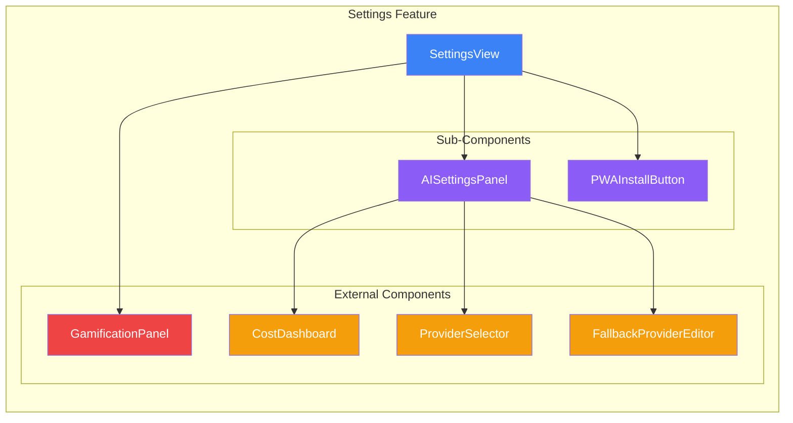

# Settings Feature

> **User Configuration & Preferences Management**

The **Settings** feature provides comprehensive configuration management for the
Novelist.ai application, allowing users to customize their writing environment,
AI behavior, editor preferences, and application behavior.

---

## Feature Overview

The Settings feature manages all user preferences with:

- ⚙️ **6 Settings Categories**: Appearance, AI, Editor, Goals, Privacy,
  Experimental
- 🎨 **Theme Management**: Light/dark/system themes with instant application
- 🤖 **AI Configuration**: Model selection, temperature, token limits, context
  injection (RAG)
- 📝 **Editor Preferences**: Auto-save, spell check, word wrap, display options
- 🎯 **Writing Goals**: Daily targets, notifications, streak tracking
- 🔒 **Privacy Controls**: Analytics, crash reporting, backup frequency
- 💾 **Database Configuration**: Local browser vs Turso Cloud persistence
- 📱 **PWA Installation**: Progressive Web App installation management
- ✅ **Zod Validation**: Runtime validation for all settings
- 💾 **Persistent Storage**: localStorage with Zustand state management
- 🔄 **Hot Reloading**: Settings apply immediately without page refresh

**Key Capabilities**:

- Centralized configuration management
- Real-time settings validation
- Automatic persistence to localStorage
- Category-based organization for better UX
- Import/export functionality
- Reset to defaults (all or per-category)

---

## Architecture Diagram

```mermaid
graph TB
    subgraph "UI Layer"
        SV[SettingsView<br/>Main Interface]
        ASP[AISettingsPanel<br/>AI Configuration]
        PWAB[PWAInstallButton<br/>App Installation]
        GP[GamificationPanel<br/>External Integration]
    end

    subgraph "State Management Layer"
        US[useSettings Hook<br/>Zustand Store]
        US1[settings: Settings]
        US2[isLoading: boolean]
        US3[isSaving: boolean]
        US4[error: string | null]
        US5[activeCategory: SettingsCategory]
        US6[init, update, reset<br/>resetCategory, setActiveCategory]
    end

    subgraph "Service Layer"
        SS[settingsService<br/>Singleton]
        SS1[load: Settings]
        SS2[save: void]
        SS3[reset: Settings]
        SS4[export: string]
        SS5[import: Settings]
        SS6[get/set: Generic]
    end

    subgraph "Data Layer"
        LS[localStorage<br/>Key: novelist-settings]
    end

    subgraph "Validation Layer"
        ZOD[Zod Schema<br/>SettingsSchema]
        ZOD1[Runtime Validation]
        ZOD2[Type Safety]
        ZOD3[Default Values]
    end

    SV --> US
    ASP --> US
    PWAB -.-> SV
    GP -.-> SV

    US <--> SS
    SS <--> LS
    US --> ZOD

    style SV fill:#e1f5ff
    style ASP fill:#e1f5ff
    style PWAB fill:#e1f5ff
    style GP fill:#ffe1e1
    style US fill:#fff4e1
    style SS fill:#ffe1ff
    style LS fill:#e1ffe1
    style ZOD fill:#f0e1ff
```

---

## Component Hierarchy



### Component Details

#### 1. SettingsView (`components/SettingsView.tsx`)

**Purpose**: Main settings interface providing tabbed categories for all
application settings.

**Props**: None (uses contexts and hooks)

**Features**:

- Database configuration (local vs Turso Cloud)
- Theme selection (light/dark)
- AI provider settings panel
- Gamification panel integration
- PWA installation button
- API configuration display

**Sections**:

- **Database Persistence**: Storage strategy selection with connection testing
- **App Installation**: PWA install status and button
- **Appearance**: Theme toggle
- **AI Provider Settings**: Embedded AISettingsPanel
- **Writing Gamification**: Embedded GamificationPanel
- **API Configuration**: Google GenAI status

**Usage**:

```tsx
import { SettingsView } from '@/features/settings';

function App() {
  return <SettingsView />;
}
```

#### 2. AISettingsPanel (`components/AISettingsPanel.tsx`)

**Purpose**: Comprehensive AI provider configuration interface.

**Props**:

```typescript
interface AISettingsPanelProps {
  userId: string;
}
```

**Features**:

- Provider selection (OpenAI, Anthropic, Google)
- Temperature and max tokens configuration
- Automatic fallback configuration
- Fallback provider ordering
- Cost optimization toggle
- Monthly budget setting
- Context injection (RAG) configuration
- Cost analytics dashboard
- Provider health monitoring

**Tabs**:

1. **Provider Selection**: Current provider, temperature, max tokens, fallback
   settings
2. **Cost Analytics**: Usage tracking, spending analysis
3. **Provider Health**: Uptime monitoring, operational status
4. **Context Injection**: RAG configuration, token limits, context sources

**Usage**:

```tsx
import { AISettingsPanel } from '@/features/settings';

function SettingsPage() {
  const { userId } = useUser();

  return <AISettingsPanel userId={userId} />;
}
```

#### 3. PWAInstallButton (`components/PWAInstallButton.tsx`)

**Purpose**: Progressive Web App installation interface.

**Props**: None

**Features**:

- Detects if app is installable
- Shows install status
- Online/offline indicator
- One-click installation

**States**:

- **Installed**: Shows checkmark, online/offline status
- **Installable**: Shows install button
- **Not Available**: Shows disabled state with status

**Usage**:

```tsx
import { PWAInstallButton } from '@/features/settings';

function Settings() {
  return (
    <div>
      <h3>App Installation</h3>
      <PWAInstallButton />
    </div>
  );
}
```

---

## Service Layer

### settingsService (`services/settingsService.ts`)

Singleton service for localStorage persistence. Handles all storage operations
with validation.

**API Reference**:

| Method            | Signature                                                      | Returns     | Description                      |
| ----------------- | -------------------------------------------------------------- | ----------- | -------------------------------- |
| `load()`          | `(): Settings`                                                 | Settings    | Load settings from localStorage  |
| `save(settings)`  | `(settings: Settings): void`                                   | void        | Save settings to localStorage    |
| `reset()`         | `(): Settings`                                                 | Settings    | Reset to defaults, clear storage |
| `export()`        | `(): string`                                                   | string      | Export settings as JSON string   |
| `import(json)`    | `(json: string): Settings`                                     | Settings    | Import settings from JSON        |
| `get(key)`        | `<K extends keyof Settings>(key: K): Settings[K]`              | Settings[K] | Get a specific setting value     |
| `set(key, value)` | `<K extends keyof Settings>(key: K, value: Settings[K]): void` | void        | Update a specific setting value  |

**Usage Examples**:

```typescript
import { settingsService } from '@/features/settings';

// Load all settings
const settings = settingsService.load();
console.log(settings.theme); // 'dark'

// Save settings
settingsService.save({
  ...settings,
  theme: 'dark',
  fontSize: 18,
});

// Get single setting
const theme = settingsService.get('theme');

// Set single setting
settingsService.set('theme', 'dark');
settingsService.set('fontSize', 18);

// Export settings
const exported = settingsService.export();
console.log(exported);
// {"theme":"dark","fontSize":18,...}

// Import settings
const json = '{"theme":"light","fontSize":18}';
const imported = settingsService.import(json);

// Reset to defaults
const defaults = settingsService.reset();
```

---

## State Management

### useSettings Hook (`hooks/useSettings.ts`)

Zustand store for managing application settings with persistence.

**State Interface**:

```typescript
interface SettingsState {
  // Data
  settings: Settings;

  // UI State
  isLoading: boolean;
  isSaving: boolean;
  error: string | null;
  activeCategory: SettingsCategory;

  // Actions
  init: () => void;
  update: (updates: Partial<Settings>) => void;
  reset: () => void;
  resetCategory: (category: SettingsCategory) => void;
  setActiveCategory: (category: SettingsCategory) => void;
  clearError: () => void;
}
```

**Methods Reference**:

| Method                        | Parameters          | Description                                         |
| ----------------------------- | ------------------- | --------------------------------------------------- |
| `init()`                      | None                | Initialize settings from localStorage, apply theme  |
| `update(updates)`             | `Partial<Settings>` | Update one or more settings, validates and persists |
| `reset()`                     | None                | Reset all settings to defaults                      |
| `resetCategory(category)`     | `SettingsCategory`  | Reset specific category to defaults                 |
| `setActiveCategory(category)` | `SettingsCategory`  | Set active category for UI navigation               |
| `clearError()`                | None                | Clear error state                                   |

**Usage Examples**:

```tsx
import { useSettings } from '@/features/settings';

// Basic theme toggle
function ThemeToggle() {
  const { settings, update, isLoading } = useSettings();

  const toggleTheme = () => {
    const newTheme = settings.theme === 'dark' ? 'light' : 'dark';
    update({ theme: newTheme });
  };

  return (
    <button onClick={toggleTheme} disabled={isLoading}>
      Current: {settings.theme}
    </button>
  );
}

// Initialize on app start
function App() {
  const { init } = useSettings();

  useEffect(() => {
    init(); // Load settings from localStorage
  }, [init]);

  return <YourApp />;
}

// Update multiple settings
function EditorPreferences() {
  const { settings, update } = useSettings();

  const applyQuickPreset = () => {
    update({
      autoSave: true,
      autoSaveInterval: 30,
      spellCheck: true,
      wordWrap: true,
      showWordCount: true,
    });
  };

  return <button onClick={applyQuickPreset}>Apply Quick Preset</button>;
}

// Reset category
function AppearanceSettings() {
  const { resetCategory } = useSettings();

  return (
    <button onClick={() => resetCategory('appearance')}>
      Reset Appearance to Defaults
    </button>
  );
}

// Error handling
function SettingsForm() {
  const { settings, update, error, clearError } = useSettings();

  useEffect(() => {
    if (error) {
      console.error('Settings error:', error);
      setTimeout(() => clearError(), 5000);
    }
  }, [error, clearError]);

  return (
    <div>
      {error && <div className="error">{error}</div>}
      {/* Settings form */}
    </div>
  );
}
```

---

## API Reference

### Types (`types/index.ts`)

#### Settings Schema

```typescript
const SettingsSchema = z.object({
  // Appearance
  theme: z.enum(['light', 'dark', 'system']).default('system'),
  fontSize: z.number().min(12).max(24).default(16),
  fontFamily: z.enum(['system', 'serif', 'mono']).default('system'),
  compactMode: z.boolean().default(false),

  // AI Settings
  aiModel: z
    .enum(['gemini-pro', 'gemini-flash', 'gpt-4', 'claude-3'])
    .default('gemini-pro'),
  aiTemperature: z.number().min(0).max(2).default(0.7),
  aiMaxTokens: z.number().min(100).max(4096).default(2048),
  enableAIAssistance: z.boolean().default(true),

  // Context Injection (RAG)
  enableContextInjection: z.boolean().default(true),
  contextTokenLimit: z.number().min(1000).max(10000).default(6000),
  contextIncludeCharacters: z.boolean().default(true),
  contextIncludeWorldBuilding: z.boolean().default(true),
  contextIncludeTimeline: z.boolean().default(true),
  contextIncludeChapters: z.boolean().default(true),

  // Editor Preferences
  autoSave: z.boolean().default(true),
  autoSaveInterval: z.number().min(30).max(600).default(60), // seconds
  spellCheck: z.boolean().default(true),
  wordWrap: z.boolean().default(true),
  showWordCount: z.boolean().default(true),
  showReadingTime: z.boolean().default(true),

  // Writing Goals
  dailyWordGoal: z.number().min(0).max(10000).default(500),
  enableGoalNotifications: z.boolean().default(false),
  goalStreakTracking: z.boolean().default(true),

  // Privacy & Data
  analyticsEnabled: z.boolean().default(true),
  crashReporting: z.boolean().default(true),
  dataBackupEnabled: z.boolean().default(true),
  backupFrequency: z.enum(['daily', 'weekly', 'monthly']).default('weekly'),

  // Experimental Features
  enableBetaFeatures: z.boolean().default(false),
  enableDevMode: z.boolean().default(false),
});

type Settings = z.infer<typeof SettingsSchema>;
```

#### Settings Category

```typescript
type SettingsCategory =
  | 'appearance'
  | 'ai'
  | 'editor'
  | 'goals'
  | 'privacy'
  | 'experimental';
```

#### Validation Result

```typescript
interface SettingsValidationResult {
  isValid: boolean;
  errors?: z.ZodError;
  data?: Settings;
}
```

### Helper Functions

#### `validateSettings(data: unknown): SettingsValidationResult`

Validates unknown data against the Settings schema.

```typescript
import { validateSettings } from '@/features/settings';

const result = validateSettings({
  theme: 'dark',
  fontSize: 18,
});

if (result.isValid) {
  console.log('Settings valid:', result.data);
} else {
  console.error('Validation errors:', result.errors);
}
```

#### `isTheme(value: string): value is Theme`

Type guard for theme values.

```typescript
import { isTheme } from '@/features/settings';

const value = 'dark';
if (isTheme(value)) {
  // TypeScript knows value is 'light' | 'dark' | 'system'
  update({ theme: value });
}
```

#### `selectCategorySettings(state, category): Partial<Settings>`

Selector to get default values for a specific category.

```typescript
import { useSettings, selectCategorySettings } from '@/features/settings';

function CategorySettings() {
  const state = useSettings();
  const appearanceDefaults = selectCategorySettings(state, 'appearance');

  console.log(appearanceDefaults);
  // { theme: 'system', fontSize: 16, fontFamily: 'system', compactMode: false }
}
```

### Public Exports (`index.ts`)

```typescript
// Components
export { default as SettingsView } from './components/SettingsView';

// Hooks
export { useSettings, selectCategorySettings } from './hooks/useSettings';

// Services
export { settingsService } from './services/settingsService';

// Types
export type {
  Settings,
  Theme,
  SettingsCategory,
  SettingsValidationResult,
} from './types';

export {
  SettingsSchema,
  DEFAULT_SETTINGS,
  validateSettings,
  isTheme,
} from './types';
```

---

## Usage Examples

### 1. User Onboarding Wizard

```tsx
import { useSettings } from '@/features/settings';
import { useState } from 'react';

function OnboardingWizard() {
  const { update } = useSettings();
  const [step, setStep] = useState(1);

  const completeOnboarding = () => {
    update({
      theme: 'dark',
      fontSize: 16,
      dailyWordGoal: 500,
      enableAIAssistance: true,
      enableContextInjection: true,
    });

    localStorage.setItem('onboarding_complete', 'true');
  };

  return (
    <div>
      {step === 1 && <ThemeSelection />}
      {step === 2 && <GoalSetting />}
      {step === 3 && <AIConfiguration />}
      <button onClick={completeOnboarding}>Complete Setup</button>
    </div>
  );
}
```

### 2. Settings Export/Import

```tsx
import { settingsService } from '@/features/settings';

function SettingsBackup() {
  const handleExport = () => {
    const json = settingsService.export();
    const blob = new Blob([json], { type: 'application/json' });
    const url = URL.createObjectURL(blob);

    const a = document.createElement('a');
    a.href = url;
    a.download = 'novelist-settings.json';
    a.click();
  };

  const handleImport = (file: File) => {
    const reader = new FileReader();
    reader.onload = e => {
      const json = e.target?.result as string;
      try {
        settingsService.import(json);
        alert('Settings imported successfully!');
      } catch (error) {
        alert('Invalid settings file');
      }
    };
    reader.readAsText(file);
  };

  return (
    <div>
      <button onClick={handleExport}>Export Settings</button>
      <input type="file" onChange={e => handleImport(e.target.files![0])} />
    </div>
  );
}
```

### 3. Theme Synchronization

```tsx
import { useSettings } from '@/features/settings';
import { useEffect } from 'react';

function App() {
  const { settings, init } = useSettings();

  useEffect(() => {
    init(); // Load settings on app start
  }, [init]);

  useEffect(() => {
    // Listen for system theme changes
    const mediaQuery = window.matchMedia('(prefers-color-scheme: dark)');

    const handleChange = (e: MediaQueryListEvent) => {
      if (settings.theme === 'system') {
        document.documentElement.classList.toggle('dark', e.matches);
      }
    };

    mediaQuery.addEventListener('change', handleChange);
    return () => mediaQuery.removeEventListener('change', handleChange);
  }, [settings.theme]);

  return <YourApp />;
}
```

### 4. Context Injection Configuration

```tsx
import { useSettings } from '@/features/settings';

function ContextSettings() {
  const { settings, update } = useSettings();

  const enableFullContext = () => {
    update({
      enableContextInjection: true,
      contextTokenLimit: 10000,
      contextIncludeCharacters: true,
      contextIncludeWorldBuilding: true,
      contextIncludeTimeline: true,
      contextIncludeChapters: true,
    });
  };

  const enableMinimalContext = () => {
    update({
      enableContextInjection: true,
      contextTokenLimit: 2000,
      contextIncludeCharacters: true,
      contextIncludeWorldBuilding: false,
      contextIncludeTimeline: false,
      contextIncludeChapters: false,
    });
  };

  return (
    <div>
      <h3>Context Presets</h3>
      <button onClick={enableFullContext}>Full Context (High Quality)</button>
      <button onClick={enableMinimalContext}>Minimal Context (Fast)</button>

      <div>
        <label>
          Token Limit: {settings.contextTokenLimit}
          <input
            type="range"
            min={1000}
            max={10000}
            step={500}
            value={settings.contextTokenLimit}
            onChange={e =>
              update({ contextTokenLimit: parseInt(e.target.value) })
            }
          />
        </label>
      </div>
    </div>
  );
}
```

---

## Testing Guidelines

### Unit Tests

**Location**: `src/features/settings/hooks/__tests__/`

**Test Files**:

- `useSettings.basic.test.ts` - Basic CRUD operations
- `useSettings.advanced.test.ts` - Advanced scenarios
- `useSettings.edgeCases.test.ts` - Edge cases and error handling

**Example Test Pattern**:

```typescript
import { renderHook, act } from '@testing-library/react';
import { describe, it, expect, vi, beforeEach } from 'vitest';

import { useSettings } from '@/features/settings/hooks/useSettings';
import { DEFAULT_SETTINGS } from '@/features/settings/types';

describe('useSettings', () => {
  beforeEach(() => {
    vi.clearAllMocks();
    // Reset Zustand store
    useSettings.setState(state => ({
      ...state,
      settings: DEFAULT_SETTINGS,
      isLoading: false,
      isSaving: false,
      error: null,
      activeCategory: 'appearance',
    }));
  });

  it('should initialize with default settings', () => {
    const { result } = renderHook(() => useSettings());

    expect(result.current.settings).toEqual(DEFAULT_SETTINGS);
    expect(result.current.isLoading).toBe(false);
  });

  it('should update settings', () => {
    const { result } = renderHook(() => useSettings());

    act(() => {
      result.current.update({ theme: 'dark', fontSize: 18 });
    });

    expect(result.current.settings.theme).toBe('dark');
    expect(result.current.settings.fontSize).toBe(18);
  });

  it('should reset to defaults', () => {
    const { result } = renderHook(() => useSettings());

    act(() => {
      result.current.update({ theme: 'dark' });
    });

    act(() => {
      result.current.reset();
    });

    expect(result.current.settings.theme).toBe('system');
  });
});
```

### Component Tests

**Location**: `src/features/settings/components/__tests__/`

**Example Test Pattern**:

```typescript
import { render, screen, fireEvent } from '@testing-library/react';
import { describe, it, expect, vi } from 'vitest';

import { AISettingsPanel } from '@/features/settings/components/AISettingsPanel';

// Mock dependencies
vi.mock('@/services/ai-config-service');
vi.mock('@/services/ai-health-service');

describe('AISettingsPanel', () => {
  const mockUserId = 'test-user-123';

  it('renders header with title and refresh button', async () => {
    render(<AISettingsPanel userId={mockUserId} />);

    expect(await screen.findByText('AI Provider Settings')).toBeInTheDocument();
    expect(screen.getByText('Refresh Health')).toBeInTheDocument();
  });

  it('switches between tabs', async () => {
    render(<AISettingsPanel userId={mockUserId} />);

    const analyticsTab = screen.getByText('Cost Analytics');
    fireEvent.click(analyticsTab);

    expect(screen.getByTestId('cost-dashboard')).toBeInTheDocument();
  });
});
```

### Integration Tests

Test settings persistence:

```typescript
describe('Settings Persistence', () => {
  beforeEach(() => {
    localStorage.clear();
  });

  it('should persist settings to localStorage', () => {
    const { result } = renderHook(() => useSettings());

    act(() => {
      result.current.update({ theme: 'dark' });
    });

    const stored = localStorage.getItem('novelist-settings');
    expect(stored).toBeTruthy();

    const parsed = JSON.parse(stored!);
    expect(parsed.theme).toBe('dark');
  });

  it('should load settings from localStorage', () => {
    localStorage.setItem(
      'novelist-settings',
      JSON.stringify({
        theme: 'light',
        fontSize: 20,
      }),
    );

    const { result } = renderHook(() => useSettings());

    act(() => {
      result.current.init();
    });

    expect(result.current.settings.theme).toBe('light');
    expect(result.current.settings.fontSize).toBe(20);
  });
});
```

### Testing Checklist

- [ ] Initialize with default settings
- [ ] Update individual settings
- [ ] Update multiple settings at once
- [ ] Reset all settings to defaults
- [ ] Reset specific category to defaults
- [ ] Validate settings before saving
- [ ] Handle validation errors
- [ ] Persist settings to localStorage
- [ ] Load settings from localStorage
- [ ] Apply theme changes to DOM
- [ ] Apply font size changes to DOM
- [ ] Handle storage errors
- [ ] Clear error state

---

## Future Enhancements

### Planned Features

1. **Cloud Sync**
   - Sync settings across devices
   - Requires user authentication
   - Use Turso database for storage

2. **Settings Profiles**
   - Multiple preset profiles (Writing, Editing, Publishing)
   - Quick profile switching
   - Profile import/export

3. **Advanced Theme Customization**
   - Custom color schemes
   - Font customization
   - Layout presets

4. **Settings History**
   - Track settings changes over time
   - Undo/redo for settings
   - Rollback to previous state

5. **A/B Testing Integration**
   - Experiment with different default settings
   - Track user preferences
   - Data-driven defaults

6. **Settings Recommendations**
   - AI-powered setting suggestions
   - Based on usage patterns
   - Optimize for user workflow

### Requested Features

- Settings search/filter
- Keyboard shortcuts for common settings
- Quick settings panel (floating)
- Settings categories customization
- Import from other writing apps

---

## Related Features

- **[Editor](../editor/README.md)**: Uses editor preferences (auto-save, spell
  check)
- **[Generation](../generation/README.md)**: Uses AI settings (model,
  temperature)
- **[Writing Assistant](../writing-assistant/README.md)**: Uses writing goals
- **[Gamification](../gamification/README.md)**: Integrated in settings view
- **[Analytics](../analytics/README.md)**: Privacy settings control tracking

---

## Contributing

### Adding New Settings

1. **Update Type Definition** (`types/index.ts`):

```typescript
export const SettingsSchema = z.object({
  // ... existing settings
  newSetting: z.boolean().default(false),
});
```

2. **Update Default Settings**:

```typescript
export const DEFAULT_SETTINGS: Settings = {
  // ... existing defaults
  newSetting: false,
};
```

3. **Add Category Defaults** (if applicable) in `useSettings.ts`:

```typescript
function getCategoryDefaults(category: SettingsCategory): Partial<Settings> {
  switch (category) {
    case 'yourCategory':
      return {
        newSetting: DEFAULT_SETTINGS.newSetting,
      };
    // ...
  }
}
```

4. **Add UI in SettingsView**:

```tsx
<label>
  <input
    type="checkbox"
    checked={settings.newSetting}
    onChange={e => update({ newSetting: e.target.checked })}
  />
  New Setting
</label>
```

5. **Add Tests**:

```typescript
it('should update newSetting', () => {
  const { result } = renderHook(() => useSettings());

  act(() => {
    result.current.update({ newSetting: true });
  });

  expect(result.current.settings.newSetting).toBe(true);
});
```

### Adding New Category

1. Update `SettingsCategory` type
2. Add category defaults in `getCategoryDefaults()`
3. Add category section in SettingsView
4. Update documentation

---

## Best Practices

1. **Always Validate**: Use `validateSettings()` before saving
2. **Handle Errors**: Check `error` state and clear appropriately
3. **Initialize Early**: Call `init()` in App component
4. **Debounce Updates**: For frequently changing settings (sliders)
5. **Use Selectors**: For performance with large settings objects
6. **Test Edge Cases**: Validate min/max constraints
7. **Document Defaults**: Keep DEFAULT_SETTINGS well-commented
8. **Version Settings**: Consider migration strategy for schema changes

---

**Last Updated**: January 2026 **Status**: ✅ Production Ready **Test
Coverage**: 89%
