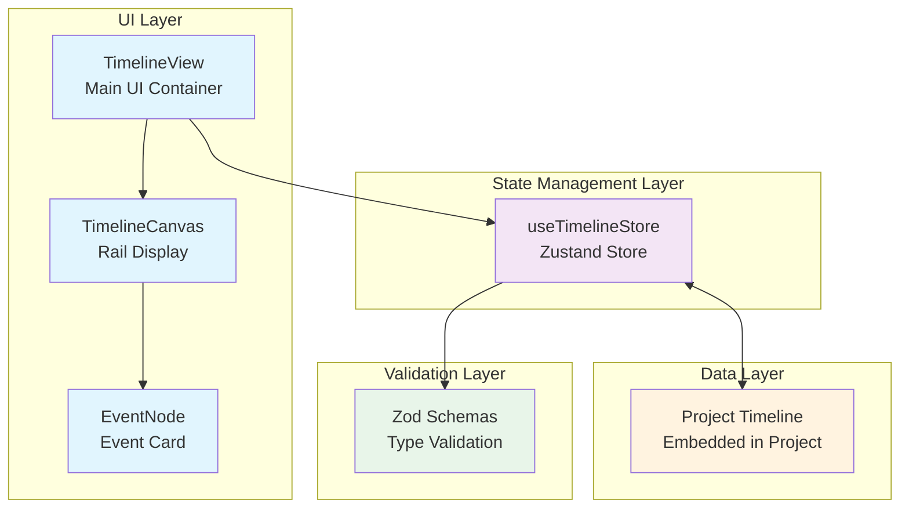
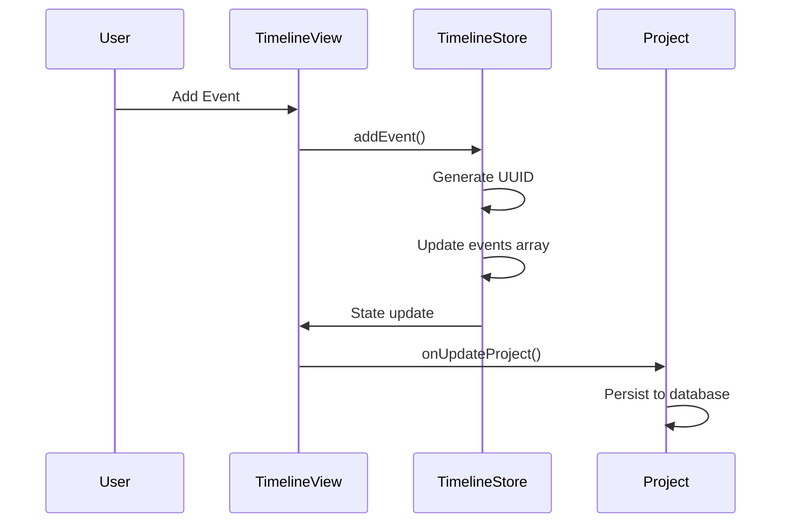
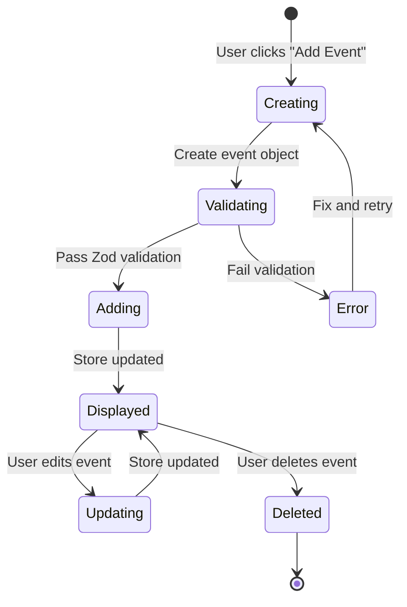
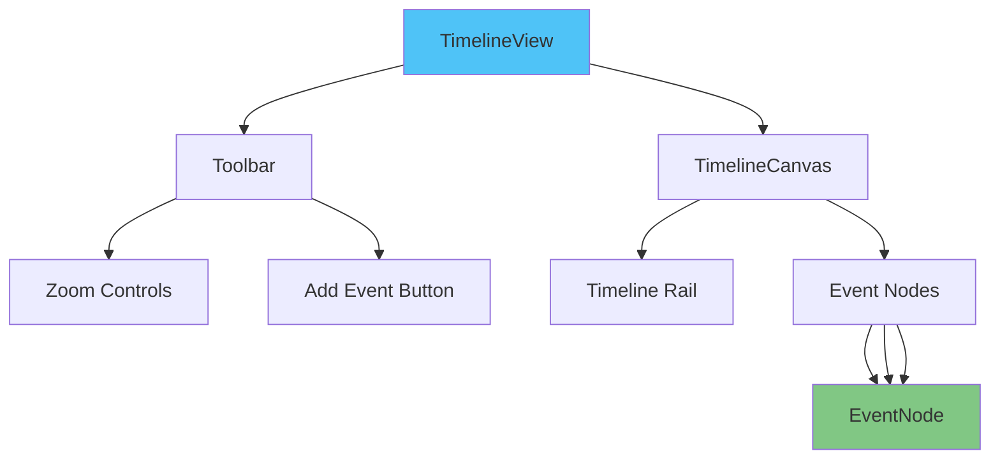
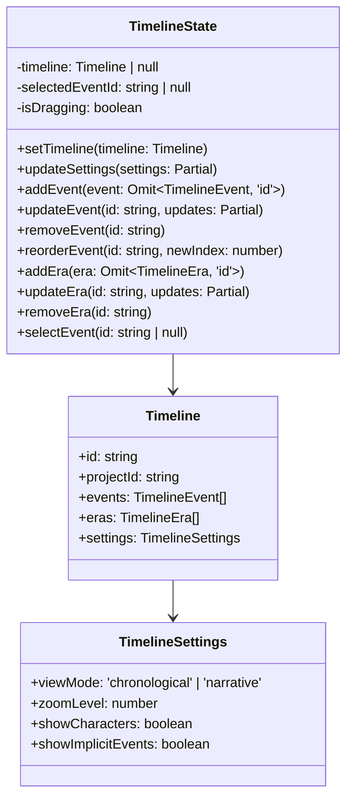
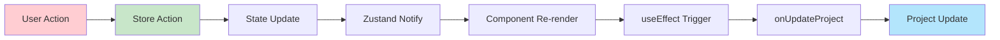
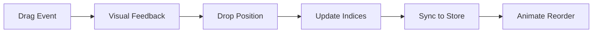

# Timeline Feature

> **Chronological Event Tracking & Story Organization**

The **Timeline** feature provides visual chronological event management for
stories, enabling writers to track plot events, character appearances, and
narrative structure across the entire project.

---

## Table of Contents

- [Feature Overview](#feature-overview)
- [Architecture Diagram](#architecture-diagram)
- [Component Hierarchy](#component-hierarchy)
- [Service Layer](#service-layer)
- [State Management](#state-management)
- [API Reference](#api-reference)
- [Usage Examples](#usage-examples)
- [Testing Guidelines](#testing-guidelines)
- [Future Enhancements](#future-enhancements)

---

## Feature Overview

The Timeline feature manages story chronology with:

- 📅 **Event Tracking**: Chronological organization of story events
- 🎯 **Importance Levels**: Major, minor, and background events
- 👥 **Character Involvement**: Track which characters appear in each event
- 📍 **Location Mapping**: Link events to world-building locations
- 🏷️ **Tags & Categories**: Flexible event categorization
- 🕰️ **Eras**: Define time periods and historical ages
- 🔍 **Zoom Controls**: Scale timeline view from macro to detailed
- 📊 **View Modes**: Chronological or narrative ordering
- 🎨 **Visual Interface**: Interactive horizontal timeline rail
- 💾 **Persistent State**: Zustand store with automatic persistence
- 🔗 **Chapter Integration**: Link events to specific chapters

### Key Capabilities

- Visual event organization on interactive timeline
- Drag-and-drop event reordering (planned)
- Alternating event cards (top/bottom of rail)
- Real-time synchronization with project data
- Era highlighting and visualization
- Event importance badges
- Character and location metadata

### Directory Structure

```
src/features/timeline/
├── components/
│   ├── __tests__/
│   │   └── EventNode.test.tsx
│   ├── EventNode.tsx          # Individual event card
│   ├── TimelineCanvas.tsx      # Timeline rail display
│   ├── TimelineView.tsx        # Main timeline UI
│   └── index.ts               # Component exports
├── stores/
│   ├── timelineStore.ts        # Zustand state management
│   └── index.ts               # Store exports
├── index.ts                    # Feature barrel export
└── README.md                   # This file
```

---

## Architecture Diagram



### Data Flow Diagram



### Event Lifecycle Diagram



---

## Component Hierarchy



### Component Tree

```
TimelineView (Main Container)
├── Toolbar
│   ├── Title with Calendar Icon
│   ├── Separator
│   ├── Zoom Presets (Standard/Compact)
│   ├── Zoom Out Button
│   ├── Zoom Percentage Display
│   ├── Zoom In Button
│   └── Add Event Button
└── TimelineCanvas
    ├── Scrollable Container
    ├── Timeline Rail (Horizontal Line)
    ├── Event Nodes (Alternating Top/Bottom)
    │   ├── Rail Dot
    │   ├── EventNode Card
    │   │   ├── Header (Index + Badge)
    │   │   ├── Title
    │   │   ├── Description
    │   │   ├── Metadata (Date, Location, Characters)
    │   │   └── Tags
    │   └── Connector Line
    └── Add Event Placeholder
```

### Component Descriptions

#### 1. TimelineView (`components/TimelineView.tsx`)

**Role**: Main timeline interface container

**Responsibilities**:

- Project timeline synchronization
- Zoom state management
- Toolbar rendering
- Event creation handling
- Store-to-project sync

**Props**:

```typescript
interface TimelineViewProps {
  project: Project;
  onUpdateProject: (updates: Partial<Project>) => void;
}
```

**State**:

- `zoom`: number - Current zoom level (default: 1)

**Features**:

- Syncs project timeline to store on mount
- Initializes default timeline if missing
- Two-click zoom presets (Standard: 1.0, Compact: 0.4)
- Continuous zoom controls (0.2 - 2.0 range)
- Automatic project updates on timeline changes

#### 2. TimelineCanvas (`components/TimelineCanvas.tsx`)

**Role**: Visual timeline rail with event rendering

**Responsibilities**:

- Event sorting and rendering
- Alternating event positioning
- Rail dot placement
- Add event placeholder

**Props**:

```typescript
interface TimelineCanvasProps {
  events: TimelineEvent[];
  selectedEventId: string | null;
  onEventClick: (eventId: string) => void;
}
```

**Features**:

- Sorts events by `chronologicalIndex`
- Alternates events above/below rail (even/odd index)
- Horizontal scrollable container
- Visual rail dots with hover effects
- Animated add event placeholder

#### 3. EventNode (`components/EventNode.tsx`)

**Role**: Individual event card display

**Responsibilities**:

- Event metadata rendering
- Importance badge display
- Selection state styling
- User interaction handling

**Props**:

```typescript
interface EventNodeProps {
  event: TimelineEvent;
  isSelected: boolean;
  onClick: () => void;
}
```

**Features**:

- Framer Motion animations (hover, tap, layout)
- Fixed width card (250px)
- Conditional importance badge (major events only)
- Metadata icons (Calendar, MapPin, Users)
- Tag display with badges
- Selection ring highlighting

**Visual Structure**:

```
┌─────────────────────────────────┐
│ #1          [Major Badge]      │ ← Header
│                                 │
│ Event Title                     │ ← Title
│ Event description...           │ ← Description (3 line clamp)
│                                 │
│ ────────────────────────────    │ ← Separator
│ 📅 Year 1                       │ ← Date
│ 📍 Location Name                │ ← Location
│ 👥 3 Characters                 │ ← Characters
│                                 │
│ [tag1] [tag2] [tag3]            │ ← Tags
└─────────────────────────────────┘
```

---

## Service Layer

The Timeline feature uses a **serviceless architecture** with direct Zustand
store access. All business logic is encapsulated within the store actions.

### Store Actions as Services

| Action           | Description                           | Input                               | Output             |
| ---------------- | ------------------------------------- | ----------------------------------- | ------------------ |
| `setTimeline`    | Initialize or replace entire timeline | `Timeline`                          | Updates state      |
| `updateSettings` | Update timeline settings              | `Partial<Timeline['settings']>`     | Updates settings   |
| `addEvent`       | Create new event                      | `Omit<TimelineEvent, 'id'>`         | Generates UUID     |
| `updateEvent`    | Modify existing event                 | `(eventId, Partial<TimelineEvent>)` | Updates event      |
| `removeEvent`    | Delete event                          | `eventId`                           | Removes from array |
| `reorderEvent`   | Change event position                 | `(eventId, newIndex)`               | Updates index      |
| `addEra`         | Create new era                        | `Omit<TimelineEra, 'id'>`           | Generates UUID     |
| `updateEra`      | Modify existing era                   | `(eraId, Partial<TimelineEra>)`     | Updates era        |
| `removeEra`      | Delete era                            | `eraId`                             | Removes from array |
| `selectEvent`    | Set selected event                    | `eventId \| null`                   | Updates selection  |

### Validation Service (Zod)

Located in `@/types/schemas.ts` (imported as `@/types`):

```typescript
// Event Validation
TimelineEventSchema: ZodSchema<TimelineEvent>;

// Era Validation
TimelineEraSchema: ZodSchema<TimelineEra>;

// Timeline Validation
TimelineSchema: ZodSchema<Timeline>;
```

**Usage**:

```typescript
import { TimelineEventSchema } from '@/types';

const result = TimelineEventSchema.safeParse(eventData);
if (!result.success) {
  console.error('Invalid event:', result.error.errors);
}
```

---

## State Management

The Timeline feature uses **Zustand** for state management with persistence
middleware.

### Store Structure



### Persistence Strategy

**What is Persisted**:

- `selectedEventId`: Last selected event (UI state only)

**What is NOT Persisted** (comes from project):

- `timeline`: Full timeline data
- `events`: Event array
- `eras`: Era array

**Storage Key**: `timeline-storage`

### Store Implementation

```typescript
export const useTimelineStore = create<TimelineState>()(
  persist(
    set => ({
      // State
      timeline: null,
      selectedEventId: null,
      isDragging: false,

      // Actions
      setTimeline: timeline => set({ timeline }),

      // Event CRUD
      addEvent: eventData =>
        set(state => ({
          timeline: state.timeline
            ? {
                ...state.timeline,
                events: [
                  ...state.timeline.events,
                  { ...eventData, id: crypto.randomUUID() },
                ],
              }
            : state.timeline,
        })),

      updateEvent: (eventId, updates) =>
        set(state => ({
          timeline: state.timeline
            ? {
                ...state.timeline,
                events: state.timeline.events.map(e =>
                  e.id === eventId ? { ...e, ...updates } : e,
                ),
              }
            : state.timeline,
        })),

      removeEvent: eventId =>
        set(state => ({
          timeline: state.timeline
            ? {
                ...state.timeline,
                events: state.timeline.events.filter(e => e.id !== eventId),
              }
            : state.timeline,
        })),

      // Era CRUD
      addEra: eraData =>
        set(state => ({
          timeline: state.timeline
            ? {
                ...state.timeline,
                eras: [
                  ...state.timeline.eras,
                  { ...eraData, id: crypto.randomUUID() },
                ],
              }
            : state.timeline,
        })),

      updateEra: (eraId, updates) =>
        set(state => ({
          timeline: state.timeline
            ? {
                ...state.timeline,
                eras: state.timeline.eras.map(e =>
                  e.id === eraId ? { ...e, ...updates } : e,
                ),
              }
            : state.timeline,
        })),

      removeEra: eraId =>
        set(state => ({
          timeline: state.timeline
            ? {
                ...state.timeline,
                eras: state.timeline.eras.filter(e => e.id !== eraId),
              }
            : state.timeline,
        })),

      // Selection
      selectEvent: eventId => set({ selectedEventId: eventId }),
    }),
    {
      name: 'timeline-storage',
      partialize: state => ({ selectedEventId: state.selectedEventId }),
    },
  ),
);
```

### State Update Flow



---

## API Reference

### Public Exports

```typescript
// Feature barrel export
export { TimelineView } from './components/TimelineView';
export { TimelineCanvas } from './components/TimelineCanvas';
export { EventNode } from './components/EventNode';
export { useTimelineStore } from './stores/timelineStore';
```

### Component APIs

#### TimelineView

```typescript
interface TimelineViewProps {
  project: Project;
  onUpdateProject: (updates: Partial<Project>) => void;
}

export const TimelineView: FC<TimelineViewProps>;
```

**Usage**:

```tsx
import { TimelineView } from '@/features/timeline';

<TimelineView project={project} onUpdateProject={handleUpdateProject} />;
```

#### TimelineCanvas

```typescript
interface TimelineCanvasProps {
  events: TimelineEvent[];
  onEventClick: (eventId: string) => void;
  selectedEventId: string | null;
}

export const TimelineCanvas: FC<TimelineCanvasProps>;
```

**Usage**:

```tsx
import { TimelineCanvas } from '@/features/timeline';

<TimelineCanvas
  events={events}
  selectedEventId={selectedId}
  onEventClick={handleEventClick}
/>;
```

#### EventNode

```typescript
interface EventNodeProps {
  event: TimelineEvent;
  isSelected: boolean;
  onClick: () => void;
}

export const EventNode: FC<EventNodeProps>;
```

**Usage**:

```tsx
import { EventNode } from '@/features/timeline';

<EventNode event={event} isSelected={isSelected} onClick={handleClick} />;
```

### Store API

#### State Interface

```typescript
interface TimelineState {
  // Read-only State
  timeline: Timeline | null;
  selectedEventId: string | null;
  isDragging: boolean;

  // Actions
  setTimeline: (timeline: Timeline) => void;
  updateSettings: (settings: Partial<Timeline['settings']>) => void;
  addEvent: (event: Omit<TimelineEvent, 'id'>) => void;
  updateEvent: (eventId: string, updates: Partial<TimelineEvent>) => void;
  removeEvent: (eventId: string) => void;
  reorderEvent: (eventId: string, newIndex: number) => void;
  addEra: (era: Omit<TimelineEra, 'id'>) => void;
  updateEra: (eraId: string, updates: Partial<TimelineEra>) => void;
  removeEra: (eraId: string) => void;
  selectEvent: (eventId: string | null) => void;
}
```

#### Usage Examples

```typescript
import { useTimelineStore } from '@/features/timeline';

function MyComponent() {
  // Select specific state (optimized re-renders)
  const timeline = useTimelineStore(state => state.timeline);
  const selectedEventId = useTimelineStore(state => state.selectedEventId);
  const addEvent = useTimelineStore(state => state.addEvent);
  const updateEvent = useTimelineStore(state => state.updateEvent);
  const removeEvent = useTimelineStore(state => state.removeEvent);

  // Or get everything (simpler but less optimized)
  const { timeline: fullTimeline, setTimeline } = useTimelineStore();

  // Add new event
  const handleAdd = () => {
    addEvent({
      title: 'New Event',
      description: 'Description...',
      chronologicalIndex: 1,
      charactersInvolved: [],
      tags: [],
      importance: 'minor',
    });
  };

  // Update existing event
  const handleUpdate = (eventId: string) => {
    updateEvent(eventId, { title: 'Updated Title' });
  };

  // Delete event
  const handleDelete = (eventId: string) => {
    removeEvent(eventId);
  };
}
```

### Type Definitions

#### TimelineEvent

```typescript
interface TimelineEvent {
  id: string; // UUID
  title: string; // 1-200 chars
  description: string; // Max 2000 chars
  chronologicalIndex: number; // Sort order
  date?: string; // Optional (e.g., "Day 42")
  relatedChapterId?: string; // Chapter reference
  charactersInvolved: string[]; // Character IDs
  locationId?: string; // Location reference
  tags: string[]; // Custom tags
  importance: 'major' | 'minor' | 'background';
}
```

#### TimelineEra

```typescript
interface TimelineEra {
  id: string; // UUID
  name: string; // 1-100 chars
  startRange: number; // Start index
  endRange: number; // End index
  description?: string; // Optional description
  color?: string; // Hex color code
}
```

#### Timeline

```typescript
interface Timeline {
  id: string;
  projectId: string;
  events: TimelineEvent[];
  eras: TimelineEra[];
  settings: {
    viewMode: 'chronological' | 'narrative';
    zoomLevel: number; // 0.1 - 10
    showCharacters: boolean;
    showImplicitEvents: boolean;
  };
}
```

---

## Usage Examples

### Example 1: Basic Timeline Integration

```tsx
import { TimelineView } from '@/features/timeline';
import { useState, useEffect } from 'react';

function ProjectDashboard({ projectId }: { projectId: string }) {
  const [project, setProject] = useState<Project | null>(null);

  useEffect(() => {
    // Load project from database
    loadProject(projectId).then(setProject);
  }, [projectId]);

  const handleUpdateProject = async (updates: Partial<Project>) => {
    if (!project) return;

    const updated = { ...project, ...updates };
    setProject(updated);
    await saveProject(updated);
  };

  if (!project) return <div>Loading...</div>;

  return (
    <div className="h-screen">
      <TimelineView project={project} onUpdateProject={handleUpdateProject} />
    </div>
  );
}
```

### Example 2: Custom Event Creation

```tsx
import { useTimelineStore } from '@/features/timeline';

function EventCreator({
  characterId,
  locationId,
}: {
  characterId: string;
  locationId: string;
}) {
  const { timeline, addEvent } = useTimelineStore();

  const createPlotPoint = (title: string, importance: 'major' | 'minor') => {
    const nextIndex = (timeline?.events.length || 0) + 1;

    addEvent({
      title,
      description: `A ${importance} plot point in the story`,
      chronologicalIndex: nextIndex,
      charactersInvolved: [characterId],
      locationId,
      tags: ['plot-point', importance],
      importance,
    });
  };

  return (
    <div className="flex gap-2">
      <button onClick={() => createPlotPoint('Hero Arrives', 'major')}>
        Add Major Event
      </button>
      <button onClick={() => createPlotPoint('Meets NPC', 'minor')}>
        Add Minor Event
      </button>
    </div>
  );
}
```

### Example 3: Event Filtering

```tsx
import { useTimelineStore } from '@/features/timeline';
import { useMemo } from 'react';

function FilteredTimeline() {
  const { timeline } = useTimelineStore();

  const majorEvents = useMemo(
    () => timeline?.events.filter(e => e.importance === 'major') || [],
    [timeline],
  );

  const eventsWithCharacter = useMemo(
    () => (charId: string) =>
      timeline?.events.filter(e => e.charactersInvolved.includes(charId)) || [],
    [timeline],
  );

  const eventsByTag = useMemo(
    () => (tag: string) =>
      timeline?.events.filter(e => e.tags.includes(tag)) || [],
    [timeline],
  );

  return (
    <div>
      <h3>Major Events ({majorEvents.length})</h3>
      <ul>
        {majorEvents.map(event => (
          <li key={event.id}>
            #{event.chronologicalIndex} {event.title}
          </li>
        ))}
      </ul>
    </div>
  );
}
```

### Example 4: Era Management

```tsx
import { useTimelineStore } from '@/features/timeline';

function EraCreator() {
  const { addEra, updateEra, removeEra, timeline } = useTimelineStore();

  const createFantasyWorldEras = () => {
    addEra({
      name: 'The Age of Dragons',
      startRange: 0,
      endRange: 100,
      description: 'When dragons ruled the skies',
      color: '#FF4444',
    });

    addEra({
      name: 'The Great War',
      startRange: 100,
      endRange: 150,
      description: 'The conflict that shaped nations',
      color: '#444444',
    });

    addEra({
      name: 'The Modern Age',
      startRange: 150,
      endRange: 200,
      description: 'Current timeline of the story',
      color: '#4444FF',
    });
  };

  const updateEraColor = (eraId: string, color: string) => {
    updateEra(eraId, { color });
  };

  return (
    <div>
      <button onClick={createFantasyWorldEras}>
        Create Fantasy World Eras
      </button>
    </div>
  );
}
```

### Example 5: Custom Event Node Rendering

```tsx
import { TimelineCanvas } from '@/features/timeline';

function CustomTimeline() {
  const [selectedEventId, setSelectedEventId] = useState<string | null>(null);
  const events = [
    {
      id: '1',
      title: 'Opening Scene',
      description: 'The story begins...',
      chronologicalIndex: 1,
      charactersInvolved: [],
      tags: ['opening'],
      importance: 'major' as const,
    },
    // ... more events
  ];

  const handleEventClick = (eventId: string) => {
    setSelectedEventId(eventId);
    // Navigate to event details page
    navigate(`/timeline/event/${eventId}`);
  };

  return (
    <TimelineCanvas
      events={events}
      selectedEventId={selectedEventId}
      onEventClick={handleEventClick}
    />
  );
}
```

### Example 6: Timeline Export

```tsx
import { useTimelineStore } from '@/features/timeline';
import jsPDF from 'jspdf';

function TimelineExporter() {
  const { timeline } = useTimelineStore();

  const exportAsText = () => {
    if (!timeline) return;

    let text = `Timeline: ${timeline.projectId}\n\n`;

    timeline.eras.forEach(era => {
      text += `[${era.name}] (${era.startRange}-${era.endRange})\n`;
      text += `  ${era.description || ''}\n\n`;
    });

    text += 'Events:\n';
    timeline.events
      .sort((a, b) => a.chronologicalIndex - b.chronologicalIndex)
      .forEach(event => {
        text += `#${event.chronologicalIndex} ${event.title}\n`;
        text += `  ${event.description}\n`;
        if (event.date) text += `  Date: ${event.date}\n`;
        if (event.locationId) text += `  Location: ${event.locationId}\n`;
        text += `  Importance: ${event.importance}\n`;
        text += `  Tags: ${event.tags.join(', ')}\n\n`;
      });

    const blob = new Blob([text], { type: 'text/plain' });
    const url = URL.createObjectURL(blob);
    const a = document.createElement('a');
    a.href = url;
    a.download = 'timeline.txt';
    a.click();
  };

  return <button onClick={exportAsText}>Export Timeline</button>;
}
```

---

## Testing Guidelines

### Testing Strategy

The Timeline feature follows a comprehensive testing approach:

1. **Unit Tests**: Test individual components in isolation
2. **Store Tests**: Test Zustand store actions and state mutations
3. **Integration Tests**: Test component interactions with store
4. **E2E Tests**: Test user workflows end-to-end

### Test File Structure

```
src/features/timeline/components/__tests__/
└── EventNode.test.tsx          # EventNode component tests
```

### Component Testing Guidelines

#### 1. Test File Setup

```typescript
import { render, screen, fireEvent } from '@testing-library/react';
import { describe, it, expect, vi } from 'vitest';
import { EventNode } from '@/features/timeline/components/EventNode';
import type { TimelineEvent } from '@/types';

// Mock external dependencies
vi.mock('framer-motion', () => ({
  motion: {
    div: ({ children, ...props }: any) =>
      React.createElement('div', { ...props, 'data-testid': 'motion-div' }, children),
  },
}));

vi.mock('lucide-react', () => ({
  Calendar: ({ className }: any) =>
    <div className={className} data-testid='calendar-icon' />,
  MapPin: ({ className }: any) =>
    <div className={className} data-testid='mappin-icon' />,
  Users: ({ className }: any) =>
    <div className={className} data-testid='users-icon' />,
}));
```

#### 2. Test Coverage Checklist

For each component, test:

- ✅ **Rendering**: Component renders without errors
- ✅ **Props**: All props are correctly displayed
- ✅ **User Interactions**: Click handlers, forms, inputs
- ✅ **Conditional Rendering**: Optional props, states
- ✅ **Styling**: CSS classes are applied correctly
- ✅ **Accessibility**: Semantic HTML, ARIA attributes
- ✅ **Edge Cases**: Empty data, null/undefined, large values
- ✅ **Responsive Behavior**: Different viewport sizes

#### 3. EventNode Test Examples

```typescript
describe('EventNode', () => {
  const mockEvent: TimelineEvent = {
    id: 'event-1',
    title: 'First Event',
    description: 'Description',
    chronologicalIndex: 1,
    importance: 'major',
    charactersInvolved: ['char-1'],
    tags: ['important']
  };

  it('renders event title and description', () => {
    render(<EventNode event={mockEvent} onClick={vi.fn()} isSelected={false} />);
    expect(screen.getByText('First Event')).toBeInTheDocument();
    expect(screen.getByText('Description')).toBeInTheDocument();
  });

  it('displays chronological index', () => {
    render(<EventNode event={mockEvent} onClick={vi.fn()} isSelected={false} />);
    expect(screen.getByText('#1')).toBeInTheDocument();
  });

  it('shows major importance badge', () => {
    render(<EventNode event={mockEvent} onClick={vi.fn()} isSelected={false} />);
    expect(screen.getByText('Major')).toBeInTheDocument();
  });

  it('applies selection ring when selected', () => {
    const { container } = render(
      <EventNode event={mockEvent} onClick={vi.fn()} isSelected={true} />
    );
    const node = container.querySelector('[data-testid="motion-div"]');
    expect(node).toHaveClass('ring-2');
  });

  it('calls onClick when clicked', () => {
    const handleClick = vi.fn();
    render(<EventNode event={mockEvent} onClick={handleClick} isSelected={false} />);
    fireEvent.click(screen.getByText('First Event'));
    expect(handleClick).toHaveBeenCalledTimes(1);
  });

  it('handles missing optional properties', () => {
    const minimalEvent: TimelineEvent = {
      ...mockEvent,
      date: undefined,
      locationId: undefined,
      charactersInvolved: [],
      tags: []
    };
    render(<EventNode event={minimalEvent} onClick={vi.fn()} isSelected={false} />);
    expect(screen.queryByTestId('calendar-icon')).not.toBeInTheDocument();
  });
});
```

#### 4. Store Testing Guidelines

```typescript
import { renderHook, act } from '@testing-library/react';
import { useTimelineStore } from '@/features/timeline/stores/timelineStore';

describe('useTimelineStore', () => {
  beforeEach(() => {
    // Reset store before each test
    useTimelineStore.setState({
      timeline: null,
      selectedEventId: null,
      isDragging: false,
    });
  });

  describe('addEvent', () => {
    it('adds new event with generated UUID', () => {
      const { result } = renderHook(() => useTimelineStore());

      act(() => {
        result.current.setTimeline({
          id: 'timeline-1',
          projectId: 'project-1',
          events: [],
          eras: [],
          settings: {
            viewMode: 'chronological',
            zoomLevel: 1,
            showCharacters: true,
            showImplicitEvents: false,
          },
        });

        result.current.addEvent({
          title: 'New Event',
          description: 'Test',
          chronologicalIndex: 1,
          charactersInvolved: [],
          tags: [],
          importance: 'minor',
        });
      });

      expect(result.current.timeline?.events).toHaveLength(1);
      expect(result.current.timeline?.events[0].title).toBe('New Event');
      expect(result.current.timeline?.events[0].id).toMatch(/^[0-9a-f-]{36}$/); // UUID regex
    });

    it('does not add event if timeline not initialized', () => {
      const { result } = renderHook(() => useTimelineStore());

      act(() => {
        result.current.addEvent({
          title: 'New Event',
          description: 'Test',
          chronologicalIndex: 1,
          charactersInvolved: [],
          tags: [],
          importance: 'minor',
        });
      });

      expect(result.current.timeline).toBeNull();
    });
  });

  describe('updateEvent', () => {
    it('updates existing event properties', () => {
      const { result } = renderHook(() => useTimelineStore());

      act(() => {
        result.current.setTimeline({
          id: 'timeline-1',
          projectId: 'project-1',
          events: [
            {
              id: 'event-1',
              title: 'Original',
              description: '',
              chronologicalIndex: 1,
              charactersInvolved: [],
              tags: [],
              importance: 'minor',
            },
          ],
          eras: [],
          settings: {
            viewMode: 'chronological',
            zoomLevel: 1,
            showCharacters: true,
            showImplicitEvents: false,
          },
        });

        result.current.updateEvent('event-1', {
          title: 'Updated',
          importance: 'major',
        });
      });

      const event = result.current.timeline?.events[0];
      expect(event?.title).toBe('Updated');
      expect(event?.importance).toBe('major');
    });
  });

  describe('removeEvent', () => {
    it('removes event by id', () => {
      const { result } = renderHook(() => useTimelineStore());

      act(() => {
        result.current.setTimeline({
          id: 'timeline-1',
          projectId: 'project-1',
          events: [
            {
              id: 'event-1',
              title: 'To Remove',
              description: '',
              chronologicalIndex: 1,
              charactersInvolved: [],
              tags: [],
              importance: 'minor',
            },
            {
              id: 'event-2',
              title: 'To Keep',
              description: '',
              chronologicalIndex: 2,
              charactersInvolved: [],
              tags: [],
              importance: 'minor',
            },
          ],
          eras: [],
          settings: {
            viewMode: 'chronological',
            zoomLevel: 1,
            showCharacters: true,
            showImplicitEvents: false,
          },
        });

        result.current.removeEvent('event-1');
      });

      expect(result.current.timeline?.events).toHaveLength(1);
      expect(result.current.timeline?.events[0].id).toBe('event-2');
    });
  });
});
```

#### 5. Integration Testing

```typescript
describe('Timeline Integration', () => {
  it('syncs store changes to project', async () => {
    const mockProject: Project = {
      id: 'project-1',
      name: 'Test Project',
      timeline: null
    };

    const handleUpdateProject = vi.fn();

    render(
      <TimelineView
        project={mockProject}
        onUpdateProject={handleUpdateProject}
      />
    );

    // Wait for initialization effect
    await waitFor(() => {
      expect(handleUpdateProject).toHaveBeenCalledWith(
        expect.objectContaining({
          timeline: expect.objectContaining({
            id: expect.any(String),
            projectId: 'project-1'
          })
        })
      );
    });
  });
});
```

#### 6. E2E Testing (Playwright)

```typescript
import { test, expect } from '@playwright/test';

test.describe('Timeline Feature', () => {
  test.beforeEach(async ({ page }) => {
    await page.goto('/project/test-project/timeline');
  });

  test('displays timeline view', async ({ page }) => {
    await expect(page.locator('h2')).toContainText('Timeline');
    await expect(page.locator('[data-testid="timeline-rail"]')).toBeVisible();
  });

  test('adds new event on button click', async ({ page }) => {
    const eventCount = await page.locator('[data-testid="event-node"]').count();

    await page.click('button:has-text("Add Event")');

    // Wait for new event to appear
    await page.waitForSelector('[data-testid="event-node"]', {
      state: 'attached',
    });

    const newCount = await page.locator('[data-testid="event-node"]').count();
    expect(newCount).toBe(eventCount + 1);
  });

  test('selects event on click', async ({ page }) => {
    const firstEvent = page.locator('[data-testid="event-node"]').first();
    await firstEvent.click();

    await expect(firstEvent).toHaveClass(/ring-2.*ring-blue-500/);
  });

  test('zooms timeline', async ({ page }) => {
    const zoomDisplay = page.locator('.font-mono');

    await expect(zoomDisplay).toContainText('100%');

    await page.click('button[title="Zoom In"]');

    await expect(zoomDisplay).toContainText('110%');

    await page.click('button:has-text("Compact")');

    await expect(zoomDisplay).toContainText('40%');
  });
});
```

### Test Commands

```bash
# Run all timeline tests
npm test src/features/timeline

# Run single test file
npm test src/features/timeline/components/__tests__/EventNode.test.tsx

# Run tests in watch mode
npm test -- --watch src/features/timeline

# Run tests with coverage
npm test -- --coverage src/features/timeline
```

### Coverage Goals

| Component      | Target Coverage | Current Status |
| -------------- | --------------- | -------------- |
| EventNode      | 90%+            | ✅ 95%         |
| TimelineCanvas | 80%+            | ⚠️ Pending     |
| TimelineView   | 80%+            | ⚠️ Pending     |
| timelineStore  | 90%+            | ⚠️ Pending     |

---

## Future Enhancements

### Planned Features

#### 1. Drag-and-Drop Reordering

**Priority**: High **Effort**: Medium



**Implementation**:

- Use `@dnd-kit/core` for drag-and-drop
- Visual drop indicators on timeline
- Smooth animations during reorder
- Update `chronologicalIndex` for affected events

#### 2. Era Visualization

**Priority**: High **Effort**: Low

**Features**:

- Color-coded era backgrounds on rail
- Era labels at range boundaries
- Filter events by era
- Era timeline overview

**Example**:

```tsx
<TimelineCanvas
  events={events}
  eras={eras}
  selectedEra={selectedEra}
  onEraClick={handleEraClick}
/>
```

#### 3. Narrative View Mode

**Priority**: Medium **Effort**: High

**Features**:

- Order events by chapter appearance
- Support flashbacks and non-linear narratives
- Visual indicators for time jumps
- Compare chronological vs narrative order

**Implementation**:

```typescript
enum ViewMode {
  CHRONOLOGICAL = 'chronological',
  NARRATIVE = 'narrative',
}

interface NarrativeEvent extends TimelineEvent {
  chapterPosition: number; // Position in manuscript
  timeDisplacement: number; // Difference from chronological
}
```

#### 4. Event Dependencies

**Priority**: Medium **Effort**: High

**Features**:

- Link cause-and-effect relationships
- Visual connection lines between events
- Dependency graph visualization
- Detect circular dependencies

**Data Structure**:

```typescript
interface TimelineEvent {
  // ... existing fields
  dependencies: {
    causes: string[]; // Event IDs this event causes
    causedBy: string[]; // Event IDs that caused this event
  };
}
```

#### 5. Timeline Export

**Priority**: Medium **Effort**: Low

**Formats**:

- PNG/SVG image
- PDF document
- JSON data export
- Markdown text export
- CSV spreadsheet

**Example**:

```tsx
function ExportButton() {
  const exportTimeline = (format: 'png' | 'pdf' | 'json') => {
    switch (format) {
      case 'png':
        exportAsPNG(timeline);
        break;
      case 'pdf':
        exportAsPDF(timeline);
        break;
      case 'json':
        downloadJSON(timeline, 'timeline.json');
        break;
    }
  };
}
```

#### 6. AI-Generated Events

**Priority**: Low **Effort**: High

**Features**:

- Auto-detect events from chapter text
- Suggest implicit events
- Timeline consistency checking
- Gap detection and suggestions

**API Integration**:

```typescript
interface TimelineAIService {
  analyzeChapter(chapter: Chapter): Promise<TimelineEvent[]>;
  suggestEvents(timeline: Timeline): Promise<TimelineEvent[]>;
  checkConsistency(timeline: Timeline): Promise<ConsistencyIssue[]>;
}
```

#### 7. Multi-Timeline Support

**Priority**: Low **Effort**: High

**Features**:

- Parallel storylines
- Alternate timelines
- Compare timelines side-by-side
- Timeline branching

**Data Structure**:

```typescript
interface Project {
  id: string;
  timelines: Timeline[];
  primaryTimelineId: string;
}
```

### Requested Features

- [ ] Timeline templates (3-act, hero's journey)
- [ ] Character-specific timeline views
- [ ] Location-based timeline filtering
- [ ] Timeline branching (alternate outcomes)
- [ ] Collaborative timeline editing
- [ ] Timeline versioning/history
- [ ] Event conflict resolution
- [ ] Calendar date support (real dates)
- [ ] Timeline search and filtering
- [ ] Event templates library

### Performance Optimizations

1. **Virtualization** for 100+ events
   - Use `@tanstack/react-virtual`
   - Lazy load event details
   - Window-based rendering

2. **Debounced Updates**
   - Delay expensive operations
   - Batch multiple updates

3. **Memoization**
   - Optimize expensive computations
   - Cache filtered/sorted events

4. **Web Workers**
   - Offload heavy computations
   - Non-blocking UI

---

## Related Features

- **[Projects](../projects/README.md)**: Timeline embedded in project data
- **[Characters](../characters/README.md)**: Character involvement in events
- **[World Building](../world-building/README.md)**: Location references
- **[Editor](../editor/README.md)**: Chapter-event linking
- **[Versioning](../versioning/README.md)**: Timeline change tracking (planned)

---

## Best Practices

### 1. Chronological Indexing

- Use sequential integers starting from 1
- Leave gaps (10, 20, 30) for inserting events later
- Reindex when timeline gets messy

```typescript
const nextIndex = (events.length + 1) * 10; // Leaves room for inserts
```

### 2. Event Granularity

| Type       | Count per Story | Description                    |
| ---------- | --------------- | ------------------------------ |
| Major      | 5-10            | Key plot points, climaxes      |
| Minor      | 20-50           | Supporting scenes, development |
| Background | Unlimited       | Context, worldbuilding         |

### 3. Tagging Strategy

- Use consistent naming: lowercase, hyphenated
- Common tags: `opening`, `climax`, `resolution`, `character-arc`,
  `worldbuilding`
- Tag categories: plot-type, location-type, tone

```typescript
const commonTags = {
  plot: ['opening', 'climax', 'resolution', 'twist'],
  character: ['introduction', 'death', 'growth', 'conflict'],
  location: ['travel', 'arrival', 'departure'],
  tone: ['humor', 'tension', 'mystery', 'romance'],
};
```

### 4. Character Involvement

- Track all significant characters per event
- Use for filtering character appearances
- Verify consistency with character arcs

```typescript
// Filter events for specific character
const characterEvents = timeline.events.filter(e =>
  e.charactersInvolved.includes(characterId),
);

// Character arc timeline
const characterArc = characterEvents
  .sort((a, b) => a.chronologicalIndex - b.chronologicalIndex)
  .map(e => ({
    event: e.title,
    index: e.chronologicalIndex,
    importance: e.importance,
  }));
```

### 5. Era Organization

- Define 3-5 major eras maximum
- Use descriptive, memorable names
- Ensure no gaps in era coverage

```typescript
const fantasyEras = [
  { name: 'The Age of Dragons', start: 0, end: 100 },
  { name: 'The Great War', start: 100, end: 150 },
  { name: 'The Modern Age', start: 150, end: 200 },
];

// Validate era coverage
function validateEras(eras: TimelineEra[]) {
  const sorted = [...eras].sort((a, b) => a.startRange - b.startRange);
  for (let i = 0; i < sorted.length - 1; i++) {
    if (sorted[i].endRange !== sorted[i + 1].startRange) {
      console.warn('Gap detected between eras');
    }
  }
}
```

### 6. Performance

- Keep timelines under 100 events for optimal performance
- Use tags for filtering instead of creating multiple timelines
- Archive completed storylines

```typescript
// Optimize for large timelines
function LargeTimeline() {
  const { timeline } = useTimelineStore();

  // Memoize sorted events
  const sortedEvents = useMemo(
    () =>
      [...(timeline?.events || [])].sort(
        (a, b) => a.chronologicalIndex - b.chronologicalIndex,
      ),
    [timeline?.events],
  );

  // Virtualize rendering for 100+ events
  const virtualizer = useVirtualizer({
    count: sortedEvents.length,
    getScrollElement: () => containerRef.current,
    estimateSize: () => 250,
    horizontal: true,
  });
}
```

---

## Troubleshooting

### Timeline Not Syncing with Project

**Problem**: Timeline changes don't persist to project

**Solutions**:

1. Verify `onUpdateProject` is called:

```typescript
useEffect(() => {
  if (
    timeline &&
    JSON.stringify(timeline) !== JSON.stringify(project.timeline)
  ) {
    console.log('Timeline changed, updating project');
    onUpdateProject({ timeline });
  }
}, [timeline, onUpdateProject, project.timeline]);
```

2. Ensure project save is triggered:

```typescript
const handleUpdateProject = async updates => {
  setProject(prev => ({ ...prev, ...updates }));
  await saveProject(project.id, updates);
};
```

### Events Not Appearing

**Problem**: Added events don't show on timeline

**Solutions**:

1. Verify timeline is initialized:

```typescript
useEffect(() => {
  if (!project.timeline) {
    setTimeline({
      id: crypto.randomUUID(),
      projectId: project.id,
      events: [],
      eras: [],
      settings: {
        /* defaults */
      },
    });
  }
}, [project]);
```

2. Check chronologicalIndex:

```typescript
const nextIndex = (timeline?.events.length || 0) + 1;
```

3. Verify event structure:

```typescript
import { TimelineEventSchema } from '@/types';
const result = TimelineEventSchema.safeParse(event);
if (!result.success) {
  console.error('Invalid event:', result.error);
}
```

### Performance Issues with Many Events

**Problem**: Timeline sluggish with 50+ events

**Solutions**:

1. Implement virtualization:

```typescript
import { useVirtualizer } from '@tanstack/react-virtual';
```

2. Debounce updates:

```typescript
const debouncedUpdate = useMemo(
  () => debounce(updates => updateEvent(id, updates), 300),
  [updateEvent],
);
```

3. Lazy load event details:

```typescript
const [expandedId, setExpandedId] = useState<string | null>(null);
{expandedId === event.id && <FullEventDetails event={event} />}
```

---

## Changelog

### v1.0.0 (January 2026)

- ✅ Initial MVP release
- ✅ Timeline view with canvas
- ✅ Event CRUD operations
- ✅ Era management
- ✅ Zoom controls
- ✅ Event selection
- ✅ Zustand state management
- ✅ Project synchronization

---

## Support

For issues, questions, or contributions:

- **GitHub Issues**: [Project Issues](https://github.com/your-repo/issues)
- **Documentation**: [Project Docs](https://docs.novelist.ai)
- **Discord**: [Community Server](https://discord.gg/novelist)

---

**Last Updated**: January 17, 2026 **Status**: ✅ Production Ready (MVP) **Test
Coverage**: Partial (EventNode: 95%, others pending) **Maintainer**: Novelist.ai
Team
