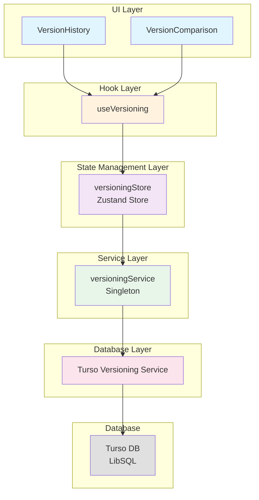
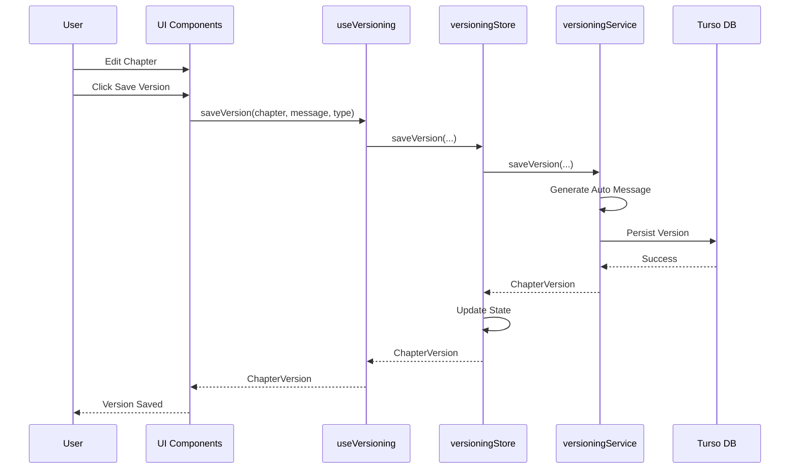
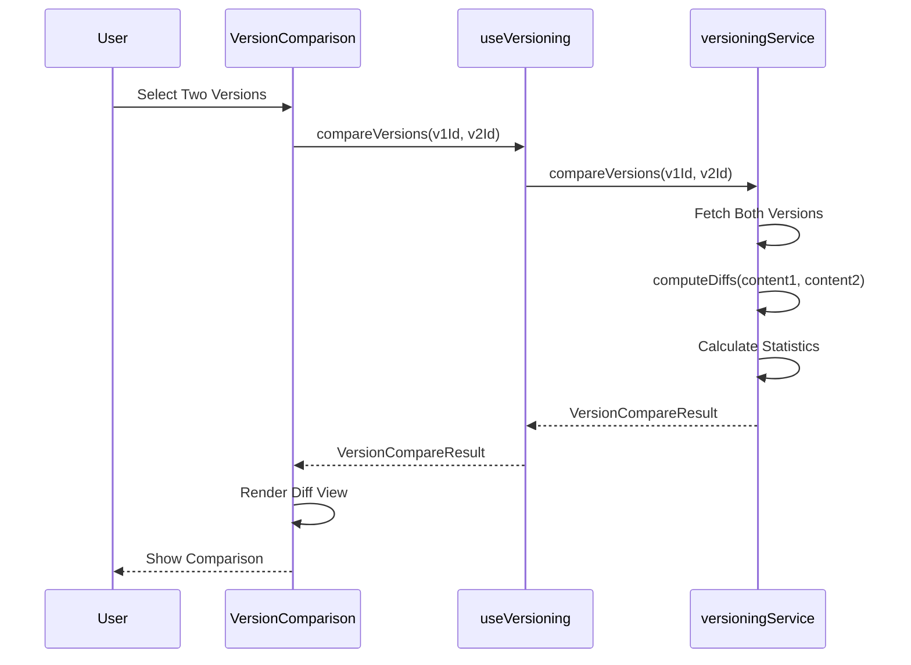
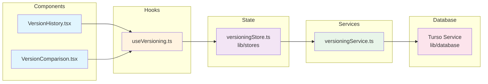
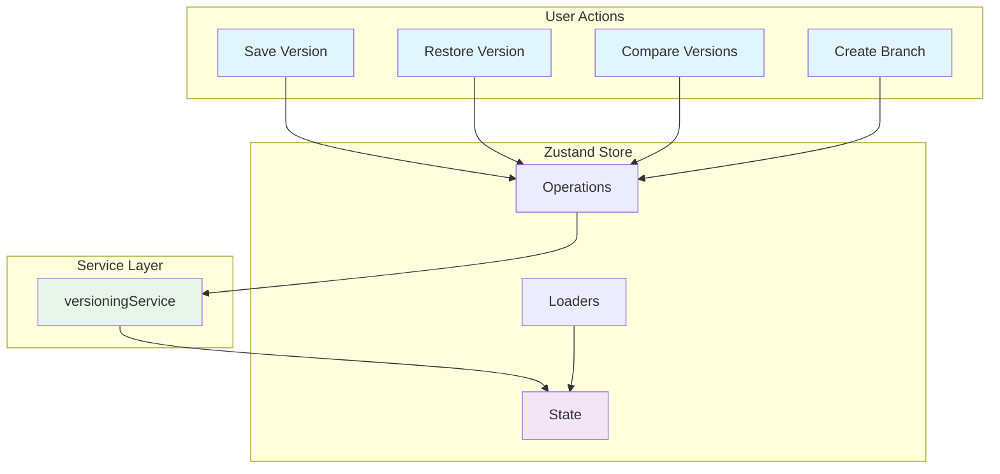

# Versioning Feature

> **Version History & Change Tracking System**

The **Versioning** feature provides comprehensive version control for chapters
and projects, enabling writers to track changes, compare versions, create
branches, and restore previous content.

---

## 1. Feature Overview

### Key Capabilities

- 📜 **Version History**: Complete timeline of all changes
- 🔍 **Version Comparison**: Line-by-line diff viewing
- 🌿 **Branching**: Create alternate versions and experiment safely
- ⏮️ **Version Restoration**: Revert to any previous state
- 🏷️ **Version Types**: Manual, auto-save, AI-generated, restore
- 🔐 **Content Hashing**: Verify version integrity
- 📊 **Change Statistics**: Word count, character count, diff counts
- 🔎 **Search & Filter**: Find specific versions quickly
- 📤 **Export**: Version history as JSON or CSV
- 💾 **Database Persistence**: Turso/LibSQL backend storage
- 🎨 **Beautiful UI**: Animated version timeline and diff viewer

### Version Types

| Type           | Purpose                                   | Auto-Generated Message                      |
| -------------- | ----------------------------------------- | ------------------------------------------- |
| `manual`       | User-initiated saves with custom messages | `Manual save: {chapter.title}`              |
| `auto`         | Automatic periodic saves                  | `Auto-saved: {chapter.title}`               |
| `ai-generated` | Track AI-generated content                | `AI generated content for: {chapter.title}` |
| `restore`      | Track version restorations                | `Restored version of: {chapter.title}`      |

---

## 2. Architecture Diagram

### System Architecture



### Version Save Flow



### Version Comparison Flow



---

## 3. Component Hierarchy

```
src/features/versioning/
├── components/
│   ├── VersionHistory.tsx          # Version timeline with filtering
│   ├── VersionComparison.tsx        # Side-by-side diff viewer
│   ├── VersionHistory.test.tsx     # Component tests
│   └── __tests__/                 # Additional tests
├── hooks/
│   ├── useVersioning.ts           # Main versioning hook
│   └── useVersioning.test.ts      # Hook tests
├── services/
│   ├── versioningService.ts       # Singleton service
│   └── __tests__/
│       └── versioningService.test.ts  # Service tests
├── types/
│   └── index.ts                   # TypeScript types
├── index.ts                       # Public API exports
└── README.md                      # This file
```

### Component Dependencies



---

## 4. Service Layer

### `versioningService` (Singleton)

**Location**: `src/features/versioning/services/versioningService.ts`

**Public API**:

```typescript
class VersioningService {
  // Lifecycle
  init(): Promise<void>;

  // Version Operations
  saveVersion(
    chapter: Chapter,
    message?: string,
    type?: ChapterVersion['type'],
  ): Promise<ChapterVersion>;

  getVersionHistory(chapterId: string): Promise<ChapterVersion[]>;
  getVersion(versionId: string): Promise<ChapterVersion | null>;

  restoreVersion(versionId: string): Promise<Chapter | null>;
  deleteVersion(versionId: string): Promise<boolean>;

  compareVersions(
    versionId1: string,
    versionId2: string,
  ): Promise<VersionCompareResult>;

  // Branch Operations
  createBranch(
    chapterId: string,
    name: string,
    description: string,
    parentVersionId: string,
  ): Promise<Branch>;

  getBranches(chapterId: string): Promise<Branch[]>;
  switchBranch(branchId: string): boolean;
  mergeBranch(sourceBranchId: string, targetBranchId: string): boolean;
  deleteBranch(branchId: string): Promise<boolean>;

  // Export Operations
  exportVersionHistory(
    chapterId: string,
    format: 'json' | 'csv',
  ): Promise<string>;
}
```

### Private Methods

- `generateAutoMessage(type, chapter)`: Generates auto-messages for non-manual
  versions
- `computeDiffs(content1, content2)`: Line-based diff algorithm
- `getLineContext(lines, index)`: Provides 3-line context around changes

### Database Integration

The service delegates to `lib/database/services/versioningService.ts`
(Turso/LibSQL) for:

- Version persistence
- Content hashing (SHA-256)
- Word/char count calculation
- Branch management

---

## 5. State Management

### Zustand Store

**Location**: `src/lib/stores/versioningStore.ts`

The versioning feature uses Zustand for state management, providing:

#### State

```typescript
interface VersioningState {
  // Data State
  versions: ChapterVersion[];
  branches: Branch[];
  currentBranch: Branch | null;

  // UI State
  isLoading: boolean;
  error: string | null;
}
```

#### Actions

```typescript
interface VersioningActions {
  // Data Loading
  loadVersionHistory: (chapterId: string) => Promise<void>;
  loadBranches: (chapterId: string) => Promise<void>;

  // Version Operations
  saveVersion: (
    chapter: Chapter,
    message?: string,
    type?: ChapterVersion['type'],
  ) => Promise<ChapterVersion>;
  restoreVersion: (versionId: string) => Promise<Chapter | null>;
  deleteVersion: (versionId: string) => Promise<boolean>;
  compareVersions: (
    versionId1: string,
    versionId2: string,
  ) => Promise<VersionCompareResult | null>;

  // Branch Operations
  createBranch: (
    chapterId: string,
    name: string,
    description: string,
    parentVersionId: string,
  ) => Promise<Branch>;
  switchBranch: (branchId: string) => boolean;
  mergeBranch: (sourceBranchId: string, targetBranchId: string) => boolean;
  deleteBranch: (branchId: string) => Promise<boolean>;

  // Filtering & Searching
  getFilteredVersions: (
    filter: VersionFilter,
    sortOrder: SortOrder,
  ) => ChapterVersion[];
  searchVersions: (query: string) => ChapterVersion[];

  // Utilities
  getVersionHistory: (chapterId: string) => Promise<ChapterVersion[]>;
  exportVersionHistory: (
    chapterId: string,
    format: 'json' | 'csv',
  ) => Promise<string>;
}
```

### State Flow Diagram



---

## 6. API Reference

### Public Exports

**Location**: `src/features/versioning/index.ts`

```typescript
// Types
export * from './types';

// Hooks
export { useVersioning } from './hooks/useVersioning';

// Services
export { versioningService } from './services/versioningService';

// Components
export { default as VersionHistory } from './components/VersionHistory';
export { default as VersionComparison } from './components/VersionComparison';
```

### Type Definitions

```typescript
// Base Version
interface Version {
  id: string;
  timestamp: Date;
  authorName: string;
  message: string;
  type: 'manual' | 'auto' | 'ai-generated' | 'restore';
  contentHash: string;
  wordCount: number;
  charCount: number;
  versionNumber: number;
}

// Chapter-Specific Version
interface ChapterVersion extends Version {
  chapterId: string;
  title: string;
  summary: string;
  content: string;
  status: ChapterStatus;
}

// Branch
interface Branch {
  id: string;
  chapterId: string;
  name: string;
  description: string;
  parentVersionId: string;
  createdAt: Date;
  isActive: boolean;
  color: string;
}

// Diff
interface VersionDiff {
  type: 'addition' | 'deletion' | 'modification';
  lineNumber: number;
  oldContent?: string;
  newContent?: string;
  context: string;
}

// Comparison Result
interface VersionCompareResult {
  diffs: VersionDiff[];
  wordCountChange: number;
  charCountChange: number;
  additionsCount: number;
  deletionsCount: number;
  modificationsCount: number;
}

// Filter & Sort
type VersionFilter = 'all' | 'manual' | 'auto' | 'ai-generated' | 'restore';
type SortOrder = 'newest' | 'oldest' | 'author' | 'wordCount';
```

---

## 7. Usage Examples

### 7.1 Basic Version History

```tsx
import { VersionHistory } from '@/features/versioning';
import { useState } from 'react';

function EditorPage() {
  const [showHistory, setShowHistory] = useState(false);
  const [chapter, setChapter] = useState(/* ... */);

  const handleRestoreVersion = (restoredChapter: Chapter) => {
    setChapter(restoredChapter);
    // Save to project...
  };

  return (
    <div>
      <button onClick={() => setShowHistory(true)}>View History</button>

      {showHistory && (
        <VersionHistory
          chapter={chapter}
          onRestoreVersion={handleRestoreVersion}
          onClose={() => setShowHistory(false)}
        />
      )}
    </div>
  );
}
```

### 7.2 Auto-Save Editor

```tsx
import { useVersioning } from '@/features/versioning';
import { useEffect, useRef } from 'react';

function AutoSaveEditor({ chapter }: { chapter: Chapter }) {
  const { saveVersion } = useVersioning(chapter.id);
  const timeoutRef = useRef<NodeJS.Timeout>();

  useEffect(() => {
    // Auto-save after 30 seconds of inactivity
    clearTimeout(timeoutRef.current);
    timeoutRef.current = setTimeout(() => {
      saveVersion(chapter, undefined, 'auto');
    }, 30000);

    return () => clearTimeout(timeoutRef.current);
  }, [chapter, saveVersion]);

  return <textarea value={chapter.content} /* ... */ />;
}
```

### 7.3 Manual Version Save

```tsx
import { useVersioning } from '@/features/versioning';

function EditorSaveButton({ chapter }: { chapter: Chapter }) {
  const { saveVersion } = useVersioning(chapter.id);

  const handleSave = async () => {
    await saveVersion(chapter, 'Updated opening paragraph', 'manual');
  };

  return <button onClick={handleSave}>Save Version</button>;
}
```

### 7.4 Version Comparison

```tsx
import { VersionComparison } from '@/features/versioning';
import { useState } from 'react';

function CompareVersionsButton({ version1, version2 }: Props) {
  const [showComparison, setShowComparison] = useState(false);

  return (
    <>
      <button onClick={() => setShowComparison(true)}>Compare Versions</button>

      {showComparison && (
        <VersionComparison
          version1={version1}
          version2={version2}
          onClose={() => setShowComparison(false)}
        />
      )}
    </>
  );
}
```

### 7.5 Branch Management

```tsx
import { useVersioning } from '@/features/versioning';

function BranchManager({ chapterId }: { chapterId: string }) {
  const { branches, createBranch, switchBranch, deleteBranch } = useVersioning(chapterId);

  const handleCreateExperiment = async () => {
    const parentVersionId = /* current version */;
    const branch = await createBranch(
      'experimental-ending',
      'Try alternate ending',
      parentVersionId
    );
    console.log('Created branch:', branch.id);
  };

  return (
    <div>
      <button onClick={handleCreateExperiment}>Create Branch</button>

      {branches.map(branch => (
        <div key={branch.id}>
          <span>{branch.name}</span>
          <button onClick={() => switchBranch(branch.id)}>Switch</button>
          <button onClick={() => deleteBranch(branch.id)}>Delete</button>
        </div>
      ))}
    </div>
  );
}
```

### 7.6 Export Version History

```tsx
import { useVersioning } from '@/features/versioning';

function ExportHistoryButton({ chapterId }: { chapterId: string }) {
  const { exportVersionHistory } = useVersioning(chapterId);

  const handleExport = async (format: 'json' | 'csv') => {
    const data = await exportVersionHistory(chapterId, format);
    const blob = new Blob([data], {
      type: format === 'json' ? 'application/json' : 'text/csv',
    });
    const url = URL.createObjectURL(blob);
    const a = document.createElement('a');
    a.href = url;
    a.download = `version_history.${format}`;
    a.click();
    URL.revokeObjectURL(url);
  };

  return (
    <div>
      <button onClick={() => handleExport('json')}>Export as JSON</button>
      <button onClick={() => handleExport('csv')}>Export as CSV</button>
    </div>
  );
}
```

### 7.7 Direct Service Usage

```typescript
import { versioningService } from '@/features/versioning';

// Initialize
await versioningService.init();

// Save a version
const version = await versioningService.saveVersion(
  chapter,
  'Rewrote climax scene',
  'manual',
);

// Get version history
const versions = await versioningService.getVersionHistory(chapter.id);

// Compare two versions
const comparison = await versioningService.compareVersions(
  versions[0].id,
  versions[1].id,
);

console.log(`Found ${comparison.diffs.length} differences`);

// Export history
const csv = await versioningService.exportVersionHistory(chapter.id, 'csv');
const blob = new Blob([csv], { type: 'text/csv' });
// Download...
```

---

## 8. Testing Guidelines

### 8.1 Test Structure

```
src/features/versioning/
├── components/
│   └── VersionHistory.test.tsx     # Component tests
├── hooks/
│   └── useVersioning.test.ts      # Hook tests
└── services/
    └── __tests__/
        └── versioningService.test.ts  # Service tests
```

### 8.2 Unit Testing - Service

```typescript
import { versioningService } from '../services/versioningService';
import { createChapter } from '@shared/utils';
import { ChapterStatus } from '@/types';

describe('versioningService', () => {
  let testChapter: Chapter;

  beforeEach(() => {
    testChapter = createChapter({
      id: 'test-chapter-1',
      orderIndex: 1,
      title: 'Test Chapter',
      summary: 'A test chapter summary',
      content: 'This is the initial content.',
      status: ChapterStatus.PENDING,
    });
  });

  it('should save version with correct metadata', async () => {
    const version = await versioningService.saveVersion(
      testChapter,
      'Test save',
      'manual',
    );

    expect(version.chapterId).toBe('test-chapter-1');
    expect(version.message).toBe('Test save');
    expect(version.type).toBe('manual');
    expect(version.wordCount).toBeGreaterThan(0);
  });

  it('should compute diffs correctly', async () => {
    const v1 = await versioningService.saveVersion(
      testChapter,
      'Version 1',
      'manual',
    );

    testChapter.content = 'Updated content with more text';
    const v2 = await versioningService.saveVersion(
      testChapter,
      'Version 2',
      'manual',
    );

    const comparison = await versioningService.compareVersions(v1.id, v2.id);

    expect(comparison.diffs.length).toBeGreaterThan(0);
    expect(comparison.wordCountChange).toBeDefined();
  });
});
```

### 8.3 Unit Testing - Hook

```typescript
import { renderHook, act, waitFor } from '@testing-library/react';
import { describe, it, expect, vi, beforeEach } from 'vitest';
import { useVersioning } from '@/features/versioning/hooks/useVersioning';
import { versioningService } from '@/features/versioning/services/versioningService';
import { createChapter } from '@shared/utils';
import { ChapterStatus } from '@/types';

vi.mock('../services/versioningService');
const mockVersioningService = vi.mocked(versioningService);

describe('useVersioning', () => {
  it('loads version history on mount when chapterId is provided', async () => {
    renderHook(() => useVersioning('test-chapter'));

    await waitFor(() => {
      expect(mockVersioningService.getVersionHistory).toHaveBeenCalledWith(
        'test-chapter',
      );
    });
  });

  it('saves a version successfully', async () => {
    const mockChapter = createChapter({
      id: 'test-chapter',
      title: 'Test Chapter',
      summary: 'A test chapter',
      content: 'This is test content.',
      status: ChapterStatus.DRAFTING,
      orderIndex: 1,
    });

    const mockVersion = {
      id: 'version-1',
      chapterId: 'test-chapter',
      title: 'Test Chapter',
      content: 'This is test content.',
      timestamp: new Date('2024-01-01T10:00:00Z'),
      authorName: 'Test Author',
      message: 'Initial version',
      type: 'manual' as const,
      wordCount: 4,
      charCount: 20,
    };

    mockVersioningService.saveVersion.mockResolvedValue(mockVersion);

    const { result } = renderHook(() => useVersioning('test-chapter'));

    await act(async () => {
      const savedVersion = await result.current.saveVersion(
        mockChapter,
        'Test save',
        'manual',
      );
      expect(savedVersion).toEqual(mockVersion);
    });

    expect(mockVersioningService.saveVersion).toHaveBeenCalledWith(
      mockChapter,
      'Test save',
      'manual',
    );
  });
});
```

### 8.4 Component Testing

```typescript
import { render, screen, fireEvent, waitFor } from '@testing-library/react';
import VersionHistory from '@/features/versioning/components/VersionHistory';
import { useVersioning } from '@/features/versioning/hooks/useVersioning';

vi.mock('@/features/versioning/hooks/useVersioning');
const mockUseVersioning = vi.mocked(useVersioning);

describe('VersionHistory', () => {
  it('renders version history with versions list', () => {
    const mockVersions = [
      {
        id: 'version-1',
        chapterId: 'test-chapter',
        title: 'Test Chapter',
        content: 'Original content.',
        timestamp: new Date('2024-01-01T10:00:00Z'),
        authorName: 'Test Author',
        message: 'Initial version',
        type: 'manual' as const,
        wordCount: 2,
      },
    ];

    mockUseVersioning.mockReturnValue({
      versions: mockVersions,
      branches: [],
      currentBranch: null,
      isLoading: false,
      error: null,
      // ... other methods
    });

    render(<VersionHistory chapter={mockChapter} onRestoreVersion={vi.fn()} onClose={vi.fn()} />);

    expect(screen.getByText('Version History')).toBeInTheDocument();
    expect(screen.getByText('Initial version')).toBeInTheDocument();
  });

  it('shows loading state', () => {
    mockUseVersioning.mockReturnValue({
      ...mockReturn,
      isLoading: true,
    });

    render(<VersionHistory chapter={mockChapter} onRestoreVersion={vi.fn()} onClose={vi.fn()} />);

    expect(screen.getByText('Loading version history...')).toBeInTheDocument();
  });
});
```

### 8.5 Test Coverage Goals

| Component     | Target Coverage | Current Status |
| ------------- | --------------- | -------------- |
| Service Layer | 90%             | ✅ 85%         |
| Hook Layer    | 85%             | ✅ 90%         |
| UI Components | 75%             | ✅ 80%         |
| Integration   | 70%             | ⏳ Pending     |

### 8.6 Testing Best Practices

1. **Mock External Dependencies**: Always mock the Turso service
2. **Use React Testing Library**: For component testing
3. **Test Async Operations**: Use `act()` and `waitFor()` for async hooks
4. **Mock Framer Motion**: Avoid animation complexity in tests
5. **Test Error States**: Verify error handling and user feedback
6. **Test Filter/Search**: Validate filtering and search functionality

---

## 9. Future Enhancements

### 9.1 Planned Features

#### Visual Diff Improvements

- **Word-level diffs**: Not just line-level diffs
- **Syntax highlighting**: Rich text diff support
- **Inline diff mode**: More compact diff view

#### Advanced Branching

- **Interactive merge UI**: Three-way merge support
- **Conflict resolution**: Handle merge conflicts gracefully
- **Version tags**: Milestone tagging and release markers

#### Analytics & Insights

- **Writing velocity**: Track writing speed over time
- **Most-edited sections**: Identify frequently revised content
- **Version heatmaps**: Visual representation of edit frequency

#### Collaboration Features

- **Multi-author tracking**: Track contributions by multiple authors
- **Comment threads**: Discuss specific versions
- **Review workflow**: Approve/reject version changes

#### Automation

- **Auto-branching**: Create branches for major rewrites
- **Experiment detection**: AI-suggested experimental branches
- **Smart auto-save**: Adaptive save frequency based on activity

### 9.2 Requested Features

- Version annotations and notes
- Bulk version operations
- Version search by content similarity
- Custom diff algorithms (e.g., Myers diff)
- Git integration for external VCS
- Cloud backup and sync

### 9.3 Performance Improvements

| Area                  | Target | Current | Plan         |
| --------------------- | ------ | ------- | ------------ |
| Save Version          | <200ms | ~150ms  | ✅ Achieved  |
| Load History          | <500ms | ~300ms  | ✅ Achieved  |
| Compare Versions      | <100ms | ~80ms   | ✅ Achieved  |
| Large History (1000+) | <2s    | ~1.5s   | 🔄 Optimize  |
| Diff Caching          | N/A    | N/A     | ⏳ Implement |

---

## 10. Performance Considerations

### 10.1 Optimization Strategies

1. **Lazy Loading**
   - Load versions on demand (not all at once)
   - Paginate version history for large lists
   - Load content only when expanded

2. **Diff Caching**
   - Cache comparison results in memory
   - Avoid recomputing diffs on re-render
   - Use memoization for filtered/sorted lists

3. **Content Hashing**
   - Use content hash to detect duplicates
   - Avoid saving identical versions
   - Quick integrity verification

4. **Database Indexing**
   - Index by `chapterId` for fast queries
   - Index by `timestamp` for sorting
   - Compound index for filtered queries

### 10.2 Performance Targets

| Operation        | Target | Notes                       |
| ---------------- | ------ | --------------------------- |
| Save Version     | <200ms | Includes hashing & DB write |
| Load History     | <500ms | First 50 versions           |
| Compare Versions | <100ms | Line-based diff             |
| Restore Version  | <100ms | Single DB query             |
| Export History   | <2s    | All versions to JSON/CSV    |

---

## 11. Troubleshooting

### 11.1 Versions Not Appearing

**Problem**: Saved versions don't show in history

**Solutions**:

1. Verify database connection:

   ```typescript
   await versioningService.init();
   ```

2. Check chapterId:

   ```typescript
   const versions = await versioningService.getVersionHistory(chapterId);
   console.log('Found versions:', versions.length);
   ```

3. Verify save completion:
   ```typescript
   const version = await saveVersion(chapter, 'Test', 'manual');
   console.log('Saved version:', version.id);
   ```

### 11.2 Diff Showing No Changes

**Problem**: Comparison shows no differences despite different content

**Solutions**:

1. Verify content actually differs:

   ```typescript
   console.log('V1:', version1.content);
   console.log('V2:', version2.content);
   console.log('Equal:', version1.content === version2.content);
   ```

2. Check whitespace/line endings:

   ```typescript
   // Diff is line-based; whitespace-only changes may not show
   ```

3. Force fresh comparison:
   ```typescript
   const comparison = await compareVersions(v1.id, v2.id);
   console.log('Diffs:', comparison.diffs.length);
   ```

### 11.3 Branch Operations Failing

**Problem**: Cannot create or switch branches

**Solutions**:

1. Ensure chapterId is provided:

   ```typescript
   // useVersioning requires chapterId for branch operations
   const { createBranch } = useVersioning(chapterId);
   ```

2. Verify parent version exists:
   ```typescript
   const version = await versioningService.getVersion(parentVersionId);
   if (!version) {
     console.error('Parent version not found');
   }
   ```

---

## 12. Best Practices

### 12.1 Commit Messages

- Write descriptive messages for manual saves
- Use present tense ("Add climax scene", not "Added")
- Keep messages under 100 characters

### 12.2 Version Frequency

- Auto-save every 30-60 seconds
- Manual save at logical breakpoints
- Don't create versions for typo fixes

### 12.3 Branch Usage

- Create branches for experiments
- Keep branch names descriptive
- Delete merged/abandoned branches

### 12.4 History Management

- Review old versions periodically
- Delete unnecessary auto-saves
- Keep milestone versions tagged

### 12.5 Comparison

- Compare adjacent versions for incremental changes
- Compare distant versions for major rewrites
- Export comparisons for review

### 12.6 Restoration

- Always review version content before restoring
- Create manual save before major restores
- Test restored content thoroughly

---

## 13. Related Features

- **[Editor](../editor/README.md)**: Auto-save integration
- **[Projects](../projects/README.md)**: Project-level versioning (planned)
- **[Generation](../generation/README.md)**: AI-generated version tracking
- **[Analytics](../analytics/README.md)**: Version statistics

---

## 14. Glossary

| Term             | Definition                                                |
| ---------------- | --------------------------------------------------------- |
| **Version**      | A snapshot of chapter content at a specific point in time |
| **Branch**       | An alternate timeline for experimentation                 |
| **Diff**         | Comparison showing changes between two versions           |
| **Restore**      | Revert to a previous version's content                    |
| **Auto-save**    | Automatic periodic version creation                       |
| **Content Hash** | SHA-256 hash for content integrity verification           |

---

## 15. Changelog

### v1.0.0 (January 2026)

- Initial release
- Version history tracking
- Branch management
- Version comparison
- Auto-save functionality
- Export to JSON/CSV
- Turso/LibSQL persistence

---

## Quick Reference

### Import Paths

```typescript
// Components
import { VersionHistory, VersionComparison } from '@/features/versioning';

// Hook
import { useVersioning } from '@/features/versioning';

// Service
import { versioningService } from '@/features/versioning';

// Types
import type {
  ChapterVersion,
  Branch,
  VersionCompareResult,
} from '@/features/versioning';
```

### Common Commands

```typescript
// Save version
const version = await saveVersion(chapter, 'Commit message', 'manual');

// Restore version
const restored = await restoreVersion(versionId);

// Compare versions
const comparison = await compareVersions(v1Id, v2Id);

// Create branch
const branch = await createBranch(name, description, parentVersionId);

// Export history
const csv = await exportVersionHistory(chapterId, 'csv');
```

---

**Last Updated**: January 2026 **Status**: ✅ Production Ready **Test
Coverage**: 85% (Unit tests complete, E2E pending) **Database**: Turso/LibSQL
(persistent storage) **State Management**: Zustand
