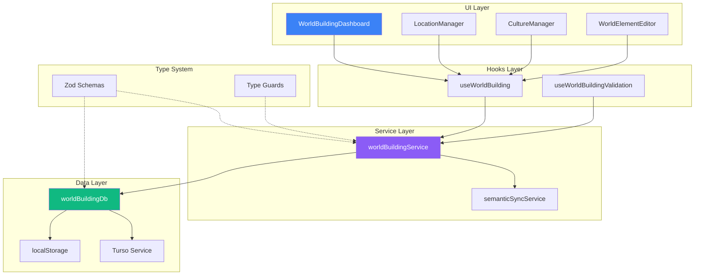
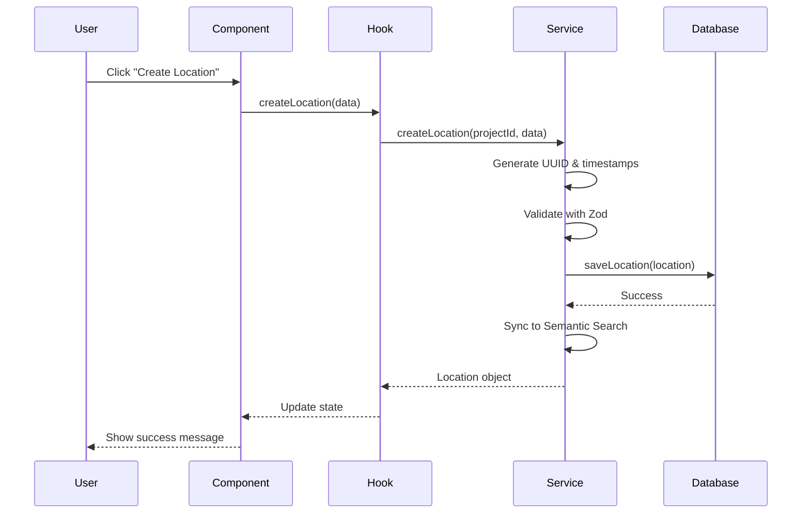
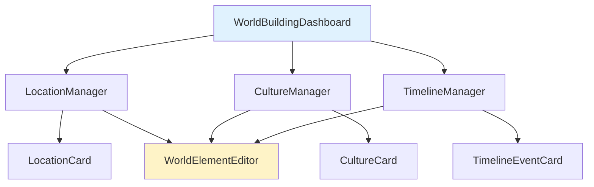
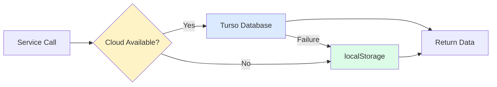
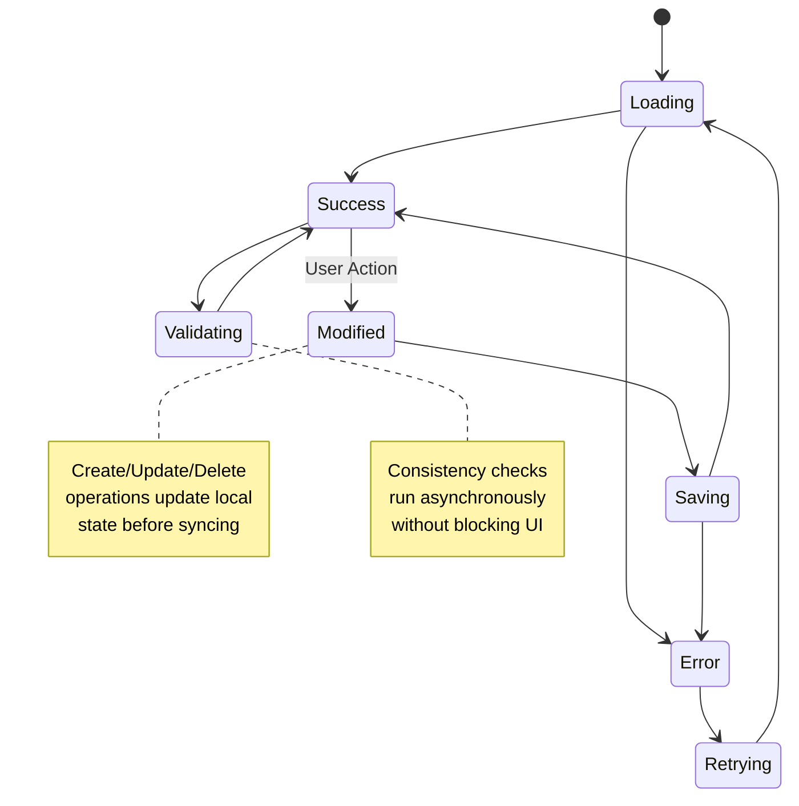

# World Building Feature

> Comprehensive world-building tools for authors to create and manage fictional
> worlds, locations, cultures, timelines, and lore consistency.

## Table of Contents

- [Feature Overview](#feature-overview)
- [Architecture](#architecture)
- [Component Hierarchy](#component-hierarchy)
- [Service Layer](#service-layer)
- [State Management](#state-management)
- [API Reference](#api-reference)
- [Usage Examples](#usage-examples)
- [Testing Guidelines](#testing-guidelines)
- [Future Enhancements](#future-enhancements)

---

## Feature Overview

The World Building feature provides authors with comprehensive tools for
creating and managing fictional worlds. It supports:

- 🗺️ **Locations** - Geographic locations, settlements, and natural features
- 🏛️ **Cultures** - Societies, civilizations, and cultural groups
- 📚 **Lore** - Historical events, mythology, and world knowledge
- 🗓️ **Timelines** - Historical chronology and events
- 🔗 **Relationships** - Interconnections between world elements
- ✅ **Consistency** - Validation across world-building elements
- 🔍 **Search** - Find and filter world elements

### Core Capabilities

| Capability                    | Description                                           |
| ----------------------------- | ----------------------------------------------------- |
| **Hierarchical Organization** | Parent-child relationships for geographic containment |
| **Semantic Search**           | Full-text search across all world elements            |
| **Validation**                | Consistency checking for references and relationships |
| **Rich Types**                | Support for multiple world element types              |
| **Cloud Sync**                | Optional Turso/LibSQL database integration            |
| **Type Safety**               | Full Zod schema validation                            |

---

## Architecture

### High-Level Architecture



### Data Flow



### File Structure

```
src/features/world-building/
├── components/                 # React Components
│   ├── WorldBuildingDashboard.tsx   # Main dashboard with tabs
│   ├── WorldElementEditor.tsx       # Generic editor modal
│   ├── LocationManager.tsx          # Location-specific manager
│   └── CultureManager.tsx           # Culture-specific manager
│
├── hooks/                      # React Hooks
│   ├── useWorldBuilding.ts          # Main state management
│   └── useWorldBuildingValidation.ts # Validation logic
│
├── services/                   # Business Logic
│   ├── worldBuildingService.ts      # CRUD & validation
│   └── worldBuildingDb.ts           # Data persistence layer
│
├── types/                      # TypeScript Types
│   └── index.ts                     # Zod schemas & types
│
├── index.ts                    # Public exports
└── README.md                   # This file
```

---

## Component Hierarchy

### Component Tree



### Component Details

#### WorldBuildingDashboard

The main interface providing tabbed navigation and overview stats.

**Props:**

```typescript
interface WorldBuildingDashboardProps {
  projectId: string;
}
```

**Features:**

- Tab-based navigation (Overview, Locations, Cultures, Timeline, Lore)
- Real-time statistics display
- Global search functionality
- Consistency validation integration
- Quick action buttons

---

#### LocationManager

Specialized interface for managing geographic locations.

**Props:**

```typescript
interface LocationManagerProps {
  projectId: string;
}
```

**Features:**

- Grid view of all locations
- Create/Edit/Delete operations
- Population and climate display
- Tag visualization
- Parent-child relationship indicators

---

#### CultureManager

Specialized interface for managing cultural groups.

**Props:**

```typescript
interface CultureManagerProps {
  projectId: string;
}
```

**Features:**

- Grid view of all cultures
- Core values display
- Language and social structure info
- Create/Edit/Delete operations
- Tag management

---

#### WorldElementEditor

Generic modal editor for creating/editing world elements.

**Props:**

```typescript
interface WorldElementEditorProps {
  element: Location | Culture | null;
  type: 'location' | 'culture';
  isOpen: boolean;
  onClose: () => void;
  onSave: (element: Record<string, unknown>) => void;
  onDelete?: (id: string) => void;
}
```

**Features:**

- Type-specific form fields
- Dynamic field rendering
- Form validation
- Tag input with comma separation
- Delete confirmation

---

## Service Layer

### worldBuildingService

The business logic layer handling CRUD operations and validation.

#### Key Methods

```typescript
class WorldBuildingService {
  // Project Management
  initializeWorldBuilding(projectId: string): Promise<WorldBuildingProject>;
  getWorldBuildingData(projectId: string): Promise<WorldBuildingProject | null>;

  // Location CRUD
  createLocation(projectId: string, data: Partial<Location>): Promise<Location>;
  getLocation(id: string): Promise<Location | null>;
  updateLocation(
    id: string,
    updates: Partial<Location>,
  ): Promise<Location | null>;
  deleteLocation(id: string): Promise<void>;
  getLocations(projectId: string): Promise<Location[]>;

  // Culture CRUD
  createCulture(projectId: string, data: Partial<Culture>): Promise<Culture>;
  getCulture(id: string): Promise<Culture | null>;
  updateCulture(id: string, updates: Partial<Culture>): Promise<Culture | null>;
  deleteCulture(id: string): Promise<void>;
  getCultures(projectId: string): Promise<Culture[]>;

  // Search & Filtering
  searchWorldElements(
    projectId: string,
    filters: WorldBuildingFilters,
  ): Promise<{
    locations: Location[];
    cultures: Culture[];
    timelines: Timeline[];
    lore: LoreEntry[];
  }>;

  // Validation
  validateWorldBuilding(
    projectId: string,
  ): Promise<WorldBuildingValidationResult>;
}
```

### worldBuildingDb

The data persistence layer with dual storage (cloud + local).

#### Storage Strategy



#### Key Methods

```typescript
class WorldBuildingDatabase {
  // Initialization
  init(): Promise<void>;

  // Project Operations
  saveWorldBuildingProject(project: WorldBuildingProject): Promise<void>;
  getWorldBuildingProject(
    projectId: string,
  ): Promise<WorldBuildingProject | null>;
  createWorldBuildingProject(projectId: string): Promise<WorldBuildingProject>;

  // Location Operations
  saveLocation(location: Location): Promise<void>;
  getLocationsByProject(projectId: string): Promise<Location[]>;
  getLocation(id: string): Promise<Location | null>;
  deleteLocation(id: string): Promise<void>;

  // Culture Operations
  saveCulture(culture: Culture): Promise<void>;
  getCulturesByProject(projectId: string): Promise<Culture[]>;
  getCulture(id: string): Promise<Culture | null>;
  deleteCulture(id: string): Promise<void>;

  // Other Element Operations
  getTimelinesByProject(projectId: string): Promise<Timeline[]>;
  getLoreByProject(projectId: string): Promise<LoreEntry[]>;
  getResearchSourcesByProject(projectId: string): Promise<ResearchSource[]>;
  getWorldMapsByProject(projectId: string): Promise<WorldMap[]>;
}
```

---

## State Management

### useWorldBuilding Hook

The primary hook for world-building state and operations.

#### Return Interface

```typescript
interface UseWorldBuildingReturn {
  // State
  worldBuilding: WorldBuildingProject | null;
  locations: Location[];
  cultures: Culture[];
  timelines: Timeline[];
  lore: LoreEntry[];
  isLoading: boolean;
  error: string | null;
  validation: WorldBuildingValidationResult | null;

  // Actions
  initializeWorldBuilding: (projectId: string) => Promise<void>;
  refreshData: () => Promise<void>;

  // Location Actions
  createLocation: (data: Partial<Location>) => Promise<Location | null>;
  updateLocation: (
    id: string,
    updates: Partial<Location>,
  ) => Promise<Location | null>;
  deleteLocation: (id: string) => Promise<void>;

  // Culture Actions
  createCulture: (data: Partial<Culture>) => Promise<Culture | null>;
  updateCulture: (
    id: string,
    updates: Partial<Culture>,
  ) => Promise<Culture | null>;
  deleteCulture: (id: string) => Promise<void>;

  // Search & Validation
  searchElements: (filters: WorldBuildingFilters) => Promise<void>;
  validateWorldBuilding: () => Promise<void>;
}
```

### State Flow Diagram



### useWorldBuildingValidation Hook

Handles validation and consistency checking.

```typescript
interface UseWorldBuildingValidationReturn {
  validation: WorldBuildingValidationResult | null;
  isValidating: boolean;
  validateWorldBuilding: (projectId: string) => Promise<void>;
  clearValidation: () => void;
}
```

---

## API Reference

### Type System

#### Core Types

```typescript
// World Element Types
export type WorldElementType =
  | 'location'
  | 'culture'
  | 'organization'
  | 'religion'
  | 'language'
  | 'technology'
  | 'magic-system'
  | 'political-system'
  | 'economic-system'
  | 'historical-event'
  | 'artifact'
  | 'creature'
  | 'natural-phenomenon';

// Location Types
export type LocationType =
  | 'continent'
  | 'country'
  | 'region'
  | 'city'
  | 'town'
  | 'village'
  | 'building'
  | 'landmark'
  | 'natural-feature'
  | 'dungeon'
  | 'realm';

// Culture Types
export type CultureType =
  | 'civilization'
  | 'tribe'
  | 'nomadic'
  | 'city-state'
  | 'empire'
  | 'federation'
  | 'clan'
  | 'guild'
  | 'religious-order';
```

#### Location Schema

```typescript
interface Location {
  id: string; // UUID
  projectId: string; // UUID
  name: string; // 1-200 chars
  type: LocationType;

  // Geographic Information
  description: string; // Max 5000 chars
  geography?: string; // Max 2000 chars
  climate?: string; // Max 1000 chars
  naturalResources?: string[]; // Max 50 items

  // Cultural Information
  population?: number;
  primaryCultures?: string[]; // Culture UUIDs
  languages?: string[]; // Max 20 languages

  // Political Information
  government?: string; // Max 1000 chars
  ruler?: string; // Max 200 chars
  allies?: string[]; // Location UUIDs
  enemies?: string[]; // Location UUIDs

  // Economic Information
  primaryIndustries?: string[]; // Max 20 items
  tradingPartners?: string[]; // Location UUIDs
  currency?: string; // Max 100 chars

  // Hierarchical Relationships
  parentLocationId?: string; // Location UUID
  childLocationIds?: string[]; // Location UUIDs

  // Map Information
  coordinates?: { x: number; y: number };
  imageUrl?: string; // URL
  mapImageUrl?: string; // URL

  // Metadata
  tags: string[]; // Max 20 tags
  notes?: string; // Max 5000 chars
  createdAt: number; // Unix timestamp
  updatedAt: number; // Unix timestamp
}
```

#### Culture Schema

```typescript
interface Culture {
  id: string; // UUID
  projectId: string; // UUID
  name: string; // 1-200 chars
  type: CultureType;

  // Core Identity
  description: string; // Max 5000 chars
  values: string[]; // Max 20 values
  beliefs?: string[]; // Max 50 beliefs
  traditions?: string[]; // Max 50 traditions

  // Social Structure
  socialStructure?: string; // Max 2000 chars
  leadership?: string; // Max 1000 chars
  caste?: string[]; // Max 20 castes

  // Cultural Practices
  language?: string; // Max 200 chars
  religion?: string; // Max 1000 chars
  art?: string; // Max 1000 chars
  music?: string; // Max 1000 chars
  cuisine?: string; // Max 1000 chars
  clothing?: string; // Max 1000 chars
  architecture?: string; // Max 1000 chars

  // Relationships
  allies?: string[]; // Culture UUIDs
  enemies?: string[]; // Culture UUIDs
  tradingPartners?: string[]; // Culture UUIDs

  // Geographic Presence
  territories?: string[]; // Location UUIDs
  originLocation?: string; // Location UUID

  // Metadata
  imageUrl?: string; // URL
  tags: string[]; // Max 20 tags
  notes?: string; // Max 5000 chars
  createdAt: number; // Unix timestamp
  updatedAt: number; // Unix timestamp
}
```

#### Validation Types

```typescript
interface ConsistencyIssue {
  id: string;
  type: 'error' | 'warning' | 'suggestion';
  category: 'timeline' | 'geography' | 'culture' | 'relationship' | 'reference';
  message: string;
  affectedElements: string[]; // Element UUIDs
  suggestion?: string;
}

interface WorldBuildingValidationResult {
  isValid: boolean; // No error-level issues
  score: number; // 0-100 consistency score
  issues: ConsistencyIssue[];
  strengths: string[];
  completeness: {
    locations: number;
    cultures: number;
    timeline: number;
    lore: number;
  };
}
```

#### Filter Types

```typescript
interface WorldBuildingFilters {
  search: string; // Full-text search term
  types: WorldElementType[]; // Element type filter
  tags: string[]; // Tag filter
  dateRange?: {
    start: string;
    end: string;
  };
}
```

---

## Usage Examples

### Basic Setup

```tsx
import { WorldBuildingDashboard } from '@/features/world-building';

function WorldBuildingPage({ projectId }: { projectId: string }) {
  return <WorldBuildingDashboard projectId={projectId} />;
}
```

### Using the Hook

```tsx
import { useWorldBuilding } from '@/features/world-building';
import { Button } from '@/shared/components/ui/Button';

function LocationCreator({ projectId }: { projectId: string }) {
  const { createLocation, locations } = useWorldBuilding(projectId);

  const handleCreate = async () => {
    const location = await createLocation({
      name: 'Mystic Forest',
      type: 'natural-feature',
      description: 'An ancient forest filled with magical creatures',
      climate: 'Temperate, misty',
      tags: ['magical', 'dangerous', 'ancient'],
    });

    if (location) {
      console.log('Created:', location.name);
    }
  };

  return (
    <div>
      <p>Total Locations: {locations.length}</p>
      <Button onClick={handleCreate}>Create Location</Button>
    </div>
  );
}
```

### Creating Hierarchical Locations

```tsx
async function createCityHierarchy() {
  const { createLocation, updateLocation } = useWorldBuilding(projectId);

  // Create continent
  const continent = await createLocation({
    name: 'Eldoria',
    type: 'continent',
    description: 'A vast continent of diverse landscapes',
  });

  if (!continent) return;

  // Create country
  const country = await createLocation({
    name: 'Kingdom of Valor',
    type: 'country',
    description: 'A realm of knights and honor',
    parentLocationId: continent.id,
  });

  if (!country) return;

  // Create city
  await createLocation({
    name: 'Silvermoon',
    type: 'city',
    description: 'A gleaming coastal city',
    parentLocationId: country.id,
    population: 50000,
    climate: 'Mild coastal climate',
  });
}
```

### Linking Cultures to Locations

```tsx
async function linkCultureToLocation() {
  const { createCulture, createLocation, updateLocation } =
    useWorldBuilding(projectId);

  // Create culture
  const culture = await createCulture({
    name: 'Forest Elves',
    type: 'tribe',
    description: 'Guardians of the ancient forest',
    values: ['harmony', 'nature', 'wisdom'],
    language: 'Elvish',
  });

  if (!culture) return;

  // Create location
  const location = await createLocation({
    name: 'Enchanted Grove',
    type: 'natural-feature',
    description: 'Home to the Forest Elves',
  });

  if (!location) return;

  // Link culture to location
  await updateLocation(location.id, {
    primaryCultures: [culture.id],
  });

  await updateCulture(culture.id, {
    territories: [location.id],
  });
}
```

### Searching and Filtering

```tsx
function ElementSearch({ projectId }: { projectId: string }) {
  const { searchElements, locations, cultures } = useWorldBuilding(projectId);

  const handleSearch = async (searchTerm: string) => {
    await searchElements({
      search: searchTerm,
      types: ['location', 'culture'],
      tags: ['magical', 'important'],
    });
  };

  return (
    <input
      type="text"
      placeholder="Search world..."
      onChange={e => handleSearch(e.target.value)}
    />
  );
}
```

### Validation and Consistency

```tsx
import { useWorldBuildingValidation } from '@/features/world-building';

function ValidationPanel({ projectId }: { projectId: string }) {
  const { validation, isValidating, validateWorldBuilding } =
    useWorldBuildingValidation();

  const handleValidate = async () => {
    await validateWorldBuilding(projectId);
  };

  return (
    <div>
      <Button onClick={handleValidate} disabled={isValidating}>
        {isValidating ? 'Validating...' : 'Validate World'}
      </Button>

      {validation && (
        <div>
          <h3>Score: {validation.score}/100</h3>
          {validation.isValid ? (
            <p className="text-green-600">✓ World is consistent</p>
          ) : (
            <p className="text-red-600">⚠ Issues found</p>
          )}

          <h4>Issues ({validation.issues.length})</h4>
          <ul>
            {validation.issues.map(issue => (
              <li key={issue.id} className={`text-${issue.type}`}>
                {issue.message}
                {issue.suggestion && <p>Suggestion: {issue.suggestion}</p>}
              </li>
            ))}
          </ul>

          <h4>Strengths</h4>
          <ul>
            {validation.strengths.map((strength, i) => (
              <li key={i}>{strength}</li>
            ))}
          </ul>
        </div>
      )}
    </div>
  );
}
```

### Using LocationManager Directly

```tsx
import { LocationManager } from '@/features/world-building';

function WorldLocations({ projectId }: { projectId: string }) {
  return <LocationManager projectId={projectId} />;
}
```

### Using CultureManager Directly

```tsx
import { CultureManager } from '@/features/world-building';

function WorldCultures({ projectId }: { projectId: string }) {
  return <CultureManager projectId={projectId} />;
}
```

### Custom Editor Integration

```tsx
import { WorldElementEditor } from '@/features/world-building';
import { useState } from 'react';

function CustomLocationEditor({
  location,
  onSave,
}: {
  location: Location | null;
  onSave: (data: Record<string, unknown>) => void;
}) {
  const [isOpen, setIsOpen] = useState(false);

  return (
    <div>
      <button onClick={() => setIsOpen(true)}>
        {location ? 'Edit Location' : 'Create Location'}
      </button>

      <WorldElementEditor
        element={location}
        type="location"
        isOpen={isOpen}
        onClose={() => setIsOpen(false)}
        onSave={data => {
          onSave(data);
          setIsOpen(false);
        }}
        onDelete={location ? id => console.log('Delete:', id) : undefined}
      />
    </div>
  );
}
```

---

## Testing Guidelines

### Unit Testing

#### Testing Service Layer

```typescript
import { describe, it, expect, beforeEach, vi } from 'vitest';
import { worldBuildingService } from '@/features/world-building/services/worldBuildingService';
import { worldBuildingDb } from '@/features/world-building/services/worldBuildingDb';

describe('worldBuildingService', () => {
  const projectId = 'test-project-id';
  const mockLocation = {
    name: 'Test Location',
    type: 'city' as const,
    description: 'A test location',
    tags: [],
  };

  beforeEach(() => {
    vi.clearAllMocks();
  });

  it('should create a location', async () => {
    const location = await worldBuildingService.createLocation(
      projectId,
      mockLocation,
    );

    expect(location).toBeDefined();
    expect(location.name).toBe(mockLocation.name);
    expect(location.type).toBe(mockLocation.type);
    expect(location.id).toBeDefined();
  });

  it('should update a location', async () => {
    const created = await worldBuildingService.createLocation(
      projectId,
      mockLocation,
    );
    const updated = await worldBuildingService.updateLocation(created.id, {
      name: 'Updated Location',
    });

    expect(updated?.name).toBe('Updated Location');
  });

  it('should delete a location', async () => {
    const created = await worldBuildingService.createLocation(
      projectId,
      mockLocation,
    );
    await worldBuildingService.deleteLocation(created.id);
    const found = await worldBuildingService.getLocation(created.id);

    expect(found).toBeNull();
  });

  it('should search world elements', async () => {
    await worldBuildingService.createLocation(projectId, {
      ...mockLocation,
      name: 'Dragon Mountain',
      tags: ['dangerous', 'magical'],
    });

    const results = await worldBuildingService.searchWorldElements(projectId, {
      search: 'dragon',
      types: ['location'],
      tags: ['magical'],
    });

    expect(results.locations).toHaveLength(1);
    expect(results.locations[0].name).toBe('Dragon Mountain');
  });

  it('should validate world building', async () => {
    const result = await worldBuildingService.validateWorldBuilding(projectId);

    expect(result).toBeDefined();
    expect(result.score).toBeGreaterThanOrEqual(0);
    expect(result.score).toBeLessThanOrEqual(100);
  });
});
```

#### Testing Hooks

```typescript
import { renderHook, act } from '@testing-library/react';
import { useWorldBuilding } from '@/features/world-building/hooks/useWorldBuilding';

describe('useWorldBuilding', () => {
  const projectId = 'test-project-id';

  it('should initialize world building', async () => {
    const { result } = renderHook(() => useWorldBuilding(projectId));

    expect(result.current.isLoading).toBe(true);

    await act(async () => {
      await result.current.initializeWorldBuilding(projectId);
    });

    expect(result.current.worldBuilding).toBeDefined();
    expect(result.current.isLoading).toBe(false);
  });

  it('should create a location', async () => {
    const { result } = renderHook(() => useWorldBuilding(projectId));

    await act(async () => {
      await result.current.initializeWorldBuilding(projectId);
    });

    let createdLocation;

    await act(async () => {
      createdLocation = await result.current.createLocation({
        name: 'Test Location',
        type: 'city',
        description: 'A test',
        tags: [],
      });
    });

    expect(createdLocation).toBeDefined();
    expect(result.current.locations).toHaveLength(1);
  });

  it('should update a location', async () => {
    const { result } = renderHook(() => useWorldBuilding(projectId));

    await act(async () => {
      await result.current.initializeWorldBuilding(projectId);
    });

    await act(async () => {
      await result.current.createLocation({
        name: 'Test Location',
        type: 'city',
        description: 'A test',
        tags: [],
      });
    });

    const location = result.current.locations[0];

    await act(async () => {
      await result.current.updateLocation(location.id, {
        name: 'Updated Location',
      });
    });

    expect(result.current.locations[0].name).toBe('Updated Location');
  });

  it('should delete a location', async () => {
    const { result } = renderHook(() => useWorldBuilding(projectId));

    await act(async () => {
      await result.current.initializeWorldBuilding(projectId);
    });

    await act(async () => {
      await result.current.createLocation({
        name: 'Test Location',
        type: 'city',
        description: 'A test',
        tags: [],
      });
    });

    const location = result.current.locations[0];

    await act(async () => {
      await result.current.deleteLocation(location.id);
    });

    expect(result.current.locations).toHaveLength(0);
  });
});
```

#### Testing Components

```typescript
import { render, screen, fireEvent, waitFor } from '@testing-library/react';
import { WorldBuildingDashboard } from '@/features/world-building/components/WorldBuildingDashboard';

describe('WorldBuildingDashboard', () => {
  const projectId = 'test-project-id';

  it('should render dashboard', () => {
    render(<WorldBuildingDashboard projectId={projectId} />);

    expect(screen.getByText('World-Building Assistant')).toBeInTheDocument();
  });

  it('should switch tabs', () => {
    render(<WorldBuildingDashboard projectId={projectId} />);

    const locationsTab = screen.getByText('Locations');
    fireEvent.click(locationsTab);

    expect(screen.getByText(/Locations \(/)).toBeInTheDocument();
  });

  it('should create location', async () => {
    render(<WorldBuildingDashboard projectId={projectId} />);

    const createButton = screen.getByText('Add New Location');
    fireEvent.click(createButton);

    await waitFor(() => {
      // Check if editor opened
      expect(screen.getByText('Create location')).toBeInTheDocument();
    });
  });
});
```

### Integration Testing

```typescript
describe('World Building Integration', () => {
  it('should maintain consistency across operations', async () => {
    const { result } = renderHook(() => useWorldBuilding(projectId));

    // Create location
    await act(async () => {
      await result.current.createLocation({
        name: 'Test Location',
        type: 'city',
        description: 'A test',
        tags: ['test'],
      });
    });

    // Validate
    await act(async () => {
      await result.current.validateWorldBuilding();
    });

    expect(result.current.validation?.isValid).toBe(true);
  });

  it('should detect orphaned references', async () => {
    const { result } = renderHook(() => useWorldBuilding(projectId));

    // Create location with invalid culture reference
    await act(async () => {
      await result.current.createLocation({
        name: 'Test Location',
        type: 'city',
        description: 'A test',
        primaryCultures: ['invalid-culture-id'],
        tags: [],
      });
    });

    // Validate
    await act(async () => {
      await result.current.validateWorldBuilding();
    });

    expect(result.current.validation?.isValid).toBe(false);
    expect(
      result.current.validation?.issues.some(
        issue => issue.type === 'error' && issue.category === 'reference',
      ),
    ).toBe(true);
  });
});
```

### Running Tests

```bash
# Run all world-building tests
npm run test -- world-building

# Run specific test file
vitest run src/features/world-building/services/__tests__/worldBuildingService.test.ts

# Run with coverage
npm run test -- --coverage world-building

# Watch mode
npm run test -- world-building --watch
```

---

## Future Enhancements

### Planned Features

| Feature                          | Status     | Priority |
| -------------------------------- | ---------- | -------- |
| Visual world map editor          | 🟡 Planned | High     |
| Timeline event management        | 🟡 Planned | High     |
| Lore library interface           | 🟡 Planned | High     |
| AI-powered suggestions           | 🟢 Roadmap | Medium   |
| Import from real-world geography | 🟢 Roadmap | Low      |
| 3D visualization                 | 🔸 Future  | Low      |
| Weather patterns and seasons     | 🟢 Roadmap | Medium   |
| Trade routes and travel times    | 🟡 Planned | Medium   |
| Political boundaries editor      | 🟢 Roadmap | Low      |
| Economic simulation              | 🔸 Future  | Low      |
| Cultural evolution over time     | 🔸 Future  | Low      |
| Export world guide (PDF/HTML)    | 🟡 Planned | High     |

### Contribution Guidelines

When contributing to the World Building feature:

1. **Maintain Type Safety**: Ensure all new types are added to Zod schemas
2. **Test Thoroughly**: Add unit tests for all new service methods
3. **Validate Rigorously**: Update validation logic for new element types
4. **Document Changes**: Update this README with new features
5. **Follow Patterns**: Use existing patterns for consistency
6. **Handle Errors**: Use logger for all error logging
7. **Maintain Accessibility**: Ensure all components are WCAG 2.1 AA compliant

---

## Related Features

- **Timeline** (`src/features/timeline`) - Historical events and chronology
- **Characters** (`src/features/characters`) - Character origins and
  relationships
- **Plot Engine** (`src/features/plot-engine`) - Plot consistency and GOAP
- **Semantic Search** (`src/features/semantic-search`) - AI-powered search

---

## License

Part of Novelist.ai - See root LICENSE file
