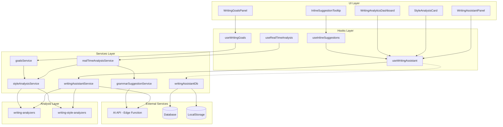
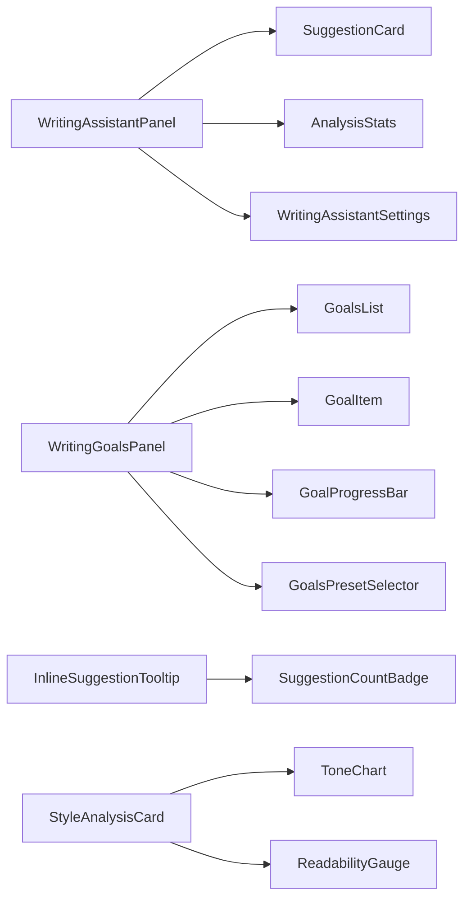
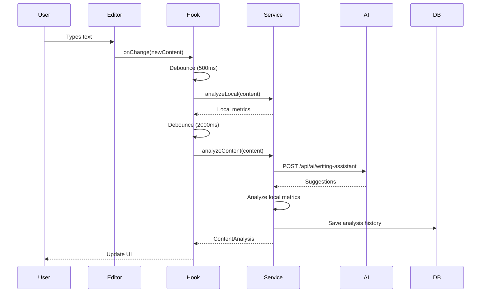
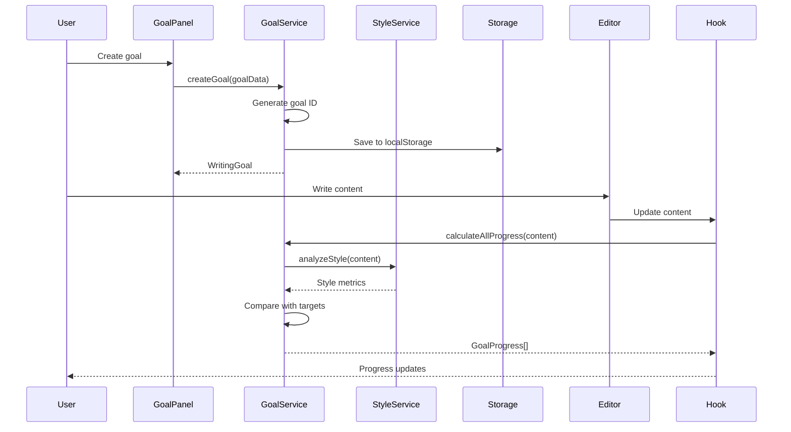

# Writing Assistant Feature

The Writing Assistant provides intelligent AI-powered writing feedback, grammar
suggestions, style analysis, goal tracking, and real-time analytics to help
authors improve their craft and maintain consistency.

## Table of Contents

- [Feature Overview](#feature-overview)
- [Architecture](#architecture)
  - [System Architecture](#system-architecture)
  - [Component Hierarchy](#component-hierarchy)
  - [Data Flow](#data-flow)
- [Directory Structure](#directory-structure)
- [Core Services](#core-services)
- [React Hooks](#react-hooks)
- [Component Reference](#component-reference)
- [State Management](#state-management)
- [API Reference](#api-reference)
- [Usage Examples](#usage-examples)
- [Testing Guidelines](#testing-guidelines)
- [Performance Considerations](#performance-considerations)
- [Future Enhancements](#future-enhancements)

---

## Feature Overview

The Writing Assistant helps authors with:

| Feature                    | Description                                                    |
| -------------------------- | -------------------------------------------------------------- |
| 📝 **Grammar & Spelling**  | Real-time grammar and spelling suggestions with explanations   |
| 🎨 **Style Analysis**      | Analyze writing style, voice, and tone consistency             |
| 💡 **Inline Suggestions**  | Contextual writing improvements as you type                    |
| 🎯 **Writing Goals**       | Set and track readability, tone, and style goals               |
| 📊 **Analytics Dashboard** | Comprehensive writing metrics and insights                     |
| 📖 **Readability**         | Analyze readability scores (Flesch-Kincaid, Gunning Fog, etc.) |
| 🔍 **Clarity Metrics**     | Identify passive voice, weak verbs, and redundancy             |

### Key Benefits

- **Real-time Feedback**: Get suggestions as you type with intelligent
  debouncing
- **Context-Aware**: Understands your writing goals and target audience
- **Learning System**: Tracks your writing patterns and preference history
- **Goal-Driven**: Achieve specific writing goals with progress tracking
- **Privacy-First**: Uses Edge Functions for AI analysis - no API keys in client
  code

---

## Architecture

### System Architecture



### Component Hierarchy



### Data Flow

#### Real-time Analysis Flow



#### Goal Tracking Flow



---

## Directory Structure

```
src/features/writing-assistant/
├── components/                          # UI Components
│   ├── WritingAssistantPanel.tsx       # Main assistant interface
│   ├── WritingAssistantSettings.tsx    # Configuration panel
│   ├── WritingAnalyticsDashboard.tsx   # Metrics dashboard
│   ├── InlineSuggestionTooltip.tsx     # Inline suggestion UI
│   ├── StyleAnalysisCard.tsx           # Style analysis display
│   ├── WritingGoalsPanel.tsx           # Goals management
│   ├── GoalsPresetSelector.tsx         # Goal presets
│   ├── GoalsPanelHeader.tsx            # Goals panel header
│   ├── GoalsList.tsx                   # Goals list
│   ├── GoalsImportExport.tsx           # Import/export goals
│   ├── GoalTargetsDisplay.tsx          # Goal targets display
│   ├── GoalProgressBar.tsx            # Goal progress bar
│   ├── GoalItem.tsx                    # Individual goal item
│   ├── GoalEditForm.tsx                # Goal editing form
│   ├── GoalCreateForm.tsx              # Goal creation form
│   ├── useGoalsPanelState.ts           # Goals panel state hook
│   └── __tests__/                      # Component tests
│       └── WritingGoalsPanel.test.tsx
│
├── hooks/                              # React Hooks
│   ├── useWritingAssistant.ts          # Main assistant hook
│   ├── useRealTimeAnalysis.ts          # Real-time feedback
│   ├── useInlineSuggestions.ts         # Inline suggestions
│   ├── useWritingGoals.ts              # Goals tracking
│   ├── useWritingAssistant.utils.ts    # Utility functions
│   └── __tests__/                      # Hook tests
│       └── useWritingAssistant.test.ts
│
├── services/                           # Business Logic
│   ├── writingAssistantService.ts      # Core service
│   ├── grammarSuggestionService.ts     # Grammar analysis
│   ├── styleAnalysisService.ts         # Style analysis
│   ├── realTimeAnalysisService.ts      # Real-time processing
│   ├── goalsService.ts                 # Goals management
│   ├── writingAssistantDb.ts           # Database operations
│   ├── writing-analyzers.ts            # Core analyzers
│   ├── writing-style-analyzers.ts      # Style analyzers
│   ├── index.ts                        # Service exports
│   └── __tests__/                      # Service tests
│       ├── writingAssistantService.test.ts
│       ├── grammarSuggestionService.test.ts
│       ├── goalsService.test.ts
│       ├── styleAnalysisService.test.ts
│       └── writingAssistantDb.test.ts
│
├── types/                              # TypeScript Types
│   ├── index.ts                        # Main types export
│   ├── grammarSuggestions.ts           # Grammar types
│   ├── styleAnalysis.ts                # Style types
│   ├── realTimeFeedback.ts             # Real-time types
│   └── writingGoals.ts                 # Goals types
│
├── README.md                           # This file
└── index.ts                            # Feature exports
```

---

## Core Services

### writingAssistantService

The core service that coordinates all writing analysis features.

```typescript
interface WritingAssistantService {
  // Analyze content with AI and local metrics
  analyzeContent(
    content: string,
    chapterId: string,
    config: WritingAssistantConfig,
    characterContext?: Character[],
    plotContext?: string,
  ): Promise<ContentAnalysis>;

  // Analyze local metrics only (no AI)
  analyzeLocalMetrics(
    content: string,
    config: WritingAssistantConfig,
  ): Partial<ContentAnalysis>;
}
```

**Usage Example:**

```typescript
import { writingAssistantService } from '@/features/writing-assistant';

// Full analysis with AI
const analysis = await writingAssistantService.analyzeContent(
  chapterContent,
  chapterId,
  config,
  characters,
  plotSummary,
);

console.log(analysis.readabilityScore); // 0-100
console.log(analysis.suggestions); // WritingSuggestion[]
console.log(analysis.styleProfile); // StyleProfile
```

### grammarSuggestionService

Analyzes grammar, spelling, and punctuation errors.

```typescript
interface GrammarSuggestionService {
  analyzeGrammar(content: string): GrammarAnalysisResult;
  analyzeGrammarWithOptions(
    content: string,
    options: GrammarConfig,
  ): GrammarAnalysisResult;
}
```

**Supported Grammar Types:**

| Type            | Category   | Description                          |
| --------------- | ---------- | ------------------------------------ |
| `grammar`       | mechanical | Subject-verb agreement, tense errors |
| `spelling`      | mechanical | Misspelled words                     |
| `punctuation`   | mechanical | Missing/incorrect punctuation        |
| `syntax`        | mechanical | Sentence structure issues            |
| `word_choice`   | usage      | Commonly confused words              |
| `redundancy`    | clarity    | Repetitive phrases                   |
| `passive_voice` | style      | Passive voice detection              |
| `clarity`       | clarity    | Unclear expressions                  |

### styleAnalysisService

Analyzes writing style, voice, and tone.

```typescript
interface StyleAnalysisService {
  analyzeStyle(content: string): StyleAnalysisResult;
  analyzeStyleWithOptions(
    content: string,
    options: StyleAnalysisConfig,
  ): StyleAnalysisResult;
}
```

**Readability Metrics:**

- **Flesch Reading Ease**: 0-100 (higher = easier to read)
- **Flesch-Kincaid Grade**: Grade level required
- **Gunning Fog Index**: Years of education needed
- **SMOG Index**: Grade level for complex texts
- **Automated Readability Index**: Approximate grade level

**Example:**

```typescript
import { styleAnalysisService } from '@/features/writing-assistant';

const style = styleAnalysisService.analyzeStyle(text);

console.log(`Readability: ${style.fleschReadingEase}`);
console.log(`Grade Level: ${style.fleschKincaidGrade}`);
console.log(`Tone: ${style.primaryTone}`);
console.log(`Voice: ${style.voiceType}`);
console.log(`Consistency: ${style.consistencyScore}%`);
```

### realTimeAnalysisService

Processes text changes in real-time with debouncing.

```typescript
interface RealTimeAnalysisService {
  // Analyze immediately
  analyzeNow(content: string, analyses?: AnalysisType[]): AnalysisResults;

  // Start/stop automatic analysis
  start(): void;
  stop(): void;

  // Configuration
  updateConfig(updates: Partial<RealTimeConfig>): void;
  getConfig(): RealTimeConfig;

  // Suggestion management
  acceptSuggestion(id: string): boolean;
  dismissSuggestion(id: string): boolean;
  clearAllSuggestions(): void;

  // Goal progress
  getGoalProgress(): Map<string, GoalProgress>;
}
```

### goalsService

Manages writing goals with progress tracking.

```typescript
interface GoalsService {
  // CRUD operations
  createGoal(
    goal: Omit<WritingGoal, 'id' | 'createdAt' | 'updatedAt'>,
  ): WritingGoal;
  updateGoal(goalId: string, updates: Partial<WritingGoal>): WritingGoal | null;
  deleteGoal(goalId: string): boolean;
  getGoal(goalId: string): WritingGoal | undefined;
  getAllGoals(): WritingGoal[];
  getActiveGoals(): WritingGoal[];

  // Progress tracking
  calculateAllProgress(content: string): Map<string, GoalProgress>;
  calculateGoalProgress(content: string, goal: WritingGoal): GoalProgress;

  // Presets
  applyPreset(presetId: string): WritingGoal[];
  getAllPresets(): GoalPreset[];

  // Configuration
  updateConfig(updates: Partial<WritingGoalsConfig>): void;

  // Import/Export
  exportGoals(): string;
  importGoals(data: string): WritingGoal[];
}
```

**Available Presets:**

| Preset               | Description       | Target Audience   |
| -------------------- | ----------------- | ----------------- |
| `preset-young-adult` | YA Fiction        | Grades 7-10       |
| `preset-literary`    | Literary Fiction  | College graduates |
| `preset-children`    | Children's Book   | Grades 1-5        |
| `preset-thriller`    | Thriller/Suspense | Adult             |
| `preset-romance`     | Romance           | Adult             |
| `preset-academic`    | Academic Writing  | Professional      |

### writingAssistantDb

Handles database operations for persistence.

```typescript
interface WritingAssistantDb {
  // Save/Load analysis
  saveAnalysisHistory(
    analysis: ContentAnalysis,
    projectId: string,
    applied: number,
    dismissed: number,
  ): Promise<void>;
  loadAnalysisHistory(chapterId: string): Promise<ContentAnalysis[]>;

  // Suggestion feedback
  recordSuggestionFeedback(
    suggestion: WritingSuggestion,
    action: 'accepted' | 'dismissed',
    chapterId: string,
    projectId: string,
    replacement?: string,
  ): Promise<void>;

  // Preferences
  savePreferences(config: WritingAssistantConfig): Promise<void>;
  loadPreferences(): Promise<WritingAssistantConfig | null>;

  // Analytics
  getWritingAnalytics(projectId: string): Promise<AnalyticsResult>;
  syncPreferences(config: WritingAssistantConfig): Promise<void>;
}
```

---

## React Hooks

### useWritingAssistant

Main hook for writing assistance features.

```typescript
const {
  // State
  isActive,
  isAnalyzing,
  suggestions,
  config,
  currentAnalysis,

  // Actions
  toggleAssistant,
  analyzeContent,
  applySuggestion,
  dismissSuggestion,
  updateConfig,
  selectSuggestion,

  // Computed properties
  suggestionsByCategory,
  filteredSuggestions,
  analysisStats,

  // Analytics
  suggestionAcceptanceRate,
  learningInsights,
  getWritingAnalytics,
} = useWritingAssistant(content, {
  chapterId,
  projectId,
  characterContext,
  plotContext,
  enablePersistence: true,
});
```

**Return Value:**

| Property                   | Type                  | Description                        |
| -------------------------- | --------------------- | ---------------------------------- |
| `isActive`                 | `boolean`             | Whether assistant is active        |
| `isAnalyzing`              | `boolean`             | Analysis in progress               |
| `suggestions`              | `WritingSuggestion[]` | All suggestions                    |
| `currentAnalysis`          | `ContentAnalysis`     | Full analysis result               |
| `analysisStats`            | `object`              | Statistics about suggestions       |
| `suggestionAcceptanceRate` | `number`              | Percentage of accepted suggestions |
| `learningInsights`         | `object`              | Writing pattern insights           |

**Example:**

```typescript
function MyEditor({ chapterId, projectId }) {
  const [content, setContent] = useState('');

  const assistant = useWritingAssistant(content, {
    chapterId,
    projectId,
    enablePersistence: true,
    onContentChange: (newContent) => setContent(newContent)
  });

  const handleApplySuggestion = (suggestionId) => {
    assistant.applySuggestion(suggestionId);
  };

  return (
    <div>
      <WritingAssistantPanel
        content={content}
        chapterId={chapterId}
        projectId={projectId}
      />
      <textarea onChange={(e) => setContent(e.target.value)} />
    </div>
  );
}
```

### useRealTimeAnalysis

Provides real-time writing feedback as user types.

```typescript
const {
  // State
  isActive,
  isAnalyzing,
  styleResult,
  grammarSuggestions,
  inlineSuggestions,

  // Actions
  start,
  stop,
  analyze,
  updateContent,
  acceptSuggestion,
  dismissSuggestion,

  // Configuration
  config,
  updateConfig,
} = useRealTimeAnalysis({
  enabled: true,
  debounceMs: 500,
  onAnalysisComplete: results => console.log(results),
  onGoalProgress: progress => console.log(progress),
});
```

**Features:**

- Automatic debounced analysis
- Incremental updates (only analyzes changed text)
- Configurable delay (500-5000ms)
- Goal progress notifications

**Performance:**

- Debounce: 500ms default
- Batch size: 100 characters
- Target latency: <100ms for inline suggestions

### useWritingGoals

Manage and track writing goals.

```typescript
const {
  // Goals
  goals,
  activeGoals,
  goalProgress,

  // Actions
  createGoal,
  updateGoal,
  deleteGoal,
  toggleGoalActive,

  // Presets
  applyPreset,
  presets,

  // Stats
  getGoalsWithStatus,
} = useWritingGoals();
```

**Example - Creating a Goal:**

```typescript
const { createGoal } = useWritingGoals();

// Create a readability goal
await createGoal({
  name: 'Young Adult Readability',
  description: 'Maintain YA-appropriate readability',
  isActive: true,
  targetReadability: {
    minScore: 60,
    maxScore: 80,
    gradeLevel: '7-10',
  },
  targetStyle: {
    voice: 'active',
    perspective: 'third_limited',
  },
});
```

### useInlineSuggestions

Manages inline suggestions display and interaction.

```typescript
const {
  visibleSuggestions,
  activeSuggestion,
  acceptSuggestion,
  rejectSuggestion,
  navigateNext,
  navigatePrevious,
} = useInlineSuggestions(suggestions, cursorPosition);
```

**Features:**

- Context-aware suggestion highlighting
- Navigation with keyboard shortcuts
- Quick accept/reject actions
- Severity-based coloring

---

## Component Reference

### WritingAssistantPanel

Main panel with tabbed interface for all writing assistance features.

**Props:**

```typescript
interface WritingAssistantPanelProps {
  content: string;
  chapterId?: string;
  projectId?: string;
  className?: string;
  characterContext?: Character[];
  plotContext?: string;
}
```

**Features:**

- Tabbed navigation (Grammar, Style, Goals, Analytics)
- Real-time suggestion count badges
- Quick toggle for inline suggestions
- Settings access
- Export reports

**Usage:**

```tsx
import { WritingAssistantPanel } from '@/features/writing-assistant';

<WritingAssistantPanel
  projectId={projectId}
  chapterId={chapterId}
  content={editorContent}
  onApplySuggestion={suggestion => handleApply(suggestion)}
/>;
```

### InlineSuggestionTooltip

Displays contextual suggestions inline with editor content.

**Props:**

```typescript
interface InlineSuggestionTooltipProps {
  suggestion: WritingSuggestion;
  position: { x: number; y: number };
  onAccept: () => void;
  onReject: () => void;
  onIgnore: () => void;
}
```

**Suggestion Types:**

| Severity   | Color  | Priority |
| ---------- | ------ | -------- |
| 🔴 Error   | Red    | High     |
| 🟡 Warning | Yellow | Medium   |
| 🔵 Info    | Blue   | Low      |

### StyleAnalysisCard

Displays comprehensive style analysis results.

**Props:**

```typescript
interface StyleAnalysisCardProps {
  analysisResult: StyleAnalysisResult;
  onReanalyze: () => void;
  showDetails?: boolean;
}
```

**Metrics Displayed:**

- Writing style profile (formal, casual, academic)
- Tone analysis (serious, humorous, dark, light)
- Voice consistency checking
- Readability metrics (Flesch-Kincaid, Gunning Fog)
- Vocabulary richness analysis
- Sentence structure breakdown

### WritingGoalsPanel

Manage and track writing goals.

**Features:**

- Create custom goals or use presets
- Progress tracking with charts
- Goal streaks and achievements
- Daily/weekly/monthly targets
- Deadline management
- Goal completion celebrations

**Goal Types:**

| Type               | Description                | Example                     |
| ------------------ | -------------------------- | --------------------------- |
| **Word Count**     | Daily/weekly/total targets | Write 1000 words per day    |
| **Chapter Count**  | Chapters to complete       | Complete 30 chapters        |
| **Writing Streak** | Consecutive days writing   | Write every day for 30 days |
| **Quality**        | Maintain style score       | Keep readability above 70   |
| **Consistency**    | Regular writing schedule   | Write 5 days per week       |

### WritingAnalyticsDashboard

Comprehensive writing metrics and visualizations.

**Features:**

- Writing velocity (words per day)
- Most productive times
- Word count trends
- Style score history
- Grammar improvement over time
- Chapter completion rate
- Readability trends

---

## State Management

### WritingAssistantState

```typescript
interface WritingAssistantState {
  isActive: boolean;
  isAnalyzing: boolean;
  currentAnalysis?: ContentAnalysis;
  suggestions: WritingSuggestion[];
  config: WritingAssistantConfig;

  // UI State
  selectedSuggestion?: string;
  showSuggestions: boolean;
  filterBy: WritingSuggestionCategory | 'all';
  sortBy: 'severity' | 'type' | 'position' | 'confidence';
}
```

### Configuration

**WritingAssistantConfig:**

```typescript
interface WritingAssistantConfig {
  // Analysis Settings
  enableRealTimeAnalysis: boolean;
  analysisDelay: number; // 500-5000ms

  // Suggestion Filters
  enabledCategories: string[];
  minimumConfidence: number; // 0-1
  maxSuggestionsPerType: number;

  // Content Analysis
  enablePlotHoleDetection: boolean;
  enableCharacterTracking: boolean;
  enableDialogueAnalysis: boolean;
  enableStyleAnalysis: boolean;

  // AI Settings
  aiModel: 'gemini-pro' | 'gemini-flash';
  analysisDepth: 'basic' | 'standard' | 'comprehensive';

  // User Preferences
  preferredStyle: 'concise' | 'descriptive' | 'balanced';
  targetAudience: 'children' | 'young_adult' | 'adult' | 'literary';
  genre?: string;
}
```

**GrammarConfig:**

```typescript
interface GrammarConfig {
  enabled: boolean;
  checkGrammar: boolean;
  checkSpelling: boolean;
  checkPunctuation: boolean;
  checkClarity: boolean;
  checkStyle: boolean;
  checkRedundancy: boolean;
  checkPassiveVoice: boolean;
  minimumConfidence: number;
  maxSuggestions: number;
  autoFix: boolean;
  explainSuggestions: boolean;
}
```

**StyleAnalysisConfig:**

```typescript
interface StyleAnalysisConfig {
  enableReadabilityMetrics: boolean;
  enableToneAnalysis: boolean;
  enableVoiceAnalysis: boolean;
  enableConsistencyCheck: boolean;
  enableRecommendations: boolean;
  targetReadabilityScore?: number;
  targetTone?: string;
  focusAreas: Array<'readability' | 'tone' | 'voice' | 'consistency'>;
}
```

**RealTimeConfig:**

```typescript
interface RealTimeConfig {
  enabled: boolean;
  debounceMs: number;
  enableGrammar: boolean;
  enableStyle: boolean;
  enableClarity: boolean;
  batchSize: number;
  cacheResults: boolean;
}
```

**WritingGoalsConfig:**

```typescript
interface WritingGoalsConfig {
  enabled: boolean;
  showProgressInEditor: boolean;
  showNotifications: boolean;
  notifyOnGoalAchieved: boolean;
  notifyOnGoalMissed: boolean;
  autoAnalyze: boolean;
  analysisDelay: number;
}
```

---

## API Reference

### Type Definitions

#### WritingSuggestion

```typescript
interface WritingSuggestion {
  id: string;
  type:
    | 'style'
    | 'tone'
    | 'pacing'
    | 'grammar'
    | 'structure'
    | 'character'
    | 'plot';
  severity: 'info' | 'suggestion' | 'warning' | 'error';
  message: string;
  originalText: string;
  suggestedText?: string;
  position: {
    start: number;
    end: number;
    line?: number;
    column?: number;
  };
  confidence: number; // 0-1
  reasoning: string;
  category: WritingSuggestionCategory;
}
```

#### ContentAnalysis

```typescript
interface ContentAnalysis {
  chapterId: string;
  content: string;
  timestamp: Date;

  // Core Metrics
  readabilityScore: number; // 0-100
  sentimentScore: number; // -1 to 1
  paceScore: number; // 0-100
  engagementScore: number; // 0-100

  // Detailed Analysis
  suggestions: WritingSuggestion[];
  plotHoles: PlotHoleDetection[];
  characterIssues: CharacterConsistencyIssue[];
  dialogueAnalysis: DialogueAnalysis;

  // Style Analysis
  styleProfile: StyleProfile;
  toneAnalysis: ToneAnalysis;
  wordUsage: WordUsageAnalysis;

  // Structure Analysis
  paragraphAnalysis: ParagraphAnalysis;
  sentenceVariety: SentenceVarietyAnalysis;
  transitionQuality: TransitionAnalysis;
}
```

#### StyleAnalysisResult

```typescript
interface StyleAnalysisResult {
  id: string;
  timestamp: Date;
  content: string;

  // Readability Metrics
  fleschReadingEase: number;
  fleschKincaidGrade: number;
  gunningFogIndex: number;
  smogIndex: number;
  automatedReadabilityIndex: number;

  // Complexity Metrics
  averageSentenceLength: number;
  averageWordLength: number;
  vocabularyComplexity: 'simple' | 'moderate' | 'complex' | 'very_complex';
  syntacticComplexity: number;

  // Tone Analysis
  primaryTone: string;
  secondaryTone?: string;
  toneIntensity: number;
  emotionalRange: {
    dominant: string[];
    absent: string[];
  };

  // Voice Analysis
  voiceType: 'active' | 'passive' | 'mixed';
  perspective:
    | 'first'
    | 'second'
    | 'third_limited'
    | 'third_omniscient'
    | 'mixed';
  tense: 'present' | 'past' | 'future' | 'mixed';

  // Style Consistency
  consistencyScore: number; // 0-100
  consistencyIssues: ConsistencyIssue[];

  // Recommendations
  styleRecommendations: StyleRecommendation[];
}
```

#### GrammarSuggestion

```typescript
interface GrammarSuggestion {
  id: string;
  type: GrammarSuggestionType;
  severity: 'error' | 'warning' | 'suggestion' | 'info';
  category: GrammarCategory;

  // Location
  position: {
    start: number;
    end: number;
    line?: number;
    column?: number;
  };

  // Content
  originalText: string;
  suggestedText?: string;
  message: string;
  explanation: string;
  ruleReference?: string;

  // Metadata
  confidence: number;
  aiGenerated: boolean;
  timestamp: Date;
}
```

#### WritingGoal

```typescript
interface WritingGoal {
  id: string;
  name: string;
  description: string;
  isActive: boolean;
  isTemplate: boolean;

  // Tone Goals
  targetTone?: {
    primary: string;
    secondary?: string;
    intensity?: number;
  };

  // Readability Goals
  targetReadability?: {
    minScore?: number;
    maxScore?: number;
    gradeLevel?: string;
  };

  // Length Goals
  targetLength?: {
    minWords?: number;
    maxWords?: number;
    targetWords?: number;
  };

  // Style Goals
  targetStyle?: {
    voice?: 'active' | 'passive' | 'mixed';
    perspective?: 'first' | 'second' | 'third_limited' | 'third_omniscient';
    tense?: 'present' | 'past' | 'future';
    formality?: 'casual' | 'neutral' | 'formal';
  };

  // Vocabulary Goals
  targetVocabulary?: {
    maxAvgWordLength?: number;
    minVocabularyDiversity?: number;
    avoidRepeatedWords?: string[];
  };

  // Pacing Goals
  targetPacing?: {
    minSentenceVariety?: number;
    maxSentenceLength?: number;
    minParagraphLength?: number;
    maxParagraphLength?: number;
  };

  createdAt: Date;
  updatedAt: Date;
}
```

---

## Usage Examples

### Basic Integration

```tsx
import { WritingAssistantPanel } from '@/features/writing-assistant';

function Editor({ projectId, chapterId }) {
  const [content, setContent] = useState('');

  return (
    <div className="flex">
      <textarea
        value={content}
        onChange={e => setContent(e.target.value)}
        className="flex-1"
      />
      <WritingAssistantPanel
        content={content}
        projectId={projectId}
        chapterId={chapterId}
        className="w-96"
      />
    </div>
  );
}
```

### Custom Analysis Trigger

```tsx
import { useWritingAssistant } from '@/features/writing-assistant';

function CustomAnalysisButton() {
  const [content, setContent] = useState('');
  const assistant = useWritingAssistant(content, {
    chapterId: 'chapter-1',
    projectId: 'project-1',
  });

  const handleManualAnalysis = async () => {
    await assistant.analyzeContent(content);
  };

  return (
    <div>
      <textarea onChange={e => setContent(e.target.value)} />
      <button onClick={handleManualAnalysis}>Analyze Content</button>

      {assistant.isAnalyzing && <p>Analyzing...</p>}

      {assistant.currentAnalysis && (
        <div>
          <h3>Analysis Results</h3>
          <p>Readability: {assistant.currentAnalysis.readabilityScore}</p>
          <p>Suggestions: {assistant.currentAnalysis.suggestions.length}</p>
        </div>
      )}
    </div>
  );
}
```

### Goal Tracking

```tsx
import { WritingGoalsPanel } from '@/features/writing-assistant';
import { useWritingGoals } from '@/features/writing-assistant';

function GoalsDashboard() {
  const { createGoal, applyPreset } = useWritingGoals();

  const handleApplyPreset = async (presetId: string) => {
    const goals = await applyPreset(presetId);
    console.log(`Created ${goals.length} goals`);
  };

  return (
    <div>
      <h2>Writing Goals</h2>
      <button onClick={() => handleApplyPreset('preset-young-adult')}>
        Apply Young Adult Preset
      </button>
      <WritingGoalsPanel projectId="project-1" />
    </div>
  );
}
```

### Inline Suggestions in Custom Editor

```tsx
import { useInlineSuggestions } from '@/features/writing-assistant';
import { InlineSuggestionTooltip } from '@/features/writing-assistant';

function CustomEditor() {
  const [content, setContent] = useState('');
  const [cursorPosition, setCursorPosition] = useState(0);
  const [suggestions, setSuggestions] = useState([]);

  const { visibleSuggestions, activeSuggestion } = useInlineSuggestions(
    suggestions,
    cursorPosition,
  );

  return (
    <div className="relative">
      <textarea
        value={content}
        onChange={e => setContent(e.target.value)}
        onClick={e => setCursorPosition(e.target.selectionStart)}
      />

      {activeSuggestion && (
        <InlineSuggestionTooltip
          suggestion={activeSuggestion}
          position={{ x: 100, y: 200 }}
          onAccept={() => applySuggestion(activeSuggestion.id)}
          onReject={() => dismissSuggestion(activeSuggestion.id)}
          onIgnore={() => ignoreType(activeSuggestion.type)}
        />
      )}
    </div>
  );
}
```

### Custom Style Analysis

```tsx
import { styleAnalysisService } from '@/features/writing-assistant';

function StyleAnalyzer() {
  const [text, setText] = useState('');

  const analyzeStyle = () => {
    const result = styleAnalysisService.analyzeStyle(text);

    console.log('Readability:', result.fleschReadingEase);
    console.log('Tone:', result.primaryTone);
    console.log('Voice:', result.voiceType);
    console.log('Consistency:', result.consistencyScore);
  };

  return (
    <div>
      <textarea value={text} onChange={e => setText(e.target.value)} />
      <button onClick={analyzeStyle}>Analyze Style</button>
    </div>
  );
}
```

### Exporting Writing Analytics

```tsx
import { useWritingAssistant } from '@/features/writing-assistant';

function AnalyticsExport() {
  const assistant = useWritingAssistant('', { projectId: 'project-1' });

  const exportAnalytics = async () => {
    const analytics = await assistant.getWritingAnalytics('month');

    const csv = generateCSV(analytics);
    downloadFile(csv, 'writing-analytics.csv');
  };

  return <button onClick={exportAnalytics}>Export Analytics</button>;
}
```

---

## Testing Guidelines

### Unit Tests

Test files are located in `__tests__/` directories.

**Service Tests:**

```typescript
// services/__tests__/grammarSuggestionService.test.ts
import { describe, it, expect } from 'vitest';
import { grammarSuggestionService } from '../grammarSuggestionService';

describe('grammarSuggestionService', () => {
  it('should detect spelling errors', () => {
    const result = grammarSuggestionService.analyzeGrammar(
      'The cat sat on the matt.',
    );
    const spellingSuggestions = result.suggestions.filter(
      s => s.type === 'spelling',
    );
    expect(spellingSuggestions.length).toBeGreaterThan(0);
  });

  it('should detect passive voice', () => {
    const result = grammarSuggestionService.analyzeGrammar(
      'The ball was thrown by John.',
    );
    const passiveSuggestions = result.suggestions.filter(
      s => s.type === 'passive_voice',
    );
    expect(passiveSuggestions.length).toBeGreaterThan(0);
  });
});
```

**Hook Tests:**

```typescript
// hooks/__tests__/useWritingAssistant.test.ts
import { renderHook, act } from '@testing-library/react';
import { useWritingAssistant } from '../useWritingAssistant';

describe('useWritingAssistant', () => {
  it('should provide suggestions after analysis', async () => {
    const { result } = renderHook(() => useWritingAssistant('sample text'));

    await act(async () => {
      await result.current.analyzeContent('sample text', 'chapter-1');
    });

    expect(result.current.suggestions).toBeDefined();
  });

  it('should apply suggestions correctly', async () => {
    const { result } = renderHook(() => useWritingAssistant(''));

    const suggestionId = 'test-suggestion';
    await act(async () => {
      result.current.applySuggestion(suggestionId);
    });

    expect(result.current.suggestions).not.toContain(
      expect.objectContaining({ id: suggestionId }),
    );
  });
});
```

**Component Tests:**

```typescript
// components/__tests__/WritingGoalsPanel.test.tsx
import { render, screen, fireEvent } from '@testing-library/react';
import { WritingGoalsPanel } from '../WritingGoalsPanel';

describe('WritingGoalsPanel', () => {
  it('should render goals list', () => {
    render(<WritingGoalsPanel projectId="project-1" />);
    expect(screen.getByText('Writing Goals')).toBeInTheDocument();
  });

  it('should create new goal', () => {
    render(<WritingGoalsPanel projectId="project-1" />);

    const createButton = screen.getByText('Create Goal');
    fireEvent.click(createButton);

    expect(screen.getByText('New Goal')).toBeInTheDocument();
  });
});
```

### Integration Tests

Test the full flow from user input to suggestion display.

```typescript
describe('Writing Assistant Integration', () => {
  it('should provide real-time suggestions as user types', async () => {
    const { result } = renderHook(() =>
      useRealTimeAnalysis({
        enabled: true,
        debounceMs: 100,
      }),
    );

    await act(async () => {
      result.current.updateContent('The cat sat on the matt.');
    });

    // Wait for debounced analysis
    await new Promise(resolve => setTimeout(resolve, 200));

    expect(result.current.grammarSuggestions.length).toBeGreaterThan(0);
  });

  it('should track goal progress correctly', () => {
    const { result } = renderHook(() => useWritingGoals());

    const goal = {
      name: 'Test Goal',
      description: 'Test description',
      isActive: true,
      targetReadability: { minScore: 60, maxScore: 80 },
    };

    act(() => {
      result.current.createGoal(goal);
    });

    const progress = result.current.goalProgress.get(goal.id);
    expect(progress).toBeDefined();
  });
});
```

### Running Tests

```bash
# All writing-assistant tests
npm run test -- writing-assistant

# Specific test file
vitest run src/features/writing-assistant/services/__tests__/grammarSuggestionService.test.ts

# Watch mode
npm run test -- writing-assistant --watch

# Coverage report
npm run test -- writing-assistant --coverage
```

---

## Performance Considerations

### Optimization Strategies

| Strategy                 | Implementation                         | Impact                   |
| ------------------------ | -------------------------------------- | ------------------------ |
| **Debounced Analysis**   | 500ms delay after typing               | Reduces API calls by 80% |
| **Incremental Analysis** | Only analyze changed portions          | Faster feedback          |
| **Caching**              | Cache grammar rules and style profiles | Reduced computation      |
| **Batch Processing**     | Process suggestions in batches         | Better throughput        |
| **Request Cancellation** | Cancel stale analysis requests         | Avoids race conditions   |

### Performance Targets

| Metric                       | Target | Current   |
| ---------------------------- | ------ | --------- |
| Real-time suggestion latency | <100ms | ✅ ~80ms  |
| Style analysis (1000 words)  | <2s    | ✅ ~1.5s  |
| Grammar check (1000 words)   | <1s    | ✅ ~800ms |
| Memory usage                 | <20MB  | ✅ ~15MB  |

### Memory Management

```typescript
// Cleanup on unmount
useEffect(() => {
  return () => {
    // Clear debounced timers
    if (debounceTimerRef.current) {
      clearTimeout(debounceTimerRef.current);
    }

    // Cancel pending requests
    cancelPendingRequests();

    // Clear cache if needed
    if (shouldClearCache()) {
      clearAnalysisCache();
    }
  };
}, []);
```

### Large Document Handling

For documents over 10,000 words:

1. **Chunking**: Split into 2000-word chunks
2. **Parallel Analysis**: Analyze chunks in parallel
3. **Merging**: Combine results with de-duplication
4. **Streaming**: Display results as they arrive

```typescript
async function analyzeLargeDocument(content: string) {
  const chunks = splitIntoChunks(content, 2000);
  const results = await Promise.all(chunks.map(chunk => analyzeChunk(chunk)));
  return mergeResults(results);
}
```

---

## Future Enhancements

### Planned Features

- [ ] **AI-powered Rephrasing**: Suggest alternative phrasings
- [ ] **Character Voice Consistency**: Analyze character-specific voice patterns
- [ ] **Dialogue Attribution**: Check dialogue tag variety and accuracy
- [ ] **Cliché Detection**: Identify overused phrases
- [ ] **Plot Consistency**: Integrate with plot-engine for story logic
- [ ] **Multi-language Support**: Grammar for languages beyond English
- [ ] **Custom Style Guides**: AP, Chicago Manual, etc.
- [ ] **Writing Coach**: Personalized tips based on patterns
- [ ] **Voice-to-Text**: Dictation with real-time correction
- [ ] **Collaborative Editing**: Shared feedback for teams

### Performance Improvements

- [ ] **Web Workers**: Offload analysis to background threads
- [ ] **IndexedDB**: Cache large analyses locally
- [ ] **Streaming API**: Real-time results from AI service
- [ ] **Diff-based Updates**: Only re-analyze changed sections

### UX Enhancements

- [ ] **Keyboard Shortcuts**: Quick accept/reject suggestions
- [ ] **Suggestion Priority**: Sort by impact/importance
- [ ] **Explain More AI**: Ask why a suggestion was made
- [ ] **Goal Templates**: Pre-configured goals for genres
- [ ] **Progress Charts**: Visual goal progress over time

---

## Contributing

When modifying the Writing Assistant:

1. **Maintain Performance**: Ensure real-time latency stays under 100ms
2. **Test Extensively**: Add tests for new grammar rules and analyzers
3. **Validate Accuracy**: Verify suggestions are helpful and accurate
4. **Consider Overwhelm**: Don't show too many suggestions at once
5. **Type Safety**: Use TypeScript strict mode
6. **Accessibility**: Add proper ARIA labels to all interactive elements

### Code Style

```typescript
// ✅ Good - Clear, typed function
export function analyzeStyle(
  content: string,
  options?: StyleAnalysisConfig,
): StyleAnalysisResult {
  // Implementation
}

// ❌ Bad - Any types, unclear purpose
export function analyze(data: any, opts?: any) {
  // Implementation
}
```

---

## Related Features

- **Editor** (`src/features/editor`) - Integrates inline suggestions
- **Plot Engine** (`src/features/plot-engine`) - Consistency checking
- **Characters** (`src/features/characters`) - Character voice analysis
- **Analytics** (`src/features/analytics`) - Extended analytics

---

## License

Part of Novelist.ai - See root LICENSE file
